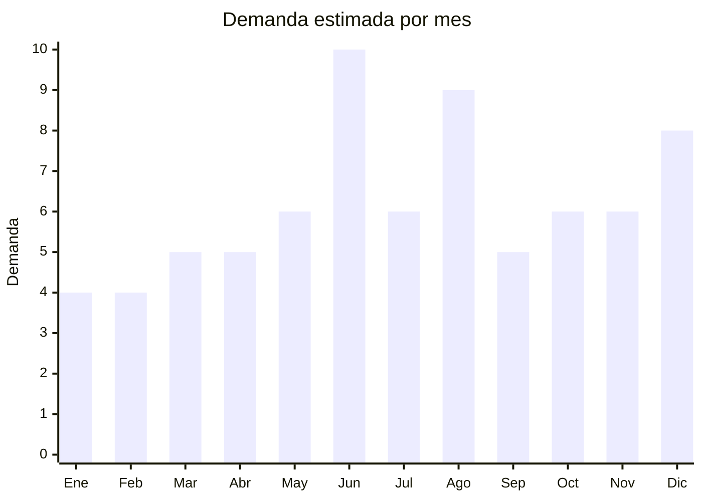

# Guitarras acusticas para principiantes

> **Capitulo NCM 92** — Instrumentos musicales, sus partes y accesorios | **Temporada:** Invierno (Jun–Ago)

## Que es y por que importarlo

Las guitarras acusticas para principiantes son instrumentos de cuerda de gama economica diseñados para quienes estan aprendiendo a tocar. Incluyen modelos criollos (cuerdas de nylon, clasica española), folk (cuerdas de acero, cuerpo mas grande) y versiones 3/4 para niños de 6 a 12 años. China es el mayor productor mundial de guitarras economicas, con hubs de fabricacion concentrados en Guangzhou (Guangdong) y especialmente en Guizhou, donde ciudades como Zheng'an producen mas del 80% de las guitarras economicas del planeta — una industria que emplea a decenas de miles de personas y mueve cientos de millones de dolares anuales.

En Argentina, las guitarras tienen dos picos de demanda claramente definidos en invierno: el Dia del Padre (tercer domingo de junio) y el Dia del Niño (tercer domingo de agosto). Son un regalo aspiracional: el padre que siempre quiso aprender, o el niño que quiere su primer instrumento. Durante junio las busquedas de "guitarra criolla regalo" se multiplican en MercadoLibre, y en agosto los modelos 3/4 para niños lideran las ventas. Marcas argentinas como Gracia, Memphis y Leonard dominan el mercado, pero con precios retail que arrancan en ARS 60,000-120,000. Una guitarra importada desde China con un FOB de USD 10-30 puede venderse competitivamente a ARS 40,000-90,000, capturando el segmento de precio mas bajo con margenes del 150-300%.

La ventaja logistica clave es que las guitarras son voluminosas pero livianas — una guitarra clasica 4/4 pesa solo 1.5-2.5 kg. El desafio es el volumen: la forma irregular y la fragilidad requieren empaque reforzado y calculo cuidadoso del CBM.

## Datos clave

| Dato | Valor |
|------|-------|
| **Posiciones NCM tipicas** | 9202.90.00 (otros instrumentos musicales de cuerda) |
| **Derecho de importacion** | 18% (DIE) + 3% tasa estadistica |
| **Rango FOB tipico** | USD 10.00 — USD 30.00 por unidad |
| **Precio de venta en Argentina** | ARS 40.000 — ARS 120.000 |
| **Margen bruto estimado** | 150% — 300% |
| **MOQ tipico** | 50 — 200 unidades |
| **Demanda en MercadoLibre** | Alta (picos en junio y agosto) |
| **Competencia en MercadoLibre** | Alta (marcas locales establecidas) |
| **Dificultad para importar** | Media (volumen, empaque fragil) |
| **Certificaciones necesarias** | Ninguna especial |
| **Antidumping** | No |

## Variantes y subtipos mas comunes

| Subtipo / Variante | FOB aprox. | Venta AR aprox. | Nota |
|--------------------|-----------|-----------------|------|
| Criolla 3/4 niños (nylon) | USD 10 — 15 | ARS 40.000 — 60.000 | **Estrella agosto** — Dia del Niño |
| Criolla clasica 4/4 (nylon) | USD 12 — 20 | ARS 50.000 — 80.000 | **Mas vendida general** — Dia del Padre |
| Folk 4/4 (cuerdas acero) | USD 15 — 25 | ARS 60.000 — 100.000 | Sonido mas brillante, publico joven |
| Guitarra 1/2 infantil (3-6 años) | USD 8 — 12 | ARS 30.000 — 50.000 | Nicho chico pero sin competencia |
| Kit guitarra + funda + puas + afinador | USD 15 — 30 | ARS 60.000 — 120.000 | Mayor valor percibido, margen alto |

## Regulaciones y requisitos

<Tabs>
  <Tab title="Certificaciones">
    | Organismo | Requiere | Detalle |
    |-----------|----------|---------|
    | ARCA (Aduana) | Si siempre | Despacho estandar |
    | ANMAT | No | No es producto medico ni cosmetico |
    | ENACOM | No | No es electronico |
    | SENASA | **Verificar** | Si usa madera sin tratar, podria requerir certificado fitosanitario. Guitarras con acabado barnizado/lacado generalmente NO requieren |
    | IRAM | No | No aplica para instrumentos musicales |

    **Nota:** Las guitarras acusticas no tienen practicamente ninguna barrera regulatoria en Argentina. No son juguetes (no aplica IRAM 3583 incluso para modelos infantiles, ya que se clasifican como instrumentos musicales). El unico punto de atencion es SENASA si la madera no tiene acabado — pero el 99% de las guitarras chinas vienen barnizadas o lacadas.
  </Tab>

  <Tab title="Etiquetado">
    | Requisito | Aplica |
    |-----------|--------|
    | Idioma español | Si |
    | Datos del importador | Si (razon social, CUIT, direccion) |
    | Material del cuerpo | Recomendado (tilo, abeto, caoba, etc.) |
    | Tamaño del instrumento | Si (1/2, 3/4, 4/4) |
    | Pais de origen | Si |
    | Garantia legal 6 meses | Si |

    El etiquetado puede resolverse con una etiqueta adhesiva en la parte trasera del cuerpo o dentro del roseton. Incluir datos del importador, pais de origen y garantia.
  </Tab>

  <Tab title="Restricciones">
    Sin restricciones especiales significativas para guitarras acusticas.

    **Nota CITES:** Verificar que la madera del diapason no sea palisandro (rosewood) protegido por CITES. Las guitarras economicas chinas generalmente usan maderas no protegidas (tilo, sapeli, abeto laminado), evitando este problema. Confirmar con el proveedor antes de la orden.
  </Tab>
</Tabs>

## Logistica

| Dato | Valor |
|------|-------|
| **Peso tipico por unidad** | 1.5 — 2.5 kg (guitarra sola) / 2.5 — 4.0 kg (con funda y caja) |
| **Volumen tipico** | Alto (forma irregular, caja ~110x45x15 cm para 4/4) |
| **Fragilidad** | Alta (instrumento de madera, golpes pueden quebrar mango o tapa) |
| **Envio recomendado** | Maritimo LCL o FCL segun volumen |
| **Tiempo total estimado** | 50 — 80 dias (maritimo) |
| **Baterias de litio** | No |
| **Requiere empaque especial** | Si — caja individual reforzada con insertos de espuma. Incluir funda acolchada |

<Tip>
El CBM (metros cubicos) es el factor critico en guitarras, no el peso. Una guitarra 4/4 con caja ocupa aprox. 0.074 CBM. Un contenedor 20' estandar (33 CBM utiles) puede llevar ~400-450 guitarras. Pedir al proveedor que incluya **funda acolchada** como parte del paquete (cuesta USD 2-3 extra) — protege durante el envio y agrega valor percibido enorme para el comprador final. Considerar tambien incluir un set de cuerdas extra, puas y afinador clip como kit para maximizar el ticket promedio.
</Tip>

## Estacionalidad



| Aspecto | Detalle |
|---------|---------|
| **Meses pico** | Junio (Dia del Padre — pico maximo), Agosto (Dia del Niño — segundo pico), Diciembre (Navidad) |
| **Meses valle** | Enero-Febrero (vacaciones de verano) |
| **Cuando pedir** | Febrero-Marzo para tener stock en mayo (antes de Dia del Padre) |

## Ventajas y riesgos

<CardGroup cols={2}>
  <Card title="Ventajas" icon="circle-check">
    - Sin certificaciones ni regulaciones complejas
    - Margenes del 150-300% sobre FOB
    - Dos picos de demanda fuertes (Dia del Padre + Dia del Niño)
    - Producto aspiracional: alto valor percibido
    - China produce calidad aceptable desde USD 10 FOB
    - Ideal para armar kits con accesorios y aumentar ticket
    - Mercado enorme: Argentina tiene fuerte cultura guitarristica
  </Card>
  <Card title="Riesgos" icon="triangle-exclamation">
    - Producto voluminoso: CBM alto, flete costoso por unidad
    - Fragilidad: daños en transito si el empaque es deficiente
    - Competencia de marcas locales establecidas (Gracia, Memphis)
    - Calidad variable: afinacion inestable en modelos sub-USD 10
    - Trastes mal nivelados generan zumbidos y devoluciones
    - Cuerdas de fabrica suelen ser de calidad muy baja
  </Card>
</CardGroup>

<Warning>
La calidad de construccion es crucial. Las guitarras sub-USD 10 FOB frecuentemente tienen problemas: mango curvado, trastes filosos que lastiman los dedos, afinacion que no se mantiene, y madera que se agrieta con cambios de humedad. Pedir siempre muestras, afinar y tocar durante varios dias antes de confirmar un pedido grande. Verificar que las clavijas sean mecanicas (no de friccion) y que el puente este bien pegado.
</Warning>

## Palabras clave para buscar en Alibaba

```
acoustic guitar wholesale, classical guitar 39 inch nylon string,
folk guitar 41 inch steel string, 3/4 guitar kids beginner,
guitar factory Zheng'an Guizhou, acoustic guitar OEM manufacturer,
guitar starter kit wholesale, classical guitar 36 inch children
```

## Fuentes

- [MercadoLibre Argentina — Guitarras criollas](https://listado.mercadolibre.com.ar/guitarra-criolla)
- [Alibaba — Acoustic guitar wholesale](https://www.alibaba.com/showroom/acoustic-guitar-wholesale.html)
- [ARCA — Nomenclador NCM](https://www.arca.gob.ar)
