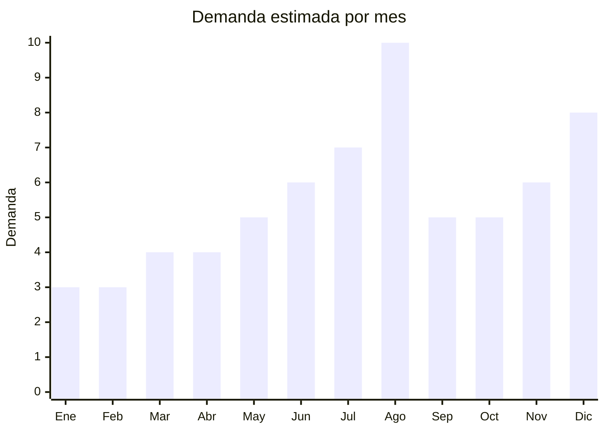

# Luces nocturnas LED infantiles

> **Capitulo NCM 94** — Muebles, mobiliario medico-quirurgico, aparatos de alumbrado | **Temporada:** Invierno (Jun–Ago)

## Que es y por que importarlo

Las luces nocturnas LED infantiles son lamparas de baja intensidad diseñadas para acompañar el sueño de los niños, combinando funcion practica (iluminacion suave nocturna) con atractivo visual y ludico. El mercado se divide en tres grandes categorias: lamparas de ilusion optica 3D (base acrilica con grabado laser que genera efecto tridimensional de dinosaurios, unicornios, superheroes), proyectores de estrellas/galaxia (que cubren el techo y paredes con patrones de cielo nocturno, nebulosas y constelaciones rotantes), y lamparas de silicona tactil (figuras blandas tipo animalitos que cambian de color al tocarlas con palmada).

En Argentina, la demanda se concentra fuertemente en agosto por el Dia del Niño (tercer domingo de agosto). Son regalos ideales para niños de 2 a 12 años: combinan funcionalidad (miedo a la oscuridad), estetica (decoracion de cuarto) y factor wow (proyeccion de galaxia en el techo). Los proyectores de estrellas/galaxia se convirtieron en virales en TikTok e Instagram, y en MercadoLibre se encuentran entre los regalos mas buscados para Dia del Niño.

China domina la produccion mundial de estas lamparas, especialmente desde Shenzhen (electronica) y Yiwu (lamparas decorativas). Los precios FOB van desde USD 2 para una lampara de silicona basica hasta USD 8 para un proyector de galaxia con rotacion, Bluetooth y parlante integrado. Los margenes son excelentes: un proyector de galaxia FOB USD 5 se vende a ARS 15,000-30,000 en Argentina.

## Datos clave

| Dato | Valor |
|------|-------|
| **Posiciones NCM tipicas** | 9405.40.90 (otros aparatos electricos de alumbrado) |
| **Derecho de importacion** | 20% (DIE) + 3% tasa estadistica |
| **Rango FOB tipico** | USD 2.00 — USD 8.00 por unidad |
| **Precio de venta en Argentina** | ARS 8.000 — ARS 35.000 |
| **Margen bruto estimado** | 200% — 400% |
| **MOQ tipico** | 100 — 500 unidades |
| **Demanda en MercadoLibre** | Alta (pico agosto) |
| **Competencia en MercadoLibre** | Media |
| **Dificultad para importar** | Baja-Moderada |
| **Certificaciones necesarias** | S-Mark (baja tension) si opera con 220V. Sin ENACOM si no tiene WiFi/Bluetooth |
| **Antidumping** | No |

## Variantes y subtipos mas comunes

| Subtipo / Variante | FOB aprox. | Venta AR aprox. | Nota |
|--------------------|-----------|-----------------|------|
| Lampara 3D ilusion optica (base + acrilico) | USD 2.00 — 4.00 | ARS 8.000 — 18.000 | 16 colores, control remoto, USB. Diseños: dinosaurios, unicornios, futbol |
| Proyector estrellas/galaxia basico | USD 3.00 — 5.00 | ARS 12.000 — 22.000 | Rotacion, multiples colores, USB/pilas |
| Proyector galaxia con Bluetooth y parlante | USD 5.00 — 8.00 | ARS 18.000 — 35.000 | **Mas vendido** — musica + proyeccion, timer |
| Lampara silicona tactil (animalito) | USD 2.00 — 4.00 | ARS 8.000 — 15.000 | Gatito, osito, conejo. Recargable USB. Ideal 0-6 años |
| Lampara luna 3D impresa | USD 3.00 — 6.00 | ARS 10.000 — 25.000 | Replica lunar con base madera. Decorativa |
| Velador LED con reloj y alarma | USD 4.00 — 7.00 | ARS 15.000 — 28.000 | Multifuncion: luz + hora + alarma |

## Regulaciones y requisitos

<Tabs>
  <Tab title="Certificaciones">
    | Organismo | Requiere | Detalle |
    |-----------|----------|---------|
    | ARCA (Aduana) | Si siempre | Despacho estandar |
    | S-Mark (seguridad electrica) | **Condicional** | Obligatorio si el producto se conecta directamente a 220V (transformador incorporado). Si opera exclusivamente con USB 5V o pilas, generalmente NO se requiere |
    | ENACOM | **Condicional** | Solo si incluye modulo Bluetooth o WiFi. Lamparas sin conectividad inalambrica NO requieren ENACOM |
    | IRAM 3583 | No | No se clasifica como juguete — es aparato de iluminacion |
    | ANMAT | No | No aplica |

    <Warning>
    **Estrategia regulatoria clave:** Importar modelos que operen exclusivamente con USB 5V o pilas AA/AAA. Esto evita S-Mark (solo aplica a productos que se conectan a red electrica 220V). Evitar modelos con Bluetooth/WiFi en la primera importacion para no requerir ENACOM. La combinacion "USB + sin Bluetooth" es la ruta mas simple regulatoriamente.
    </Warning>
  </Tab>

  <Tab title="Etiquetado">
    | Requisito | Aplica |
    |-----------|--------|
    | Idioma español | Si |
    | Datos del importador | Si (razon social, CUIT, direccion) |
    | Voltaje y tipo de alimentacion | Si (USB 5V, pilas, etc.) |
    | Pais de origen | Si |
    | Garantia legal 6 meses | Si |
    | Advertencias | Si (no mirar directamente al LED, supervisar niños menores de 3 años) |

    El packaging debe incluir instrucciones en español y datos del importador. Para lamparas USB, indicar claramente "Alimentacion: USB 5V — no incluye adaptador de pared".
  </Tab>

  <Tab title="Restricciones">
    - Modelos con laser (algunos proyectores de estrellas usan laser Clase 1) pueden requerir declaracion adicional. Preferir modelos LED sin componente laser.
    - Si el producto incluye pilas de litio recargables internas, considerar restricciones de envio aereo (no aplica a maritimo).
    - Sin antidumping vigente para esta partida.
    - No se clasifica como juguete (IRAM 3583 no aplica) a menos que se promocione explicitamente como tal.
  </Tab>
</Tabs>

## Logistica

| Dato | Valor |
|------|-------|
| **Peso tipico por unidad** | 0.15 — 0.50 kg (con caja) |
| **Volumen tipico** | Bajo (cajas compactas 10-20 cm) |
| **Fragilidad** | Media (acrilico y componentes electronicos) |
| **Envio recomendado** | Maritimo consolidado o aereo para primeros pedidos |
| **Tiempo total estimado** | 15 — 25 dias (aereo) / 50 — 70 dias (maritimo) |
| **Baterias de litio** | Condicional (modelos recargables con bateria interna) |
| **Requiere empaque especial** | No — caja individual con proteccion de espuma estandar |

<Tip>
Las lamparas nocturnas LED son excelentes para envio aereo por su bajo peso. Un pedido de 200 unidades de lamparas 3D pesa apenas 40-60 kg. Para el Dia del Niño, si te atrasaste con el maritimo, el aereo es perfectamente viable economicamente. Combinar varios modelos (3D + silicona + proyector) en un mismo envio para diversificar oferta y reducir riesgo.
</Tip>

## Estacionalidad



| Aspecto | Detalle |
|---------|---------|
| **Meses pico** | Agosto (Dia del Niño — pico maximo), Julio (preventa + vacaciones invierno), Diciembre (Navidad) |
| **Meses valle** | Enero-Marzo (post-verano, menor interes) |
| **Cuando pedir** | Abril-Mayo para tener stock en julio. Para maritimo, pedir en marzo |

## Ventajas y riesgos

<CardGroup cols={2}>
  <Card title="Ventajas" icon="circle-check">
    - Margenes del 200-400% sobre FOB
    - Producto liviano y compacto: flete aereo viable
    - Factor wow: proyectores de galaxia son virales en redes
    - Sin IRAM 3583 (no es juguete, es luminaria)
    - Modelos USB evitan S-Mark y simplifican importacion
    - Regalo ideal para niños: funcional + decorativo
    - Multiples variantes para diversificar oferta
  </Card>
  <Card title="Riesgos" icon="triangle-exclamation">
    - Modelos con Bluetooth requieren ENACOM (costo y tiempo adicional)
    - Calidad electronica variable: LEDs que fallan prematuramente
    - Proyectores baratos pueden tener motor de rotacion ruidoso
    - Lamparas de silicona economicas pueden desprender olor quimico
    - Competencia creciente en MercadoLibre
    - Bateria interna puede complicar logistica aerea
  </Card>
</CardGroup>

## Palabras clave para buscar en Alibaba

```
3D illusion lamp wholesale, star projector night light kids,
galaxy projector lamp USB, silicone night light touch lamp,
moon lamp 3D print wholesale, dinosaur night light 3D LED,
starry sky projector children bedroom, cute animal night lamp silicone
```

## Fuentes

- [MercadoLibre Argentina — Luces nocturnas infantiles](https://listado.mercadolibre.com.ar/luz-nocturna-infantil)
- [MercadoLibre Argentina — Proyector estrellas](https://listado.mercadolibre.com.ar/proyector-estrellas)
- [Alibaba — Night light wholesale](https://www.alibaba.com/showroom/night-light-kids.html)
- [ARCA — Nomenclador NCM](https://www.arca.gob.ar)
