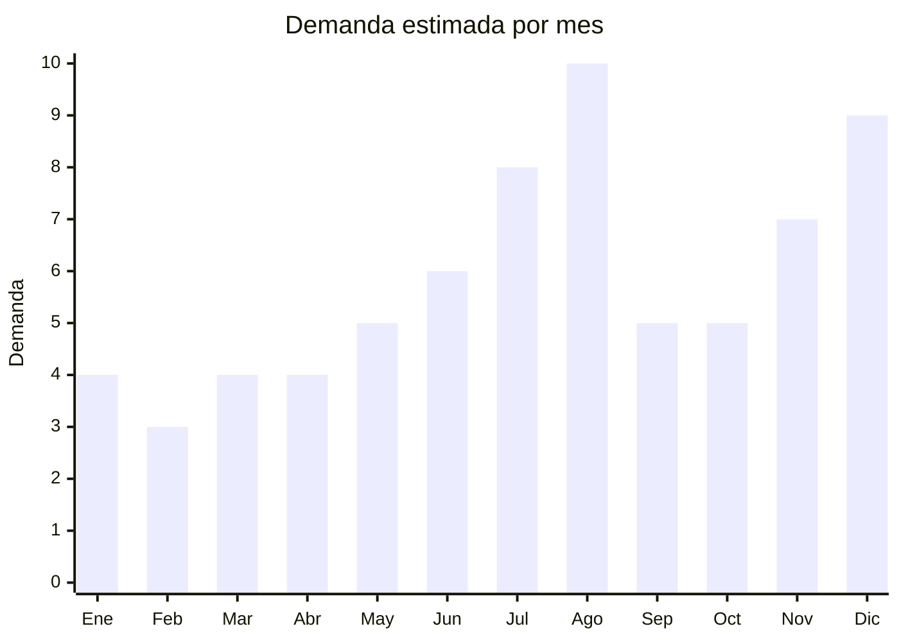

# Autos y vehiculos a control remoto (RC)

> **Capitulo NCM 95** — Juguetes, juegos y articulos para recreo o deporte | **Temporada:** Invierno (Jun–Ago)

## Que es y por que importarlo

Los autos y vehiculos a control remoto (RC cars) son juguetes motorizados que se operan inalambricamente mediante un control de radiofrecuencia (tipicamente 2.4GHz). Son el **regalo clasico e infalible del Dia del Niño** en Argentina: generaciones enteras de niños argentinos recibieron su primer auto a control remoto cada agosto. La categoria incluye desde autitos drift escala 1:24 economicos hasta camionetas 4x4 escala 1:16 con suspension independiente y traccion en las 4 ruedas.

En MercadoLibre Argentina, los autos RC son consistentemente de los productos mas vendidos en agosto. Marcas como **Zippy Toys** (marca propia de un importador argentino) se convirtieron en referencia del mercado demostrando que hay espacio para marcas importadas posicionadas. Un auto drift 1:24 FOB USD 2-3 se vende a ARS 8,000-15,000. Una camioneta 4x4 1:16 FOB USD 6-10 alcanza ARS 20,000-40,000.

**Shantou (Guangdong)** es el epicentro de produccion: la ciudad concentra cientos de fabricas que producen RC cars a escala masiva. La tecnologia RC de 2.4GHz es estandar y permite operar multiples vehiculos simultaneamente sin interferencia, un punto de venta importante para niños que juegan con amigos. Las fabricas ofrecen personalizacion de colores, diseños de carroceria y packaging con marca propia a MOQs desde 200-500 unidades.

## Datos clave

| Dato | Valor |
|------|-------|
| **Posiciones NCM tipicas** | 9503.00.97 (vehiculos de juguete con motor), 9503.00.99 (otros juguetes) |
| **Derecho de importacion** | 20% (DIE) + 3% tasa estadistica |
| **Rango FOB tipico** | USD 2.00 — USD 10.00 por unidad |
| **Precio de venta en Argentina** | ARS 8.000 — ARS 45.000 |
| **Margen bruto estimado** | 200% — 400% |
| **MOQ tipico** | 200 — 1,000 unidades |
| **Demanda en MercadoLibre** | Muy Alta (pico agosto) |
| **Competencia en MercadoLibre** | Alta (Zippy Toys, importadores establecidos) |
| **Dificultad para importar** | Moderada (IRAM 3583 + ENACOM) |
| **Certificaciones necesarias** | IRAM 3583 obligatorio + ENACOM (radiofrecuencia 2.4GHz) |
| **Antidumping** | No |

## Variantes y subtipos mas comunes

| Subtipo / Variante | FOB aprox. | Venta AR aprox. | Nota |
|--------------------|-----------|-----------------|------|
| Auto drift 1:24 (basico, pilas AA) | USD 2.00 — 3.50 | ARS 8.000 — 15.000 | Economico, altisima rotacion, regalo accesible |
| Auto deportivo 1:20 (bateria recargable) | USD 3.00 — 5.00 | ARS 12.000 — 22.000 | **Mas vendido** — recargable agrega valor |
| Camioneta 4x4 1:16 (suspension, grandes ruedas) | USD 6.00 — 10.00 | ARS 20.000 — 45.000 | Premium. Todo terreno, impacto visual |
| Auto drift con luces LED y humo | USD 4.00 — 7.00 | ARS 15.000 — 30.000 | Factor wow: luces + efecto humo por vapor de agua |
| Excavadora/camion de obra RC | USD 5.00 — 10.00 | ARS 18.000 — 40.000 | Nicho creciente, menos competencia |
| Set 2 autos para carreras | USD 5.00 — 8.00 | ARS 18.000 — 35.000 | Pack para jugar entre hermanos/amigos |

## Regulaciones y requisitos

<Tabs>
  <Tab title="Certificaciones">
    | Organismo | Requiere | Detalle |
    |-----------|----------|---------|
    | ARCA (Aduana) | Si siempre | Despacho estandar |
    | IRAM 3583 | **Si — obligatorio** | Juguete para menores de 14 años |
    | ENACOM | **Si — obligatorio** | Todo dispositivo que emite en radiofrecuencia (2.4GHz) requiere homologacion ENACOM |
    | S-Mark | No (si opera con pilas/bateria, no con 220V) | Solo si incluye cargador que se conecta a red |
    | ANMAT | No | No aplica |

    <Warning>
    Los RC cars requieren **doble certificacion**: IRAM 3583 (juguete) + ENACOM (radiofrecuencia). ENACOM es obligatorio porque el control remoto opera en 2.4GHz. El tramite de ENACOM tarda 30-60 dias y cuesta USD 200-500 por modelo. Solicitar al proveedor el informe de frecuencia y potencia de emision para presentar ante ENACOM. Las fabricas de Shantou estan acostumbradas a proveer esta documentacion.
    </Warning>
  </Tab>

  <Tab title="Etiquetado">
    | Requisito | Aplica |
    |-----------|--------|
    | Idioma español | Si |
    | Datos del importador | Si |
    | Rango de edad recomendado | Si (tipicamente 6+ o 8+) |
    | Tipo de baterias/alimentacion | Si (pilas AA, bateria recargable, voltaje) |
    | Frecuencia de operacion | Si (2.4GHz — requerido por ENACOM) |
    | Pais de origen | Si |
    | Sello IRAM | Si |
    | Numero de homologacion ENACOM | Si |
    | Garantia legal 6 meses | Si |
    | Advertencias | Si (no usar cerca de agua, supervision adulta para carga) |
  </Tab>

  <Tab title="Restricciones">
    - La doble certificacion (IRAM + ENACOM) es una barrera de entrada que muchos importadores pequeños no cruzan — esto puede ser una ventaja competitiva para quien la resuelve.
    - Modelos con bateria de litio recargable tienen restricciones de envio aereo (documentacion DGR).
    - Modelos con cargador USB son preferibles a modelos con cargador de pared 220V (evitan S-Mark).
    - Sin antidumping vigente.
    - Marcas como Hot Wheels (Mattel) y Nikko son marcas registradas — evitar packaging que las mencione.
  </Tab>
</Tabs>

## Logistica

| Dato | Valor |
|------|-------|
| **Peso tipico por unidad** | 0.3 — 1.2 kg (con control y caja) |
| **Volumen tipico** | Medio (cajas rectangulares con ventana plastica) |
| **Fragilidad** | Media (carroceria plastica puede rayarse/romperse en transito) |
| **Envio recomendado** | Maritimo LCL o FCL. Aereo posible para modelos chicos |
| **Tiempo total estimado** | 15 — 25 dias (aereo) / 50 — 75 dias (maritimo) |
| **Baterias de litio** | Condicional (modelos recargables) |
| **Requiere empaque especial** | Caja individual con insertos de telgopor. Proteger antenas y ruedas |

<Tip>
Las camionetas 4x4 escala 1:16 son las que mejor relacion margen/volumen tienen: cuestan USD 6-10 FOB, se venden a ARS 20,000-45,000, y caben ~1,500-2,500 unidades en un contenedor 20'. Para primeras importaciones, arrancar con autos drift 1:24 (mas compactos, menor MOQ, menor inversion) y escalar a modelos mas grandes una vez validado el canal de venta. Zippy Toys demuestra que crear una marca propia en RC es altamente rentable.
</Tip>

## Estacionalidad



| Aspecto | Detalle |
|---------|---------|
| **Meses pico** | Agosto (Dia del Niño — pico absoluto), Diciembre (Navidad), Julio (preventa + vacaciones) |
| **Meses valle** | Enero-Marzo (post-fiestas) |
| **Cuando pedir** | Febrero-Marzo para maritimo. Considerar 60 dias adicionales para IRAM + ENACOM |

## Ventajas y riesgos

<CardGroup cols={2}>
  <Card title="Ventajas" icon="circle-check">
    - Regalo CLASICO Dia del Niño: demanda garantizada cada agosto
    - Margenes del 200-400%
    - Zippy Toys demuestra viabilidad de marca propia
    - Shantou tiene produccion masiva a costos bajisimos
    - Tecnologia 2.4GHz permite juego multi-vehiculo sin interferencia
    - Modelos con luces y humo generan efecto wow
    - Doble certificacion actua como barrera de entrada a competencia
  </Card>
  <Card title="Riesgos" icon="triangle-exclamation">
    - Doble certificacion (IRAM + ENACOM): mayor costo y tiempo
    - Calidad variable: motores que fallan, baterias que no cargan
    - Competencia alta de importadores establecidos
    - Modelos con bateria de litio complican logistica aerea
    - Controles que se desvinculan generan devoluciones
    - Stock de agosto no vendido se arrastra hasta diciembre
  </Card>
</CardGroup>

## Palabras clave para buscar en Alibaba

```
RC car 2.4GHz wholesale, remote control car drift 1:24,
RC truck 4x4 1:16 wholesale, RC car factory Shantou,
remote control car kids wholesale, RC drift car LED smoke,
toy car remote control 2.4G manufacturer, excavator RC toy bulk
```

## Fuentes

- [MercadoLibre Argentina — Autos a control remoto](https://listado.mercadolibre.com.ar/auto-control-remoto)
- [Alibaba — RC car wholesale](https://www.alibaba.com/trade/search?SearchText=rc+car+wholesale+2.4ghz)
- [IRAM — Norma 3583 Seguridad de juguetes](https://www.iram.org.ar)
- [ENACOM — Homologacion de equipos](https://www.enacom.gob.ar)
