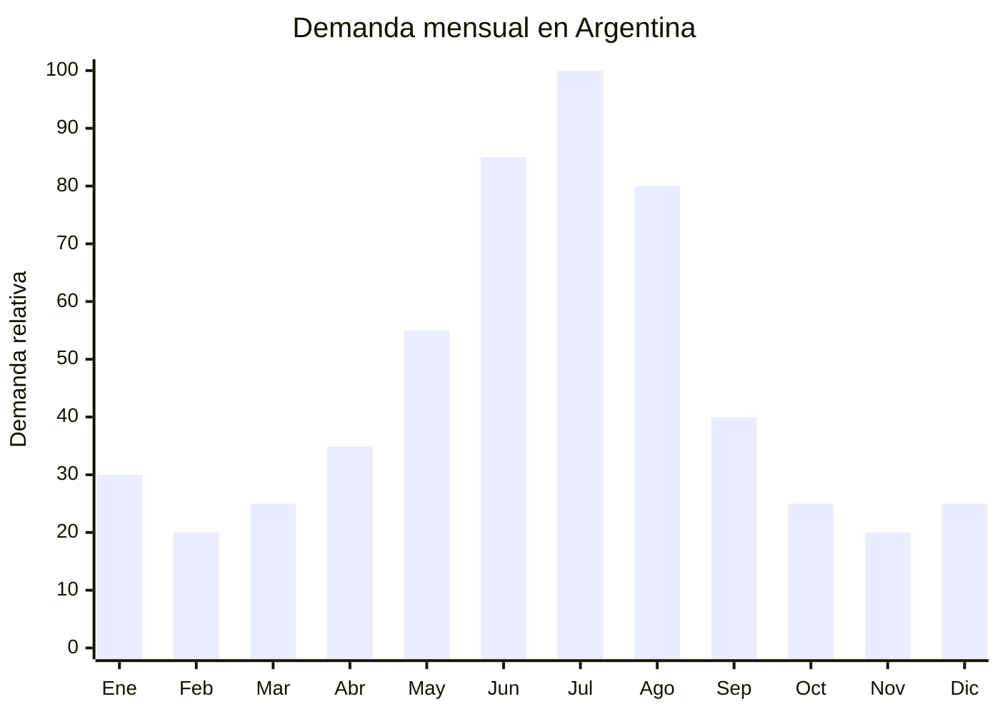

# Bicicletas fijas / spinning indoor

> **Capítulo NCM 95** — Juguetes, juegos y artículos para recreo o deporte | **Temporada:** Invierno (Jun–Ago)

## Qué es y por qué importarlo

Las bicicletas fijas de spinning indoor son equipos de fitness estacionarios que simulan el pedaleo de una bicicleta de ruta en interiores. Se componen de un volante de inercia (flywheel) de 6 a 15 kg, sistema de resistencia magnética o por fricción, asiento ajustable, manubrio regulable en altura e inclinación, y monitor digital que muestra velocidad, distancia, calorías y pulso. Los modelos más avanzados incluyen soporte para tablet, conectividad Bluetooth para apps como Zwift o Kinomap, y pedales con calapié o compatibles con calas SPD.

El invierno argentino (junio-agosto) genera un aumento del +85% en la demanda de equipamiento de fitness indoor, ya que el frío, la lluvia y la oscuridad temprana desincentivan la actividad física al aire libre. Julio es el mes pico absoluto: las membresías de gimnasio bajan (por vacaciones de invierno) pero la búsqueda de equipamiento hogareño sube porque la gente busca entrenar en casa. Las bicicletas de spinning son el segundo equipo de fitness más vendido en Argentina después de las cintas de correr.

China (especialmente Xiamen, Fujian y Zhejiang) concentra la producción mundial de bicicletas de spinning. Las fábricas producen desde modelos básicos con resistencia por fricción hasta bicicletas premium con resistencia magnética, transmisión por correa y monitor LCD, a precios FOB de USD 40 a USD 100.

## Datos clave

| Dato | Valor |
|------|-------|
| **Posiciones NCM típicas** | 9506.91.00 (aparatos de gimnasia y atletismo) / 8428.90.90 (las demás máquinas de elevación/manipulación) |
| **Derecho de importación** | 18-20% (DIE) + 3% tasa estadística |
| **Rango FOB típico** | USD 40.00 — USD 100.00 por unidad |
| **Precio de venta en Argentina** | ARS 80.000 — ARS 350.000 |
| **Margen bruto estimado** | 80% — 200% |
| **MOQ típico** | 50 — 200 unidades |
| **Demanda en MercadoLibre** | Alta (pico fuerte invierno) |
| **Competencia en MercadoLibre** | Media |
| **Dificultad para importar** | Baja (sin regulaciones especiales) |
| **Certificaciones necesarias** | Ninguna obligatoria específica |
| **Antidumping** | No |

## Variantes y subtipos más comunes

| Subtipo / Variante | FOB aprox. | Venta AR aprox. | Nota |
|--------------------|-----------|-----------------|------|
| Bici fija básica resistencia por fricción 6kg | USD 40.00 — 55.00 | ARS 80.000 — 140.000 | Entrada, hogar |
| Spinning resistencia magnética 8kg, monitor LCD | USD 55.00 — 75.00 | ARS 130.000 — 220.000 | **Más vendida** |
| Spinning magnética 13kg, transmisión correa | USD 70.00 — 90.00 | ARS 180.000 — 280.000 | Semi-profesional |
| Spinning premium 15kg, Bluetooth, soporte tablet | USD 85.00 — 100.00 | ARS 250.000 — 350.000 | Segmento premium |
| Mini bici estática plegable (pedaleador) | USD 15.00 — 25.00 | ARS 30.000 — 65.000 | Espacio reducido, seniors |
| Bici fija recumbente (con respaldo) | USD 60.00 — 90.00 | ARS 150.000 — 280.000 | Rehabilitación, confort |

## Regulaciones y requisitos

<Tabs>
  <Tab title="Certificaciones">
    | Organismo | Requiere | Detalle |
    |-----------|----------|---------|
    | ARCA (Aduana) | Sí siempre | Despacho estándar |
    | INTI / S-Mark | No específicamente | No es un electrodoméstico de alto riesgo. El monitor funciona con baterías o generador interno de baja tensión |
    | ENACOM | No | No es producto de comunicación (modelos con BT para apps fitness generalmente no requieren, verificar) |
    | ANMAT | No | No es producto de salud |
    | SENASA | No | No es alimento |

    **Recomendación:** Aunque no hay certificación obligatoria específica, solicitar al proveedor certificación CE y test de fatiga estructural (ciclos de pedal, resistencia del cuadro). Verificar que el volante de inercia esté correctamente balanceado para evitar vibración excesiva. Un monitor que muestre pulso cardíaco NO convierte al producto en dispositivo médico.
  </Tab>

  <Tab title="Etiquetado">
    | Requisito | Aplica |
    |-----------|--------|
    | País de origen | Sí |
    | Datos del importador | Sí (nombre, dirección, CUIT) |
    | Peso máximo de usuario | Recomendable (generalmente 100-120 kg) |
    | Peso del volante de inercia | Recomendable (dato de venta clave) |
    | Instrucciones de armado | Sí — en español, con diagramas |
    | Dimensiones del producto | Recomendable |
  </Tab>

  <Tab title="Restricciones">
    - Sin medidas antidumping vigentes.
    - Sin restricciones específicas de importación.
    - Verificar peso máximo de usuario declarado: si el cuadro no soporta el peso indicado, es un riesgo de seguridad y responsabilidad civil.
    - Los pedales deben tener calapié de seguridad o sistema de fijación para evitar que el pie se salga durante pedaleo intenso.
    - El producto llega semi-armado: incluir manual de armado claro en español.
  </Tab>
</Tabs>

## Logística de importación

| Factor | Detalle |
|--------|---------|
| **Peso por unidad** | 25 — 40 kg (producto pesado) |
| **Volumen por unidad** | Alto — caja de 100x30x80 cm aprox. (semi-armado) |
| **Unidades por caja (master carton)** | 1 unidad por caja |
| **Peso por caja** | 28 — 45 kg |
| **Cajas por contenedor 20'** | ~100 — 150 unidades |
| **Unidades por contenedor 20'** | ~100 — 150 unidades |
| **Fragilidad** | Baja (estructura metálica robusta) |
| **Requiere embalaje especial** | Sí — espuma EPS en puntos de apoyo, protección del monitor LCD |

<Tip>
Las bicicletas de spinning son pesadas y voluminosas: un contenedor de 20' alcanza rápidamente el límite de peso con solo 100-150 unidades. Para una primera importación, considerar un LCL (consolidado marítimo) de 30-50 unidades para testear el mercado antes de comprometer un contenedor completo. El envío aéreo es inviable por el peso: el flete por unidad superaría los USD 80-120.
</Tip>

## Estacionalidad y timing de compra

| Dato | Valor |
|------|-------|
| **Meses de mayor venta** | Junio — Agosto (invierno, fitness indoor) |
| **Pico absoluto** | Julio (vacaciones de invierno + frío máximo) |
| **Pedido ideal (marítimo)** | Febrero — Marzo (para llegar en mayo) |
| **Pedido ideal (aéreo)** | No recomendable por peso |
| **Anticipación mínima** | 3-4 meses antes del pico |

## Ventajas y riesgos

<CardGroup cols={2}>
  <Card title="Ventajas" icon="circle-check">
    - Ticket alto (ARS 80,000-350,000) con buen margen
    - Demanda creciente (tendencia fitness hogareño post-pandemia)
    - Sin certificaciones obligatorias específicas
    - Producto durable que genera recomendaciones
    - Ideal para marca propia (personalización del cuadro y monitor)
    - Pico invernal predecible y fuerte
    - Cross-sell con accesorios (mat, bidon, soporte celular)
  </Card>

  <Card title="Riesgos y desventajas" icon="triangle-exclamation">
    - Producto pesado (25-40 kg): flete marítimo alto por unidad
    - Pocas unidades por contenedor (100-150 en 20')
    - Envío aéreo inviable por costo
    - Reclamos posventa por ruido del sistema de resistencia
    - Competencia con marcas establecidas (Randers, Fitage, Olmo)
    - Estacionalidad marcada: stock de verano tiene poca rotación
    - Garantía y servicio técnico necesarios (repuestos, ajustes)
  </Card>
</CardGroup>

## Palabras clave para buscar en Alibaba

`spin bike indoor cycling wholesale` · `spinning bicycle magnetic resistance` · `exercise bike flywheel 8kg 13kg` · `indoor cycling bike belt drive` · `spin bike OEM factory Xiamen` · `stationary bike LCD monitor wholesale`

## Fuentes

- MercadoLibre Argentina — búsqueda "bicicleta spinning", "bici fija indoor"
- Alibaba.com — proveedores de spin bike indoor cycling wholesale
- Nomenclador Arancelario Argentino — partida 9506.91.00
- Tendencias de fitness hogareño en Argentina post-pandemia
