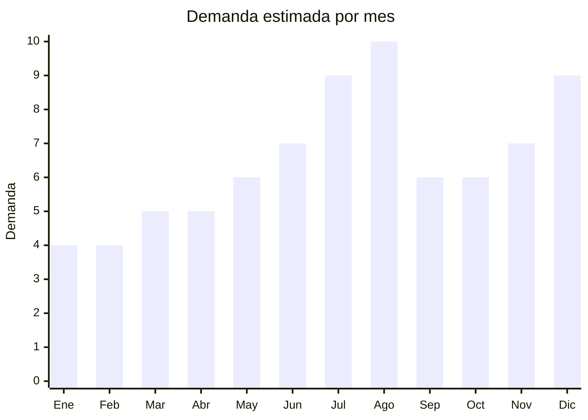

# Bloques de construccion avanzados

> **Capitulo NCM 95** — Juguetes, juegos y articulos para recreo o deporte | **Temporada:** Invierno (Jun–Ago)

## Que es y por que importarlo

Los bloques de construccion avanzados son sets de piezas de encastre plastico (tipo LEGO compatible) que permiten construir modelos detallados siguiendo instrucciones paso a paso. A diferencia de los bloques basicos para preescolares, estos sets van de 200 a mas de 2,000 piezas y estan dirigidos a niños mayores de 6 años, adolescentes e incluso adultos coleccionistas. Incluyen tematicas como vehiculos (coches, tanques, aviones), arquitectura (edificios famosos, ciudades), personajes (anime, superheroes, military), mecanismos con engranajes y motores (technic), y sets modulares de ciudades.

La categoria registro un crecimiento del **+95% interanual** en Argentina, siendo el **mayor crecimiento de toda la categoria juguetes**. El impulso viene de varios factores: LEGO original tiene precios prohibitivos en Argentina (un set mediano cuesta ARS 80,000-200,000), las marcas chinas ofrecen calidad comparable a una fraccion del precio, y los sets de construccion son percibidos como juguetes "educativos" (STEM) por los padres.

Las principales marcas chinas de bloques de construccion son **Cada** (especialista en mecanismos y motores RC), **Sembo** (arquitectura y military), **Panlos** (diversidad de tematicas), **MORK** (modular buildings), **Wange** (arquitectura) y **SY/Lepin** (sets genéricos). Estas marcas fabrican en Shantou (Guangdong) y Shenzhen, con calidad que ha mejorado enormemente — la precision de encastre de marcas como Cada es practicamente identica a LEGO. La Resolucion 313/2025 simplifico los requisitos de IRAM 3583 para juguetes importados, reduciendo tiempos y costos de certificacion.

## Datos clave

| Dato | Valor |
|------|-------|
| **Posiciones NCM tipicas** | 9503.00.99 (otros juguetes — juegos de construccion) |
| **Derecho de importacion** | 20% (DIE) + 3% tasa estadistica |
| **Rango FOB tipico** | USD 3.00 — USD 25.00 por set |
| **Precio de venta en Argentina** | ARS 10.000 — ARS 80.000 |
| **Margen bruto estimado** | 200% — 400% |
| **MOQ tipico** | 50 — 500 sets (dependiendo del modelo) |
| **Demanda en MercadoLibre** | Muy Alta (+95% crecimiento — MAYOR crecimiento juguetes) |
| **Competencia en MercadoLibre** | Media-Alta |
| **Dificultad para importar** | Moderada (IRAM 3583 — simplificado con Res. 313/2025) |
| **Certificaciones necesarias** | IRAM 3583 obligatorio (juguete menores 14). Res. 313/2025 simplifica tramite |
| **Antidumping** | No |

## Variantes y subtipos mas comunes

| Subtipo / Variante | FOB aprox. | Venta AR aprox. | Nota |
|--------------------|-----------|-----------------|------|
| Set basico 200-400 piezas | USD 3 — 6 | ARS 10.000 — 22.000 | Vehiculos, animales. Ideal regalo accesible |
| Set mediano 400-800 piezas | USD 6 — 12 | ARS 20.000 — 40.000 | **Mas vendido** — buena relacion precio/complejidad |
| Set avanzado 800-1500 piezas | USD 10 — 18 | ARS 35.000 — 60.000 | Adolescentes y adultos, modelos detallados |
| Set premium 1500-2000+ piezas | USD 18 — 25 | ARS 55.000 — 80.000 | Coleccionistas, arquitectura, technic |
| Set technic con motor RC | USD 15 — 25 | ARS 45.000 — 80.000 | Cada lidera. Motor, control remoto, engranajes |
| Mini sets 100-200 piezas (impulso) | USD 1.50 — 3.00 | ARS 5.000 — 10.000 | Compra impulsiva, ideal para probar mercado |

## Regulaciones y requisitos

<Tabs>
  <Tab title="Certificaciones">
    | Organismo | Requiere | Detalle |
    |-----------|----------|---------|
    | ARCA (Aduana) | Si siempre | Despacho estandar |
    | IRAM 3583 | **Si — obligatorio** | Juguete para menores de 14 años. La Res. 313/2025 simplifico el tramite: permite usar certificaciones internacionales equivalentes (EN-71, ASTM F963) para acelerar el proceso |
    | ENACOM | **Condicional** | Solo si el set incluye motor con control remoto por radiofrecuencia (2.4GHz). Sets sin motor/RC NO requieren |
    | S-Mark | No | No es electrico (salvo sets con motor que se alimenten de red) |
    | ANMAT | No | No aplica |

    <Note>
    **La Resolucion 313/2025** fue un cambio significativo para los importadores de juguetes. Permite presentar certificaciones internacionales (EN-71 europea, ASTM F963 estadounidense) como base para la homologacion IRAM, reduciendo el proceso de 60 a 20-30 dias y el costo a USD 300-800 por modelo. Solicitar al proveedor chino los certificados EN-71 y/o ASTM que ya tenga vigentes, ya que las marcas grandes (Cada, Sembo) generalmente los tienen.
    </Note>
  </Tab>

  <Tab title="Etiquetado">
    | Requisito | Aplica |
    |-----------|--------|
    | Idioma español | Si |
    | Datos del importador | Si |
    | Rango de edad recomendado | Si (obligatorio — tipicamente 6+, 8+, 12+ segun complejidad) |
    | Advertencias piezas pequeñas | Si (obligatorio — contienen piezas menores de 3cm) |
    | Cantidad de piezas | Si |
    | Sello IRAM | Si (visible en packaging) |
    | Pais de origen | Si |
    | Instrucciones en español | Recomendado (las instrucciones son mayormente visuales/graficas) |
    | Garantia legal 6 meses | Si |
  </Tab>

  <Tab title="Restricciones">
    - Sets que replican diseños **exactos** de LEGO (misma forma, color, packaging) pueden ser retenidos por propiedad intelectual. Las marcas chinas como Cada y Sembo diseñan modelos propios que evitan este problema.
    - Sets con tematica de marcas registradas (Star Wars, Marvel, Harry Potter) son riesgo altisimo de retencion. LEGO tiene exclusividad en muchas licencias.
    - Sets con personajes de anime/manga (Naruto, Dragon Ball) pueden tener problemas si las licencias estan registradas en Argentina.
    - La estrategia segura: tematicas genericas (military, city, architecture, technic, vehicles) con diseños originales de marcas chinas.
    - Sin antidumping vigente.
  </Tab>
</Tabs>

## Logistica

| Dato | Valor |
|------|-------|
| **Peso tipico por unidad** | 0.3 — 2.5 kg (dependiendo de cantidad de piezas) |
| **Volumen tipico** | Bajo a Medio (cajas compactas, piezas densas) |
| **Fragilidad** | Baja (piezas plasticas resistentes en bolsas selladas) |
| **Envio recomendado** | Maritimo LCL o FCL. Aereo viable para sets pequeños |
| **Tiempo total estimado** | 15 — 25 dias (aereo) / 50 — 75 dias (maritimo) |
| **Baterias de litio** | Condicional (sets con motor RC: pilas AA o bateria recargable) |
| **Requiere empaque especial** | No — la caja original con bolsas de piezas selladas es suficiente |

<Tip>
Los bloques tienen una excelente relacion peso/valor: son densos y compactos, a diferencia de los peluches que "pagan aire". Un contenedor 20' puede cargar 8,000-15,000 sets medianos. Mezclar diferentes tamaños de sets en un mismo envio para diversificar la oferta y cubrir distintos rangos de precio. Solicitar al proveedor que los sets vengan con instrucciones graficas (no dependen del idioma) y verificar que cada bolsa de piezas dentro de la caja este numerada para facilitar el armado.
</Tip>

## Estacionalidad



| Aspecto | Detalle |
|---------|---------|
| **Meses pico** | Agosto (Dia del Niño — pico absoluto), Diciembre (Navidad/Reyes), Julio (vacaciones invierno — tiempo para armar) |
| **Meses valle** | Enero-Febrero (post-fiestas) |
| **Cuando pedir** | Marzo-Abril para maritimo y llegar en junio con stock completo |

## Ventajas y riesgos

<CardGroup cols={2}>
  <Card title="Ventajas" icon="circle-check">
    - +95% crecimiento interanual — MAYOR crecimiento en juguetes
    - LEGO original es prohibitivamente caro en Argentina = mercado cautivo
    - Calidad de marcas chinas (Cada, Sembo) practicamente identica
    - Res. 313/2025 simplifico IRAM 3583 significativamente
    - Producto compacto y denso: flete eficiente
    - Percepcion "educativo/STEM" facilita decision de compra
    - Publico amplio: niños, adolescentes Y adultos coleccionistas
  </Card>
  <Card title="Riesgos" icon="triangle-exclamation">
    - IRAM 3583 obligatorio por cada modelo (aunque simplificado)
    - Riesgo de propiedad intelectual con sets que copien diseños LEGO
    - Licencias de marcas (Star Wars, Marvel) = retencion aduanera
    - Piezas faltantes en sets baratos generan quejas masivas
    - Sets con motor RC requieren ENACOM adicional
    - Instrucciones confusas en sets genéricos = devoluciones
  </Card>
</CardGroup>

## Palabras clave para buscar en Alibaba

```
building blocks compatible wholesale, Cada technic block set,
Sembo building block city, construction toy set 1000 pieces,
military building blocks wholesale, technic car RC blocks,
Panlos building block set, architecture block model wholesale,
compatible brick toy manufacturer Shantou
```

## Fuentes

- [MercadoLibre Argentina — Bloques de construccion](https://listado.mercadolibre.com.ar/bloques-construccion)
- [Alibaba — Building blocks wholesale](https://www.alibaba.com/trade/search?SearchText=building+blocks+compatible)
- [IRAM — Norma 3583 Seguridad de juguetes](https://www.iram.org.ar)
- [Resolucion 313/2025 — Simplificacion certificacion juguetes](https://www.argentina.gob.ar)
