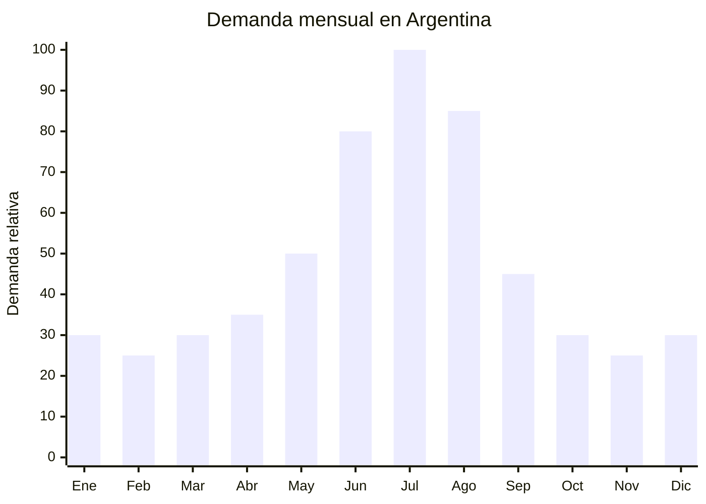

# Caminadoras eléctricas plegables (walking pad)

> **Capítulo NCM 95** — Juguetes, juegos y artículos para recreo o deporte | **Temporada:** Invierno (Jun–Ago)

## Qué es y por qué importarlo

Las caminadoras eléctricas plegables son equipos de fitness compactos con motor eléctrico que mueve una cinta de marcha/carrera. Se pliegan para guardarse debajo de una cama o detrás de un mueble. Dentro de esta categoría, el walking pad es la variante tendencia de 2025: una caminadora ultra-delgada (8-10 cm de altura) sin pasamanos, diseñada para usar debajo del escritorio mientras se trabaja o estudia. Las velocidades van de 0.5 a 12 km/h (walking pad) o hasta 16 km/h (caminadora plegable con pasamanos).

El invierno argentino (junio-agosto) genera el pico de demanda más fuerte de equipamiento de fitness indoor. El frío, las lluvias y la oscuridad temprana desincentivan las caminatas y el running al aire libre, empujando a los usuarios hacia alternativas hogareñas. El walking pad bajo escritorio se convirtió en fenómeno viral en redes sociales durante 2024-2025, especialmente entre personas que trabajan en home office y buscan combatir el sedentarismo sin dejar de trabajar. Las búsquedas de "walking pad" en Argentina crecieron +300% interanual.

China (Zhejiang — Yongkang y Jinhua, además de Fujian) concentra la producción mundial de caminadoras. Las fábricas ofrecen desde walking pads ultra-compactos con motor DC sin escobillas hasta caminadoras plegables con inclinación regulable, monitor LCD y conectividad Bluetooth para apps de fitness.

## Datos clave

| Dato | Valor |
|------|-------|
| **Posiciones NCM típicas** | 9506.91.00 (aparatos de gimnasia) / 8501.10.19 (motores eléctricos, según interpretación) |
| **Derecho de importación** | 18-20% (DIE) + 3% tasa estadística |
| **Rango FOB típico** | USD 80.00 — USD 200.00 (walking pad USD 80-150; caminadora plegable USD 120-200) |
| **Precio de venta en Argentina** | ARS 150.000 — ARS 500.000 |
| **Margen bruto estimado** | 80% — 180% |
| **MOQ típico** | 30 — 100 unidades |
| **Demanda en MercadoLibre** | Alta (crecimiento explosivo 2024-2025) |
| **Competencia en MercadoLibre** | Media (pocas marcas importan walking pads) |
| **Dificultad para importar** | Media (IRAM seguridad eléctrica) |
| **Certificaciones necesarias** | IRAM (motor eléctrico con conexión 220V). ENACOM si tiene Bluetooth |
| **Antidumping** | No |

## Variantes y subtipos más comunes

| Subtipo / Variante | FOB aprox. | Venta AR aprox. | Nota |
|--------------------|-----------|-----------------|------|
| Walking pad básico 0.5-6 km/h sin pasamanos | USD 80.00 — 110.00 | ARS 150.000 — 250.000 | **Tendencia 2025**, bajo escritorio |
| Walking pad premium 0.5-12 km/h control remoto | USD 100.00 — 150.00 | ARS 220.000 — 380.000 | Caminar + trotar ligero |
| Caminadora plegable con pasamanos 0.5-14 km/h | USD 120.00 — 170.00 | ARS 280.000 — 420.000 | Uso fitness completo |
| Caminadora plegable con inclinación 0.5-16 km/h | USD 150.00 — 200.00 | ARS 350.000 — 500.000 | Semi-profesional |
| Walking pad con pantalla LED + BT app | USD 110.00 — 140.00 | ARS 250.000 — 350.000 | Mayor valor agregado |
| Mini caminadora manual (sin motor) | USD 30.00 — 50.00 | ARS 60.000 — 120.000 | Económica, sin certificación eléctrica |

## Regulaciones y requisitos

<Tabs>
  <Tab title="Certificaciones">
    | Organismo | Requiere | Detalle |
    |-----------|----------|---------|
    | ARCA (Aduana) | Sí siempre | Despacho estándar |
    | **IRAM** | **SÍ — requerido** | Motor eléctrico conectado a 220V. Seguridad eléctrica según norma IRAM correspondiente a aparatos con motor |
    | ENACOM | **Solo si tiene Bluetooth/WiFi** | Modelos con app y conectividad BT requieren homologación ENACOM |
    | S-Mark | **Posiblemente** | Dependiendo de la clasificación arancelaria y potencia del motor |
    | ANMAT | No | No es producto de salud |

    **Recomendación:** Verificar con despachante de aduanas la clasificación exacta del producto (NCM 9506 como equipo de gimnasia o NCM 8501 como aparato con motor eléctrico), ya que de esto depende el régimen de certificaciones aplicable. Solicitar al proveedor certificados CE, IEC 60335-1 y test de seguridad del motor.
  </Tab>

  <Tab title="Etiquetado">
    | Requisito | Aplica |
    |-----------|--------|
    | País de origen | Sí |
    | Datos del importador | Sí (nombre, dirección, CUIT) |
    | Potencia del motor (W/HP) | Sí |
    | Tensión (V) y frecuencia | Sí (220V 50Hz) |
    | Peso máximo de usuario | **Sí — crítico** (generalmente 90-120 kg) |
    | Velocidad máxima | Recomendable |
    | Dimensiones plegado y desplegado | Recomendable |
    | Instrucciones en español | Sí |
  </Tab>

  <Tab title="Restricciones">
    - El motor debe ser compatible con 220V 50Hz. Verificar que NO sea 110V.
    - **Peso máximo de usuario:** Si el producto declara 120 kg pero falla con 100 kg, hay responsabilidad civil. Solicitar test de carga al proveedor.
    - La cinta de marcha debe tener bordes de seguridad (anti-atrapamiento de pies/manos).
    - Walking pads sin pasamanos: incluir advertencia de uso a baja velocidad.
    - Batería de litio en modelos portátiles: restricciones IATA para transporte aéreo.
    - Sin antidumping vigente.
  </Tab>
</Tabs>

## Logística de importación

| Factor | Detalle |
|--------|---------|
| **Peso por unidad** | 20 — 60 kg (walking pad 20-30 kg; caminadora plegable 35-60 kg) |
| **Volumen por unidad** | Alto — caja de 130x60x20 cm (walking pad) a 150x70x30 cm (caminadora) |
| **Unidades por caja (master carton)** | 1 unidad por caja |
| **Peso por caja** | 22 — 65 kg |
| **Cajas por contenedor 20'** | ~80 — 200 unidades (según modelo) |
| **Unidades por contenedor 20'** | ~80 — 200 unidades |
| **Fragilidad** | Baja (estructura metálica robusta) |
| **Requiere embalaje especial** | Sí — espuma EPS en motor y panel de control, protección de cinta |

<Tip>
Las caminadoras son pesadas y voluminosas: un contenedor de 20' con walking pads carga ~150-200 unidades, y con caminadoras plegables con pasamanos solo ~80-120 unidades. Para una primera importación de prueba, un LCL (consolidado) de 20-50 unidades es la opción más prudente. El envío aéreo es prácticamente inviable por el peso (flete de USD 150-300 por unidad).
</Tip>

## Estacionalidad y timing de compra

| Dato | Valor |
|------|-------|
| **Meses de mayor venta** | Junio — Agosto (invierno, fitness indoor) |
| **Pico absoluto** | Julio (frío máximo + home office + vacaciones) |
| **Pedido ideal (marítimo)** | Febrero — Marzo (para llegar en mayo) |
| **Pedido ideal (aéreo)** | No recomendable por peso/volumen |
| **Anticipación mínima** | 3-4 meses antes del pico |

<Note>
El walking pad bajo escritorio tiene demanda más estable que otros productos de fitness porque se vincula con el trabajo diario (home office), no solo con el ejercicio. Esto suaviza la estacionalidad y permite ventas durante todo el año, con pico invernal pero sin desplome en verano.
</Note>

## Ventajas y riesgos

<CardGroup cols={2}>
  <Card title="Ventajas" icon="circle-check">
    - Ticket alto (ARS 150,000-500,000) con buen margen
    - Tendencia viral 2025 (walking pad bajo escritorio)
    - Demanda con componente estable (home office todo el año)
    - Competencia baja en walking pads específicamente
    - Producto aspiracional vinculado a bienestar y productividad
    - Ideal para marca propia premium
    - Cross-sell con mats, escritorios elevables, accesorios
  </Card>

  <Card title="Riesgos y desventajas" icon="triangle-exclamation">
    - Producto pesado (20-60 kg): flete alto y pocas unidades por contenedor
    - Envío aéreo inviable por costo
    - Certificación IRAM necesaria (motor 220V)
    - ENACOM adicional si tiene Bluetooth
    - Servicio técnico posventa complejo (motor, cinta, placa electrónica)
    - Riesgo de lesiones: responsabilidad civil si falla
    - Ruido del motor en modelos económicos = reclamos
  </Card>
</CardGroup>

## Palabras clave para buscar en Alibaba

`walking pad under desk wholesale` · `foldable treadmill electric 220V` · `walking pad slim treadmill OEM` · `portable treadmill foldable home` · `under desk walking pad brushless motor` · `foldable electric treadmill factory Yongkang`

## Fuentes

- MercadoLibre Argentina — búsqueda "walking pad", "caminadora eléctrica plegable"
- Alibaba.com — proveedores de walking pad under desk wholesale
- Nomenclador Arancelario Argentino — partida 9506.91.00
- Tendencias de fitness hogareño y home office 2024-2025
