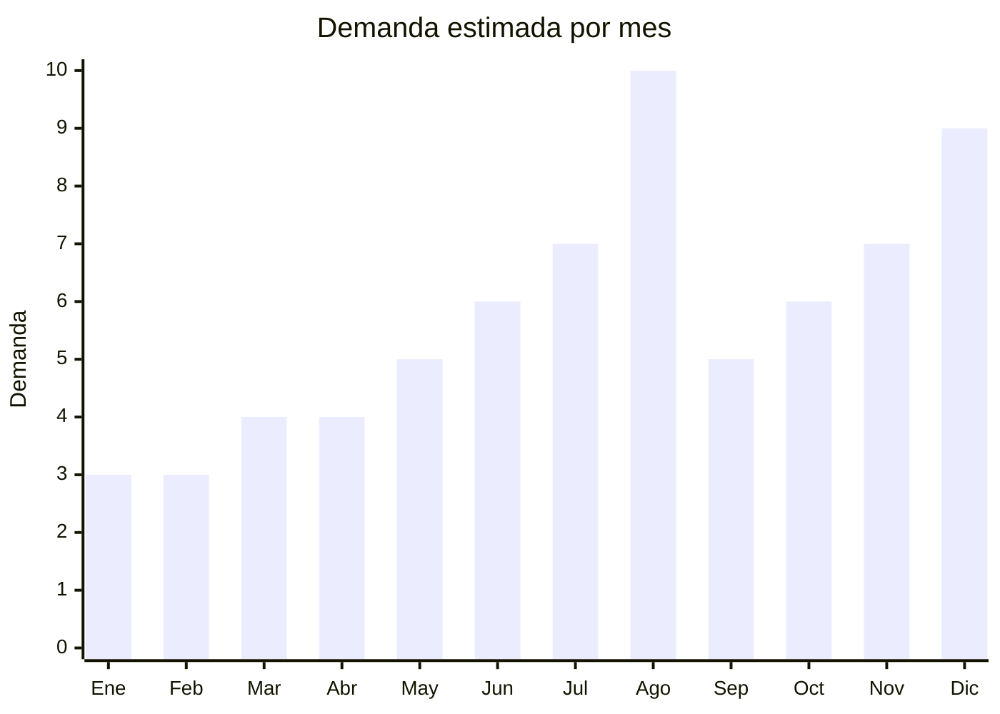

# Casas de munecas y sets de muebles miniatura

> **Capitulo NCM 95** — Juguetes, juegos y articulos para recreo o deporte | **Temporada:** Invierno (Jun–Ago)

## Que es y por que importarlo

Las casas de muñecas y sets de muebles miniatura son juguetes de juego imaginativo que incluyen estructuras de madera MDF o plastico de 2-4 pisos con habitaciones, escaleras y muebles en miniatura (camas, mesas, sillas, bañera, cocina). Las versiones premium tipo KidKraft pueden tener 60-90 cm de altura con 10-15 muebles incluidos. Tambien se incluyen los "sets de muebles miniatura" sueltos (cocina miniatura, living, dormitorio) que se venden como complemento o para casas de muñecas que el comprador ya tiene.

En Argentina, las casas de muñecas son un regalo de Dia del Niño aspiracional: tienen alto impacto visual (son grandes y coloridas), generan horas de juego imaginativo, y los padres las perciben como juguetes de calidad. Las casas tipo KidKraft originales cuestan ARS 120,000-300,000 en Argentina. Las versiones importadas de China con calidad similar de MDF cuestan ARS 30,000-80,000, capturando el segmento de precio medio con margenes generosos.

Las fabricas chinas especializadas en juguetes de madera se concentran en Yunhe (Zhejiang), conocida como "la ciudad del juguete de madera de China". Producen casas de muñecas de MDF cortadas a laser con impresion digital de colores vibrantes, muebles incluidos y empaque flat-pack (desarmado) que optimiza el envio. El FOB va de USD 5 para una casa basica de 2 pisos hasta USD 20 para una casa de 4 pisos con 15+ muebles y accesorios.

## Datos clave

| Dato | Valor |
|------|-------|
| **Posiciones NCM tipicas** | 9503.00.99 (otros juguetes) |
| **Derecho de importacion** | 20% (DIE) + 3% tasa estadistica |
| **Rango FOB tipico** | USD 5.00 — USD 20.00 por unidad |
| **Precio de venta en Argentina** | ARS 15.000 — ARS 80.000 |
| **Margen bruto estimado** | 200% — 400% |
| **MOQ tipico** | 100 — 500 unidades |
| **Demanda en MercadoLibre** | Alta (pico agosto) |
| **Competencia en MercadoLibre** | Baja-Media (KidKraft importada es cara, pocas alternativas) |
| **Dificultad para importar** | Media-Alta (volumen + IRAM 3583) |
| **Certificaciones necesarias** | IRAM 3583 obligatorio (juguete menores 14 años) |
| **Antidumping** | No |

## Variantes y subtipos mas comunes

| Subtipo / Variante | FOB aprox. | Venta AR aprox. | Nota |
|--------------------|-----------|-----------------|------|
| Casa MDF 2 pisos + 6 muebles (40-50cm) | USD 5.00 — 8.00 | ARS 15.000 — 30.000 | Formato accesible, buen margen |
| Casa MDF 3 pisos + 10 muebles (60-70cm) | USD 8.00 — 14.00 | ARS 30.000 — 55.000 | **Mas vendida** — relacion tamaño/precio ideal |
| Casa MDF 4 pisos + 15 muebles (80-90cm) | USD 14.00 — 20.00 | ARS 50.000 — 80.000 | Premium, impacto visual maximo |
| Set muebles miniatura sueltos (cocina/dormitorio/baño) | USD 2.00 — 5.00/set | ARS 5.000 — 15.000 | Complemento, alta rotacion |
| Casa de muñecas plegable/portatil | USD 6.00 — 10.00 | ARS 20.000 — 40.000 | Se cierra como maletin, practica |
| Casa de muñecas con luces LED | USD 10.00 — 18.00 | ARS 35.000 — 65.000 | Factor wow con iluminacion |

## Regulaciones y requisitos

<Tabs>
  <Tab title="Certificaciones">
    | Organismo | Requiere | Detalle |
    |-----------|----------|---------|
    | ARCA (Aduana) | Si siempre | Despacho estandar |
    | IRAM 3583 | **Si — obligatorio** | Juguete para menores de 14 años. Ensayos incluyen partes pequeñas (muebles miniatura), bordes cortantes (MDF), materiales toxicos (pinturas) |
    | ENACOM | No | No aplica (salvo modelos con luces LED con control remoto) |
    | S-Mark | No | No aplica |
    | SENASA | **Verificar** | Si usa madera sin tratar. MDF con acabado impreso/lacado generalmente NO requiere |

    <Warning>
    Los muebles miniatura incluidos son **piezas pequeñas** segun IRAM 3583: no deben poder pasar por el cilindro de partes pequeñas si el producto es para menores de 3 años. Si los muebles son muy chicos, el rango de edad minimo debe ser 3+ años con advertencia prominente. Ademas, las pinturas y acabados del MDF deben cumplir con limites de plomo, cadmio y formaldehido (comun en MDF de baja calidad).
    </Warning>
  </Tab>

  <Tab title="Etiquetado">
    | Requisito | Aplica |
    |-----------|--------|
    | Idioma español | Si |
    | Datos del importador | Si |
    | Rango de edad recomendado | Si (tipicamente 3+ o 4+) |
    | Advertencias piezas pequeñas | Si (muebles miniatura) |
    | Materiales de construccion | Si (MDF, pintura no toxica base agua) |
    | Instrucciones de armado | Si (en español, con fotos paso a paso) |
    | Pais de origen | Si |
    | Sello IRAM | Si |
    | Garantia legal 6 meses | Si |
  </Tab>

  <Tab title="Restricciones">
    - Verificar contenido de formaldehido en MDF — el standard europeo E1 es la referencia (no mas de 0.1 ppm). MDF chino barato puede exceder este limite.
    - Pinturas deben ser base agua no toxicas (verificar certificado de pintura del proveedor).
    - Sin antidumping vigente.
    - Casas con luces LED operadas por pilas no requieren S-Mark.
  </Tab>
</Tabs>

## Logistica

| Dato | Valor |
|------|-------|
| **Peso tipico por unidad** | 2 — 8 kg (segun tamaño, desarmada en flat-pack) |
| **Volumen tipico** | Alto (flat-pack reduce volumen pero sigue siendo considerable) |
| **Fragilidad** | Media (MDF puede astillarse en bordes si no tiene proteccion) |
| **Envio recomendado** | Maritimo LCL o FCL (por volumen y peso) |
| **Tiempo total estimado** | 50 — 80 dias (maritimo) |
| **Baterias de litio** | No (salvo modelos con LED recargable) |
| **Requiere empaque especial** | Caja reforzada con esquineros de carton. Cada panel envuelto individualmente |

<Tip>
Las casas de muñecas se envian **desarmadas en flat-pack** (paneles planos + bolsa de muebles + instrucciones), similar a muebles IKEA. Esto reduce el volumen dramaticamente: una casa de 3 pisos que armada mide 65x35x70 cm, desarmada cabe en una caja de 65x35x12 cm. Un contenedor 20' puede llevar 800-1,200 casas en flat-pack. Las instrucciones de armado en español con fotos paso a paso son CRITICAS: sin ellas, el comprador se frustra y devuelve. Pedir al proveedor que incluya herramientas basicas (destornillador, pegamento si aplica).
</Tip>

## Estacionalidad



| Aspecto | Detalle |
|---------|---------|
| **Meses pico** | Agosto (Dia del Niño — pico absoluto), Diciembre (Navidad), Julio (preventa) |
| **Meses valle** | Enero-Marzo (post-fiestas) |
| **Cuando pedir** | Febrero-Marzo para maritimo. Producto voluminoso, planificar FCL con anticipacion |

## Ventajas y riesgos

<CardGroup cols={2}>
  <Card title="Ventajas" icon="circle-check">
    - Margenes del 200-400% sobre FOB
    - KidKraft original es carisima en Argentina = espacio para alternativas
    - Competencia baja en segmento de precio medio
    - Alto impacto visual: fotos de producto venden solas
    - Flat-pack optimiza envio significativamente
    - Yunhe (Zhejiang) tiene especializacion unica en juguetes de madera
    - Muebles miniatura como complemento generan ventas adicionales
  </Card>
  <Card title="Riesgos" icon="triangle-exclamation">
    - VOLUMINOSO: incluso en flat-pack, ocupa espacio considerable
    - IRAM 3583 con atencion especial a piezas pequeñas y pinturas
    - MDF de baja calidad puede tener formaldehido excesivo
    - Armado complejo sin instrucciones claras = devoluciones masivas
    - Piezas faltantes en kits generan frustracion
    - Producto pesado: costo de envio al comprador final significativo
  </Card>
</CardGroup>

## Palabras clave para buscar en Alibaba

```
wooden dollhouse wholesale MDF, dollhouse furniture set kids,
miniature doll house factory Yunhe, dollhouse 3 story MDF wholesale,
doll house furniture miniature wholesale, flat pack dollhouse manufacturer,
wooden doll house OEM factory, kids dollhouse with furniture set
```

## Fuentes

- [MercadoLibre Argentina — Casa de muñecas](https://listado.mercadolibre.com.ar/casa-de-muñecas)
- [Alibaba — Wooden dollhouse wholesale](https://www.alibaba.com/trade/search?SearchText=wooden+dollhouse)
- [IRAM — Norma 3583 Seguridad de juguetes](https://www.iram.org.ar)
- [ARCA — Nomenclador NCM](https://www.arca.gob.ar)
