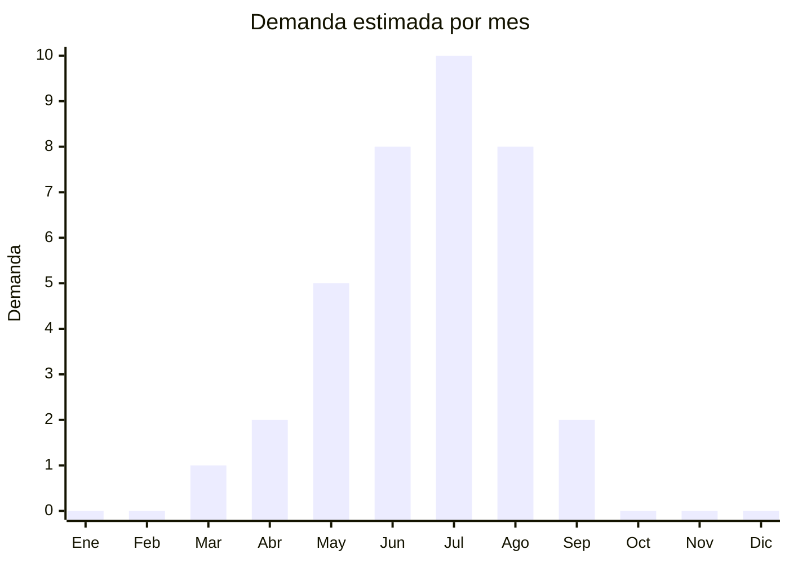

# Equipamiento de ski y snowboard para ninos

> **Capitulo NCM 95** — Juguetes, juegos y articulos para recreo o deporte | **Temporada:** Invierno (Jun–Ago)

## Que es y por que importarlo

El equipamiento de ski y snowboard para niños abarca los accesorios esenciales que las familias necesitan para la temporada de deportes invernales en los centros de ski patagónicos: antiparras de ski/snowboard (goggles con proteccion UV y antifog), guantes impermeables termicos para nieve, y cascos de ski homologados. Estos tres items son los que mas se compran (o renuevan) cada temporada porque los niños crecen y necesitan tallas nuevas cada año.

En Argentina, la temporada de ski se concentra en julio-agosto, con centros como Cerro Catedral (Bariloche), Chapelco (San Martin de los Andes), Las Leñas (Mendoza) y Cerro Castor (Ushuaia). Las familias que viajan a esquiar necesitan equipar a sus hijos con accesorios que en Argentina tienen precios elevados: unas antiparras de marca (Oakley, Smith, Julbo) cuestan ARS 80,000-200,000, mientras que las importadas de China con calidad comparable cuestan ARS 15,000-40,000. Los guantes de nieve para niños tienen una brecha de precio similar.

China produce la gran mayoria de los accesorios de ski del mundo, incluso para marcas premium. Fabricas en Dongguan y Guangzhou especializadas en eyewear deportivo producen antiparras con lentes de doble capa, tratamiento antifog y proteccion UV400 desde USD 3-5 FOB. Las fabricas de guantes en Zhejiang producen guantes impermeables con membrana tipo Hipora o TPU desde USD 3-6 FOB el par. Los margenes son excelentes pero la temporada es corta (junio-agosto), lo que requiere precision en el timing de la importacion.

## Datos clave

| Dato | Valor |
|------|-------|
| **Posiciones NCM tipicas** | 9506.99.00 (articulos para deportes de invierno), 6116.93.00 (guantes deportivos) |
| **Derecho de importacion** | 20% (DIE) + 3% tasa estadistica |
| **Rango FOB tipico** | USD 3.00 — USD 10.00 por articulo |
| **Precio de venta en Argentina** | ARS 10.000 — ARS 50.000 |
| **Margen bruto estimado** | 200% — 400% |
| **MOQ tipico** | 100 — 500 unidades por articulo |
| **Demanda en MercadoLibre** | Media-Alta (estacional julio-agosto) |
| **Competencia en MercadoLibre** | Baja-Media (nicho poco atendido) |
| **Dificultad para importar** | Baja (sin regulaciones complejas) |
| **Certificaciones necesarias** | Sin IRAM 3583 (articulos deportivos, no juguetes) |
| **Antidumping** | No |

## Variantes y subtipos mas comunes

| Subtipo / Variante | FOB aprox. | Venta AR aprox. | Nota |
|--------------------|-----------|-----------------|------|
| Antiparras ski niños lente doble UV400 | USD 3.00 — 5.00 | ARS 12.000 — 25.000 | **Mas vendidas** — esenciales para seguridad |
| Antiparras ski niños con clip para anteojos (OTG) | USD 4.00 — 6.00 | ARS 15.000 — 30.000 | Para niños con anteojos recetados |
| Guantes nieve niños impermeables (TPU) | USD 3.00 — 6.00/par | ARS 10.000 — 25.000 | Se renuevan cada año por crecimiento |
| Guantes nieve niños con muñequera | USD 4.00 — 8.00/par | ARS 15.000 — 35.000 | Mejor proteccion, cierre con velcro |
| Casco ski niños regulable | USD 6.00 — 10.00 | ARS 20.000 — 50.000 | Mayor ticket, mayor margen |
| Kit antiparras + guantes niños | USD 5.00 — 8.00 | ARS 18.000 — 35.000 | Pack combo, conveniencia para padres |

## Regulaciones y requisitos

<Tabs>
  <Tab title="Certificaciones">
    | Organismo | Requiere | Detalle |
    |-----------|----------|---------|
    | ARCA (Aduana) | Si siempre | Despacho estandar |
    | IRAM 3583 | **No** | NO se clasifica como juguete — es artículo deportivo. Esta exención es una ventaja significativa |
    | ANMAT | No | No aplica |
    | ENACOM | No | No es electronico |
    | S-Mark | No | No es electrico |

    **Ventaja regulatoria clave:** A diferencia de los juguetes, los articulos deportivos para niños NO requieren IRAM 3583. Esto simplifica enormemente la importacion: no hay certificaciones obligatorias especiales, solo el despacho aduanero estandar. Esto reduce tiempos y costos significativamente.
  </Tab>

  <Tab title="Etiquetado">
    | Requisito | Aplica |
    |-----------|--------|
    | Idioma español | Si |
    | Datos del importador | Si |
    | Pais de origen | Si |
    | Composicion materiales | Si (especialmente guantes: membrana impermeable, relleno termico) |
    | Proteccion UV (antiparras) | Recomendado (UV400 es el estandar) |
    | Talla/edad recomendada | Si |
    | Instrucciones de cuidado | Recomendado |
    | Garantia legal 6 meses | Si |
  </Tab>

  <Tab title="Restricciones">
    - Sin restricciones especiales para artículos deportivos de ski importados.
    - Los cascos de ski NO tienen norma argentina obligatoria equivalente a la EN 1077 europea, pero importar cascos con certificacion CE o ASTM agrega confianza del consumidor.
    - Sin antidumping vigente.
    - Para guantes, verificar que la membrana impermeable sea real (prueba de inmersion) y no solo marketing del proveedor.
  </Tab>
</Tabs>

## Logistica

| Dato | Valor |
|------|-------|
| **Peso tipico por unidad** | 0.10 — 0.40 kg (antiparras/guantes) / 0.30 — 0.50 kg (casco) |
| **Volumen tipico** | Bajo (antiparras y guantes) / Medio (cascos) |
| **Fragilidad** | Baja (guantes) / Media (antiparras — lentes pueden rayarse) |
| **Envio recomendado** | Aereo (temporada corta, necesitas velocidad) |
| **Tiempo total estimado** | 10 — 20 dias (aereo) / 50 — 70 dias (maritimo) |
| **Baterias de litio** | No |
| **Requiere empaque especial** | Antiparras con funda de microfibra individual. Cascos con bolsa protectora |

<Tip>
La temporada de ski es CORTA (junio-agosto). El envio aereo se justifica plenamente para este producto: los margenes son altos, el peso es bajo, y llegar tarde significa perder toda la temporada. Un pedido de 200 antiparras + 200 pares de guantes pesa apenas 60-80 kg y puede enviarse por courier o aereo consolidado. Pedir en abril, recibir en mayo, vender desde junio. Si envias por maritimo, pedir en febrero para no arriesgarte.
</Tip>

## Estacionalidad



| Aspecto | Detalle |
|---------|---------|
| **Meses pico** | Julio (plena temporada ski), Junio y Agosto (inicio y fin de temporada) |
| **Meses valle** | Septiembre-Abril (demanda practicamente nula) |
| **Cuando pedir** | Febrero-Marzo para maritimo, Abril-Mayo para aereo |

## Ventajas y riesgos

<CardGroup cols={2}>
  <Card title="Ventajas" icon="circle-check">
    - Sin IRAM 3583 — importacion simple y rapida
    - Margenes del 200-400%: marcas premium son carisimas en Argentina
    - Nicho poco atendido: menos competencia que juguetes
    - Producto liviano: flete aereo viable y economico
    - Padres NECESITAN comprar cada año (niños crecen)
    - Combinar antiparras + guantes + casco en kits premium
    - Brecha de precio enorme vs marcas (Oakley, Smith)
  </Card>
  <Card title="Riesgos" icon="triangle-exclamation">
    - Temporada ultra-corta: 3 meses maximo de venta
    - Stock no vendido queda 9 meses sin moverse
    - Mercado objetivo reducido (familias que esquian)
    - Antiparras de baja calidad empañan rapidamente (reclamos)
    - Guantes sin membrana real no son impermeables (devolucion)
    - Tallas incorrectas = stock muerto
  </Card>
</CardGroup>

## Palabras clave para buscar en Alibaba

```
ski goggles kids wholesale, children snow goggles UV400 anti-fog,
kids ski gloves waterproof, snow gloves children TPU membrane,
kids ski helmet wholesale, junior snowboard goggles factory,
children winter sports goggles, ski equipment kids OEM
```

## Fuentes

- [MercadoLibre Argentina — Antiparras ski niños](https://listado.mercadolibre.com.ar/antiparras-ski-niños)
- [MercadoLibre Argentina — Guantes nieve niños](https://listado.mercadolibre.com.ar/guantes-nieve-niños)
- [Alibaba — Kids ski goggles](https://www.alibaba.com/trade/search?SearchText=kids+ski+goggles)
- [ARCA — Nomenclador NCM](https://www.arca.gob.ar)
