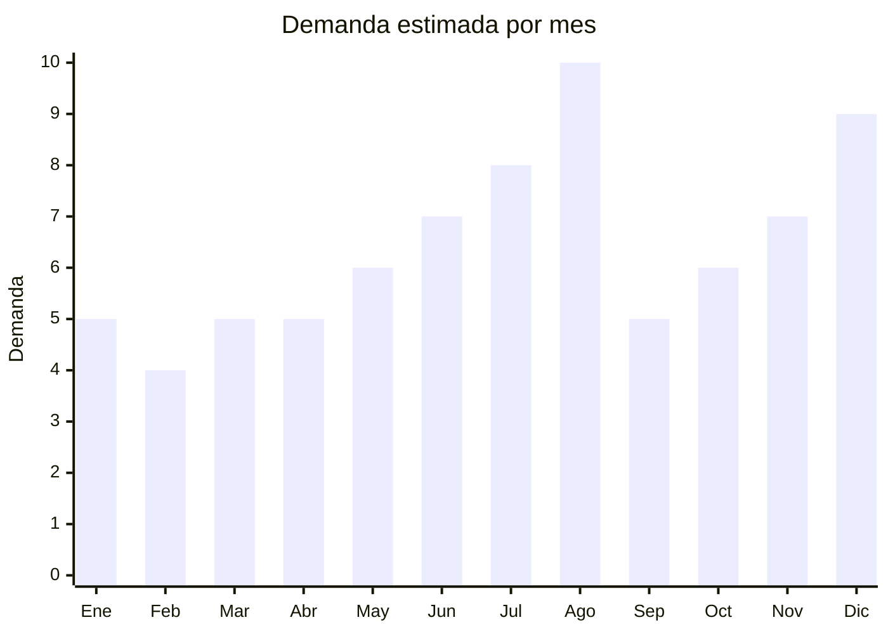

# Munecas y figuras de accion trending

> **Capitulo NCM 95** — Juguetes, juegos y articulos para recreo o deporte | **Temporada:** Invierno (Jun–Ago)

## Que es y por que importarlo

Las figuras de accion trending son muñecos articulados o estaticos de 8-30 cm que representan personajes virales del momento y clasicos evergreen del anime, comics y videojuegos. En 2025, el fenomeno viral mas relevante es **Italian Brainrot** — un universo de personajes generados por IA que se convirtieron en memes globales entre niños de 6-14 años (Bombardiro Cocodrilo, Tralalero Tralala, Tung Tung Sahur, etc.). La demanda de figuras de estos personajes exploto en Argentina y en el mundo, con fabricas chinas reaccionando rapidamente para producir figuras en plastico ABS y PVC.

Paralelamente, los clasicos del anime mantienen demanda constante: Dragon Ball (Goku, Vegeta), One Piece (Luffy Gear 5), Naruto, Demon Slayer, y superheroes Marvel/DC. Estas figuras son el regalo clasico del Dia del Niño (agosto) y se venden masivamente entre julio y agosto.

**Shantou (Guangdong)** es la capital mundial de juguetes plasticos, con miles de fabricas que producen figuras de accion a escala industrial. Los precios FOB van desde USD 1 para figuras basicas de 10cm hasta USD 8 para sets de figuras articuladas de 15-20cm con accesorios. Las fabricas pueden tener nuevos diseños listos en 7-15 dias, lo que permite capitalizar tendencias virales rapido.

El principal riesgo es la propiedad intelectual: personajes como Dragon Ball, Marvel y Disney tienen marcas registradas que se monitorean activamente en aduanas. Los personajes de Italian Brainrot son una zona gris mas segura por su origen en memes/IA, pero la situacion legal puede cambiar.

## Datos clave

| Dato | Valor |
|------|-------|
| **Posiciones NCM tipicas** | 9503.00.29 (muñecos que representen seres humanos), 9503.00.99 (otros) |
| **Derecho de importacion** | 20% (DIE) + 3% tasa estadistica |
| **Rango FOB tipico** | USD 1.00 — USD 8.00 por unidad |
| **Precio de venta en Argentina** | ARS 5.000 — ARS 30.000 |
| **Margen bruto estimado** | 200% — 500% |
| **MOQ tipico** | 200 — 1,000 unidades |
| **Demanda en MercadoLibre** | Muy Alta (pico agosto) |
| **Competencia en MercadoLibre** | Alta |
| **Dificultad para importar** | Moderada (IRAM 3583 + riesgo marcas) |
| **Certificaciones necesarias** | IRAM 3583 obligatorio (juguete menores 14 años) |
| **Antidumping** | No |

## Variantes y subtipos mas comunes

| Subtipo / Variante | FOB aprox. | Venta AR aprox. | Nota |
|--------------------|-----------|-----------------|------|
| Figuras Italian Brainrot 10-15cm (set x4-x6) | USD 2 — 5 | ARS 8.000 — 20.000 | **VIRAL 2025** — demanda explosiva |
| Figuras anime Dragon Ball 15-18cm | USD 3 — 6 | ARS 10.000 — 25.000 | Evergreen. Riesgo marca Bandai |
| Figuras One Piece 15-20cm | USD 3 — 8 | ARS 12.000 — 30.000 | Gear 5 Luffy muy buscado |
| Figuras superheroes 15cm (Marvel/DC) | USD 2 — 5 | ARS 8.000 — 22.000 | Alto riesgo marca registrada |
| Set figuras genericas robots/warriors | USD 1 — 3 | ARS 5.000 — 12.000 | Sin riesgo marca. Volumen |
| Figura articulada premium 20-25cm con accesorios | USD 5 — 8 | ARS 18.000 — 30.000 | Coleccionistas, display |

## Regulaciones y requisitos

<Tabs>
  <Tab title="Certificaciones">
    | Organismo | Requiere | Detalle |
    |-----------|----------|---------|
    | ARCA (Aduana) | Si siempre | Despacho estandar |
    | IRAM 3583 | **Si — obligatorio** | Juguete para menores de 14 años. Ensayos de seguridad incluyen partes pequeñas, materiales toxicos, bordes cortantes |
    | ENACOM | No | No es electronico |
    | ANMAT | No | No aplica |

    <Warning>
    **IRAM 3583 es obligatorio** para todas las figuras de accion. Los ensayos incluyen: partes pequeñas desprendibles (accesorios, armas miniatura), bordes cortantes o punzantes, materiales toxicos (pintura con plomo, ftalatos en PVC blando), resistencia de articulaciones. Las figuras baratas de Shantou frecuentemente tienen bordes filosos y pintura de baja calidad — verificar con muestras antes de certificar.
    </Warning>
  </Tab>

  <Tab title="Etiquetado">
    | Requisito | Aplica |
    |-----------|--------|
    | Idioma español | Si |
    | Datos del importador | Si |
    | Rango de edad recomendado | Si (obligatorio) |
    | Advertencias piezas pequeñas | Si (accesorios, armas miniatura) |
    | Composicion materiales | Si (ABS, PVC, etc.) |
    | Pais de origen | Si |
    | Sello IRAM | Si |
    | Garantia legal 6 meses | Si |
  </Tab>

  <Tab title="Restricciones">
    **PROPIEDAD INTELECTUAL — RIESGO PRINCIPAL:**

    - **Dragon Ball, One Piece, Naruto:** Licencias en Argentina en manos de distribuidores oficiales (Bandai Namco, Banpresto). Figuras genéricas pueden ser retenidas.
    - **Marvel, DC, Disney:** Monitoreo aduanero activo. ALTO riesgo de retencion y decomiso.
    - **Italian Brainrot:** Zona gris — personajes de origen memético/IA sin licencia clara. Menor riesgo ACTUALMENTE, pero puede cambiar.
    - **Estrategia segura:** Figuras de personajes genéricos propios del fabricante, o personajes de Italian Brainrot mientras no haya registro de marca.
    - Sin antidumping vigente.
  </Tab>
</Tabs>

## Logistica

| Dato | Valor |
|------|-------|
| **Peso tipico por unidad** | 0.05 — 0.30 kg (con caja/blister) |
| **Volumen tipico** | Bajo a Medio (packaging blister o caja ventana) |
| **Fragilidad** | Media (figuras con partes finas pueden romperse) |
| **Envio recomendado** | Aereo viable por bajo peso. Maritimo para volumen |
| **Tiempo total estimado** | 10 — 20 dias (aereo) / 50 — 70 dias (maritimo) |
| **Baterias de litio** | No |
| **Requiere empaque especial** | Blister individual protege la figura. Caja master estandar |

<Tip>
Para capitalizar tendencias virales como Italian Brainrot, la velocidad es todo. Las fabricas de Shantou pueden tener muestras de un nuevo personaje en 7 dias y produccion en 15 dias. Envio aereo desde Shenzhen tarda 7-12 dias. En total, puedes ir de "personaje viral" a "producto en venta" en 30-40 dias. Para tendencias de vida corta, el aereo se justifica economicamente por los margenes altos y la ventana de oportunidad limitada.
</Tip>

## Estacionalidad



| Aspecto | Detalle |
|---------|---------|
| **Meses pico** | Agosto (Dia del Niño — pico absoluto), Diciembre (Navidad), Julio (preventa + vacaciones) |
| **Meses valle** | Enero-Febrero (post-fiestas) |
| **Cuando pedir** | Abril-Mayo para maritimo. Junio-Julio para aereo urgente (tendencias virales) |

## Ventajas y riesgos

<CardGroup cols={2}>
  <Card title="Ventajas" icon="circle-check">
    - Margenes del 200-500% sobre FOB
    - Tendencias virales generan demanda explosiva (Italian Brainrot 2025)
    - Shantou produce a velocidad record (muestras en 7 dias)
    - Producto liviano: flete aereo viable para capitalizar tendencias
    - Dia del Niño garantiza pico de ventas anual
    - Clasicos anime tienen demanda evergreen constante
    - FOB muy bajo: desde USD 1 por figura
  </Card>
  <Card title="Riesgos" icon="triangle-exclamation">
    - IRAM 3583 obligatorio: costo y tiempo adicional
    - Alto riesgo propiedad intelectual con personajes de marca
    - Calidad variable: pintura que se descascara, bordes filosos
    - Tendencias virales pueden morir rapido (stock muerto)
    - PVC blando barato puede contener ftalatos (rechazo IRAM)
    - Figuras fragiles: piezas rotas generan devoluciones
  </Card>
</CardGroup>

## Palabras clave para buscar en Alibaba

```
action figure wholesale Shantou, anime figure wholesale PVC,
dragon ball figure factory, Italian Brainrot toys wholesale,
superhero action figure bulk, articulated figure OEM manufacturer,
PVC figure 15cm wholesale, character toy figure factory Guangdong
```

## Fuentes

- [MercadoLibre Argentina — Figuras de accion](https://listado.mercadolibre.com.ar/figuras-de-accion)
- [Alibaba — Action figure wholesale](https://www.alibaba.com/trade/search?SearchText=action+figure+wholesale)
- [IRAM — Norma 3583 Seguridad de juguetes](https://www.iram.org.ar)
- [ARCA — Nomenclador NCM](https://www.arca.gob.ar)
