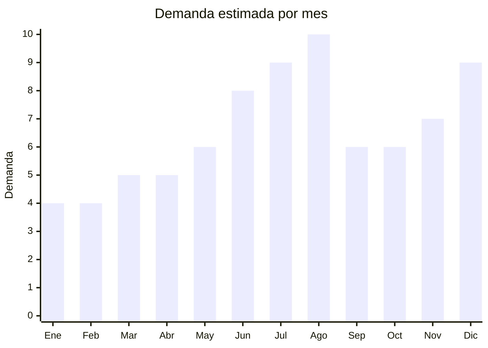

# Juegos de mesa familiares y de estrategia

> **Capitulo NCM 95** — Juguetes, juegos y articulos para recreo o deporte | **Temporada:** Invierno (Jun–Ago)

## Que es y por que importarlo

Los juegos de mesa familiares y de estrategia para invierno incluyen ediciones especiales de juegos clasicos en formato grande/premium, juegos party para reuniones familiares, juegos de trivia, juegos de estrategia para mayores de 14 años, y juegos cooperativos. La diferencia con la oferta atemporal es que en invierno se buscan especificamente juegos para jugar "en casa con la familia" durante las noches frias y las vacaciones de julio — formatos mas grandes, mas jugadores, mas tiempo de juego.

La categoria registro un **crecimiento del +63% interanual** en Argentina. El invierno es el momento perfecto: las familias pasan mas tiempo adentro, las vacaciones de julio liberan tiempo, y el Dia del Niño en agosto genera un pico de regalos. Los juegos de mesa son una de las pocas categorias que apelan a toda la familia, no solo a los niños.

En MercadoLibre, los juegos party tipo "What Do You Meme?", juegos de preguntas y respuestas, y versiones economicas de clasicos como Monopoly, Risk, y Catán dominan las busquedas de invierno. Las fabricas chinas en Dongguan se especializan en impresion de cartas, tableros y cajas de alta calidad a precios FOB de USD 2-8 por juego. Una ventaja clave: los juegos customizados con reglas e instrucciones en español tienen mayor valor percibido y menor competencia.

## Datos clave

| Dato | Valor |
|------|-------|
| **Posiciones NCM tipicas** | 9504.40 (naipes), 9504.90 (otros juegos de mesa) |
| **Derecho de importacion** | 20% (DIE) + 3% tasa estadistica |
| **Rango FOB tipico** | USD 2.00 — USD 8.00 por unidad |
| **Precio de venta en Argentina** | ARS 8.000 — ARS 35.000 |
| **Margen bruto estimado** | 200% — 400% |
| **MOQ tipico** | 200 — 1,000 unidades |
| **Demanda en MercadoLibre** | Alta (+63% crecimiento interanual) |
| **Competencia en MercadoLibre** | Media-Alta (Ruibal, Top Toys) |
| **Dificultad para importar** | Baja (adultos) / Moderada (menores 14) |
| **Certificaciones necesarias** | IRAM 3583 solo si dirigido a menores de 14 años |
| **Antidumping** | No |

## Variantes y subtipos mas comunes

| Subtipo / Variante | FOB aprox. | Venta AR aprox. | Nota |
|--------------------|-----------|-----------------|------|
| Juego party cartas (tipo What Do You Meme, adultos) | USD 2 — 4 | ARS 8.000 — 18.000 | **Sin IRAM** — publico +14. Altisima rotacion |
| Juego familiar clasico edicion grande | USD 4 — 8 | ARS 15.000 — 35.000 | Tablero grande, piezas premium, 4-6 jugadores |
| Juego de trivia/preguntas (custom español) | USD 2 — 5 | ARS 8.000 — 22.000 | Alto valor percibido si esta en español nativo |
| Juego de estrategia (tipo Catán/Risk simplificado) | USD 4 — 8 | ARS 15.000 — 30.000 | Nicho creciente, coleccionistas |
| Juegos cooperativos familiares | USD 3 — 6 | ARS 10.000 — 25.000 | Tendencia: todos juegan juntos vs competencia |
| Pack x3 juegos mini/viaje | USD 3 — 6 | ARS 10.000 — 22.000 | Formato vacaciones de julio |

## Regulaciones y requisitos

<Tabs>
  <Tab title="Certificaciones">
    | Organismo | Requiere | Detalle |
    |-----------|----------|---------|
    | ARCA (Aduana) | Si siempre | Despacho estandar |
    | IRAM 3583 | **Condicional** | Solo si el juego esta dirigido a menores de 14 años. Juegos "+14" o "adultos" NO requieren |
    | ENACOM | No | No es electronico |
    | S-Mark | No | No es electrico |
    | ANMAT | No | No aplica |

    <Note>
    **Estrategia regulatoria:** Los juegos party para adultos (+14/+18) NO requieren IRAM 3583, lo que simplifica enormemente la importacion. Si el producto lo permite, posicionarlo como "+14 años" en el packaging. Juegos con contenido familiar pero que pueden funcionar para adultos pueden etiquetarse como "+14" si no son evidentemente infantiles. Sin embargo, juegos con imagenes de dibujos animados, personajes infantiles o que claramente estan destinados a niños NO pueden evadir la regulacion.
    </Note>
  </Tab>

  <Tab title="Etiquetado">
    | Requisito | Aplica |
    |-----------|--------|
    | Idioma español | Si (critico: instrucciones en español nativo) |
    | Datos del importador | Si |
    | Rango de edad recomendado | Si (obligatorio) |
    | Numero de jugadores | Recomendado |
    | Tiempo de juego estimado | Recomendado |
    | Advertencias piezas pequeñas | Si si tiene piezas chicas y es para menores de 3 |
    | Pais de origen | Si |
    | Sello IRAM (si aplica) | Si si dirigido a menores 14 |
    | Garantia legal 6 meses | Si |
  </Tab>

  <Tab title="Restricciones">
    - Juegos que sean copias identicas de juegos patentados (Monopoly es marca de Hasbro, UNO es de Mattel) pueden generar reclamos de propiedad intelectual. Variaciones suficientes en nombre, diseño y mecanica evitan el problema.
    - Juegos con contenido para adultos (humor negro, tematicas +18) deben tener advertencia clara y empaque que impida la visualizacion por menores.
    - Personajes de marcas registradas en las cartas o tablero son riesgo de retencion.
    - Sin antidumping vigente.
  </Tab>
</Tabs>

## Logistica

| Dato | Valor |
|------|-------|
| **Peso tipico por unidad** | 0.3 — 1.2 kg (con caja) |
| **Volumen tipico** | Bajo a Medio (cajas planas, apilables) |
| **Fragilidad** | Baja (cartas) a Media (tableros rigidos, piezas de madera) |
| **Envio recomendado** | Aereo para primeros pedidos, maritimo para volumen |
| **Tiempo total estimado** | 15 — 25 dias (aereo) / 50 — 70 dias (maritimo) |
| **Baterias de litio** | No |
| **Requiere empaque especial** | No — film retractil sobre cada caja evita que se abran en transito |

<Tip>
Los juegos de mesa customizados con reglas en **español argentino** (no español neutro ni castellano de España) tienen una ventaja competitiva enorme. Los proveedores chinos en Dongguan ofrecen impresion custom a bajo costo: envias el archivo de diseño con las reglas, cartas y tablero, y fabrican el juego completo. El costo extra de customizacion es minimo (USD 0.50-1.00 por juego) pero permite crear productos unicos que no compiten directamente con importaciones genéricas en ingles.
</Tip>

## Estacionalidad



| Aspecto | Detalle |
|---------|---------|
| **Meses pico** | Agosto (Dia del Niño), Julio (vacaciones invierno — mas tiempo en casa), Diciembre (Navidad) |
| **Meses valle** | Enero-Febrero (vacaciones de verano, actividades al aire libre) |
| **Cuando pedir** | Marzo-Abril para maritimo. Mayo para aereo y llegar antes de julio |

## Ventajas y riesgos

<CardGroup cols={2}>
  <Card title="Ventajas" icon="circle-check">
    - +63% crecimiento interanual en la categoria
    - Juegos +14 NO requieren IRAM — importacion simplificada
    - Producto liviano y compacto: flete eficiente
    - Customizacion en español a bajo costo extra
    - Invierno = temporada perfecta para juegos en casa
    - Margenes 200-400%, especialmente en party games
    - FOB muy bajo: desde USD 2 por juego
  </Card>
  <Card title="Riesgos" icon="triangle-exclamation">
    - IRAM 3583 obligatorio si dirigido a menores de 14
    - Copias de marcas registradas generan reclamos legales
    - Juegos sin instrucciones en español se venden mal
    - Competencia de marcas locales (Ruibal, Top Toys)
    - Calidad de impresion variable en proveedores baratos
    - Cada variante para menores requiere certificacion independiente
  </Card>
</CardGroup>

## Palabras clave para buscar en Alibaba

```
board game custom printing factory, party card game OEM Spanish,
family board game wholesale, trivia game custom manufacturer,
strategy board game factory Dongguan, card game custom design printing,
table game manufacturer China, cooperative board game wholesale
```

## Fuentes

- [MercadoLibre Argentina — Juegos de mesa](https://listado.mercadolibre.com.ar/juegos-de-mesa)
- [Alibaba — Board game manufacturers](https://www.alibaba.com/trade/search?SearchText=board+game+custom)
- [IRAM — Norma 3583 Seguridad de juguetes](https://www.iram.org.ar)
- [ARCA — Nomenclador NCM](https://www.arca.gob.ar)
