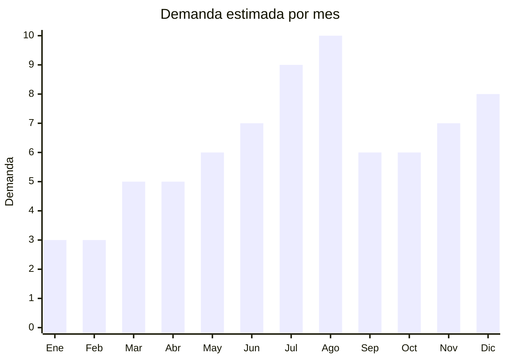

# Kits de ciencia y experimentos STEM

> **Capitulo NCM 95** — Juguetes, juegos y articulos para recreo o deporte | **Temporada:** Invierno (Jun–Ago)

## Que es y por que importarlo

Los kits de ciencia y experimentos STEM (Science, Technology, Engineering, Mathematics) son sets educativos que permiten a los niños realizar experimentos y proyectos practicos de ciencia en casa. Incluyen kits de quimica (con tubos de ensayo, reactivos seguros e instrucciones para 20-50 experimentos), kits de electronica (circuitos, LEDs, motores), kits de robotica basica (armado de robots simples con motor), microscopios infantiles (100x-1200x con muestras preparadas) y telescopios de iniciacion (refractores 50-70mm).

En Argentina, la demanda se concentra en julio-agosto por dos razones convergentes: las vacaciones de invierno dejan a los niños sin actividades y los padres buscan entretenimiento educativo, y el Dia del Niño genera demanda de regalos que los padres perciban como "utiles" ademas de divertidos. Los kits STEM tienen una **alta percepcion de valor**: los padres estan dispuestos a pagar mas por un producto que consideran educativo. Un kit de quimica con 100 experimentos FOB USD 5-8 se vende facilmente a ARS 20,000-40,000.

Las fabricas chinas en Shantou, Shenzhen y Yiwu producen kits STEM para todo el mundo. La clave del exito esta en las instrucciones en español: un kit con manual de experimentos en español bien diseñado tiene mucho mas valor percibido que uno con instrucciones solo en ingles/chino. Algunos proveedores ofrecen customizacion del manual a bajo costo extra.

## Datos clave

| Dato | Valor |
|------|-------|
| **Posiciones NCM tipicas** | 9503.00.99 (juguetes educativos), 9005.80 (microscopios/telescopios si no son juguete) |
| **Derecho de importacion** | 20% (DIE) + 3% tasa estadistica |
| **Rango FOB tipico** | USD 3.00 — USD 15.00 por kit |
| **Precio de venta en Argentina** | ARS 10.000 — ARS 50.000 |
| **Margen bruto estimado** | 200% — 500% |
| **MOQ tipico** | 100 — 500 kits |
| **Demanda en MercadoLibre** | Alta (pico julio-agosto) |
| **Competencia en MercadoLibre** | Baja-Media (nicho poco atendido) |
| **Dificultad para importar** | Moderada (IRAM 3583 + posible quimicos) |
| **Certificaciones necesarias** | IRAM 3583 obligatorio (juguete menores 14 años) |
| **Antidumping** | No |

## Variantes y subtipos mas comunes

| Subtipo / Variante | FOB aprox. | Venta AR aprox. | Nota |
|--------------------|-----------|-----------------|------|
| Kit quimica 50-100 experimentos | USD 5.00 — 10.00 | ARS 18.000 — 40.000 | **Mas vendido** — alta percepcion educativa |
| Kit electronica basica (circuitos, LEDs) | USD 3.00 — 8.00 | ARS 12.000 — 30.000 | Tendencia STEM, nicho creciente |
| Kit robotica armable (motor + sensor) | USD 5.00 — 12.00 | ARS 18.000 — 40.000 | Tecnologia + manualidad, alto valor |
| Microscopio infantil 100x-1200x con muestras | USD 5.00 — 10.00 | ARS 15.000 — 35.000 | Clasico educativo, demanda estable |
| Telescopio refractor 50-70mm con tripode | USD 8.00 — 15.00 | ARS 25.000 — 50.000 | Mayor ticket, menor rotacion |
| Kit multi-ciencia (quimica + fisica + biologia) | USD 8.00 — 15.00 | ARS 25.000 — 50.000 | Percepcion de valor maxima |

## Regulaciones y requisitos

<Tabs>
  <Tab title="Certificaciones">
    | Organismo | Requiere | Detalle |
    |-----------|----------|---------|
    | ARCA (Aduana) | Si siempre | Despacho estandar |
    | IRAM 3583 | **Si — obligatorio** | Juguete para menores de 14 años. Kits de quimica tienen ensayos especificos para sustancias incluidas |
    | ANMAT | **Verificar** | Si el kit incluye sustancias quimicas, ANMAT puede requerir evaluacion dependiendo de la composicion |
    | ENACOM | No | Generalmente no aplica (salvo kits con radio/WiFi) |
    | S-Mark | No | Generalmente no aplica |

    <Warning>
    Los kits de quimica tienen requisitos especiales dentro de IRAM 3583: las sustancias incluidas deben ser seguras y estar listadas como aptas para uso infantil. Verificar que el proveedor proporcione la lista completa de reactivos (MSDS — Material Safety Data Sheet) para cada sustancia. Algunas sustancias que eran comunes en kits antiguos ahora estan prohibidas (acido borico en algunas concentraciones, por ejemplo). Para microscopios y telescopios, si se clasifican como instrumentos opticos (no juguetes), pueden no requerir IRAM 3583.
    </Warning>
  </Tab>

  <Tab title="Etiquetado">
    | Requisito | Aplica |
    |-----------|--------|
    | Idioma español | Si (critico: instrucciones de experimentos en español) |
    | Datos del importador | Si |
    | Rango de edad recomendado | Si (tipicamente 8+ o 10+ segun complejidad) |
    | Lista de componentes | Si (especialmente sustancias quimicas) |
    | Advertencias de seguridad | Si (supervision adulta, uso de guantes/proteccion) |
    | Pais de origen | Si |
    | Sello IRAM | Si |
    | Garantia legal 6 meses | Si |
  </Tab>

  <Tab title="Restricciones">
    - Kits con sustancias quimicas: verificar que ninguna sustancia este prohibida o restringida para juguetes en Argentina.
    - Kits con baterias (robotica, electronica): restricciones de envio si son de litio.
    - Sin antidumping vigente.
    - Telescopios y microscopios de calidad optica real pueden clasificarse fuera de NCM 95 (como instrumentos opticos NCM 90), lo que cambia la regulacion aplicable.
  </Tab>
</Tabs>

## Logistica

| Dato | Valor |
|------|-------|
| **Peso tipico por unidad** | 0.5 — 2.0 kg (kit con caja) |
| **Volumen tipico** | Medio (cajas 30-50 cm, contienen multiples componentes) |
| **Fragilidad** | Media (tubos de vidrio en kits de quimica, lentes en opticos) |
| **Envio recomendado** | Maritimo para volumen. Aereo posible para kits sin quimicos |
| **Tiempo total estimado** | 15 — 25 dias (aereo) / 50 — 75 dias (maritimo) |
| **Baterias de litio** | Condicional (kits de robotica/electronica) |
| **Requiere empaque especial** | Si — kits de quimica necesitan embalaje que evite derrame. Opticos necesitan proteccion de lentes |

<Tip>
Los kits STEM tienen la mejor percepcion de valor de toda la categoria juguetes: los padres pagan premium por productos "educativos". Un kit de quimica con instrucciones en español bien diseñadas y packaging atractivo puede venderse al doble que un juego de mesa del mismo costo FOB. Invertir en traduccion profesional del manual de experimentos y en packaging con imagenes de niños haciendo experimentos. El costo extra de customizacion (USD 1-2 por kit) se recupera multiplicado en el precio de venta.
</Tip>

## Estacionalidad



| Aspecto | Detalle |
|---------|---------|
| **Meses pico** | Julio (vacaciones invierno — entretenimiento educativo), Agosto (Dia del Niño), Diciembre (Navidad) |
| **Meses valle** | Enero-Febrero (vacaciones de verano) |
| **Cuando pedir** | Marzo-Abril para maritimo. Los kits de quimica pueden demorar mas en produccion (15-25 dias) |

## Ventajas y riesgos

<CardGroup cols={2}>
  <Card title="Ventajas" icon="circle-check">
    - Alta percepcion de valor = margenes excepcionales (200-500%)
    - Padres pagan premium por "educativo" vs juguete comun
    - Competencia baja: nicho poco atendido en Argentina
    - Instrucciones en español customizadas agregan valor enorme
    - Vacaciones de julio crean necesidad de entretenimiento indoor
    - Producto multi-edad: kits para 6-8, 8-12, 12+ años
    - Tendencia STEM global en crecimiento sostenido
  </Card>
  <Card title="Riesgos" icon="triangle-exclamation">
    - IRAM 3583 con requisitos especiales para kits de quimica
    - Sustancias quimicas pueden generar complicaciones aduaneras
    - Componentes fragiles (tubos vidrio, lentes) pueden romperse en transito
    - Instrucciones solo en ingles/chino = producto invendible
    - Kits con piezas faltantes generan frustracion y devolucion
    - Microscopios y telescopios de baja calidad optica decepcionan
  </Card>
</CardGroup>

## Palabras clave para buscar en Alibaba

```
science kit kids experiments wholesale, chemistry set children OEM,
STEM toy kit educational wholesale, kids microscope 1200x set,
telescope kids beginner 70mm, electronics kit children education,
robot kit DIY kids wholesale, science experiment kit factory
```

## Fuentes

- [MercadoLibre Argentina — Kit ciencia niños](https://listado.mercadolibre.com.ar/kit-ciencia-niños)
- [MercadoLibre Argentina — Microscopio infantil](https://listado.mercadolibre.com.ar/microscopio-infantil)
- [Alibaba — Science kit kids](https://www.alibaba.com/trade/search?SearchText=science+kit+kids+wholesale)
- [IRAM — Norma 3583 Seguridad de juguetes](https://www.iram.org.ar)
