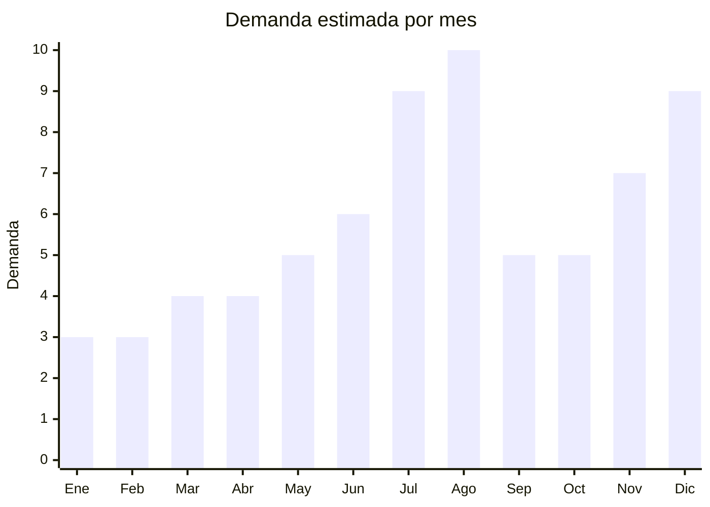

# Microfonos karaoke infantiles Bluetooth con parlante

> **Capitulo NCM 95** — Juguetes, juegos y articulos para recreo o deporte | **Temporada:** Invierno (Jun–Ago)

## Que es y por que importarlo

Los microfonos karaoke infantiles con parlante Bluetooth incorporado son dispositivos portatiles que combinan microfono, parlante y conectividad Bluetooth en una sola unidad. Se conectan al celular para reproducir musica y cantar encima. El modelo **WS858** se convirtio en la referencia de mercado: un microfono metalizado con parlante integrado, bateria recargable, y funciones como cambio de voz, eco regulable y luces LED multicolor. Es el juguete de entretenimiento indoor por excelencia para vacaciones de invierno.

En Argentina, la demanda se concentra en julio-agosto: las vacaciones de invierno (julio) dejan a los niños en casa buscando entretenimiento, y el Dia del Niño (agosto) es la fecha de regalo. Los microfonos karaoke son uno de los productos que mas crecen en busquedas durante este periodo: combinan musica, juego y tecnologia a un precio accesible.

Las fabricas chinas en Shenzhen producen microfonos karaoke masivamente con precios FOB de USD 2-6. El modelo WS858 y sus variaciones representan el grueso del mercado. Versiones mas recientes incluyen luces LED dinamicas, efectos de voz (robot, ardilla, eco), y conexion dual para cantar en duo. La bateria recargable de litio incorporada da 4-8 horas de uso.

## Datos clave

| Dato | Valor |
|------|-------|
| **Posiciones NCM tipicas** | 9503.00.99 (juguetes — microfono de juguete), 8518.10.00 (microfonos, si se clasifica como electronico) |
| **Derecho de importacion** | 20% (DIE) + 3% tasa estadistica |
| **Rango FOB tipico** | USD 2.00 — USD 6.00 por unidad |
| **Precio de venta en Argentina** | ARS 8.000 — ARS 25.000 |
| **Margen bruto estimado** | 200% — 400% |
| **MOQ tipico** | 100 — 500 unidades |
| **Demanda en MercadoLibre** | Alta (pico julio-agosto) |
| **Competencia en MercadoLibre** | Media-Alta |
| **Dificultad para importar** | Moderada-Alta (ENACOM + IRAM 3583) |
| **Certificaciones necesarias** | ENACOM (Bluetooth) + IRAM 3583 (juguete menores 14) |
| **Antidumping** | No |

## Variantes y subtipos mas comunes

| Subtipo / Variante | FOB aprox. | Venta AR aprox. | Nota |
|--------------------|-----------|-----------------|------|
| Microfono karaoke WS858 basico (BT + parlante) | USD 2.00 — 3.50 | ARS 8.000 — 15.000 | Referencia del mercado, altisima rotacion |
| Microfono karaoke con luces LED | USD 3.00 — 4.50 | ARS 10.000 — 18.000 | **Mas vendido** — luces son factor diferencial |
| Microfono karaoke infantil con cambio de voz | USD 3.50 — 5.00 | ARS 12.000 — 22.000 | Efecto robot, ardilla — encanta a niños |
| Microfono karaoke duo (2 conectados) | USD 5.00 — 6.00 | ARS 18.000 — 25.000 | Para cantar de a 2, mayor ticket |
| Microfono karaoke con soporte y pantalla LED | USD 4.00 — 6.00 | ARS 15.000 — 25.000 | Premium, efecto profesional |
| Mini microfono karaoke llavero | USD 1.50 — 2.50 | ARS 5.000 — 10.000 | Impulso, formato pocket |

## Regulaciones y requisitos

<Tabs>
  <Tab title="Certificaciones">
    | Organismo | Requiere | Detalle |
    |-----------|----------|---------|
    | ARCA (Aduana) | Si siempre | Despacho estandar |
    | ENACOM | **Si — obligatorio** | Modulo Bluetooth requiere homologacion ENACOM. Costo aprox. USD 200-500, tiempo 30-60 dias |
    | IRAM 3583 | **Si — obligatorio** | Si se comercializa como juguete para menores de 14 años |
    | S-Mark | **Condicional** | Si incluye cargador de pared 220V. Si carga solo por USB, generalmente no |
    | ANMAT | No | No aplica |

    <Warning>
    **Doble certificacion obligatoria:** ENACOM (por Bluetooth) + IRAM 3583 (por juguete). Este es el producto con mayor carga regulatoria de esta lista. El proceso completo puede demorar 60-90 dias entre ambas certificaciones. Planificar con mucha anticipacion. Una alternativa es clasificar como "equipo electronico de audio" (+14 años) para evitar IRAM 3583, pero si el producto se publicita claramente para niños, la aduana puede exigir la certificacion igualmente.
    </Warning>
  </Tab>

  <Tab title="Etiquetado">
    | Requisito | Aplica |
    |-----------|--------|
    | Idioma español | Si |
    | Datos del importador | Si |
    | Especificaciones tecnicas (BT, bateria, frecuencia) | Si |
    | Numero homologacion ENACOM | Si (visible en producto o packaging) |
    | Rango de edad recomendado | Si |
    | Advertencias (volumen maximo, bateria litio) | Si |
    | Pais de origen | Si |
    | Sello IRAM (si aplica) | Si |
    | Garantia legal 6 meses | Si |
  </Tab>

  <Tab title="Restricciones">
    - Contiene bateria de litio recargable: restricciones de envio aereo (documentacion DGR, limite de Wh).
    - El Bluetooth debe operar en frecuencias aprobadas por ENACOM para Argentina.
    - Volumen maximo del parlante no debe exceder niveles que puedan dañar la audicion infantil — verificar con el proveedor.
    - Sin antidumping vigente.
  </Tab>
</Tabs>

## Logistica

| Dato | Valor |
|------|-------|
| **Peso tipico por unidad** | 0.20 — 0.40 kg (con caja) |
| **Volumen tipico** | Bajo (caja 25x10x10 cm aprox.) |
| **Fragilidad** | Media (electronica interna, parlante, pantalla LED) |
| **Envio recomendado** | Maritimo consolidado. Aereo con documentacion DGR (bateria litio) |
| **Tiempo total estimado** | 15 — 25 dias (aereo) / 50 — 70 dias (maritimo) |
| **Baterias de litio** | Si — bateria recargable incorporada (requiere documentacion DGR para aereo) |
| **Requiere empaque especial** | Caja individual con espuma protectora. No apilar excesivamente |

<Tip>
La bateria de litio recargable complica ligeramente el envio aereo (requiere documentacion DGR y packaging especial), pero no el maritimo. Para el primer pedido, el maritimo es mas simple. Un pedido de 300 microfonos pesa apenas 90-120 kg. Solicitar al proveedor que las baterias vengan con carga parcial (40-60%) para el transito, que es el requisito estandar de seguridad para envio de baterias de litio.
</Tip>

## Estacionalidad



| Aspecto | Detalle |
|---------|---------|
| **Meses pico** | Julio (vacaciones invierno — entretenimiento indoor), Agosto (Dia del Niño), Diciembre (Navidad) |
| **Meses valle** | Enero-Marzo (verano, actividades al aire libre) |
| **Cuando pedir** | Febrero-Marzo para maritimo. Considerar 90 dias para produccion + envio + ENACOM + IRAM |

## Ventajas y riesgos

<CardGroup cols={2}>
  <Card title="Ventajas" icon="circle-check">
    - Entretenimiento indoor perfecto para invierno
    - Margenes del 200-400%
    - Producto liviano y compacto: buen ratio valor/peso
    - Cambio de voz y luces LED encantan a niños
    - WS858 es referencia de mercado probada
    - Versatil: sirve para niños Y para adultos (karaoke familiar)
    - FOB muy bajo: desde USD 2 por unidad
  </Card>
  <Card title="Riesgos" icon="triangle-exclamation">
    - Doble certificacion ENACOM + IRAM: mayor complejidad regulatoria
    - Bateria de litio complica logistica aerea
    - Calidad de audio variable en modelos baratos (distorsion)
    - Bluetooth inestable genera desconexiones y reclamos
    - Competencia alta en el segmento WS858 genérico
    - Proceso completo puede demorar 90+ dias
  </Card>
</CardGroup>

## Palabras clave para buscar en Alibaba

```
karaoke microphone kids Bluetooth, WS858 microphone wholesale,
wireless karaoke microphone LED lights, kids karaoke mic speaker,
Bluetooth microphone toy factory, karaoke microphone voice changer,
portable karaoke microphone wholesale Shenzhen, kids singing microphone BT
```

## Fuentes

- [MercadoLibre Argentina — Microfono karaoke](https://listado.mercadolibre.com.ar/microfono-karaoke-infantil)
- [Alibaba — Karaoke microphone wholesale](https://www.alibaba.com/trade/search?SearchText=karaoke+microphone+kids+bluetooth)
- [ENACOM — Homologacion de equipos](https://www.enacom.gob.ar)
- [IRAM — Norma 3583 Seguridad de juguetes](https://www.iram.org.ar)
