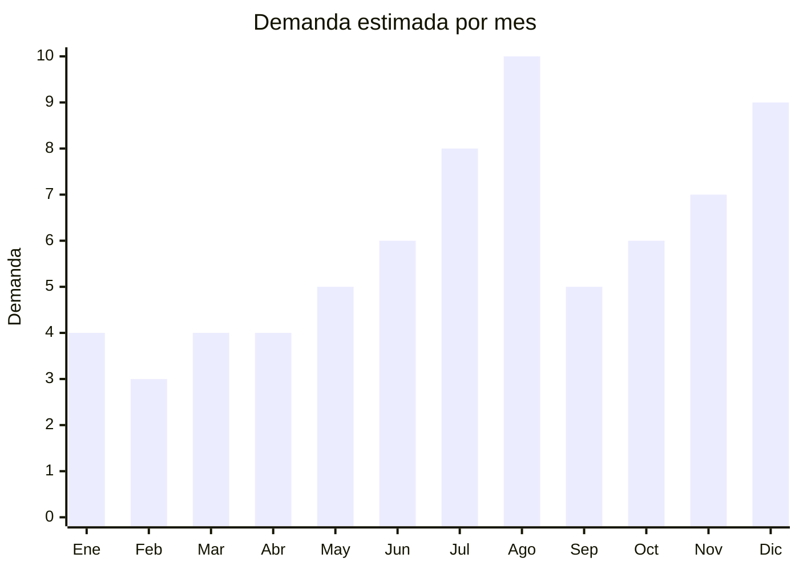

# Munecas Cry Babies y bebes reborn

> **Capitulo NCM 95** — Juguetes, juegos y articulos para recreo o deporte | **Temporada:** Invierno (Jun–Ago)

## Que es y por que importarlo

Las muñecas Cry Babies y los bebes reborn son dos segmentos de muñecas que dominan las busquedas de Dia del Niño en Argentina. Las **Cry Babies** son muñecas que "lloran" lagrimas reales (con mecanismo de agua), tienen chupete que las calma, y vienen con pijamas tematicos de animales. **IMC Toys** (España) creo la marca original que es #19 en el ranking de productos mas vendidos de MercadoLibre Argentina. Los **bebes reborn** son muñecas hiperrealistas de 45-60cm de vinilo suave que simulan la apariencia y el peso de un bebe real, con detalles como venas pintadas, pestañas implantadas y ropa de tela.

El mercado argentino de muñecas para Dia del Niño es enorme. Las Cry Babies originales de IMC Toys cuestan ARS 40,000-80,000 en retail, lo que abre espacio para versiones genericas chinas posicionadas como "bebe lloron" a ARS 10,000-25,000. Las fabricas chinas en Shantou y Guangzhou producen muñecas con mecanismos de llanto identicos (sin usar la marca Cry Babies) desde USD 3-8 FOB. Los bebes reborn genéricos de vinilo desde USD 5-12 FOB se venden a ARS 15,000-40,000.

La estrategia legalmente segura es importar genericos etiquetados como "bebe lloron con lagrimas reales" o "bebe realista de vinilo" sin mencionar jamas la marca Cry Babies, IMC Toys ni replicar el diseño exacto de los personajes (Coney, Lady, Dotty, etc.). Las fabricas chinas tienen lineas de muñecas con mecanismo de llanto y diseños propios que cumplen la misma funcion.

## Datos clave

| Dato | Valor |
|------|-------|
| **Posiciones NCM tipicas** | 9503.00.21 (muñecas que representen seres humanos), 9503.00.29 (partes y accesorios) |
| **Derecho de importacion** | 20% (DIE) + 3% tasa estadistica |
| **Rango FOB tipico** | USD 3.00 — USD 12.00 por unidad |
| **Precio de venta en Argentina** | ARS 8.000 — ARS 45.000 |
| **Margen bruto estimado** | 200% — 400% |
| **MOQ tipico** | 100 — 500 unidades |
| **Demanda en MercadoLibre** | Muy Alta (Cry Babies #19 en ranking general ML) |
| **Competencia en MercadoLibre** | Media-Alta |
| **Dificultad para importar** | Moderada (IRAM 3583 obligatorio) |
| **Certificaciones necesarias** | IRAM 3583 obligatorio (juguete menores 14 años) |
| **Antidumping** | No |

## Variantes y subtipos mas comunes

| Subtipo / Variante | FOB aprox. | Venta AR aprox. | Nota |
|--------------------|-----------|-----------------|------|
| Muñeca "bebe lloron" generica 30cm (con lagrimas + sonido) | USD 3.00 — 6.00 | ARS 10.000 — 22.000 | **Mas vendida** — version accesible |
| Muñeca "bebe lloron" con accesorios (biberon, chupete, ropita) | USD 5.00 — 8.00 | ARS 15.000 — 30.000 | Mayor valor percibido |
| Bebe reborn vinilo 45-49cm (cuerpo blando, extremidades vinilo) | USD 5.00 — 8.00 | ARS 15.000 — 30.000 | Hiperrealista, publico coleccionista + niñas |
| Bebe reborn vinilo completo 49-55cm | USD 8.00 — 12.00 | ARS 25.000 — 45.000 | Premium, bañable, peso realista (~1.5kg) |
| Mini muñeca lloronas 15-20cm (formato bolsita sorpresa) | USD 1.50 — 3.00 | ARS 5.000 — 10.000 | Impulso, coleccion, accesible |
| Set muñeca + cuna/cochecito | USD 6.00 — 10.00 | ARS 18.000 — 35.000 | Kit completo, regalo premium |

## Regulaciones y requisitos

<Tabs>
  <Tab title="Certificaciones">
    | Organismo | Requiere | Detalle |
    |-----------|----------|---------|
    | ARCA (Aduana) | Si siempre | Despacho estandar |
    | IRAM 3583 | **Si — obligatorio** | Juguete para menores de 14 años. Ensayos incluyen partes pequeñas, materiales toxicos (especialmente vinilo/PVC), resistencia mecanica |
    | ENACOM | No | Muñecas con sonido usan circuito simple, no radiofrecuencia |
    | ANMAT | No | No aplica |
    | S-Mark | No | Opera con pilas, no con red electrica |

    <Warning>
    Las muñecas de vinilo/PVC requieren atencion especial en los ensayos IRAM 3583: el vinilo blando puede contener **ftalatos** en concentraciones superiores a lo permitido. Los ftalatos (plastificantes) son sustancias restringidas para juguetes en contacto con la boca de los niños. Solicitar al proveedor certificado de contenido de ftalatos antes de iniciar la certificacion IRAM. Rechazar proveedores que no puedan proveer este certificado.
    </Warning>
  </Tab>

  <Tab title="Etiquetado">
    | Requisito | Aplica |
    |-----------|--------|
    | Idioma español | Si |
    | Datos del importador | Si |
    | Rango de edad recomendado | Si (tipicamente 3+) |
    | Composicion materiales | Si (vinilo, PVC, poliester del relleno) |
    | Tipo de pilas requeridas | Si (muñecas con sonido/llanto) |
    | Advertencias | Si (piezas pequeñas, supervisar durante uso con agua) |
    | Pais de origen | Si |
    | Sello IRAM | Si |
    | Garantia legal 6 meses | Si |
  </Tab>

  <Tab title="Restricciones">
    **PROPIEDAD INTELECTUAL:**

    - "Cry Babies" es marca registrada de IMC Toys. Importar muñecas con este nombre o replicar los personajes especificos (Coney, Lady, Dotty) genera retencion aduanera y acciones legales.
    - La estrategia segura: etiquetar como "bebe lloron con lagrimas reales" o "muñeca lloronas" (nombre generico). Usar diseños de personajes originales del fabricante, no copias de IMC Toys.
    - Los bebes reborn genericos no tienen problemas de marca (no hay marca dominante registrada para el concepto "reborn").
    - Sin antidumping vigente.
  </Tab>
</Tabs>

## Logistica

| Dato | Valor |
|------|-------|
| **Peso tipico por unidad** | 0.3 — 1.5 kg (segun tamaño y material) |
| **Volumen tipico** | Medio (cajas con ventana 30-50cm) |
| **Fragilidad** | Media (vinilo puede marcarse, packaging debe proteger rostro) |
| **Envio recomendado** | Maritimo LCL para volumen. Aereo viable para pedidos chicos |
| **Tiempo total estimado** | 15 — 25 dias (aereo) / 50 — 75 dias (maritimo) |
| **Baterias de litio** | No (pilas AA/AAA estandar) |
| **Requiere empaque especial** | Caja con ventana plastica + inserto que sostiene la muñeca. Proteger rostro |

<Tip>
Los bebes reborn de vinilo completo (bañables) tienen un punto de venta unico: se pueden bañar. Esto los diferencia de las muñecas de tela con extremidades de vinilo. Pedir al proveedor que incluya un certificado de "waterproof" y mencionarlo en la publicacion. Para muñecas con mecanismo de llanto, solicitar video de funcionamiento de la muestra antes de confirmar pedido — verificar que el sonido sea convincente y el flujo de lagrimas funcione correctamente.
</Tip>

## Estacionalidad



| Aspecto | Detalle |
|---------|---------|
| **Meses pico** | Agosto (Dia del Niño — pico absoluto), Diciembre (Navidad), Julio (preventa) |
| **Meses valle** | Enero-Marzo (post-fiestas) |
| **Cuando pedir** | Marzo-Abril para maritimo. Mayo para aereo urgente |

## Ventajas y riesgos

<CardGroup cols={2}>
  <Card title="Ventajas" icon="circle-check">
    - Cry Babies es #19 en ranking MercadoLibre — demanda validada masivamente
    - Genericos a fraccion del precio de IMC Toys (ARS 10,000 vs ARS 60,000)
    - Margenes del 200-400%
    - Mecanismo de llanto genera efecto wow en niñas
    - Bebes reborn apelan a coleccionistas adultas tambien
    - Fabricas chinas tienen diseños propios sin riesgo de marca
    - Pilas estandar (no litio): logistica simple
  </Card>
  <Card title="Riesgos" icon="triangle-exclamation">
    - IRAM 3583 obligatorio: costo adicional por modelo
    - Alto riesgo si se usa marca "Cry Babies" o diseños de IMC Toys
    - Vinilo PVC barato puede contener ftalatos prohibidos
    - Mecanismo de llanto puede fallar (agua, bomba, sensor)
    - Muñecas con olor quimico fuerte generan devolucion
    - Competencia de la marca original que baja precios
  </Card>
</CardGroup>

## Palabras clave para buscar en Alibaba

```
crying baby doll tears wholesale, baby doll cry tears mechanism,
reborn baby doll vinyl 49cm, realistic baby doll factory,
cry doll toy wholesale OEM, silicone reborn doll manufacturer,
baby doll with tears sound, vinyl baby doll factory Shantou
```

## Fuentes

- [MercadoLibre Argentina — Cry Babies](https://listado.mercadolibre.com.ar/cry-babies)
- [MercadoLibre Argentina — Bebe reborn](https://listado.mercadolibre.com.ar/bebe-reborn)
- [Alibaba — Crying baby doll wholesale](https://www.alibaba.com/trade/search?SearchText=crying+baby+doll)
- [IRAM — Norma 3583 Seguridad de juguetes](https://www.iram.org.ar)
