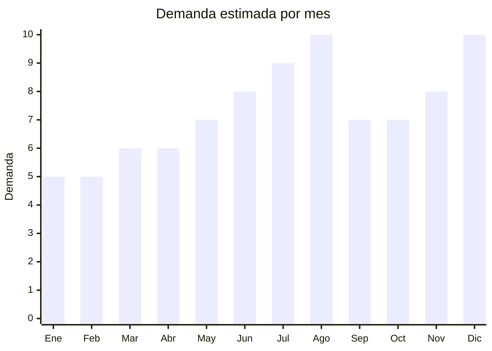

# Peluches coleccionables tipo Labubu / blind box

> **Capitulo NCM 95** — Juguetes, juegos y articulos para recreo o deporte | **Temporada:** Invierno (Jun–Ago)

## Que es y por que importarlo

Los peluches coleccionables tipo blind box son figuras de peluche pequeñas (8-20 cm) que se venden en cajas selladas sin que el comprador sepa cual modelo recibira hasta abrirla. El formato "caja sorpresa" genera una mecanica de coleccion y re-compra altamente adictiva. Cada serie tiene entre 6 y 12 modelos regulares mas 1-2 modelos "secretos" de baja probabilidad, lo que impulsa compras multiples.

**Pop Mart** es la empresa china que revoluciono este mercado a nivel mundial con su personaje estrella **Labubu**, diseñado por el artista Kasing Lung. En 2025, Labubu se convirtio en un fenomeno viral global: celebridades como Lisa de BLACKPINK publicaron fotos con Labubu colgando de sus carteras, disparando la demanda a niveles sin precedentes. En Argentina, la tendencia llego con fuerza: MercadoLibre registra mas de **100,000 busquedas mensuales** de "Labubu" y productos relacionados, con un ticket promedio de **ARS 68,211**. Las ventas crecieron mas del **+300%** interanual en la categoria de peluches coleccionables.

La oportunidad para el importador esta en los **genericos** (no marcas Pop Mart originales). Existen decenas de fabricas en Dongguan y Shantou que producen peluches coleccionables en formato blind box con personajes propios o genéricos que replican la mecanica sin infringir marcas registradas. El FOB va de USD 2.50 a USD 6.00 por caja individual, y se venden en Argentina entre ARS 5,000 y ARS 25,000, con margenes del 200-500%.

## Datos clave

| Dato | Valor |
|------|-------|
| **Posiciones NCM tipicas** | 9503.00.99 (otros juguetes) |
| **Derecho de importacion** | 20% (DIE) + 3% tasa estadistica |
| **Rango FOB tipico** | USD 2.50 — USD 6.00 por caja blind box |
| **Precio de venta en Argentina** | ARS 5.000 — ARS 25.000 por caja |
| **Ticket promedio MercadoLibre** | ARS 68.211 (dato 2025) |
| **Margen bruto estimado** | 200% — 500% |
| **MOQ tipico** | 200 — 1,000 cajas (1 serie = 12 cajas = 1 display) |
| **Demanda en MercadoLibre** | Muy Alta (+100,000 busquedas/mes "Labubu") |
| **Competencia en MercadoLibre** | Alta (pero mercado en expansion) |
| **Dificultad para importar** | Moderada (IRAM 3583 + zona gris marcas) |
| **Certificaciones necesarias** | IRAM 3583 obligatorio (juguete para menores de 14 años) |
| **Antidumping** | No |

## Variantes y subtipos mas comunes

| Subtipo / Variante | FOB aprox. | Venta AR aprox. | Nota |
|--------------------|-----------|-----------------|------|
| Blind box peluche generico 10-15cm (serie 6-12 modelos) | USD 2.50 — 4.00 | ARS 5.000 — 15.000 | **Volumen ideal** — mecanica coleccion |
| Blind box peluche premium 15-20cm (materiales superiores) | USD 4.00 — 6.00 | ARS 12.000 — 25.000 | Mayor calidad, coleccionistas |
| Display completo (12 cajas = 1 serie) | USD 30 — 70 | ARS 60.000 — 200.000 | Venta al por mayor a revendedores |
| Peluche llavero blind bag 8-10cm | USD 1.50 — 3.00 | ARS 3.000 — 8.000 | Formato mas accesible, impulso |
| Pack x3 o x6 cajas surtidas | USD 8 — 20 | ARS 15.000 — 50.000 | Regalo ideal, mayor ticket |

## Regulaciones y requisitos

<Tabs>
  <Tab title="Certificaciones">
    | Organismo | Requiere | Detalle |
    |-----------|----------|---------|
    | ARCA (Aduana) | Si siempre | Despacho estandar |
    | IRAM 3583 | **Si — obligatorio** | Producto destinado a menores de 14 años. Certificacion de seguridad de juguetes. Costo aprox. USD 500-1,500 por linea |
    | ENACOM | No | No es electronico |
    | ANMAT | No | No aplica |
    | S-Mark | No | No es electrico |

    <Warning>
    **IRAM 3583 es obligatorio** para todos los peluches coleccionables, ya que son juguetes destinados a menores de 14 años. El certificado debe tramitarse antes del despacho aduanero con un laboratorio acreditado (INTI, Bureau Veritas, SGS). Prever 30-60 dias adicionales y USD 500-1,500 por linea de producto. Los ensayos incluyen: partes pequeñas, materiales toxicos (plomo, ftalatos), inflamabilidad del textil.
    </Warning>
  </Tab>

  <Tab title="Etiquetado">
    | Requisito | Aplica |
    |-----------|--------|
    | Idioma español | Si |
    | Datos del importador | Si |
    | Composicion materiales | Si (tipo de relleno, tela exterior) |
    | Pais de origen | Si |
    | Rango de edad recomendado | Si (obligatorio en juguetes) |
    | Advertencias piezas pequeñas | Si (si incluye accesorios chicos) |
    | Sello IRAM | Si (visible en packaging) |
    | Garantia legal 6 meses | Si |
  </Tab>

  <Tab title="Restricciones">
    **ZONA GRIS DE MARCAS REGISTRADAS:**

    - Labubu, Molly, Dimoo y otros personajes Pop Mart son **marcas registradas**. Importar replicas exactas puede resultar en retencion aduanera por propiedad intelectual y acciones legales.
    - La estrategia segura es importar **personajes genericos** propios de la fabrica o diseños originales que repliquen la **mecanica** (blind box, coleccion, series) sin copiar los personajes especificos.
    - Fabricas en Dongguan ofrecen lineas de personajes propios con diseño original (monstruitos, animalitos, aliens) que no infringen ninguna marca.
    - Evitar absolutamente packaging que mencione "Pop Mart", "Labubu" o cualquier marca registrada.
    - IRAM 3583 obligatorio sin excepciones.
  </Tab>
</Tabs>

## Logistica

| Dato | Valor |
|------|-------|
| **Peso tipico por unidad** | 0.08 — 0.20 kg (caja individual) |
| **Volumen tipico** | Bajo (cajas 8-12 cm por lado) |
| **Fragilidad** | Baja (peluche blando, caja rigida lo protege) |
| **Envio recomendado** | Maritimo LCL para volumen, aereo viable para primeros pedidos |
| **Tiempo total estimado** | 15 — 25 dias (aereo) / 50 — 70 dias (maritimo) |
| **Baterias de litio** | No |
| **Requiere empaque especial** | No — display de 12 unidades ya protege individualmente |

<Tip>
Los peluches blind box son ultralivianos y compactos. Un pedido de 1,000 cajas pesa apenas 100-200 kg y ocupa minimo volumen. La relacion valor/peso/volumen es extraordinaria: un solo master carton de 100 cajas pesa ~15 kg y puede generar ARS 500,000-1,500,000 en ventas. Ideal para envio aereo en la primera importacion como test de mercado.
</Tip>

## Estacionalidad



| Aspecto | Detalle |
|---------|---------|
| **Meses pico** | Agosto (Dia del Niño — pico maximo), Diciembre (Navidad), Julio (vacaciones invierno + preventa) |
| **Meses valle** | Enero-Febrero (post-fiestas, pero demanda base fuerte) |
| **Cuando pedir** | Marzo-Abril para tener stock en junio. La tendencia es TAN fuerte en 2025 que la demanda base es alta todo el año |

## Ventajas y riesgos

<CardGroup cols={2}>
  <Card title="Ventajas" icon="circle-check">
    - PRODUCTO ESTRELLA invierno 2025: +300% crecimiento interanual
    - Ticket promedio ARS 68,211 — alto para un peluche
    - Mecanica de re-compra: coleccionistas compran multiples veces
    - Ultraliviano y compacto: flete minimo
    - +100,000 busquedas mensuales en MercadoLibre
    - Tendencia viral global con años de recorrido
    - Margenes del 200-500%
  </Card>
  <Card title="Riesgos" icon="triangle-exclamation">
    - IRAM 3583 obligatorio agrega costo y tiempo
    - Zona gris de marcas registradas: riesgo legal con replicas
    - Tendencia puede desacelerar en 2026 (moda vs demanda sostenida)
    - Competencia creciente rapida en el nicho
    - Calidad del peluche variable: relleno pobre, costuras debiles
    - Necesidad de renovar series frecuentemente para mantener interes
  </Card>
</CardGroup>

## Palabras clave para buscar en Alibaba

```
blind box plush toy wholesale, mystery box plush toy series,
collectible plush blind bag OEM, mini plush toy blind box factory,
surprise box plush keychain wholesale, designer toy plush series,
blind box toy manufacturer Dongguan, collectible figure plush box
```

## Fuentes

- [MercadoLibre Argentina — Labubu y blind box](https://listado.mercadolibre.com.ar/labubu)
- [Alibaba — Blind box plush toys](https://www.alibaba.com/trade/search?SearchText=blind+box+plush+toy)
- [IRAM — Norma 3583 Seguridad de juguetes](https://www.iram.org.ar)
- [ARCA — Nomenclador NCM](https://www.arca.gob.ar)
