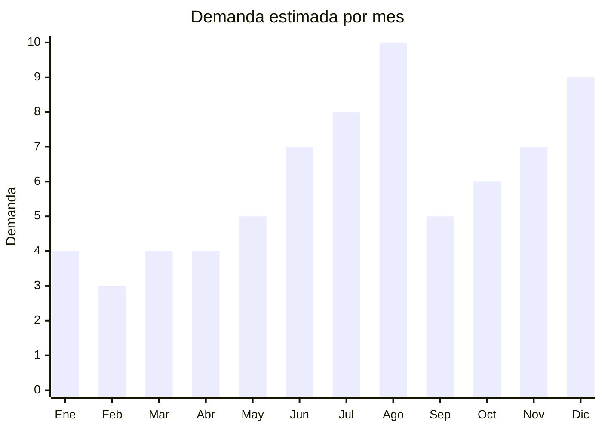

# Peluches grandes y munecos de tela

> **Capitulo NCM 95** — Juguetes, juegos y articulos para recreo o deporte | **Temporada:** Invierno (Jun–Ago)

## Que es y por que importarlo

Los peluches grandes y munecos de tela son juguetes blandos de tamaño mediano a grande (50 a 120 cm), tipicamente rellenos de fibra de poliester hueca siliconada y cubiertos con tela de peluche (plush) de poliester. Incluyen clasicos universales como osos de peluche, y tendencias actuales como capybaras (carpinchos), Stitch (Disney), Totoro, gatos kawaii y personajes de anime. El peluche grande es el regalo por excelencia del Dia del Niño en Argentina.

La categoria registro un **crecimiento del +79% interanual** en Argentina, impulsada por dos fenomenos convergentes: la cultura kawaii/anime que valora los peluches como objeto decorativo (no solo juguete), y la tendencia de peluches gigantes como regalo "instagrameable". Los peluches de capybara (carpincho) se convirtieron en un fenomeno especificamente argentino por la conexion cultural con este animal nativo.

**Yangzhou (Jiangsu, China)** es la capital mundial del peluche. La ciudad concentra mas de 1,000 fabricas de peluches que producen para las principales marcas globales (Disney, Ty, Gund). El FOB va desde USD 2 para un peluche de 30-40 cm hasta USD 12 para modelos de 100-120 cm con detalles premium. El principal desafio logistico es el volumen: los peluches grandes son extremadamente livianos pero ocupan mucho espacio, lo que impacta en el costo del flete.

## Datos clave

| Dato | Valor |
|------|-------|
| **Posiciones NCM tipicas** | 9503.00.31 (muñecos rellenos que representen animales o seres no humanos) |
| **Derecho de importacion** | 20% (DIE) + 3% tasa estadistica |
| **Rango FOB tipico** | USD 2.00 — USD 12.00 por unidad |
| **Precio de venta en Argentina** | ARS 8.000 — ARS 50.000 |
| **Margen bruto estimado** | 200% — 400% |
| **MOQ tipico** | 100 — 500 unidades (varía segun tamaño) |
| **Demanda en MercadoLibre** | Muy Alta (+79% crecimiento interanual) |
| **Competencia en MercadoLibre** | Alta |
| **Dificultad para importar** | Media (IRAM + volumen logistico) |
| **Certificaciones necesarias** | IRAM 3583 obligatorio (juguete para menores de 14 años) |
| **Antidumping** | No |

## Variantes y subtipos mas comunes

| Subtipo / Variante | FOB aprox. | Venta AR aprox. | Nota |
|--------------------|-----------|-----------------|------|
| Peluche oso clasico 50-60cm | USD 2.00 — 4.00 | ARS 8.000 — 18.000 | Clasico eterno, alta rotacion |
| Peluche capybara (carpincho) 40-60cm | USD 3.00 — 5.00 | ARS 10.000 — 22.000 | **Tendencia argentina** — muy buscado |
| Peluche Stitch/personaje 40-50cm | USD 3.00 — 6.00 | ARS 12.000 — 25.000 | Riesgo marca registrada Disney |
| Peluche gigante 80-100cm | USD 5.00 — 8.00 | ARS 18.000 — 35.000 | Factor wow, regalo premium |
| Peluche XXL 120cm+ | USD 8.00 — 12.00 | ARS 30.000 — 50.000 | Maximo impacto visual |
| Peluche kawaii generico (gato, conejo) | USD 2.00 — 4.00 | ARS 8.000 — 15.000 | Sin riesgo de marca, facil importar |

## Regulaciones y requisitos

<Tabs>
  <Tab title="Certificaciones">
    | Organismo | Requiere | Detalle |
    |-----------|----------|---------|
    | ARCA (Aduana) | Si siempre | Despacho estandar |
    | IRAM 3583 | **Si — obligatorio** | Todos los peluches son juguetes para menores de 14 años. Ensayos de seguridad obligatorios |
    | ENACOM | No | No es electronico (salvo modelos con sonido/movimiento) |
    | ANMAT | No | No aplica |
    | SENASA | No | No aplica (relleno sintetico) |

    <Warning>
    **IRAM 3583 es obligatorio** para todos los peluches sin excepcion. Los ensayos incluyen: resistencia de costuras (traccion), partes pequeñas que puedan desprenderse (ojos, narices), materiales toxicos (plomo, ftalatos en telas y relleno), inflamabilidad del textil. Prever USD 500-1,500 por modelo y 30-60 dias de proceso. Un "modelo" es un diseño especifico — si importas 5 diseños diferentes, necesitas 5 certificaciones.
    </Warning>
  </Tab>

  <Tab title="Etiquetado">
    | Requisito | Aplica |
    |-----------|--------|
    | Idioma español | Si |
    | Datos del importador | Si |
    | Composicion materiales | Si (exterior: poliester; relleno: fibra poliester siliconada) |
    | Pais de origen | Si |
    | Rango de edad recomendado | Si (obligatorio) |
    | Advertencias piezas pequeñas | Si si tiene ojos/nariz plasticos desprendibles |
    | Sello IRAM | Si (visible en etiqueta) |
    | Instrucciones de lavado | Recomendado |
    | Garantia legal 6 meses | Si |
  </Tab>

  <Tab title="Restricciones">
    - Peluches de personajes con marca registrada (Stitch, Mickey Mouse, Pikachu, etc.) pueden ser retenidos en aduana por propiedad intelectual. Disney, Nintendo y similares monitorean activamente las importaciones.
    - La alternativa segura es importar personajes genericos (osos, gatos, conejos, capybaras) o personajes propios del fabricante.
    - Peluches con mecanismo de sonido o movimiento (baterias) requieren verificar ENACOM si incluyen Bluetooth.
    - Sin antidumping vigente.
  </Tab>
</Tabs>

## Logistica

| Dato | Valor |
|------|-------|
| **Peso tipico por unidad** | 0.20 — 1.50 kg (segun tamaño) |
| **Volumen tipico** | Alto a Muy Alto (peluches no se comprimen mucho) |
| **Fragilidad** | Muy baja (producto blando, no se rompe) |
| **Envio recomendado** | Maritimo FCL (por volumen). Maritimo LCL para pedidos chicos |
| **Tiempo total estimado** | 50 — 80 dias (maritimo) |
| **Baterias de litio** | No (modelos estandar) |
| **Requiere empaque especial** | No — bolsa de plastico individual + caja master |

<Tip>
Los peluches grandes son el clasico producto "que paga aire": pesan poco pero ocupan mucho volumen. Un contenedor 20' puede cargar apenas 3,000-5,000 peluches de 60cm, porque el volumen se agota antes que el peso. Pedir al proveedor que **comprima al vacio** los peluches para el envio: esto reduce el volumen hasta un 60-70% y permite meter muchas mas unidades por contenedor. El peluche recupera su forma completamente al abrir la bolsa. Esta tecnica es estandar en Yangzhou y reduce dramaticamente el costo de flete por unidad.
</Tip>

## Estacionalidad



| Aspecto | Detalle |
|---------|---------|
| **Meses pico** | Agosto (Dia del Niño — pico absoluto), Diciembre (Navidad), Julio (preventa + vacaciones invierno) |
| **Meses valle** | Enero-Marzo (post-verano) |
| **Cuando pedir** | Marzo-Abril para maritimo. El comprimido al vacio tarda 5-7 dias extra en produccion |

## Ventajas y riesgos

<CardGroup cols={2}>
  <Card title="Ventajas" icon="circle-check">
    - +79% crecimiento interanual — categoria en expansion
    - Regalo por excelencia del Dia del Niño
    - Producto indestructible en transito (no se rompe)
    - Margenes del 200-400%
    - Yangzhou tiene miles de fabricas con MOQ accesibles
    - Trend capybara tiene identidad argentina unica
    - Producto que genera compras recurrentes (coleccion)
  </Card>
  <Card title="Riesgos" icon="triangle-exclamation">
    - IRAM 3583 obligatorio por cada modelo (costo x5 si importas 5 diseños)
    - Volumen altisimo: flete costoso si no se comprime al vacio
    - Personajes con marca registrada: alto riesgo de retencion aduanera
    - Calidad del relleno variable: peluches que pierden forma rapidamente
    - Olor quimico en peluches baratos (ventilacion necesaria)
    - Costuras que se abren con uso normal generan devoluciones
  </Card>
</CardGroup>

## Palabras clave para buscar en Alibaba

```
plush toy wholesale Yangzhou, stuffed animal factory 60cm,
capybara plush toy bulk, large teddy bear manufacturer,
soft toy OEM Yangzhou, giant plush 100cm wholesale,
kawaii plush cat wholesale, vacuum compressed stuffed animal
```

## Fuentes

- [MercadoLibre Argentina — Peluches grandes](https://listado.mercadolibre.com.ar/peluches-grandes)
- [MercadoLibre Argentina — Peluche capybara](https://listado.mercadolibre.com.ar/peluche-capybara)
- [Alibaba — Stuffed animal wholesale](https://www.alibaba.com/showroom/stuffed-animal-wholesale.html)
- [IRAM — Norma 3583 Seguridad de juguetes](https://www.iram.org.ar)
