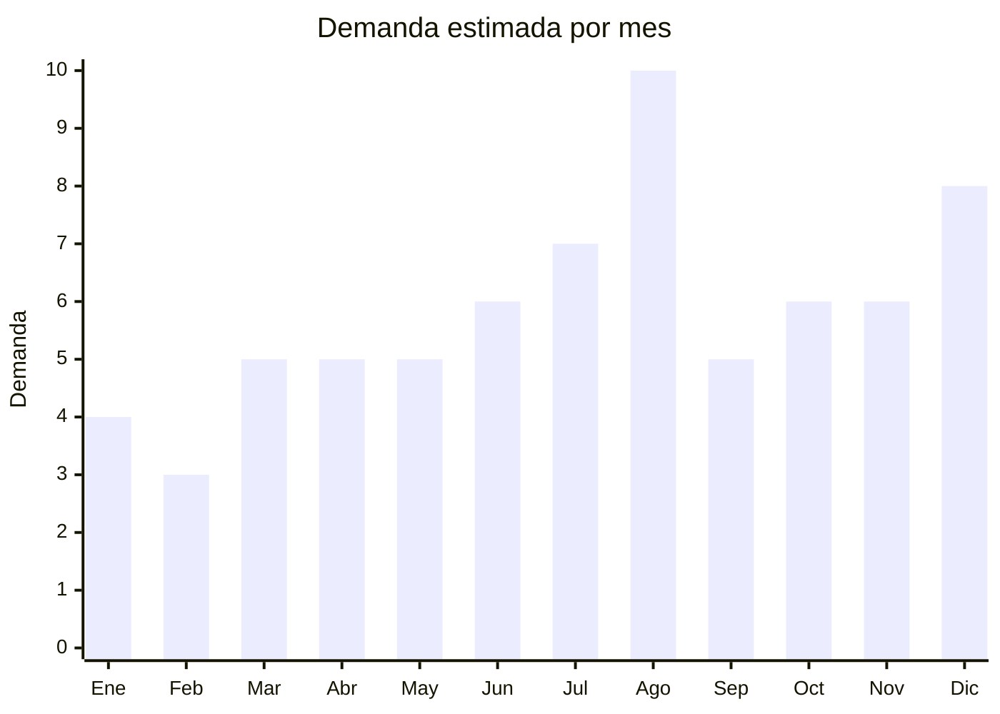

# Triciclos, bicicletas sin pedales y ride-ons infantiles

> **Capitulo NCM 95** — Juguetes, juegos y articulos para recreo o deporte | **Temporada:** Invierno (Jun–Ago)

## Que es y por que importarlo

Los triciclos, bicicletas sin pedales (camicletas/balance bikes) y ride-ons (vehiculos montables sin motor) son juguetes de movilidad infantil para niños de 1 a 6 años. La **camicleta** (bicicleta de equilibrio sin pedales) se convirtio en el producto estrella de esta categoria: permite a niños desde 2 años aprender equilibrio antes de pasar a la bicicleta con pedales, eliminando la necesidad de rueditas. En MercadoLibre Argentina, la **Camicleta GTi** es la referencia del mercado con 627 opiniones y calificacion de 4.7 estrellas — un caso de exito de importacion con marca propia.

El pico de demanda es agosto (Dia del Niño), cuando estos productos son regalo premium para niños pequeños. Los padres valoran la camicleta como producto "educativo" que desarrolla motricidad y equilibrio. Un triciclo o camicleta de buena calidad es un regalo aspiracional que puede venderse a ARS 40,000-100,000.

Las fabricas chinas en Hebei (Baoding, Pingxiang) y Zhejiang son los principales productores mundiales de bicicletas y triciclos infantiles. El FOB va desde USD 8 para un triciclo basico hasta USD 40 para una bicicleta sin pedales de aluminio con freno. El principal desafio logistico es el **volumen**: estos productos son extremadamente voluminosos y el flete puede representar un porcentaje significativo del costo total.

## Datos clave

| Dato | Valor |
|------|-------|
| **Posiciones NCM tipicas** | 9503.00.10 (triciclos/vehiculos de pedales infantiles), 8712.00 (bicicletas sin motor) |
| **Derecho de importacion** | 20% (DIE) + 3% tasa estadistica |
| **Rango FOB tipico** | USD 8.00 — USD 40.00 por unidad |
| **Precio de venta en Argentina** | ARS 25.000 — ARS 120.000 |
| **Margen bruto estimado** | 150% — 300% |
| **MOQ tipico** | 100 — 300 unidades |
| **Demanda en MercadoLibre** | Alta (pico agosto) |
| **Competencia en MercadoLibre** | Media (Camicleta GTi lidera) |
| **Dificultad para importar** | Alta (VOLUMINOSO + certificaciones) |
| **Certificaciones necesarias** | IRAM 3583 (si juguete para menores 14). Bicicletas pueden clasificar como vehiculo |
| **Antidumping** | No |

## Variantes y subtipos mas comunes

| Subtipo / Variante | FOB aprox. | Venta AR aprox. | Nota |
|--------------------|-----------|-----------------|------|
| Bicicleta sin pedales (camicleta) acero 12" | USD 10 — 18 | ARS 35.000 — 70.000 | **ESTRELLA** — Camicleta GTi es la referencia |
| Bicicleta sin pedales aluminio 12" (ultraliviana) | USD 20 — 40 | ARS 60.000 — 120.000 | Premium, 2.5-3 kg, padres fitness |
| Triciclo basico con empujador | USD 8 — 15 | ARS 25.000 — 50.000 | 1-3 años, empujador desmontable |
| Triciclo evolutivo 4 en 1 | USD 15 — 30 | ARS 45.000 — 90.000 | Se transforma segun edad (1-5 años) |
| Ride-on carrito montable (sin motor) | USD 8 — 15 | ARS 25.000 — 50.000 | Tipo jeep/auto para empujar |
| Scooter/monopatin 3 ruedas | USD 8 — 15 | ARS 25.000 — 55.000 | 3-6 años, plegable |

## Regulaciones y requisitos

<Tabs>
  <Tab title="Certificaciones">
    | Organismo | Requiere | Detalle |
    |-----------|----------|---------|
    | ARCA (Aduana) | Si siempre | Despacho estandar |
    | IRAM 3583 | **Condicional** | Aplica si se clasifica como juguete (triciclos infantiles, ride-ons). Las bicicletas sin pedales pueden clasificarse como "vehiculo de dos ruedas" (no juguete) dependiendo de la posicion NCM |
    | ENACOM | No | No es electronico |
    | ANMAT | No | No aplica |

    <Note>
    La clasificacion NCM es clave: un triciclo infantil se clasifica como juguete (NCM 9503) y requiere IRAM 3583. Una bicicleta sin pedales puede clasificarse como bicicleta (NCM 8712) y estar exenta de IRAM 3583. Consultar con un despachante de aduanas experimentado para determinar la clasificacion mas conveniente segun el producto especifico.
    </Note>
  </Tab>

  <Tab title="Etiquetado">
    | Requisito | Aplica |
    |-----------|--------|
    | Idioma español | Si |
    | Datos del importador | Si |
    | Rango de edad y peso maximo | Si (critico para seguridad) |
    | Materiales de construccion | Si (acero, aluminio, plastico) |
    | Instrucciones de armado | Si (en español) |
    | Advertencias de seguridad | Si (casco obligatorio, supervision adulta) |
    | Pais de origen | Si |
    | Sello IRAM (si aplica) | Si |
    | Garantia legal 6 meses | Si |
  </Tab>

  <Tab title="Restricciones">
    - No hay antidumping vigente para triciclos o bicicletas infantiles importadas de China.
    - Verificar que las pinturas y recubrimientos cumplan con limites de plomo y metales pesados (critico para productos que los niños muerden/chupan).
    - Neumáticos de goma EVA son mas seguros y livianos que neumáticos inflables para menores de 3 años.
    - El peso maximo soportado debe estar claramente indicado.
  </Tab>
</Tabs>

## Logistica

| Dato | Valor |
|------|-------|
| **Peso tipico por unidad** | 3 — 8 kg (desarmado en caja) |
| **Volumen tipico** | **Alto a Muy Alto** (cajas de 60-90 cm de largo) |
| **Fragilidad** | Baja (metal y plastico resistente) |
| **Envio recomendado** | Maritimo FCL (volumen justifica contenedor) |
| **Tiempo total estimado** | 50 — 80 dias (maritimo) |
| **Baterias de litio** | No |
| **Requiere empaque especial** | Caja individual reforzada. Producto viene desarmado para optimizar volumen |

<Tip>
El volumen es el factor critico: una camicleta desarmada en caja ocupa aprox. 0.035-0.05 CBM (60x35x25 cm). Un contenedor 20' (33 CBM) puede llevar 650-950 camicletas desarmadas. El producto viene semi-desarmado de fabrica (manubrio y rueda delantera sueltos) para optimizar espacio. Cada caja debe incluir herramientas basicas (llave allen) e instrucciones de armado en español con fotos. El **Dia del Niño es THE momento**: agosto concentra el 30-40% de las ventas anuales de esta categoria.
</Tip>

## Estacionalidad



| Aspecto | Detalle |
|---------|---------|
| **Meses pico** | Agosto (Dia del Niño — pico absoluto, 30-40% de ventas anuales), Diciembre (Navidad), Julio (preventa) |
| **Meses valle** | Enero-Febrero (post-fiestas) |
| **Cuando pedir** | Febrero-Marzo para maritimo (producto voluminoso necesita FCL planificado) |

## Ventajas y riesgos

<CardGroup cols={2}>
  <Card title="Ventajas" icon="circle-check">
    - Camicleta GTi demuestra exito de marca propia importada (627 opiniones, 4.7 estrellas)
    - Regalo premium Dia del Niño con alto ticket
    - Producto "educativo" que desarrolla motricidad: padres pagan mas
    - Margenes 150-300% sobre FOB
    - Bicicletas sin pedales pueden evitar IRAM 3583 (clasificacion NCM 8712)
    - Demanda creciente por tendencia de desarrollo temprano
    - China produce calidad equivalente a marcas europeas a fraccion del costo
  </Card>
  <Card title="Riesgos" icon="triangle-exclamation">
    - VOLUMINOSO: flete caro, requiere contenedor o consolidado grande
    - Inversion inicial alta por MOQ + flete
    - Piezas faltantes o mal ajustadas generan devoluciones
    - Pintura que se descascara = reclamo de seguridad
    - Competencia de marcas locales y de Camicleta GTi establecida
    - Tallas incorrectas (rueda 10" vs 12") crean stock muerto
  </Card>
</CardGroup>

## Palabras clave para buscar en Alibaba

```
balance bike kids wholesale, no pedal bicycle children 12 inch,
kids balance bike factory Hebei, tricycle children push handle,
balance bike aluminum lightweight, kids ride on car no battery,
baby trike 4 in 1 wholesale, scooter 3 wheel kids foldable
```

## Fuentes

- [MercadoLibre Argentina — Camicleta](https://listado.mercadolibre.com.ar/camicleta)
- [MercadoLibre Argentina — Triciclo infantil](https://listado.mercadolibre.com.ar/triciclo-infantil)
- [Alibaba — Balance bike wholesale](https://www.alibaba.com/trade/search?SearchText=balance+bike+kids)
- [IRAM — Norma 3583 Seguridad de juguetes](https://www.iram.org.ar)
