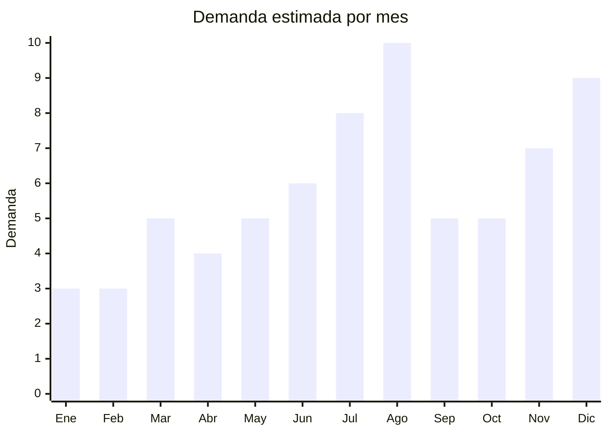

# Kits de arte y manualidades para ninos (Dia del Nino)

> **Capitulo NCM 96** — Manufacturas diversas | **Temporada:** Invierno (Jun–Ago)

## Que es y por que importarlo

Los kits de arte y manualidades para niños son sets completos de materiales artisticos diseñados como regalo para el Dia del Niño (agosto). A diferencia de los utiles escolares de otoño (cuadernos, lapiceras, carpetas), estos kits son sets premium de dibujo y pintura presentados en estuches atractivos: maletines de 48 a 150 piezas con lapices de colores, marcadores doble punta, pasteles al oleo, acuarelas, crayones, goma de borrar, sacapuntas y regla — todo en un estuche de madera, aluminio o PU leather que se convierte en el regalo en si mismo.

En Argentina, los sets de arte son uno de los regalos mas populares de Dia del Niño porque combinan precio accesible, presentacion premium y utilidad practica. Un set de 150 piezas en estuche de madera FOB USD 4-8 se vende a ARS 10,000-25,000, y los padres lo perciben como un regalo "educativo" y "creativo". La demanda se concentra entre julio y agosto, con el pico en la semana previa al Dia del Niño.

Las fabricas chinas en Yiwu (Zhejiang) y Guangdong producen estos sets masivamente para todo el mundo. La oferta incluye desde sets basicos de 48 piezas en caja de carton hasta sets premium de 180 piezas en maletin de madera. Los margenes son excelentes por la percepcion de valor: el estuche (que cuesta USD 1-3 al proveedor) es el que "vende" el producto y eleva el precio percibido.

## Datos clave

| Dato | Valor |
|------|-------|
| **Posiciones NCM tipicas** | 9609.10 (lapices con mina de grafito), 9608.20 (marcadores con punta de fieltro), 9609.90 (otros) |
| **Derecho de importacion** | 14-18% (DIE, varía segun subpartida) + 3% tasa estadistica |
| **Rango FOB tipico** | USD 2.00 — USD 10.00 por set |
| **Precio de venta en Argentina** | ARS 5.000 — ARS 30.000 |
| **Margen bruto estimado** | 200% — 400% |
| **MOQ tipico** | 100 — 500 sets |
| **Demanda en MercadoLibre** | Alta (pico julio-agosto) |
| **Competencia en MercadoLibre** | Media |
| **Dificultad para importar** | Baja (sin regulaciones especiales) |
| **Certificaciones necesarias** | Ninguna especial (no es juguete, es articulo de escritura) |
| **Antidumping** | No |

## Variantes y subtipos mas comunes

| Subtipo / Variante | FOB aprox. | Venta AR aprox. | Nota |
|--------------------|-----------|-----------------|------|
| Set 48-72 piezas en caja de carton | USD 2.00 — 4.00 | ARS 5.000 — 12.000 | Formato accesible, alta rotacion |
| Set 100-120 piezas en estuche aluminio | USD 4.00 — 6.00 | ARS 10.000 — 18.000 | **Mas vendido** — relacion contenido/precio ideal |
| Set 150-180 piezas en maletin de madera | USD 6.00 — 10.00 | ARS 15.000 — 30.000 | Premium, regalo aspiracional |
| Set marcadores doble punta 24-48 colores | USD 2.00 — 4.00 | ARS 5.000 — 12.000 | Nicho artistico, lettering/ilustracion |
| Set acuarelas premium 36-48 colores + pinceles | USD 3.00 — 6.00 | ARS 8.000 — 18.000 | Publico artistico, calidad de pigmento importa |
| Set pasteles al oleo 50 colores | USD 2.00 — 4.00 | ARS 5.000 — 12.000 | Complemento artistico |

## Regulaciones y requisitos

<Tabs>
  <Tab title="Certificaciones">
    | Organismo | Requiere | Detalle |
    |-----------|----------|---------|
    | ARCA (Aduana) | Si siempre | Despacho estandar |
    | IRAM 3583 | **No** | Los articulos de escritura y dibujo se clasifican en NCM 96 (manufacturas diversas), NO como juguetes (NCM 95). Esto los exime de certificacion de juguetes |
    | ANMAT | No | No aplica |
    | ENACOM | No | No es electronico |
    | S-Mark | No | No es electrico |

    <Note>
    **Ventaja regulatoria enorme:** A diferencia de juguetes, los kits de arte clasificados como "articulos de escritura y dibujo" (NCM 96) NO requieren IRAM 3583 ni ninguna certificacion especial. Esto simplifica drasticamente la importacion: solo necesitas el despacho aduanero estandar. La clave es que la posicion NCM sea la de lapices/marcadores/crayones (NCM 96xx), no la de juguetes (NCM 9503).
    </Note>
  </Tab>

  <Tab title="Etiquetado">
    | Requisito | Aplica |
    |-----------|--------|
    | Idioma español | Si |
    | Datos del importador | Si |
    | Composicion / materiales | Si (tipo de pigmento, "no toxico" si aplica) |
    | Pais de origen | Si |
    | Garantia legal 6 meses | Si |
    | Indicacion "no toxico" (AP Seal) | Recomendado (especialmente si se marketing a niños) |

    El etiquetado es simple: datos del importador, pais de origen y composicion. Si el set se vende para niños, incluir "no toxico" de forma prominente. Muchos proveedores chinos ya tienen certificacion AP (Approved Product) o CE de sus pigmentos.
  </Tab>

  <Tab title="Restricciones">
    - Sin restricciones especiales para articulos de escritura y dibujo importados.
    - Si el set se empaqueta junto con un juguete (por ejemplo, incluye un muñeco), podria reclasificarse como juguete (NCM 95) y requerir IRAM 3583. Mantener el set como "articulos de arte" puros.
    - Verificar que los pigmentos (especialmente en crayones y pasteles que los niños pueden llevarse a la boca) sean no toxicos y cumplan con limites de metales pesados.
    - Sin antidumping vigente.
  </Tab>
</Tabs>

## Logistica

| Dato | Valor |
|------|-------|
| **Peso tipico por unidad** | 0.5 — 2.0 kg (segun cantidad de piezas y tipo de estuche) |
| **Volumen tipico** | Bajo a Medio (estuches rectangulares, apilables) |
| **Fragilidad** | Baja (lapices, crayones y marcadores son resistentes) |
| **Envio recomendado** | Maritimo para volumen. Aereo viable para sets livianos |
| **Tiempo total estimado** | 15 — 25 dias (aereo) / 50 — 70 dias (maritimo) |
| **Baterias de litio** | No |
| **Requiere empaque especial** | No — el estuche propio protege el contenido. Film retractil exterior |

<Tip>
El estuche es lo que vende el producto. Un set de 100 lapices en bolsa de plastico vale ARS 5,000. El mismo set en maletin de aluminio vale ARS 18,000. El costo adicional del estuche es apenas USD 1-3 para el proveedor. Siempre invertir en la mejor presentacion posible. Los maletines de madera tienen la mejor percepcion de valor, seguidos por aluminio y luego PU leather. Pedir al proveedor que incluya una muestra de cada color del set para verificar que los colores sean vibrantes y que los marcadores no se sequen rapido.
</Tip>

## Estacionalidad



| Aspecto | Detalle |
|---------|---------|
| **Meses pico** | Agosto (Dia del Niño — pico absoluto), Julio (vacaciones invierno + preventa), Diciembre (Navidad) |
| **Meses valle** | Enero-Febrero (vacaciones de verano) |
| **Cuando pedir** | Marzo-Abril para maritimo. Mayo para aereo |

<Note>
A diferencia de los utiles escolares que se venden en febrero-marzo (vuelta a clases), los kits de arte para Dia del Niño son **regalos** — packaging premium, sets completos, presentacion visual. NO competir con los utiles escolares de otoño: son mercados diferentes con timing diferente.
</Note>

## Ventajas y riesgos

<CardGroup cols={2}>
  <Card title="Ventajas" icon="circle-check">
    - SIN regulaciones especiales — importacion mas simple de toda la lista
    - Margenes del 200-400%
    - Estuche premium multiplica el precio percibido por 3-4x
    - Producto liviano y compacto: flete eficiente
    - Padres perciben "educativo/creativo" = decision de compra facil
    - MOQ bajo: desde 100 sets
    - No requiere IRAM, ENACOM, ANMAT ni ninguna certificacion
  </Card>
  <Card title="Riesgos" icon="triangle-exclamation">
    - Competencia creciente: muchos importadores venden sets similares
    - Calidad de pigmentos variable: colores opacos en sets baratos
    - Marcadores que se secan rapido generan reclamos
    - Estuches de madera pueden tener astillas si la terminacion es pobre
    - Diferenciacion dificil sin marca propia
    - Sets con piezas faltantes (1 lapiz de menos) generan devolucion
  </Card>
</CardGroup>

## Palabras clave para buscar en Alibaba

```
art set kids wooden box wholesale, drawing set 150 pieces,
coloring set aluminum case children, marker set double tip wholesale,
art supplies set kids gift, watercolor paint set children OEM,
crayon set wooden box factory Yiwu, stationery set kids gift box
```

## Fuentes

- [MercadoLibre Argentina — Set arte niños](https://listado.mercadolibre.com.ar/set-arte-niños)
- [MercadoLibre Argentina — Set colores maletin](https://listado.mercadolibre.com.ar/set-colores-maletin)
- [Alibaba — Art set kids wholesale](https://www.alibaba.com/trade/search?SearchText=art+set+kids+wooden+box)
- [ARCA — Nomenclador NCM](https://www.arca.gob.ar)
