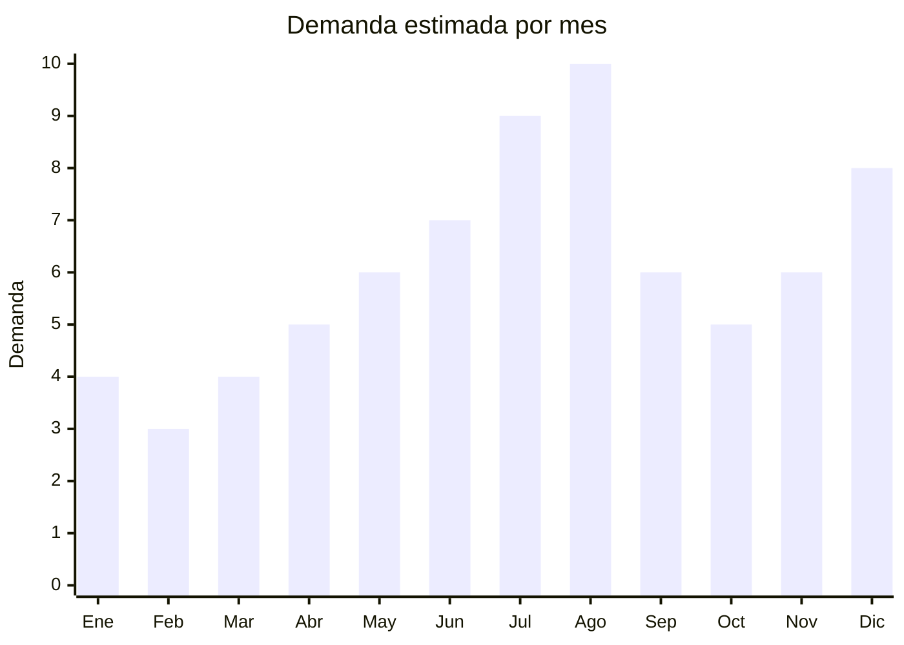

# Sets de pintura y lienzo para ninos (paint by numbers)

> **Capitulo NCM 96** — Manufacturas diversas | **Temporada:** Invierno (Jun–Ago)

## Que es y por que importarlo

Los sets de pintura por numeros (paint by numbers) son kits creativos que incluyen un lienzo pre-impreso con secciones numeradas, un set de pinturas acrilicas en potes pequeños (cada numero corresponde a un color), y pinceles de diferentes tamaños. El usuario simplemente pinta cada seccion con el color indicado y al finalizar obtiene una pintura completa — sin necesidad de talento artistico. Las versiones infantiles incluyen diseños de animales, personajes de dibujos, paisajes simples y motivos kawaii.

El formato paint by numbers se convirtio en una **tendencia DIY (Do It Yourself) global** que se fortalece especialmente en invierno: dias frios, tardes largas en casa, y busqueda de actividades relajantes y creativas. En Argentina, la demanda crece entre julio y agosto por las vacaciones de invierno (niños en casa necesitando actividades) y el Dia del Niño (regalo creativo). Adultos tambien compran sets de paint by numbers como hobby de relajacion — categoria de autocuidado/mindfulness.

Las fabricas chinas en Yiwu y Shenzhen producen sets paint by numbers masivamente. El FOB es extraordinariamente bajo: USD 1.50 para un set basico (lienzo 20x20cm + 8-12 pinturas + 3 pinceles) hasta USD 5.00 para sets premium (lienzo 40x50cm + 20-24 pinturas + 6 pinceles + marco). El peso es minimo (100-300g por set), lo que los convierte en uno de los productos mas eficientes para envio aereo. Los margenes van del 300% al 600%.

## Datos clave

| Dato | Valor |
|------|-------|
| **Posiciones NCM tipicas** | 9609.90.00 (otros articulos para dibujo), 3213.10 (pinturas para artistas en sets) |
| **Derecho de importacion** | 14-18% (DIE, varía segun subpartida) + 3% tasa estadistica |
| **Rango FOB tipico** | USD 1.50 — USD 5.00 por set |
| **Precio de venta en Argentina** | ARS 5.000 — ARS 20.000 |
| **Margen bruto estimado** | 300% — 600% |
| **MOQ tipico** | 50 — 300 sets (muchos proveedores aceptan pedidos chicos) |
| **Demanda en MercadoLibre** | Media-Alta (creciendo fuerte con tendencia DIY) |
| **Competencia en MercadoLibre** | Baja-Media |
| **Dificultad para importar** | Muy Baja (sin regulaciones, ultraliviano) |
| **Certificaciones necesarias** | Ninguna especial |
| **Antidumping** | No |

## Variantes y subtipos mas comunes

| Subtipo / Variante | FOB aprox. | Venta AR aprox. | Nota |
|--------------------|-----------|-----------------|------|
| Set basico niños 20x20cm (animales, dibujos simples) | USD 1.50 — 2.50 | ARS 5.000 — 10.000 | Alta rotacion, ideal impulso |
| Set mediano niños 30x40cm (diseños detallados) | USD 2.50 — 3.50 | ARS 8.000 — 15.000 | **Mas vendido** — buena relacion calidad/precio |
| Set premium 40x50cm con marco incluido | USD 3.50 — 5.00 | ARS 12.000 — 20.000 | Resultado enmarcable, factor decorativo |
| Set adultos 40x50cm (paisajes, obras de arte) | USD 3.00 — 5.00 | ARS 10.000 — 20.000 | Nicho mindfulness/relajacion |
| Set mini pack x3 (3 lienzos chicos diferentes) | USD 3.00 — 4.50 | ARS 10.000 — 16.000 | Formato regalo, variedad |
| Set con caballete mini de madera incluido | USD 3.00 — 5.00 | ARS 10.000 — 18.000 | Presentacion premium, regalo ideal |

## Regulaciones y requisitos

<Tabs>
  <Tab title="Certificaciones">
    | Organismo | Requiere | Detalle |
    |-----------|----------|---------|
    | ARCA (Aduana) | Si siempre | Despacho estandar |
    | IRAM 3583 | **No** | Se clasifica como articulo de pintura/escritura (NCM 96), no como juguete |
    | ANMAT | No | Las pinturas acrilicas de artista no son cosmeticos |
    | ENACOM | No | No es electronico |
    | S-Mark | No | No es electrico |

    **Producto sin barreras regulatorias.** Los sets de pintura por numeros se clasifican como articulos de escritura/pintura artistica (NCM 96) y estan completamente exentos de certificaciones especiales. Es uno de los productos mas simples de importar de toda la guia.
  </Tab>

  <Tab title="Etiquetado">
    | Requisito | Aplica |
    |-----------|--------|
    | Idioma español | Si |
    | Datos del importador | Si |
    | Composicion pinturas | Si ("pintura acrilica base agua, no toxica") |
    | Pais de origen | Si |
    | Garantia legal 6 meses | Si |
    | Indicacion "no toxico" | Recomendado (especialmente sets infantiles) |
    | Edad sugerida | Recomendado (6+ para sets infantiles) |

    El etiquetado es minimo: datos del importador, pais de origen, composicion de las pinturas. Incluir "no toxico, base agua" de forma prominente para sets infantiles.
  </Tab>

  <Tab title="Restricciones">
    - Sin restricciones especiales para sets de pintura artistica.
    - Las pinturas acrilicas base agua no son peligrosas para el transporte.
    - Si se empaquetan con un juguete, podrian reclasificarse como NCM 95 (juguete).
    - Sin antidumping vigente.
    - Mantener la clasificacion como "articulo de pintura artistica" pura.
  </Tab>
</Tabs>

## Logistica

| Dato | Valor |
|------|-------|
| **Peso tipico por unidad** | 0.10 — 0.30 kg (set completo con lienzo, pinturas y pinceles) |
| **Volumen tipico** | Muy Bajo (lienzo enrollado o plano, potes chicos) |
| **Fragilidad** | Baja (lienzo flexible, potes plasticos resistentes) |
| **Envio recomendado** | Aereo o courier (ultraliviano). Maritimo para volumen |
| **Tiempo total estimado** | 10 — 20 dias (aereo/courier) / 50 — 70 dias (maritimo) |
| **Baterias de litio** | No |
| **Requiere empaque especial** | No — caja individual con lienzo protegido. Verificar que potes de pintura no derramen |

<Tip>
Los sets paint by numbers tienen el mejor ratio valor/peso de toda esta guia. Un pedido de 500 sets pesa apenas 75-150 kg y puede enviarse por courier (DHL/FedEx) en 7-15 dias a un costo de flete minimo. La relacion es brutal: inviertes USD 750-2,500 en producto (FOB) + USD 200-400 en flete aereo, y generas ARS 2,500,000-10,000,000 en ventas. Para primeras importaciones, es EL producto para empezar: cero regulaciones, bajo capital, alto margen.
</Tip>

## Estacionalidad



| Aspecto | Detalle |
|---------|---------|
| **Meses pico** | Julio (vacaciones invierno — actividad indoor), Agosto (Dia del Niño), Diciembre (Navidad) |
| **Meses valle** | Enero-Febrero (verano, actividades al aire libre) |
| **Cuando pedir** | Abril-Mayo para maritimo. Junio para aereo urgente (viable por bajo peso) |

<Note>
A diferencia de los sets de colores/lapices, el paint by numbers tiene un componente de "experiencia" y "resultado final exhibible" que lo diferencia. El niño no solo pinta: obtiene una obra de arte terminada que puede colgar en su cuarto. Este factor emocional eleva el valor percibido muy por encima de un set de lapices tradicional.
</Note>

## Ventajas y riesgos

<CardGroup cols={2}>
  <Card title="Ventajas" icon="circle-check">
    - CERO regulaciones: producto mas simple de importar
    - Margenes del 300-600%: extraordinario ratio valor/costo
    - Ultraliviano: flete aereo viable incluso para primeros pedidos
    - MOQ muy bajo: desde 50 sets con muchos proveedores
    - Tendencia DIY/mindfulness en crecimiento global
    - Producto para niños Y adultos: mercado amplio
    - Capital inicial minimo: podes empezar con USD 200-500
    - Resultado "instagrameable": genera contenido viral
  </Card>
  <Card title="Riesgos" icon="triangle-exclamation">
    - Pinturas de baja calidad: colores opacos, textura grumosa
    - Potes de pintura que se secan si no estan bien sellados
    - Numeracion del lienzo confusa en sets baratos
    - Cantidad de pintura insuficiente para cubrir el lienzo (queja comun)
    - Pinceles de mala calidad que pierden cerdas
    - Lienzos que se arrugan o deforman con la humedad de la pintura
  </Card>
</CardGroup>

<Warning>
El problema numero uno reportado por compradores es **pintura insuficiente**: el proveedor incluye potes muy chicos y no alcanzan para cubrir todas las secciones del lienzo. Solicitar al proveedor que incluya un 20-30% extra de pintura en los colores mas usados (blanco, azul cielo, verde). Verificar con una muestra pintando el diseño completo antes de confirmar un pedido grande.
</Warning>

## Palabras clave para buscar en Alibaba

```
paint by numbers kids wholesale, DIY painting kit children,
paint by number canvas set wholesale, acrylic paint set kids OEM,
painting by numbers factory Yiwu, kids canvas painting set wholesale,
art kit paint by numbers custom design, painting set frame kids gift
```

## Fuentes

- [MercadoLibre Argentina — Pintar por numeros](https://listado.mercadolibre.com.ar/pintar-por-numeros)
- [MercadoLibre Argentina — Paint by numbers](https://listado.mercadolibre.com.ar/paint-by-numbers)
- [Alibaba — Paint by numbers wholesale](https://www.alibaba.com/trade/search?SearchText=paint+by+numbers+kids)
- [ARCA — Nomenclador NCM](https://www.arca.gob.ar)
