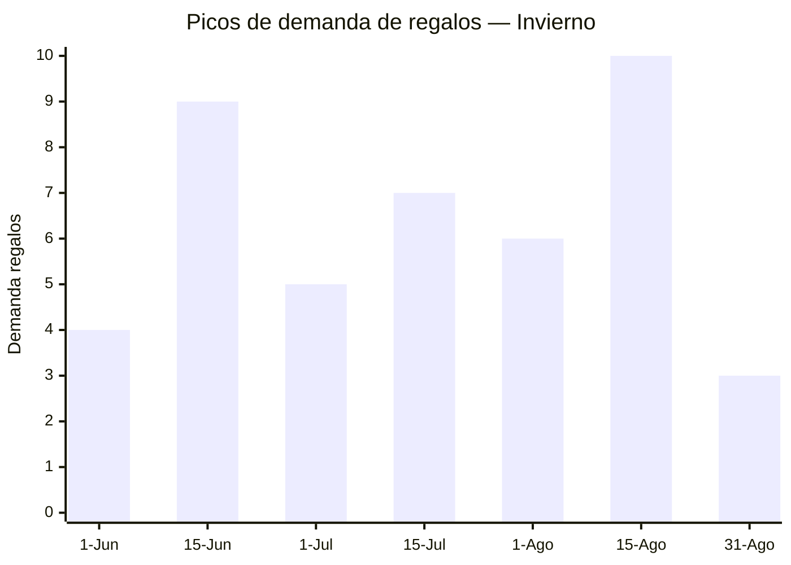

# Productos de Invierno — Introducción

> **Temporada:** Junio a Agosto | **Clima:** Frío intenso (3-15°C) | **Eventos clave:** Día del Padre, Día del Amigo, Día del Niño, vacaciones de invierno

## ¿Qué tiene de particular el invierno argentino?

El invierno argentino es la temporada con **más fechas de regalo concentradas** en el calendario. En apenas 3 meses se suceden Día del Padre, Día del Amigo y Día del Niño, generando tres olas de demanda consecutivas. Sumado al frío que impulsa abrigo, calefacción y entretenimiento indoor, es una temporada de alto volumen comercial.

### Clima y geografía

- **Temperaturas de 3°C a 15°C** en la zona más poblada (Buenos Aires, Córdoba, Rosario)
- **Heladas frecuentes** en el interior (Mendoza, Tucumán, Patagonia)
- **Nevadas en zonas turísticas**: Bariloche, Las Leñas, Chapelco, Cerro Catedral — generan demanda de equipamiento ski
- **Días cortos y oscuros**: la gente pasa mucho más tiempo adentro — pico de entretenimiento indoor, streaming, juegos
- **Humedad + frío**: la combinación porteña genera demanda de calefacción Y deshumidificación

### Eventos y fechas clave

| Fecha | Evento | Impacto comercial |
|-------|--------|-------------------|
| 3er dom Jun | **Día del Padre** | Regalos masculinos: herramientas, relojes, bijouterie, guitarras, electrónica |
| 20 Jul | **Día del Amigo** | Regalos económicos, experiencias, accesorios |
| Jul (2 sem) | **Vacaciones de invierno** | Ski, juegos indoor, entretenimiento, viajes a la nieve |
| 3er dom Ago | **Día del Niño** | Juguetes masivo: peluches, bloques, consolas retro, muñecas, kits STEM |

### Comportamiento del consumidor

- **Gasto en regalos escalonado**: junio (padre), julio (amigo), agosto (niño) — tres oportunidades de venta en 3 meses
- **Día del Niño = juguetes masivo**: es el segundo evento de juguetes más grande del año después de Navidad. En 2025, los peluches Labubu/blind box fueron el fenómeno viral
- **Día del Padre = regalo aspiracional**: herramientas premium, relojes, electrónica. Gasto promedio más alto que Día del Amigo
- **Compras de abrigo por necesidad**: no es compra planificada — cuando llega la primera ola polar, la gente sale a comprar abrigo urgente
- **Ski como nicho premium**: equipamiento de ski/snowboard es un mercado pequeño pero de altísimo margen

## ¿Por qué un producto es "de invierno"?

| Razón | Ejemplo |
|-------|---------|
| **Combatir el frío** | Camperas puffer, sweaters, cortinas blackout, edredones, botas nieve, guantes |
| **Calefacción** | Bicicletas fijas (ejercicio indoor), cafeteras, soperas eléctricas |
| **Regalo Día del Padre** | Sets herramientas, relojes masculinos, bijouterie hombre, guitarras |
| **Regalo Día del Niño** | Peluches, bloques construcción, juegos mesa, consolas retro, muñecas, kits ciencia |
| **Entretenimiento indoor** | Proyectores, tablets infantiles, auriculares gaming, puzzles, libros actividades |
| **Deportes de invierno** | Antiparras ski, equipamiento ski niños, cadenas nieve auto |

<Warning>
**ANTIDUMPING en textiles:** Los capítulos 61 (ropa de punto) y 62 (ropa no de punto) tienen **medidas antidumping vigentes** sobre productos chinos. Esto no impide importar, pero incrementa significativamente el costo (entre 30% y 200% adicional según el producto). Las camperas puffer, sweaters y conjuntos térmicos están afectados. El calzado (Cap. 64) tiene antidumping con FOB mínimo de USD 15.70/par. **Consultá siempre con tu despachante antes de comprar.**
</Warning>

## Las tres olas de regalos

El invierno argentino tiene una particularidad única: **tres fechas de regalo en 90 días**.

| Ola | Fecha | Perfil del regalo | Ticket promedio |
|-----|-------|-------------------|-----------------|
| **1ª — Padre** | 3er dom junio | Aspiracional, masculino, herramientas/tech | Alto ($30,000-80,000 ARS) |
| **2ª — Amigo** | 20 julio | Económico, divertido, simbólico | Bajo ($5,000-20,000 ARS) |
| **3ª — Niño** | 3er dom agosto | Juguetes, masivo, emocional | Medio ($15,000-50,000 ARS) |

<Tip>
**Estrategia de stock:** Tener el mismo contenedor listo para las 3 fechas. Ejemplo: sets de herramientas para Día del Padre, accesorios divertidos para Día del Amigo, y juguetes para Día del Niño. Un solo pedido cubre 3 meses de picos.
</Tip>

## Relación con otras temporadas

| Invierno | Se conecta con... |
|----------|-------------------|
| Camperas puffer / ski | ← Camperas rompevientos en **Otoño** |
| Calefactores | ← Primera búsqueda en **Otoño** |
| Juguetes Día del Niño | → Juguetes Navidad en **Primavera** |
| Relojes masculinos (Padre) | → Relojes femeninos (Madre) en **Primavera** |
| Bijouterie masculina (Padre) | → Bijouterie femenina (Madre) en **Primavera** |

## ¿Cuántos productos de invierno hay documentados?

En esta sección encontrarás **57 productos** organizados en **34 capítulos NCM**. Los ejes temáticos principales son:

- **Día del Niño**: 12 productos en Cap. 95 (el capítulo más grande) — peluches, bloques, juegos mesa, figuras, muñecas, kits ciencia, consolas, karaoke
- **Día del Padre**: herramientas, relojes, bijouterie, guitarras (~5 productos)
- **Abrigo e indumentaria**: camperas, sweaters, conjuntos térmicos, botas, gorros, guantes (~12 productos)
- **Confort hogar**: cortinas blackout, edredones, cafeteras, soperas, alfombras faux fur (~8 productos)
- **Electrónica indoor**: proyectores, caminadoras, tablets infantiles, auriculares gaming (~5 productos)
