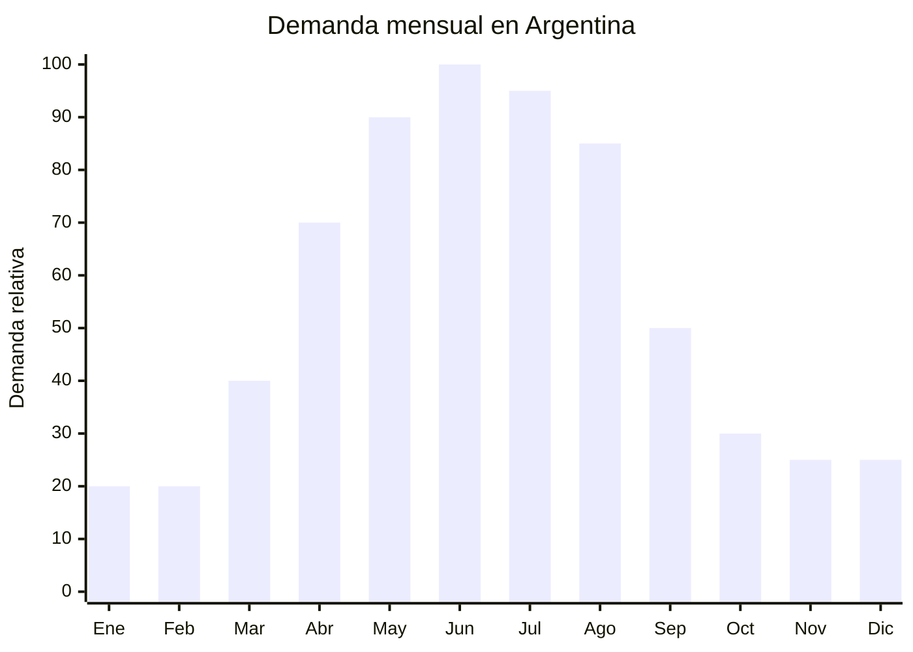

# Bálsamos y protectores labiales

> **Capítulo NCM 33** — Aceites esenciales, preparaciones de perfumería y cosmética | **Temporada:** Otoño (Mar–May)

## Qué es y por qué importarlo

Los bálsamos y protectores labiales son productos cosméticos diseñados para hidratar, proteger y reparar los labios resecos o agrietados. Se presentan en formato stick (tubo giratorio), pote pequeño o tubo squeeze, típicamente en envases de 3 a 15 g. Es un producto de impulso con altísima rotación que se compra por unidad o en packs.

En Argentina, la demanda se concentra entre abril y agosto, cuando el frío seco y el viento provocan labios agrietados de forma masiva. Es un producto que prácticamente "se vende solo" en esos meses. El consumo abarca todos los géneros y edades, lo que amplifica el mercado potencial.

Guangzhou (China) es el hub mundial de producción cosmética, con fábricas especializadas en lip balm que ofrecen OEM/ODM desde lotes de 1,000 unidades. El costo FOB extremadamente bajo (USD 0.15-0.80 por unidad) combinado con precios de venta de ARS 1,500-5,000 genera márgenes superiores al 200%. Además, al ser ultraliviano, el costo de flete por unidad es mínimo, lo que lo convierte en uno de los productos más rentables por kilo importado.

## Datos clave

| Dato | Valor |
|------|-------|
| **Posiciones NCM típicas** | 3304.99.10 (preparaciones para el cuidado de la piel, incluidos labios) |
| **Derecho de importación** | 18% (DIE) + 3% tasa estadística |
| **Rango FOB típico** | USD 0.15 — USD 0.80 por unidad |
| **Precio de venta en Argentina** | ARS 1.500 — ARS 5.000 |
| **Margen bruto estimado** | 200% — 500% |
| **MOQ típico** | 1,000 — 5,000 unidades |
| **Demanda en MercadoLibre** | Media-Alta |
| **Competencia en MercadoLibre** | Media |
| **Dificultad para importar** | Moderada (requiere ANMAT) |
| **Certificaciones necesarias** | ANMAT — Producto Cosmético Grado 1 (Disp. 4033/2025) |
| **Antidumping** | No |

## Variantes y subtipos más comunes

| Subtipo / Variante | FOB aprox. | Venta AR aprox. | Nota |
|--------------------|-----------|-----------------|------|
| Lip balm stick clásico 4.5g | USD 0.15 — 0.30 | ARS 1.500 — 3.000 | Alta rotación |
| Lip balm con SPF 15/30 | USD 0.20 — 0.40 | ARS 2.000 — 4.000 | Valor agregado |
| Lip balm saborizados (frutilla, cereza, miel) | USD 0.15 — 0.35 | ARS 1.500 — 3.500 | **Más vendido** |
| Lip balm en pote 10-15g | USD 0.20 — 0.50 | ARS 2.000 — 4.000 | Formato nocturno |
| Lip balm tinted (color suave) | USD 0.25 — 0.60 | ARS 2.500 — 5.000 | Público femenino |
| Pack x3 lip balm variados | USD 0.50 — 1.50 | ARS 4.000 — 10.000 | Formato regalo/valor |
| Lip balm premium (manteca karité, cera abeja) | USD 0.40 — 0.80 | ARS 3.000 — 5.000 | Segmento natural |

## Regulaciones y requisitos

<Tabs>
  <Tab title="Certificaciones">
    | Organismo | Requiere | Detalle |
    |-----------|----------|---------|
    | ARCA (Aduana) | Sí siempre | Despacho estándar |
    | ANMAT | **Sí — obligatorio** | Cosmético Grado 1. La Disposición 4033/2025 simplificó el proceso con DJC de trámite ágil (15-30 días). Requiere fórmula cuali-cuantitativa y certificado GMP de fábrica |
    | ENACOM | No | No es electrónico |
    | SENASA | No | No es alimento (aunque tenga sabor, no se ingiere) |

    **Recomendación:** Al ser un producto que se aplica en los labios (zona mucosa), ANMAT puede ser más estricto con los ingredientes. Asegurar que la fórmula no contenga colorantes o saborizantes prohibidos. Solicitar certificados de inocuidad y test de metales pesados al proveedor.
  </Tab>

  <Tab title="Etiquetado">
    | Requisito | Aplica |
    |-----------|--------|
    | País de origen | Sí |
    | Datos importador | Sí (nombre, dirección, CUIT) |
    | Composición (INCI) | Sí — lista completa |
    | Instrucciones de uso | Sí |
    | Lote y vencimiento | Sí |
    | Precauciones | Sí ("Uso externo", "Discontinuar si hay irritación") |
    | Número de registro ANMAT | Sí |
  </Tab>

  <Tab title="Restricciones">
    - Los lip balms con SPF (protección solar) pueden requerir clasificación como Grado 2 dependiendo del nivel de protección declarado.
    - NO declarar propiedades terapéuticas ("cura herpes labial", "trata queilitis").
    - Verificar que los colorantes usados en versiones tinted estén aprobados por ANMAT para uso labial.
    - Sin antidumping vigente.
  </Tab>
</Tabs>

## Logística de importación

| Factor | Detalle |
|--------|---------|
| **Peso por unidad** | 8 — 25 g (producto con envase) |
| **Volumen por unidad** | 30 — 80 cm³ aprox. |
| **Unidades por caja (master carton)** | 200 — 500 unidades |
| **Peso por caja** | 2 — 8 kg |
| **Cajas por contenedor 20'** | ~2,000 — 3,500 cajas |
| **Unidades por contenedor 20'** | ~500,000 — 1,000,000 unidades |
| **Fragilidad** | Muy baja (envases plásticos pequeños y resistentes) |
| **Requiere embalaje especial** | No — envase estándar. Protección básica suficiente |

<Tip>
El lip balm es uno de los productos con mejor ratio valor/peso/volumen para importar. Un solo master carton de 500 unidades pesa menos de 8 kg y cabe en un espacio mínimo. Ideal para primeras importaciones por courier o aéreo como prueba de mercado antes de escalar a marítimo.
</Tip>

## Estacionalidad y timing de compra

| Dato | Valor |
|------|-------|
| **Meses de mayor venta** | Abril — Agosto (otoño-invierno) |
| **Pedido ideal (marítimo)** | Enero — Febrero (para llegar en abril) |
| **Pedido ideal (aéreo)** | Marzo (para llegar en abril) |
| **Anticipación mínima** | 2-3 meses antes del pico |

## Ventajas y riesgos

<CardGroup cols={2}>
  <Card title="Ventajas" icon="circle-check">
    - Márgenes excepcionales (200-500%)
    - Ultraliviano: mínimo costo de flete por unidad
    - Producto de impulso con altísima rotación
    - Consumo universal (todos los géneros y edades)
    - Compra recurrente (se pierde y se repone)
    - ANMAT simplificado con Disp. 4033/2025
    - Ideal para courier/aéreo en primeras pruebas
  </Card>

  <Card title="Riesgos y desventajas" icon="triangle-exclamation">
    - Requiere registro ANMAT obligatorio
    - Ticket bajo por unidad — necesita volumen para rentabilizar
    - Competencia con marcas de farmacia (Blistex, Labello)
    - Producto que se aplica en zona mucosa: mayor escrutinio regulatorio
    - Saborizantes y colorantes requieren verificación de aprobación
    - Shelf life limitado (18-24 meses típico)
  </Card>
</CardGroup>

## Palabras clave para buscar en Alibaba

`lip balm private label OEM` · `lip balm stick wholesale` · `moisturizing lip balm manufacturer` · `tinted lip balm wholesale` · `lip balm SPF Guangzhou factory`

## Fuentes

- MercadoLibre Argentina — búsqueda "balsamo labial"
- Alibaba.com — proveedores de lip balm OEM
- ANMAT — Disposición 4033/2025 sobre registro simplificado de cosméticos
