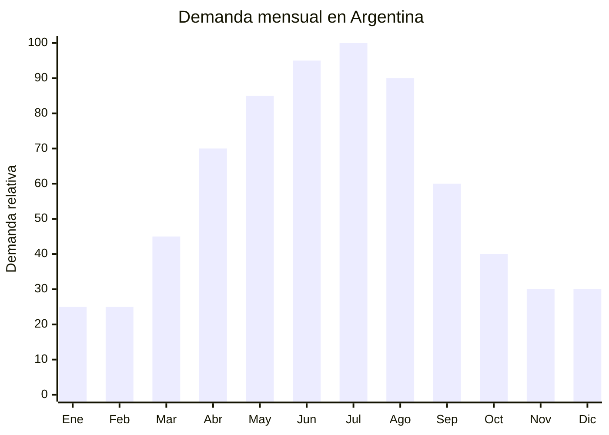

# Cremas hidratantes faciales y corporales

> **Capítulo NCM 33** — Aceites esenciales, preparaciones de perfumería y cosmética | **Temporada:** Otoño (Mar–May)

## Qué es y por qué importarlo

Las cremas hidratantes faciales y corporales son productos cosméticos formulados para restaurar la barrera lipídica de la piel y prevenir la deshidratación. En Argentina, la demanda se dispara entre abril y agosto porque el frío, el viento y la calefacción artificial resecan la piel de manera agresiva. Es uno de los productos de skincare con mayor rotación estacional.

El mercado argentino de cremas hidratantes está dominado por marcas internacionales (Nivea, Eucerin, La Roche-Posay) con precios elevados. Sin embargo, la tendencia global del K-beauty y skincare coreano abrió una ventana de oportunidad para cremas con ingredientes como snail mucin (baba de caracol), centella asiática, ácido hialurónico y niacinamida, que los consumidores argentinos buscan activamente en MercadoLibre a precios accesibles.

China (especialmente Guangzhou, capital de la cosmética asiática) es el mayor productor mundial de productos de skincare, con fábricas que ofrecen formulación OEM/ODM desde 500 unidades. La Disposición ANMAT 4033/2025 simplificó el proceso de registro de cosméticos importados, reduciendo los tiempos y costos de habilitación. Esto hace que 2025-2026 sea un momento ideal para ingresar al mercado.

## Datos clave

| Dato | Valor |
|------|-------|
| **Posiciones NCM típicas** | 3304.99.10 (cremas de belleza y de maquillaje — preparaciones para el cuidado de la piel) |
| **Derecho de importación** | 18% (DIE) + 3% tasa estadística |
| **Rango FOB típico** | USD 0.50 — USD 3.00 por unidad (50-100 ml) |
| **Precio de venta en Argentina** | ARS 5.000 — ARS 20.000 |
| **Margen bruto estimado** | 200% — 400% |
| **MOQ típico** | 500 — 3,000 unidades |
| **Demanda en MercadoLibre** | Alta |
| **Competencia en MercadoLibre** | Alta (marcas premium) / Baja-Media (skincare coreano/chino) |
| **Dificultad para importar** | Moderada (requiere ANMAT) |
| **Certificaciones necesarias** | ANMAT — Producto Cosmético Grado 1 (Disp. 4033/2025) |
| **Antidumping** | No |

## Variantes y subtipos más comunes

| Subtipo / Variante | FOB aprox. | Venta AR aprox. | Nota |
|--------------------|-----------|-----------------|------|
| Crema hidratante facial 50ml básica | USD 0.50 — 1.20 | ARS 5.000 — 10.000 | Entrada |
| Crema snail mucin 50ml | USD 0.80 — 2.00 | ARS 8.000 — 15.000 | **Tendencia viral** |
| Crema centella asiática 50ml | USD 0.80 — 2.00 | ARS 7.000 — 14.000 | K-beauty popular |
| Crema ácido hialurónico 50ml | USD 0.60 — 1.80 | ARS 6.000 — 12.000 | Ingrediente estrella |
| Crema corporal 200-250ml | USD 1.00 — 3.00 | ARS 8.000 — 18.000 | Mayor volumen |
| Set skincare (crema + serum + tónico) | USD 2.50 — 6.00 | ARS 15.000 — 35.000 | Kit premium |

## Regulaciones y requisitos

<Tabs>
  <Tab title="Certificaciones">
    | Organismo | Requiere | Detalle |
    |-----------|----------|---------|
    | ARCA (Aduana) | Sí siempre | Despacho estándar |
    | ANMAT | **Sí — obligatorio** | Producto cosmético Grado 1 (crema hidratante sin claims terapéuticos). La Disposición 4033/2025 simplificó el proceso: DJC (Declaración Jurada de Conformidad) con menor documentación y tiempos reducidos a 15-30 días |
    | ENACOM | No | No es electrónico |
    | SENASA | No | No es alimento |

    **Recomendación:** Solicitar al proveedor chino: certificado GMP de la fábrica, fórmula cuali-cuantitativa completa, test de estabilidad y test microbiológico. Estos documentos son necesarios para el trámite ANMAT. Con la Disp. 4033/2025, el proceso es más ágil pero sigue requiriendo un profesional farmacéutico como director técnico.
  </Tab>

  <Tab title="Etiquetado">
    | Requisito | Aplica |
    |-----------|--------|
    | País de origen | Sí |
    | Datos importador | Sí (nombre, dirección, CUIT) |
    | Composición (INCI) | Sí — lista completa de ingredientes en nomenclatura INCI |
    | Instrucciones de uso | Sí |
    | Lote y vencimiento | Sí |
    | Precauciones | Sí ("Uso externo", "Evitar contacto con ojos") |
    | Número de registro ANMAT | Sí — debe figurar en el envase |
  </Tab>

  <Tab title="Restricciones">
    - NO hacer claims terapéuticos ("cura", "trata", "previene arrugas médicamente") ya que esto reclasifica el producto a Grado 2 con requisitos más estrictos.
    - Claims cosméticos permitidos: "hidrata", "suaviza", "nutre la piel", "restaura la barrera cutánea".
    - Verificar que la fórmula no contenga ingredientes prohibidos por ANMAT (mercurio, hidroquinona en concentraciones no permitidas, etc.).
    - Sin antidumping vigente para esta categoría.
  </Tab>
</Tabs>

## Logística de importación

| Factor | Detalle |
|--------|---------|
| **Peso por unidad** | 80 — 150 g (producto 50ml con envase) |
| **Volumen por unidad** | 200 — 400 cm³ aprox. (con caja individual) |
| **Unidades por caja (master carton)** | 50 — 100 unidades |
| **Peso por caja** | 5 — 12 kg |
| **Cajas por contenedor 20'** | ~800 — 1,200 cajas |
| **Unidades por contenedor 20'** | ~60,000 — 100,000 unidades |
| **Fragilidad** | Media (envases plásticos resistentes, envases de vidrio requieren protección) |
| **Requiere embalaje especial** | Sí si envases de vidrio. Protección térmica recomendada para evitar separación de fórmula en tránsito |

<Tip>
Preferir envases de plástico (PP, PE, acrílico) sobre vidrio para el primer embarque. Son más livianos, resistentes al transporte y reducen el riesgo de rotura. El envase airless (sin aire) es ideal para cremas con activos sensibles como vitamina C o retinol.
</Tip>

## Estacionalidad y timing de compra

| Dato | Valor |
|------|-------|
| **Meses de mayor venta** | Abril — Agosto (otoño-invierno) |
| **Pedido ideal (marítimo)** | Enero — Febrero (para llegar en abril) |
| **Pedido ideal (aéreo)** | Marzo (para llegar en abril) |
| **Anticipación mínima** | 3 meses antes del pico (enero para abril) |

## Ventajas y riesgos

<CardGroup cols={2}>
  <Card title="Ventajas" icon="circle-check">
    - Margen bruto 200-400% sobre FOB
    - Tendencia snail mucin y K-beauty en auge
    - ANMAT simplificó proceso con Disp. 4033/2025
    - Producto liviano y compacto (bajo costo de flete por unidad)
    - Consumo recurrente — el cliente repone cada 1-2 meses
    - Ideal para marca propia (OEM chino desde 500 unidades)
  </Card>

  <Card title="Riesgos y desventajas" icon="triangle-exclamation">
    - Requiere registro ANMAT obligatorio (barrera de entrada)
    - Necesita director técnico farmacéutico
    - Competencia con marcas globales reconocidas (Nivea, Eucerin)
    - Sensibilidad térmica: calor extremo en tránsito puede alterar la fórmula
    - Reclamos por reacciones alérgicas son un riesgo legal
    - Vencimiento: shelf life típico 2-3 años, controlar stock
  </Card>
</CardGroup>

## Palabras clave para buscar en Alibaba

`moisturizing cream OEM private label` · `snail mucin cream wholesale` · `centella asiatica cream manufacturer` · `hyaluronic acid face cream OEM` · `skin care cream Guangzhou factory`

## Fuentes

- MercadoLibre Argentina — búsqueda "crema hidratante facial"
- Alibaba.com — proveedores de face cream OEM/ODM
- ANMAT — Disposición 4033/2025 sobre registro simplificado de cosméticos
- Cámara Argentina de Cosmética y Perfumería (CAFCPE)
