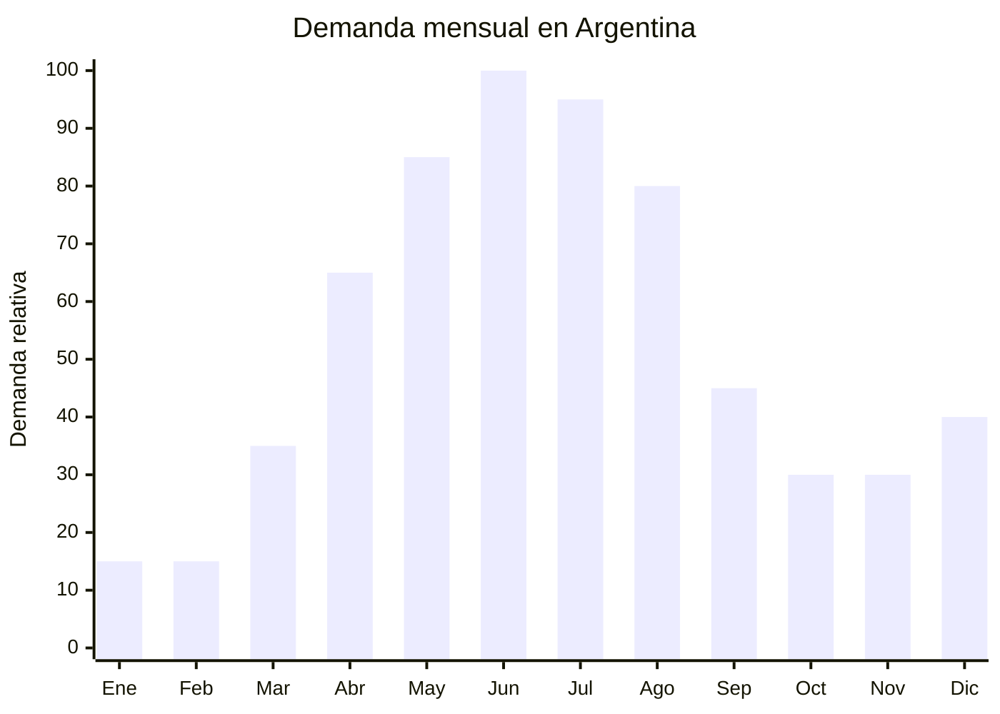

# Velas decorativas de temporada fría

> **Capítulo NCM 34** — Jabón, agentes de superficie orgánicos, preparaciones para lavar, velas | **Temporada:** Otoño (Mar–May)

## Qué es y por qué importarlo

Las velas decorativas de temporada fría son velas aromáticas en frascos de vidrio con tapa, formuladas con fragancias cálidas asociadas al otoño e invierno: canela, vainilla, madera de sándalo, café, jengibre, ámbar y especias. Se diferencian de las velas atemporales (lavanda, cítricos, florales) por su paleta olfativa específica para climas fríos y su estética "cozy".

La tendencia "hygge" (concepto danés de confort hogareño) se consolidó globalmente y en Argentina impulsa la demanda de velas aromáticas entre abril y agosto, cuando los consumidores buscan crear ambientes cálidos y acogedores en sus hogares. Las velas en frascos de vidrio con tapa son el formato más vendido porque son reutilizables, decorativas y mantienen la fragancia entre usos.

China (Hebei y Zhejiang) concentra la producción mundial de velas, con fábricas que ofrecen personalización total: fragancia, color, envase, etiqueta y packaging. El punto clave es que las velas NO son cosméticos (no se aplican sobre la piel), por lo tanto NO requieren registro ANMAT, lo que reduce drásticamente la barrera de entrada comparado con otros productos del Capítulo 33-34.

## Datos clave

| Dato | Valor |
|------|-------|
| **Posiciones NCM típicas** | 3406.00.00 (velas, cirios y artículos similares) |
| **Derecho de importación** | 18% (DIE) + 3% tasa estadística |
| **Rango FOB típico** | USD 0.80 — USD 4.00 por unidad (según tamaño y envase) |
| **Precio de venta en Argentina** | ARS 3.000 — ARS 12.000 |
| **Margen bruto estimado** | 150% — 300% |
| **MOQ típico** | 200 — 1,000 unidades |
| **Demanda en MercadoLibre** | Media-Alta |
| **Competencia en MercadoLibre** | Media |
| **Dificultad para importar** | Fácil |
| **Certificaciones necesarias** | Ninguna específica — solo despacho aduanero estándar |
| **Antidumping** | No |

## Variantes y subtipos más comunes

| Subtipo / Variante | FOB aprox. | Venta AR aprox. | Nota |
|--------------------|-----------|-----------------|------|
| Vela en frasco vidrio 200g con tapa | USD 0.80 — 1.80 | ARS 3.000 — 6.000 | **Más vendido** |
| Vela en frasco vidrio 300g premium | USD 1.50 — 3.00 | ARS 6.000 — 10.000 | Duración 40-50 horas |
| Vela en lata metálica 150g | USD 0.60 — 1.50 | ARS 2.500 — 5.000 | Portátil, travel size |
| Set x3 velas mini (80g c/u) | USD 1.50 — 3.50 | ARS 5.000 — 10.000 | Formato regalo |
| Vela en frasco con caja premium (gift box) | USD 2.00 — 4.00 | ARS 7.000 — 12.000 | Regalería |
| Vela pilar decorativa (sin envase) | USD 0.40 — 1.50 | ARS 2.000 — 5.000 | Decoración pura |

## Regulaciones y requisitos

<Tabs>
  <Tab title="Certificaciones">
    | Organismo | Requiere | Detalle |
    |-----------|----------|---------|
    | ARCA (Aduana) | Sí siempre | Despacho estándar |
    | ANMAT | **No** | Las velas no son cosméticos ni productos de higiene. No requieren registro ANMAT |
    | ENACOM | No | No es electrónico |
    | SENASA | No | No es alimento |
    | INTI | No obligatorio | No hay norma IRAM obligatoria para velas decorativas |

    **Recomendación:** Aunque no hay regulación específica, solicitar al proveedor chino certificado MSDS (Material Safety Data Sheet) de la fragancia y ficha técnica de la cera utilizada. Esto da respaldo ante cualquier consulta de aduana y genera confianza en el comprador final.
  </Tab>

  <Tab title="Etiquetado">
    | Requisito | Aplica |
    |-----------|--------|
    | País de origen | Sí |
    | Datos importador | Sí |
    | Composición | Recomendado (tipo de cera: soja, parafina, coco) |
    | Instrucciones de uso | Recomendado (tiempo máximo de encendido, distancia de materiales inflamables) |
    | Precauciones | Sí ("No dejar sin supervisión", "Mantener fuera del alcance de niños") |
    | Fragancia | Recomendado indicar (canela, vainilla, etc.) |
  </Tab>

  <Tab title="Restricciones">
    Sin restricciones significativas para la importación de velas decorativas.

    **Notas logísticas:** Las velas de parafina tienen punto de fusión bajo (45-65°C). Si se importan en verano o transitan por climas cálidos, pueden deformarse o derretirse en el contenedor. Coordinar el envío para que llegue en meses fríos o solicitar contenedor con ventilación.
  </Tab>
</Tabs>

## Logística de importación

| Factor | Detalle |
|--------|---------|
| **Peso por unidad** | 200 — 450 g (vela 200-300g + envase vidrio) |
| **Volumen por unidad** | 300 — 600 cm³ aprox. (con caja individual) |
| **Unidades por caja (master carton)** | 12 — 36 unidades |
| **Peso por caja** | 5 — 15 kg |
| **Cajas por contenedor 20'** | ~800 — 1,500 cajas |
| **Unidades por contenedor 20'** | ~15,000 — 40,000 unidades |
| **Fragilidad** | Media-Alta (frascos de vidrio) |
| **Requiere embalaje especial** | Sí — separadores internos para frascos de vidrio, protección anti-golpes. Solicitar "egg crate dividers" al proveedor |

<Tip>
Las velas en frascos de vidrio son pesadas para su tamaño. Calcular el flete por peso, no por volumen, ya que probablemente se cobre por peso bruto. Considerar las velas en latas metálicas como alternativa más liviana y resistente para el primer embarque.
</Tip>

## Estacionalidad y timing de compra

| Dato | Valor |
|------|-------|
| **Meses de mayor venta** | Abril — Agosto (otoño-invierno) |
| **Pedido ideal (marítimo)** | Enero — Febrero (para llegar en abril) |
| **Pedido ideal (aéreo)** | Marzo (para llegar en abril) |
| **Anticipación mínima** | 3 meses antes del pico |

## Ventajas y riesgos

<CardGroup cols={2}>
  <Card title="Ventajas" icon="circle-check">
    - SIN regulación ANMAT — barrera de entrada muy baja
    - Tendencia "hygge" y decoración de interiores en crecimiento
    - Personalización total desde fábrica (fragancia, color, envase, etiqueta)
    - Ideal para marca propia / private label
    - Producto aspiracional con percepción de alto valor
    - Complementa venta de difusores y aromaterapia
    - Formato regalo con alta demanda en Día de la Madre (octubre)
  </Card>

  <Card title="Riesgos y desventajas" icon="triangle-exclamation">
    - Frascos de vidrio = riesgo de rotura en transporte
    - Producto pesado para su tamaño (flete relativamente alto)
    - Sensible al calor: puede derretirse en tránsito si hace calor
    - Fragancias baratas huelen artificial — pedir muestras
    - Competencia con velas artesanales locales (percepcción "hecho a mano")
    - Estacionalidad marcada: stock sobrante de invierno pierde valor en verano
  </Card>
</CardGroup>

## Palabras clave para buscar en Alibaba

`scented candle jar wholesale` · `soy wax candle private label` · `cinnamon vanilla candle manufacturer` · `candle gift set box` · `glass jar candle OEM custom label`

## Fuentes

- MercadoLibre Argentina — búsqueda "vela aromática frasco"
- Alibaba.com — proveedores de scented candle wholesale
- Tendencia "hygge" y mercado de velas decorativas en Latinoamérica
