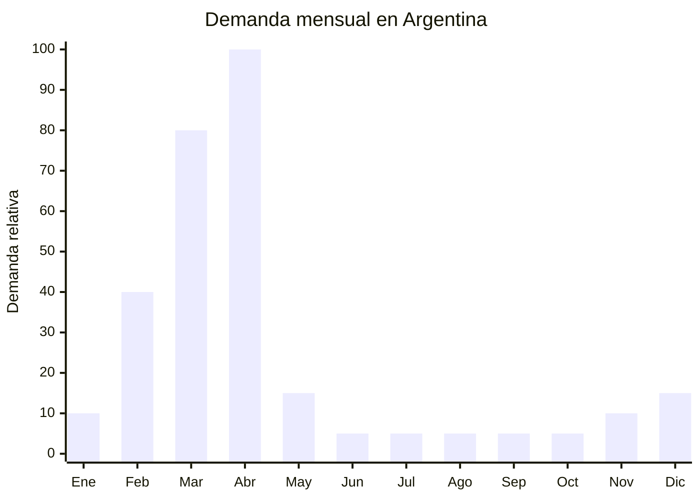

# Moldes de silicona para huevos de Pascua

> **Capítulo NCM 39** — Plástico y sus manufacturas | **Temporada:** Otoño (Mar–May)

## Qué es y por qué importarlo

Los moldes para huevos de Pascua son herramientas de silicona alimentaria o plástico rígido (policarbonato) que permiten fabricar huevos de chocolate, bombones y figuras de Pascua de forma artesanal o semi-industrial. Se presentan en formatos de medio huevo (dos mitades que se unen), moldes 3D con cierre, moldes de bombones temáticos (conejos, huevos, pollitos) y planchas de silicona con múltiples cavidades.

En Argentina, la producción artesanal de huevos de Pascua es un fenómeno masivo. Miles de emprendedores, amas de casa y chocolateros artesanales producen huevos caseros cada Semana Santa, generando una demanda explosiva de moldes entre febrero y abril. La tradición de regalar huevos de chocolate en Pascua está profundamente arraigada, y el precio elevado de los huevos industriales (marcas como Arcor, Felfort, Kinder) empuja a muchos consumidores hacia la opción artesanal, que puede costar la mitad.

China (Yiwu, Shenzhen) produce moldes de silicona food-grade y policarbonato a costos FOB de USD 0.30-2.00 por unidad, mientras que en Argentina se venden entre ARS 1,500 y ARS 8,000. La temporada es ultra-corta (4-6 semanas efectivas), pero la demanda es tan concentrada que permite liquidar stock rápidamente. El producto es ultraliviano y compacto, ideal para envíos por courier o aéreo.

## Datos clave

| Dato | Valor |
|------|-------|
| **Posiciones NCM típicas** | 3924.10.00 (vajilla y artículos de cocina de plástico), 3926.90.90 (demás manufacturas de plástico) |
| **Derecho de importación** | 18% (DIE) + 3% tasa estadística |
| **Rango FOB típico** | USD 0.30 — USD 2.00 por unidad |
| **Precio de venta en Argentina** | ARS 1.500 — ARS 8.000 |
| **Margen bruto estimado** | 200% — 500% |
| **MOQ típico** | 100 — 500 unidades |
| **Demanda en MercadoLibre** | Muy Alta (estacional, pico Semana Santa) |
| **Competencia en MercadoLibre** | Media-Alta |
| **Dificultad para importar** | Fácil |
| **Certificaciones necesarias** | Ninguna obligatoria (recomendable certificado food-grade del proveedor) |
| **Antidumping** | No |

## Variantes y subtipos más comunes

| Subtipo / Variante | FOB aprox. | Venta AR aprox. | Nota |
|--------------------|-----------|-----------------|------|
| Molde policarbonato medio huevo 15-20 cm | USD 0.80 — 2.00 | ARS 3.000 — 8.000 | **Más vendido** — profesional |
| Molde silicona medio huevo 12-15 cm | USD 0.30 — 1.00 | ARS 1.500 — 4.000 | Económico, flexible |
| Molde bombones Pascua (plancha 12-24 cavidades) | USD 0.50 — 1.50 | ARS 2.000 — 6.000 | Para rellenos y bombones |
| Molde 3D conejo/pollito silicona | USD 0.50 — 1.50 | ARS 2.000 — 5.000 | Figuras decorativas |
| Molde huevo liso gigante 25+ cm | USD 1.00 — 2.00 | ARS 4.000 — 8.000 | Huevos premium grandes |
| Kit moldes variados (set x3-x6) | USD 1.50 — 4.00 | ARS 5.000 — 15.000 | Pack valor, regalo |

## Regulaciones y requisitos

<Tabs>
  <Tab title="Certificaciones">
    | Organismo | Requiere | Detalle |
    |-----------|----------|---------|
    | ARCA (Aduana) | Sí siempre | Despacho estándar |
    | ANMAT | No obligatorio | No es un envase que contiene alimento. El molde en sí no requiere registro ANMAT |
    | SENASA | No | No es alimento |
    | INTI | No | No es textil |

    **Recomendación:** Aunque no es legalmente obligatorio, solicitar al proveedor chino un certificado de silicona food-grade (FDA o LFGB) y un test de migración. Esto genera confianza en el comprador final y protege ante reclamos.
  </Tab>

  <Tab title="Etiquetado">
    | Requisito | Aplica |
    |-----------|--------|
    | País de origen | Sí |
    | Datos del importador | Sí (nombre, CUIT, domicilio) |
    | Material de fabricación | Sí (silicona, policarbonato, etc.) |
    | Apto contacto alimentos | Recomendado (no obligatorio legalmente para moldes) |
    | Instrucciones de uso | Recomendado |
  </Tab>

  <Tab title="Restricciones">
    - Sin restricciones significativas para moldes de silicona/plástico.
    - Si el molde tiene forma de marca registrada (personajes Disney, etc.), puede ser retenido por propiedad intelectual.
    - Los moldes de policarbonato transparente son más frágiles en el transporte que los de silicona.
    - Sin antidumping vigente para esta categoría.
  </Tab>
</Tabs>

## Logística de importación

| Factor | Detalle |
|--------|---------|
| **Peso por unidad** | 30 — 200 g (silicona liviana) |
| **Volumen por unidad** | 200 — 800 cm³ aprox. |
| **Unidades por caja (master carton)** | 50 — 200 unidades |
| **Peso por caja** | 3 — 10 kg |
| **Cajas por contenedor 20'** | ~2,000 — 4,000 cajas |
| **Unidades por contenedor 20'** | ~200,000 — 500,000 unidades |
| **Fragilidad** | Baja (silicona) / Media (policarbonato) |
| **Requiere embalaje especial** | No para silicona. Policarbonato requiere separadores de cartón |

<Tip>
Los moldes de silicona son ultralivianos y flexibles — no se rompen. Podés enviar 500-1,000 unidades por courier/aéreo con un flete mínimo (menos de USD 2/kg) y validar la demanda antes del pico de Semana Santa. Ideal para primera importación de prueba dado el bajo riesgo.
</Tip>

## Estacionalidad y timing de compra

| Dato | Valor |
|------|-------|
| **Meses de mayor venta** | Marzo — Abril (pico absoluto: 2-3 semanas antes de Pascua) |
| **Pedido ideal (marítimo)** | Noviembre — Diciembre |
| **Pedido ideal (aéreo)** | Enero — Febrero |
| **Anticipación mínima** | 3-4 meses antes de Semana Santa |

## Ventajas y riesgos

<CardGroup cols={2}>
  <Card title="Ventajas" icon="circle-check">
    - FOB muy bajo = inversión mínima
    - Ultraliviano: flete por unidad casi despreciable
    - Demanda explosiva y predecible (Semana Santa)
    - Sin regulaciones ni certificaciones obligatorias
    - Producto reutilizable (el comprador vuelve por variantes)
    - Ideal para primera importación de prueba
  </Card>

  <Card title="Riesgos y desventajas" icon="triangle-exclamation">
    - Temporada ultra-corta (4-6 semanas efectivas)
    - Stock sobrante queda hasta el año siguiente
    - Fecha de Pascua varía cada año (planificar según calendario)
    - Competencia con bazares y librerías que ya importan
    - Moldes de policarbonato pueden llegar rotos si el embalaje es deficiente
  </Card>
</CardGroup>

## Palabras clave para buscar en Alibaba

`chocolate mold silicone easter egg` · `polycarbonate chocolate mould egg` · `easter bunny chocolate mold` · `silicone baking mold easter` · `3D easter egg mold wholesale` · `chocolate mould half sphere`

## Fuentes

- MercadoLibre Argentina — búsqueda "molde huevo pascua"
- Alibaba.com — proveedores de chocolate mold silicone easter
- ARCA (ex-AFIP) — Nomenclador Arancelario, posición 3924
