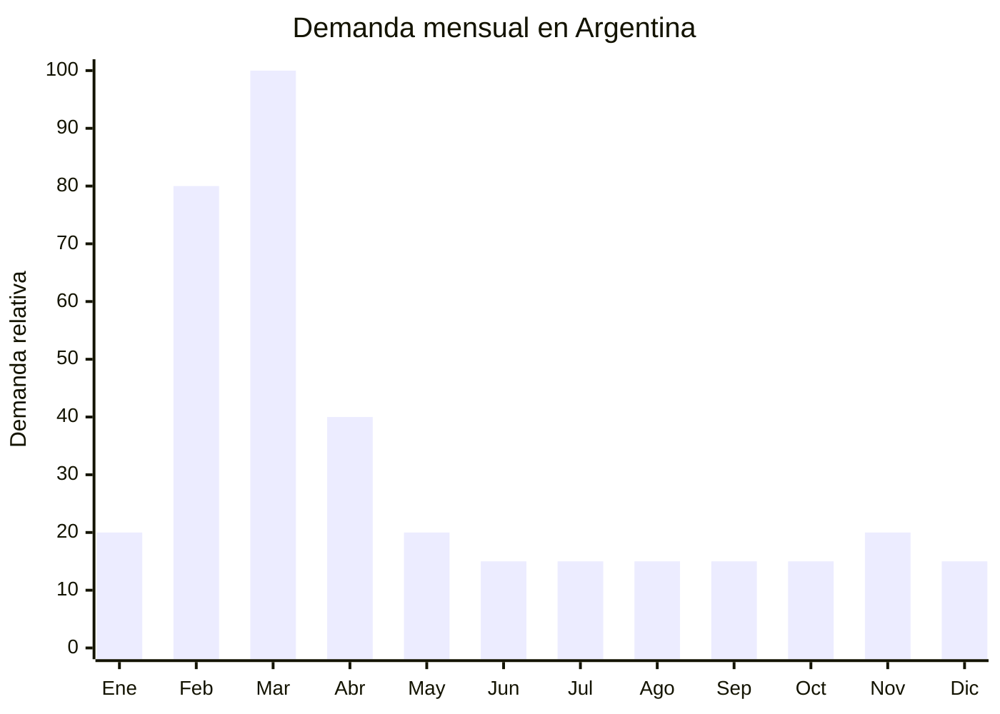

# Organizadores escolares de plástico

> **Capítulo NCM 39** — Plástico y sus manufacturas | **Temporada:** Otoño (Mar–May)

## Qué es y por qué importarlo

Los organizadores escolares de plástico incluyen portalápices de escritorio con compartimentos, bandejas organizadoras para útiles, cubiletes giratorios, organizadores de cajón para lápices y reglas, y porta-accesorios temáticos con diseños infantiles y juveniles (animales, personajes genéricos, formas geométricas, kawaii). Se fabrican en plástico ABS, polipropileno (PP) o poliestireno (PS), generalmente inyectados con colores vibrantes.

En Argentina, la vuelta a clases en marzo genera una demanda masiva de todo lo relacionado con el escritorio escolar. Los padres arman el espacio de estudio de sus hijos y buscan organizadores funcionales y atractivos. Los diseños infantiles y kawaii tienen especial tracción en redes sociales (TikTok, Instagram) donde los "school hauls" y "desk tours" generan tendencia entre adolescentes.

China (Yiwu, Ningbo) produce organizadores escolares con diseños innovadores a FOB de USD 0.30-2.00 por unidad. En Argentina se venden entre ARS 2,000 y ARS 8,000, generando márgenes del 200-400%. Sin ninguna regulación especial, son ideales para importadores principiantes que buscan un producto fácil de gestionar con demanda comprobada.

## Datos clave

| Dato | Valor |
|------|-------|
| **Posiciones NCM típicas** | 3926.10.00 (artículos de oficina y escolares de plástico), 3924.90.00 (otros artículos de uso doméstico de plástico) |
| **Derecho de importación** | 18% (DIE) + 3% tasa estadística |
| **Rango FOB típico** | USD 0.30 — USD 2.00 por unidad |
| **Precio de venta en Argentina** | ARS 2.000 — ARS 8.000 |
| **Margen bruto estimado** | 200% — 400% |
| **MOQ típico** | 200 — 1,000 unidades |
| **Demanda en MercadoLibre** | Alta (estacional, pico vuelta a clases) |
| **Competencia en MercadoLibre** | Media |
| **Dificultad para importar** | Fácil |
| **Certificaciones necesarias** | Ninguna |
| **Antidumping** | No |

## Variantes y subtipos más comunes

| Subtipo / Variante | FOB aprox. | Venta AR aprox. | Nota |
|--------------------|-----------|-----------------|------|
| Portalápices cilíndrico simple PP | USD 0.30 — 0.60 | ARS 2.000 — 3.500 | Económico, volumen |
| Organizador escritorio 4-6 compartimentos | USD 0.80 — 1.50 | ARS 3.500 — 6.000 | **Más vendido** |
| Portalápices diseño kawaii/animal | USD 0.50 — 1.20 | ARS 2.500 — 5.000 | Tendencia redes sociales |
| Bandeja escritorio apilable x2-x3 | USD 0.80 — 2.00 | ARS 4.000 — 8.000 | Para escritorios grandes |
| Organizador giratorio 360° | USD 1.00 — 2.00 | ARS 4.000 — 8.000 | Premium, funcional |
| Set organizador escolar (porta+bandeja+cubilete) | USD 1.50 — 3.00 | ARS 5.000 — 12.000 | Pack valor |

## Regulaciones y requisitos

<Tabs>
  <Tab title="Certificaciones">
    | Organismo | Requiere | Detalle |
    |-----------|----------|---------|
    | ARCA (Aduana) | Sí siempre | Despacho estándar |
    | ANMAT | No | No aplica |
    | ENACOM | No | No aplica |
    | INTI | No | No es textil |

    **Recomendación:** Producto sin barreras regulatorias. Si los diseños son para niños menores de 3 años, verificar que no contengan piezas pequeñas desmontables (riesgo de asfixia).
  </Tab>

  <Tab title="Etiquetado">
    | Requisito | Aplica |
    |-----------|--------|
    | País de origen | Sí |
    | Datos del importador | Sí |
    | Material de fabricación | Recomendado (PP, ABS, PS) |
    | Edad recomendada | Recomendado si es temático infantil |
    | Idioma español | Sí |
  </Tab>

  <Tab title="Restricciones">
    - Sin restricciones significativas para organizadores de plástico.
    - Evitar diseños con personajes con licencia (Disney, Marvel, etc.) sin autorización.
    - Verificar que los bordes no sean cortantes, especialmente en productos para niños.
    - Sin antidumping vigente.
  </Tab>
</Tabs>

## Logística de importación

| Factor | Detalle |
|--------|---------|
| **Peso por unidad** | 50 — 300 g |
| **Volumen por unidad** | 300 — 2,000 cm³ aprox. |
| **Unidades por caja (master carton)** | 24 — 100 unidades |
| **Peso por caja** | 3 — 12 kg |
| **Cajas por contenedor 20'** | ~1,500 — 3,000 cajas |
| **Unidades por contenedor 20'** | ~50,000 — 200,000 unidades |
| **Fragilidad** | Baja (plástico resistente) |
| **Requiere embalaje especial** | No — bolsa OPP individual + caja master |

<Tip>
Los organizadores de plástico son resistentes a golpes y no se rompen en tránsito. Podés mezclar distintos modelos en un mismo pedido para ofrecer variedad sin aumentar el MOQ total. Un pedido de 500 unidades mixtas (5 diseños x 100 unidades) es una excelente prueba de mercado.
</Tip>

## Estacionalidad y timing de compra

| Dato | Valor |
|------|-------|
| **Meses de mayor venta** | Febrero — Marzo (vuelta a clases) |
| **Pedido ideal (marítimo)** | Octubre — Noviembre |
| **Pedido ideal (aéreo)** | Enero |
| **Anticipación mínima** | 3 meses antes de la vuelta a clases |

## Ventajas y riesgos

<CardGroup cols={2}>
  <Card title="Ventajas" icon="circle-check">
    - FOB bajo y sin regulaciones
    - Producto resistente, no se rompe en transporte
    - Tendencia kawaii genera demanda sostenida en redes
    - Se vende todo el año (menor pico pero hay ventas basales)
    - Ideal para combinar con otros útiles escolares
    - Sin certificaciones obligatorias
  </Card>

  <Card title="Riesgos y desventajas" icon="triangle-exclamation">
    - Pico concentrado en 4-6 semanas
    - Competencia con bazares y librerías que importan directo
    - Diseños genéricos tienen menos tracción que los licenciados
    - Ticket bajo por unidad (necesita volumen)
    - Tendencias de diseño cambian cada temporada
  </Card>
</CardGroup>

## Palabras clave para buscar en Alibaba

`desk organizer school plastic` · `pencil holder cute kawaii` · `desktop organizer compartments` · `rotating pencil holder wholesale` · `stationery organizer kids` · `plastic desk tidy wholesale Yiwu`

## Fuentes

- MercadoLibre Argentina — búsqueda "organizador escritorio escolar"
- Alibaba.com — proveedores de desk organizer school wholesale
- ARCA — Nomenclador Arancelario, posición 3926
