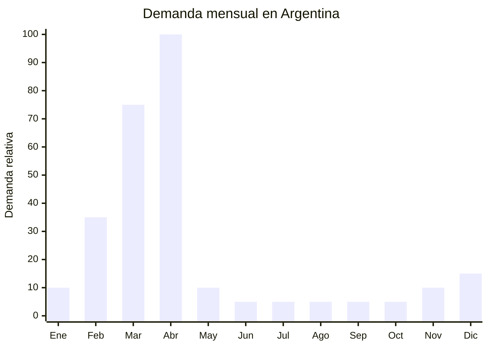

# Packaging y envoltorios para Pascua

> **Capítulo NCM 39** — Plástico y sus manufacturas | **Temporada:** Otoño (Mar–May)

## Qué es y por qué importarlo

El packaging para Pascua incluye cajas decorativas de cartón y plástico transparente (tipo acetato), bolsas celofán con diseños temáticos, cintas decorativas, lazos pre-armados, papel de seda de colores, blísters termoformados para huevos y bandejas internas de soporte. Son todos los elementos necesarios para presentar y empacar un huevo de Pascua artesanal de forma profesional.

Argentina tiene un ecosistema enorme de chocolateros artesanales que producen miles de huevos de Pascua cada temporada. Estos emprendedores necesitan packaging atractivo para competir visualmente con las marcas industriales. Una caja elegante transforma un huevo casero de ARS 5,000 en un regalo premium de ARS 15,000. El packaging es tanto o más importante que el producto en sí para la venta.

China (Yiwu es el epicentro mundial de packaging) ofrece cajas y envoltorios desde FOB USD 0.03 por bolsa celofán hasta USD 1.80 por caja rígida decorada. Los costos son tan bajos que permiten vender a ARS 500-3,000 con márgenes de 200-400%. La barrera de entrada es prácticamente nula: sin regulaciones, sin certificaciones, producto ultraliviano y fácil de transportar.

## Datos clave

| Dato | Valor |
|------|-------|
| **Posiciones NCM típicas** | 3923.29.90 (bolsas y sacos de plástico), 3923.10.90 (cajas y cajones de plástico), 4819.20.00 (cajas de cartón) |
| **Derecho de importación** | 14-18% (DIE) + 3% tasa estadística |
| **Rango FOB típico** | USD 0.03 — USD 1.80 por unidad |
| **Precio de venta en Argentina** | ARS 500 — ARS 3.000 |
| **Margen bruto estimado** | 200% — 400% |
| **MOQ típico** | 500 — 2,000 unidades |
| **Demanda en MercadoLibre** | Alta (estacional, pico Semana Santa) |
| **Competencia en MercadoLibre** | Media |
| **Dificultad para importar** | Muy Fácil |
| **Certificaciones necesarias** | Ninguna |
| **Antidumping** | No |

## Variantes y subtipos más comunes

| Subtipo / Variante | FOB aprox. | Venta AR aprox. | Nota |
|--------------------|-----------|-----------------|------|
| Bolsa celofán transparente con fuelle (x100) | USD 0.03 — 0.08/u | ARS 500 — 1.500 (pack) | Básico, alto volumen |
| Caja acetato transparente para huevo 15-20 cm | USD 0.15 — 0.50 | ARS 800 — 2.000 | **Más vendido** |
| Caja cartón decorativa con ventana | USD 0.30 — 1.00 | ARS 1.000 — 2.500 | Presentación premium |
| Caja rígida con tapa magnética | USD 0.80 — 1.80 | ARS 1.500 — 3.000 | Segmento alto |
| Cintas y lazos decorativos (rollo x25m) | USD 0.10 — 0.30 | ARS 500 — 1.500 | Complemento esencial |
| Kit packaging completo (caja+cinta+tag) | USD 0.50 — 1.50 | ARS 1.500 — 3.000 | Set armado, mayor ticket |

## Regulaciones y requisitos

<Tabs>
  <Tab title="Certificaciones">
    | Organismo | Requiere | Detalle |
    |-----------|----------|---------|
    | ARCA (Aduana) | Sí siempre | Despacho estándar |
    | ANMAT | No | No es envase primario de alimento (no contacta directamente el chocolate) |
    | SENASA | No | No aplica |
    | INTI | No | No aplica |

    **Recomendación:** Producto sin barreras regulatorias. Es uno de los más simples de importar. Ideal para principiantes absolutos.
  </Tab>

  <Tab title="Etiquetado">
    | Requisito | Aplica |
    |-----------|--------|
    | País de origen | Sí |
    | Datos del importador | Sí |
    | Material de fabricación | Recomendado |
    | Idioma español | No obligatorio (es packaging decorativo) |
  </Tab>

  <Tab title="Restricciones">
    - Sin restricciones significativas.
    - Evitar packaging con marcas registradas sin licencia (logos de marcas de chocolate, personajes, etc.).
    - El packaging de acetato/PVC puede tener olor a plástico si es de baja calidad — solicitar muestras antes de comprar volumen.
    - Sin antidumping vigente.
  </Tab>
</Tabs>

## Logística de importación

| Factor | Detalle |
|--------|---------|
| **Peso por unidad** | 5 — 80 g según tipo |
| **Volumen por unidad** | Variable — las cajas se envían planas (flat-pack) |
| **Unidades por caja (master carton)** | 100 — 1,000 unidades |
| **Peso por caja** | 2 — 8 kg |
| **Cajas por contenedor 20'** | ~3,000 — 5,000 cajas |
| **Unidades por contenedor 20'** | ~300,000 — 2,000,000 unidades |
| **Fragilidad** | Baja (bolsas) / Media (cajas rígidas) |
| **Requiere embalaje especial** | No — las cajas se envían plegadas, ocupando mínimo espacio |

<Tip>
Las cajas se envían planas (flat-pack), lo que reduce drásticamente el volumen del envío. Un pedido de 1,000 cajas de acetato plegadas puede pesar solo 10-15 kg y caber en un solo paquete courier. Aprovechá este formato para importar por aéreo/courier con flete mínimo.
</Tip>

## Estacionalidad y timing de compra

| Dato | Valor |
|------|-------|
| **Meses de mayor venta** | Marzo — Abril (2-4 semanas antes de Pascua) |
| **Pedido ideal (marítimo)** | Noviembre — Diciembre |
| **Pedido ideal (aéreo)** | Enero — Febrero |
| **Anticipación mínima** | 3-4 meses antes de Semana Santa |

## Ventajas y riesgos

<CardGroup cols={2}>
  <Card title="Ventajas" icon="circle-check">
    - Inversión mínima: FOB desde USD 0.03/unidad
    - Sin regulaciones ni certificaciones
    - Se envía plano (flat-pack): volumen mínimo de flete
    - Se vende como complemento de moldes (venta cruzada)
    - Dificultad de importación prácticamente nula
    - Venta por pack = ticket promedio más alto
  </Card>

  <Card title="Riesgos y desventajas" icon="triangle-exclamation">
    - Temporada ultra-corta (4-6 semanas)
    - Stock sobrante difícil de reubicar fuera de temporada
    - Diseños muy temáticos (Pascua) no sirven para otros usos
    - Ticket bajo por unidad individual
    - Competencia con bazares y cotillón que ya importan directo
  </Card>
</CardGroup>

## Palabras clave para buscar en Alibaba

`easter egg packaging box` · `chocolate egg gift box clear` · `acetate box easter` · `cellophane bags easter` · `ribbon bow pre-made wholesale` · `easter chocolate packaging Yiwu`

## Fuentes

- MercadoLibre Argentina — búsqueda "caja huevo pascua"
- Alibaba.com — proveedores de easter egg packaging
- ARCA — Nomenclador Arancelario, posiciones 3923 y 4819
