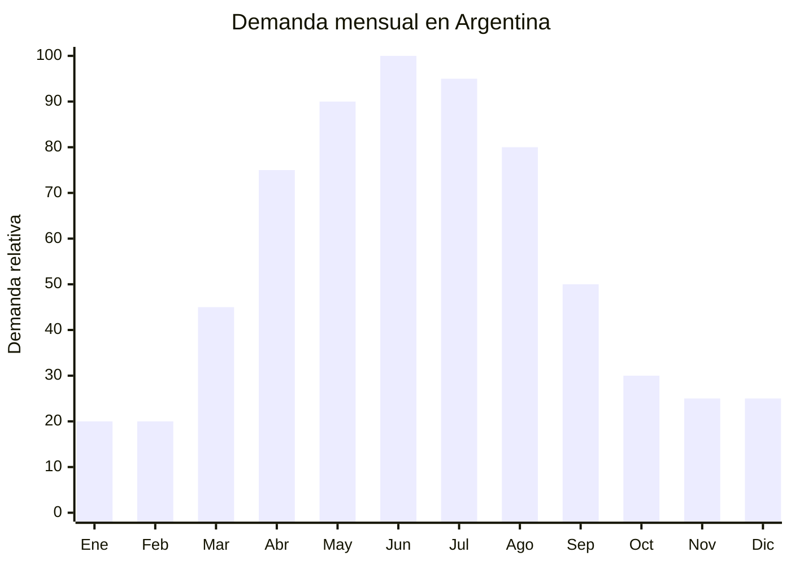

# Termos plásticos y vasos térmicos

> **Capítulo NCM 39** — Plástico y sus manufacturas | **Temporada:** Otoño (Mar–May)

## Qué es y por qué importarlo

Los termos plásticos y vasos térmicos tipo "travel mug" son recipientes con doble pared (generalmente de polipropileno, Tritan o acrílico) diseñados para mantener la temperatura de bebidas calientes como café, té e infusiones. A diferencia de los termos de acero inoxidable (Cap. 76, atemporales), estos son más económicos, livianos y están orientados al segmento de uso cotidiano y portabilidad.

En Argentina, la demanda de estos productos se dispara entre abril y agosto, cuando el consumo de bebidas calientes se multiplica. El vaso térmico con tapa se convirtió en un accesorio cotidiano para oficinas, transporte público y universidades. La tendencia "coffee to go" sigue creciendo y los consumidores buscan opciones económicas que cumplan la función básica de mantener la temperatura por 1-3 horas.

China (Yongkang, Zhejiang) es el principal productor mundial de vasos y termos plásticos, con fábricas que ofrecen personalización total (color, serigrafía, tapa, capacidad) desde MOQ de 200 unidades. La ventaja competitiva del plástico sobre el acero es el precio FOB significativamente menor y el peso reducido.

## Datos clave

| Dato | Valor |
|------|-------|
| **Posiciones NCM típicas** | 3924.10.00 (vajilla y artículos para servicio de mesa o cocina, de plástico) |
| **Derecho de importación** | 18% (DIE) + 3% tasa estadística |
| **Rango FOB típico** | USD 0.80 — USD 3.00 por unidad |
| **Precio de venta en Argentina** | ARS 3.000 — ARS 12.000 |
| **Margen bruto estimado** | 150% — 300% |
| **MOQ típico** | 200 — 1,000 unidades |
| **Demanda en MercadoLibre** | Media-Alta |
| **Competencia en MercadoLibre** | Media |
| **Dificultad para importar** | Fácil |
| **Certificaciones necesarias** | Recomendable certificado "Food Grade" / "BPA Free" |
| **Antidumping** | No |

## Variantes y subtipos más comunes

| Subtipo / Variante | FOB aprox. | Venta AR aprox. | Nota |
|--------------------|-----------|-----------------|------|
| Vaso térmico doble pared 350ml con tapa | USD 0.80 — 1.50 | ARS 3.000 — 6.000 | **Más vendido** |
| Travel mug 450ml con tapa anti-derrame | USD 1.00 — 2.00 | ARS 4.000 — 8.000 | Uso vehicular |
| Vaso térmico con sorbete 500-700ml | USD 1.20 — 2.50 | ARS 5.000 — 10.000 | Tendencia bebidas frías/calientes |
| Termo plástico/Tritan 500ml con correa | USD 1.50 — 3.00 | ARS 5.000 — 12.000 | Portátil |
| Vaso tipo Starbucks reutilizable 470ml | USD 0.80 — 1.80 | ARS 3.000 — 7.000 | Estética coffee shop |
| Vaso térmico con cambio de color | USD 1.00 — 2.50 | ARS 4.000 — 9.000 | Novedad / regalo |

## Regulaciones y requisitos

<Tabs>
  <Tab title="Certificaciones">
    | Organismo | Requiere | Detalle |
    |-----------|----------|---------|
    | ARCA (Aduana) | Sí siempre | Despacho estándar |
    | ANMAT | No obligatorio | Recomendable tener certificado "Food Grade" del proveedor para contacto con alimentos/bebidas calientes |
    | ENACOM | No | No es electrónico |
    | SENASA | No | No es alimento |

    **Recomendación:** Solicitar certificado de material "Food Grade" y "BPA Free" (test FDA o EU equivalente) al proveedor. Asegurar que el plástico soporte temperaturas de hasta 100°C sin liberar sustancias tóxicas. Esto es argumento de venta y protección legal.
  </Tab>

  <Tab title="Etiquetado">
    | Requisito | Aplica |
    |-----------|--------|
    | País de origen | Sí |
    | Datos importador | Sí |
    | Composición / materiales | Sí ("PP libre de BPA", "Tritan", con símbolo reciclaje) |
    | Instrucciones de uso | Recomendado (temperatura máxima, lavado) |
    | Capacidad en ml | Sí |
    | Precauciones | Recomendado ("No usar en microondas" si aplica) |
  </Tab>

  <Tab title="Restricciones">
    Sin restricciones significativas. No hay antidumping ni licencias previas.

    **Nota:** Si el vaso incluye componentes de acero inoxidable (doble pared con vacío metálico), podría reclasificarse en Cap. 73 o Cap. 76. Los productos de esta página son exclusivamente de plástico/Tritan con aislación por doble pared de aire.
  </Tab>
</Tabs>

## Logística de importación

| Factor | Detalle |
|--------|---------|
| **Peso por unidad** | 80 — 250 g |
| **Volumen por unidad** | 400 — 800 cm³ aprox. (con caja individual) |
| **Unidades por caja (master carton)** | 24 — 48 unidades |
| **Peso por caja** | 3 — 10 kg |
| **Cajas por contenedor 20'** | ~1,200 — 2,000 cajas |
| **Unidades por contenedor 20'** | ~40,000 — 80,000 unidades |
| **Fragilidad** | Baja (plástico resistente a golpes) |
| **Requiere embalaje especial** | No — embalaje estándar suficiente |

<Tip>
Los vasos térmicos de plástico son huecos y voluminosos para su peso. El flete se cobra por volumen (CBM), no por peso. Buscar modelos que se apilen o aniden para optimizar el espacio. Algunos proveedores ofrecen empaque "sin caja individual" (bulk pack) que reduce un 30-40% el volumen de envío.
</Tip>

## Estacionalidad y timing de compra

| Dato | Valor |
|------|-------|
| **Meses de mayor venta** | Abril — Agosto (otoño-invierno) |
| **Pedido ideal (marítimo)** | Enero — Febrero (para llegar en abril) |
| **Pedido ideal (aéreo)** | Marzo (para llegar en abril) |
| **Anticipación mínima** | 3 meses antes del pico |

## Ventajas y riesgos

<CardGroup cols={2}>
  <Card title="Ventajas" icon="circle-check">
    - Sin regulación compleja — barrera de entrada baja
    - Producto liviano y resistente (bajo riesgo de rotura)
    - Precio FOB bajo con buenos márgenes
    - Tendencia "coffee to go" en crecimiento
    - Ideal para marca propia con serigrafía personalizada
    - Complementa venta de termos de acero (Cap. 76)
  </Card>

  <Card title="Riesgos y desventajas" icon="triangle-exclamation">
    - Percepción de menor calidad vs. termos de acero
    - Retención térmica limitada (1-3 horas vs. 8-12 de acero)
    - Voluminoso para su peso (flete por CBM alto)
    - Tapas de mala calidad = fugas = devoluciones
    - Estacionalidad marcada: baja demanda en verano
    - Plásticos baratos pueden liberar olores o sabores con líquidos calientes
  </Card>
</CardGroup>

## Palabras clave para buscar en Alibaba

`plastic travel mug double wall` · `reusable coffee cup lid wholesale` · `Tritan thermal cup BPA free` · `double wall tumbler wholesale` · `plastic insulated cup custom logo`

## Fuentes

- MercadoLibre Argentina — búsqueda "vaso térmico tapa"
- Alibaba.com — proveedores de double wall plastic cup
- Comparativa termos plásticos vs. acero inoxidable
