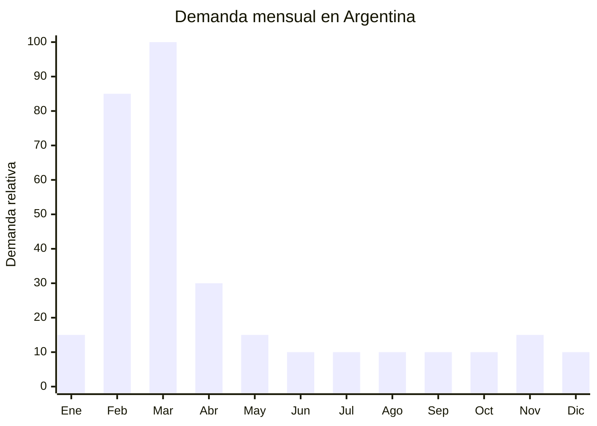

# Cartucheras escolares

> **Capítulo NCM 42** — Manufacturas de cuero; artículos de viaje, bolsos | **Temporada:** Otoño (Mar–May)

## Qué es y por qué importarlo

Las cartucheras escolares incluyen estuches para lápices con compartimentos, cartucheras 3D con relieve, estuches enrollables, portatodo de silicona y cartucheras de gran capacidad. Son un producto obligatorio en la lista de útiles escolares de todos los niveles educativos, desde jardín hasta secundaria.

En Argentina, la vuelta a clases en marzo genera un pico de demanda concentrado en 4-6 semanas (mediados de febrero a mediados de marzo). Las cartucheras con diseños llamativos (3D, personajes, holográficas) tienen mayor ticket y son las más buscadas por los niños. Alibaba ofrece más de 91,000 resultados para "pencil bags", lo que demuestra la amplitud de la oferta china.

Los materiales principales son poliéster 600D, PVC, neopreno, silicona y cuero sintético PU. China (Yiwu, Guangzhou) produce cartucheras a FOB extremadamente bajos, permitiendo márgenes brutos de 200-400%. El producto es liviano, compacto y fácil de transportar, lo que lo convierte en un excelente primer producto de importación.

## Datos clave

| Dato | Valor |
|------|-------|
| **Posiciones NCM típicas** | 4202.32.00 (estuches con superficie exterior de materia textil), 4202.39.00 (demás estuches) |
| **Derecho de importación** | 20% (DIE) + 3% tasa estadística |
| **Rango FOB típico** | USD 0.50 — USD 4.00 por unidad |
| **Precio de venta en Argentina** | ARS 3.220 — ARS 28.300 |
| **Margen bruto estimado** | 200% — 400% |
| **MOQ típico** | 200 — 1,000 unidades |
| **Demanda en MercadoLibre** | Alta (estacional) |
| **Competencia en MercadoLibre** | Alta |
| **Dificultad para importar** | Fácil |
| **Certificaciones necesarias** | Ninguna |
| **Antidumping** | No |

## Variantes y subtipos más comunes

| Subtipo / Variante | FOB aprox. | Venta AR aprox. | Nota |
|--------------------|-----------|-----------------|------|
| Cartuchera básica 1 cierre poliéster | USD 0.50 — 1.00 | ARS 3.220 — 6.000 | Económica, volumen |
| Cartuchera 3D con relieve | USD 1.00 — 2.50 | ARS 5.000 — 12.000 | **Más vendido infantil** |
| Cartuchera 2-3 compartimentos | USD 1.50 — 3.00 | ARS 6.000 — 15.000 | Primaria estándar |
| Cartuchera de silicona flexible | USD 1.00 — 2.00 | ARS 5.000 — 10.000 | Tendencia, formas divertidas |
| Estuche enrollable (wrap) | USD 1.50 — 3.00 | ARS 6.000 — 14.000 | Artístico, premium |
| Cartuchera gran capacidad (box) | USD 2.00 — 4.00 | ARS 8.000 — 28.300 | Secundaria, amplia |

## Regulaciones y requisitos

<Tabs>
  <Tab title="Certificaciones">
    | Organismo | Requiere | Detalle |
    |-----------|----------|---------|
    | ARCA (Aduana) | Sí siempre | Despacho estándar |
    | ANMAT | No | No aplica |
    | ENACOM | No | No aplica |
    | INTI | No | No es textil regulado |

    **Recomendación:** Producto sin barreras regulatorias. Ideal para importadores principiantes.
  </Tab>

  <Tab title="Etiquetado">
    | Requisito | Aplica |
    |-----------|--------|
    | Idioma español | Sí |
    | Datos del importador | Sí |
    | Composición / materiales | Sí (poliéster, PVC, silicona, etc.) |
    | País de origen | Sí |
    | Garantía legal 6 meses | Sí |
  </Tab>

  <Tab title="Restricciones">
    Sin restricciones significativas. Evitar diseños con marcas registradas sin licencia. Las cartucheras de silicona con formas de alimentos pueden ser retenidas si se confunden con productos alimenticios.
  </Tab>
</Tabs>

## Logística de importación

| Factor | Detalle |
|--------|---------|
| **Peso por unidad** | 50 — 200 g |
| **Volumen por unidad** | 500 — 1,500 cm³ aprox. |
| **Unidades por caja (master carton)** | 50 — 200 unidades |
| **Peso por caja** | 5 — 15 kg |
| **Cajas por contenedor 20'** | ~1,500 — 2,500 cajas |
| **Unidades por contenedor 20'** | ~100,000 — 300,000 unidades |
| **Fragilidad** | Muy baja |
| **Requiere embalaje especial** | No — bolsa OPP individual + caja master |

<Tip>
Las cartucheras son uno de los productos con mejor relación valor/volumen para importar. Son livianas, compactas y no se rompen. Podés enviar un pedido de prueba de 500-1,000 unidades por aéreo/courier con flete muy bajo (aprox. USD 3-5/kg) y validar el mercado antes de hacer un pedido marítimo grande.
</Tip>

## Estacionalidad y timing de compra

| Dato | Valor |
|------|-------|
| **Meses de mayor venta** | Febrero — Marzo |
| **Pedido ideal (marítimo)** | Octubre — Noviembre |
| **Pedido ideal (aéreo)** | Enero |
| **Anticipación mínima** | 3 meses |

## Ventajas y riesgos

<CardGroup cols={2}>
  <Card title="Ventajas" icon="circle-check">
    - FOB muy bajo = bajo riesgo de inversión
    - Producto liviano y compacto (flete económico)
    - Sin regulaciones ni certificaciones
    - Se vende en combo con mochila y lunchera
    - Ideal para primera importación
    - Variedad enorme en Alibaba (+91,000 resultados)
  </Card>
  <Card title="Riesgos y desventajas" icon="triangle-exclamation">
    - Temporada muy corta (4-6 semanas)
    - Cierres de mala calidad = devoluciones
    - Stock sobrante hasta el año siguiente
    - Competencia con librerías y marcas locales (Mooving, Cresko)
    - Tendencias de personajes cambian cada año
  </Card>
</CardGroup>

## Palabras clave para buscar en Alibaba

`pencil case wholesale` · `pencil bag 3D` · `school pencil pouch` · `silicone pencil case` · `large capacity pencil box` · `custom pencil case logo` · `EVA pencil case 3D` · `pencil bags wholesale`

## Fuentes

- MercadoLibre Argentina — búsqueda "cartuchera escolar"
- Alibaba.com — proveedores de pencil case wholesale
