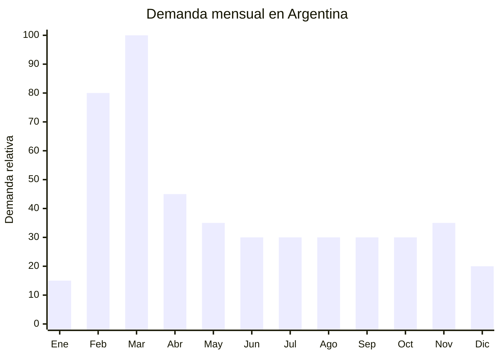

# Luncheras térmicas escolares

> **Capítulo NCM 42** — Manufacturas de cuero; artículos de viaje, bolsos | **Temporada:** Otoño (Mar–May)

## Qué es y por qué importarlo

Las luncheras térmicas escolares son bolsos aislantes diseñados para transportar alimentos y bebidas manteniendo su temperatura. Están compuestas por una capa exterior de poliéster 600D o nylon, una capa intermedia de espuma aislante (PE foam) y un forro interior de aluminio laminado (PEVA o aluminio foil) que refleja el calor/frío.

En Argentina, la vuelta a clases en marzo impulsa la demanda de luncheras como complemento de la mochila escolar. Se venden tanto individualmente como en combos (mochila + lunchera + cartuchera). Con la tendencia creciente de llevar vianda al colegio (tanto por economía como por alimentación saludable), la demanda de luncheras térmicas de calidad ha crecido sostenidamente.

China domina la producción mundial de luncheras térmicas con precios FOB desde USD 1.00, permitiendo márgenes muy atractivos. Los principales centros de producción están en Dongguan, Guangzhou y Yiwu.

## Datos clave

| Dato | Valor |
|------|-------|
| **Posiciones NCM típicas** | 4202.92.00 (bolsos con superficie exterior de materia textil) |
| **Derecho de importación** | 20% (DIE) + 3% tasa estadística |
| **Rango FOB típico** | USD 1.00 — USD 5.00 por unidad |
| **Precio de venta en Argentina** | ARS 3.000 — ARS 15.000 |
| **Margen bruto estimado** | 150% — 300% |
| **MOQ típico** | 200 — 1,000 unidades |
| **Demanda en MercadoLibre** | Alta (estacional, creciente todo el año) |
| **Competencia en MercadoLibre** | Media-Alta |
| **Dificultad para importar** | Fácil |
| **Certificaciones necesarias** | Ninguna (no es contacto directo con alimento) |
| **Antidumping** | No |

## Variantes y subtipos más comunes

| Subtipo / Variante | FOB aprox. | Venta AR aprox. | Nota |
|--------------------|-----------|-----------------|------|
| Lunchera básica cuadrada | USD 1.00 — 2.00 | ARS 3.000 — 7.000 | Económica |
| Lunchera infantil con personaje | USD 1.50 — 3.50 | ARS 5.000 — 12.000 | **Más vendido escolar** |
| Lunchera doble compartimento | USD 2.00 — 4.00 | ARS 6.000 — 13.000 | Premium |
| Lunchera tipo mochilita (con correas) | USD 2.50 — 5.00 | ARS 7.000 — 15.000 | Jardín, práctica |
| Lunchera adulto oficina | USD 2.00 — 4.00 | ARS 5.000 — 12.000 | Demanda atemporal |
| Lunchera con contenedores incluidos | USD 3.00 — 5.00 | ARS 8.000 — 15.000 | Set completo, mayor ticket |

## Regulaciones y requisitos

<Tabs>
  <Tab title="Certificaciones">
    | Organismo | Requiere | Detalle |
    |-----------|----------|---------|
    | ARCA (Aduana) | Sí siempre | Despacho estándar |
    | ANMAT | No | La lunchera no tiene contacto directo con alimento (los alimentos van en recipientes dentro). Si incluye recipientes plásticos, esos sí requieren apto alimentario |
    | ENACOM | No | No aplica |
    | INTI | No | No es textil regulado |

    **Recomendación:** Si vendés luncheras con contenedores plásticos incluidos, esos contenedores deben cumplir con normas de aptitud alimentaria (ANMAT). La lunchera en sí no necesita certificación.
  </Tab>

  <Tab title="Etiquetado">
    | Requisito | Aplica |
    |-----------|--------|
    | Idioma español | Sí |
    | Datos del importador | Sí |
    | Composición / materiales | Sí (poliéster, aluminio, PE foam) |
    | Capacidad en litros | Recomendado |
    | País de origen | Sí |
    | Garantía legal 6 meses | Sí |
  </Tab>

  <Tab title="Restricciones">
    Sin restricciones significativas. Si la lunchera incluye contenedores plásticos para alimentos, verificar aptitud alimentaria de los plásticos (libre de BPA, apto microondas si se publicita).
  </Tab>
</Tabs>

## Logística de importación

| Factor | Detalle |
|--------|---------|
| **Peso por unidad** | 150 — 400 g |
| **Volumen por unidad** | 2,000 — 5,000 cm³ aprox. |
| **Unidades por caja (master carton)** | 20 — 50 unidades |
| **Peso por caja** | 5 — 12 kg |
| **Cajas por contenedor 20'** | ~1,000 — 2,000 cajas |
| **Unidades por contenedor 20'** | ~30,000 — 60,000 unidades |
| **Fragilidad** | Muy baja |
| **Requiere embalaje especial** | No |

<Tip>
Las luncheras plegables o colapsables reducen significativamente el volumen de envío. Algunos modelos se pliegan planos y ocupan hasta un 70% menos de espacio. Si el flete es una preocupación, considerar este tipo de diseños para el primer pedido.
</Tip>

## Estacionalidad y timing de compra

| Dato | Valor |
|------|-------|
| **Meses de mayor venta** | Febrero — Marzo (vuelta a clases), con demanda base todo el año |
| **Pedido ideal (marítimo)** | Octubre — Noviembre |
| **Pedido ideal (aéreo)** | Enero |
| **Anticipación mínima** | 3 meses |

<Note>
A diferencia de las mochilas y cartucheras, las luncheras térmicas tienen demanda base significativa fuera de temporada escolar. Se usan para oficina, gimnasio, viajes y picnics. Esto reduce el riesgo de stock sobrante post-temporada.
</Note>

## Ventajas y riesgos

<CardGroup cols={2}>
  <Card title="Ventajas" icon="circle-check">
    - FOB muy bajo (desde USD 1)
    - Demanda escolar + demanda atemporal (oficina, gym)
    - Producto liviano y compacto
    - Se vende en combo con mochila + cartuchera
    - Sin regulaciones
    - Tendencia de viandas saludables impulsa demanda
  </Card>
  <Card title="Riesgos y desventajas" icon="triangle-exclamation">
    - Pico concentrado en febrero-marzo
    - Calidad del forro interior variable (puede pelarse)
    - Olores del material si la calidad es baja
    - Competencia con marcas locales y supermercados
    - Costuras defectuosas en modelos económicos
  </Card>
</CardGroup>

## Palabras clave para buscar en Alibaba

`lunch bag insulated wholesale` · `kids lunch box bag` · `thermal lunch bag children` · `insulated cooler bag school` · `custom lunch bag logo` · `PEVA lunch tote` · `school lunch bag set` · `portable lunch bag wholesale`

## Fuentes

- MercadoLibre Argentina — búsqueda "lunchera térmica escolar"
- Alibaba.com — proveedores de insulated lunch bag wholesale
