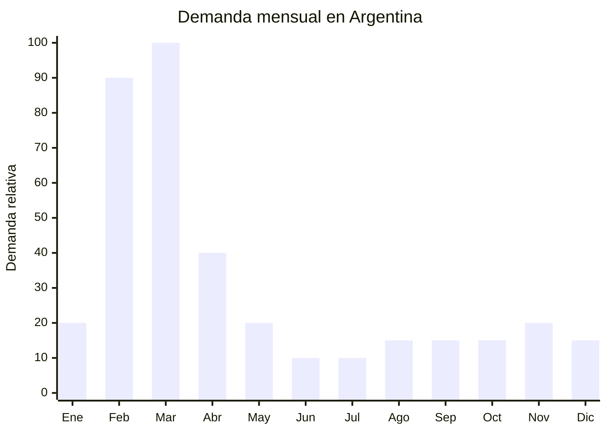

# Mochilas escolares con personajes

> **Capítulo NCM 42** — Manufacturas de cuero; artículos de viaje, bolsos | **Temporada:** Otoño (Mar–May)

## Qué es y por qué importarlo

Las mochilas escolares con personajes son el producto estrella de la vuelta a clases en Argentina. Incluyen mochilas infantiles (jardín y primaria) con diseños de personajes populares (Disney, Marvel, Barbie, Minecraft, anime), así como modelos juveniles con estampados de tendencia. Se comercializan en sets que combinan mochila + lunchera + cartuchera, maximizando el ticket promedio.

El pico de demanda es MASIVO entre febrero y marzo, cuando millones de familias argentinas compran útiles escolares. Marcas como Protrade venden combos mochila+lunchera+cartuchera a precios significativos. Las mochilas con carrito (rueditas) son especialmente populares en primaria y tienen FOB más alto pero también mayor precio de venta.

China (Guangzhou, Quanzhou y Baigou) concentra la fabricación mundial de mochilas escolares con capacidad de producir diseños personalizados con impresión full-color, bordados y apliques 3D a costos muy competitivos. Los proveedores ofrecen tanto diseños genéricos (sin licencia) como modelos con personajes propios del proveedor que no infringen marcas registradas.

## Datos clave

| Dato | Valor |
|------|-------|
| **Posiciones NCM típicas** | 4202.92.00 (bolsos con superficie exterior de materia textil), 4202.12.20 (con superficie de plástico/material sintético) |
| **Derecho de importación** | 20% (DIE) + 3% tasa estadística |
| **Rango FOB típico** | USD 3.00 — USD 12.00 por unidad (sin carrito); USD 8.00 — USD 20.00 (con carrito) |
| **Precio de venta en Argentina** | ARS 15.000 — ARS 80.000 |
| **Margen bruto estimado** | 150% — 350% |
| **MOQ típico** | 100 — 500 unidades (por diseño) |
| **Demanda en MercadoLibre** | Muy alta (estacional) |
| **Competencia en MercadoLibre** | Alta |
| **Dificultad para importar** | Fácil (sin licencias) / Media (con licencias) |
| **Certificaciones necesarias** | Ninguna para mochilas textiles |
| **Antidumping** | No |

<Warning>
**LICENCIAS DE PERSONAJES.** Importar mochilas con personajes de Disney, Marvel, Mattel, Warner, etc. **sin licencia** es ilegal y puede resultar en retención y destrucción de la mercadería en Aduana. La aduana argentina controla activamente marcas registradas. **Alternativas seguras:** (1) Diseños propios inspirados sin copiar, (2) Personajes genéricos del proveedor, (3) Diseños geométricos/abstractos, (4) Obtener sublicencia de un licenciatario local.
</Warning>

## Variantes y subtipos más comunes

| Subtipo / Variante | FOB aprox. | Venta AR aprox. | Nota |
|--------------------|-----------|-----------------|------|
| Mochila jardín (12" pequeña) | USD 3.00 — 5.00 | ARS 15.000 — 25.000 | 3-5 años |
| Mochila primaria 16" estampada | USD 4.00 — 8.00 | ARS 20.000 — 40.000 | **Más vendido** |
| Mochila con carrito (rueditas) | USD 8.00 — 20.00 | ARS 35.000 — 80.000 | Alto ticket |
| Combo mochila + lunchera + cartuchera | USD 6.00 — 15.00 | ARS 25.000 — 60.000 | Formato retail popular |
| Mochila juvenil estampada (secundaria) | USD 5.00 — 10.00 | ARS 18.000 — 40.000 | Anime, gaming, urbano |
| Mochila espalda ergonómica premium | USD 8.00 — 15.00 | ARS 30.000 — 55.000 | Diferencial salud |

## Regulaciones y requisitos

<Tabs>
  <Tab title="Certificaciones">
    | Organismo | Requiere | Detalle |
    |-----------|----------|---------|
    | ARCA (Aduana) | Sí siempre | Despacho estándar |
    | ANMAT | No | No es cosmético ni alimento |
    | ENACOM | No | No es electrónico |
    | INTI | No | No es textil regulado (Cap. 61-62) ni calzado |
    | Marcas y Patentes (INPI) | Verificar | Si lleva marcas/personajes registrados, se requiere licencia |

    **Recomendación:** Usar diseños propios o genéricos del proveedor. Si querés usar personajes conocidos, contactar al licenciatario oficial en Argentina para negociar una sublicencia (generalmente 8-15% sobre precio de venta mayorista).
  </Tab>

  <Tab title="Etiquetado">
    | Requisito | Aplica |
    |-----------|--------|
    | Idioma español | Sí |
    | Datos del importador | Sí |
    | Composición / materiales | Sí (poliéster, nylon, PVC, etc.) |
    | Edad recomendada | Recomendado |
    | Capacidad en litros | Recomendado |
    | País de origen | Sí |
    | Garantía legal 6 meses | Sí |
  </Tab>

  <Tab title="Restricciones">
    Sin restricciones técnicas. La única restricción relevante es de **propiedad intelectual**: no importar con marcas/personajes sin licencia. La Aduana argentina tiene un sistema de alerta de marcas (SICAM) que detecta automáticamente productos con logos conocidos.
  </Tab>
</Tabs>

## Logística de importación

| Factor | Detalle |
|--------|---------|
| **Peso por unidad** | 300 — 800 g (sin carrito); 1.2 — 2.5 kg (con carrito) |
| **Volumen por unidad** | 4,000 — 8,000 cm³ aprox. |
| **Unidades por caja (master carton)** | 10 — 20 unidades |
| **Peso por caja** | 5 — 12 kg |
| **Cajas por contenedor 20'** | ~600 — 1,000 cajas |
| **Unidades por contenedor 20'** | ~8,000 — 15,000 unidades |
| **Fragilidad** | Baja |
| **Requiere embalaje especial** | No — comprimir en bolsas plásticas para reducir volumen |

<Tip>
Las mochilas son MUY voluminosas para su peso. El flete marítimo se cobra por CBM (metro cúbico), no por peso. Pedir al proveedor que **comprima** las mochilas en bolsas al vacío puede reducir el volumen un 40-60%, ahorrando significativamente en flete. Las mochilas con carrito NO se pueden comprimir y ocupan mucho más espacio.
</Tip>

## Estacionalidad y timing de compra

| Dato | Valor |
|------|-------|
| **Meses de mayor venta** | Febrero — Marzo (vuelta a clases) |
| **Pedido ideal (marítimo)** | Octubre — Noviembre (llega enero-febrero) |
| **Pedido ideal (aéreo)** | Enero (llega febrero) |
| **Anticipación mínima** | 3 — 4 meses |

<Note>
La vuelta a clases en Argentina es en **marzo**, pero las compras empiezan en **febrero**. Los padres que compran temprano (febrero) consiguen más variedad; los que compran tarde (mediados de marzo) compran lo que queda. Tener stock listo a inicio de febrero es clave. Las ferias escolares mayoristas (Once, Buenos Aires) empiezan a vender en enero.
</Note>

## Ventajas y riesgos

<CardGroup cols={2}>
  <Card title="Ventajas" icon="circle-check">
    - Demanda masiva y predecible (vuelta a clases)
    - Producto sin regulaciones técnicas
    - Venta en combos (mochila+lunchera+cartuchera) sube ticket
    - Personalización completa en China
    - Sin antidumping
    - Múltiples segmentos (jardín, primaria, secundaria)
  </Card>
  <Card title="Riesgos y desventajas" icon="triangle-exclamation">
    - Temporada muy corta (4-6 semanas de pico)
    - Stock sobrante difícil de liquidar hasta el año siguiente
    - Riesgo de retención en Aduana por marcas/personajes sin licencia
    - Producto voluminoso (flete alto por CBM)
    - Cierres y rueditas (carritos) de mala calidad = devoluciones
    - Competencia con marcas establecidas (Totto, Samsonite Kids)
  </Card>
</CardGroup>

## Palabras clave para buscar en Alibaba

`school backpack children wholesale` · `kids school bag cartoon` · `trolley school bag wheels` · `school backpack set lunch bag pencil case` · `3D school bag kids` · `teenage school backpack` · `primary school bag custom logo` · `kindergarten backpack wholesale`

## Fuentes

- MercadoLibre Argentina — búsqueda "mochila escolar"
- Alibaba.com — proveedores de school backpack wholesale
- Protrade Argentina — referencia de combos escolares
