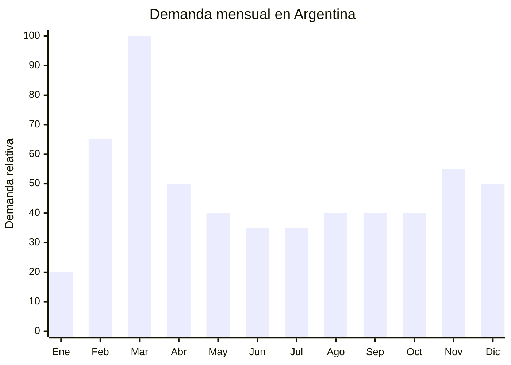

# Organizadores de escritorio escolares

> **Capítulo NCM 44** — Madera, carbón vegetal y manufacturas de madera | **Temporada:** Otoño (Mar–May)

## Qué es y por qué importarlo

Los organizadores de escritorio de bambú y madera son accesorios funcionales que incluyen portalápices, porta-celular, bandejas para papeles, organizadores de correspondencia y sets combinados multi-función. Los modelos escolares se enfocan en portalápices con múltiples compartimentos, soportes para libros/cuadernos y organizadores compactos para escritorios juveniles.

La vuelta a clases en febrero-marzo impulsa la compra de estos productos como complemento del equipamiento del espacio de estudio en casa. Con la consolidación del estudio híbrido (presencial + virtual), cada vez más familias argentinas invierten en acondicionar el escritorio de estudio de sus hijos. El bambú y la madera tienen una percepción premium y eco-friendly que permite cobrar precios superiores a los organizadores plásticos.

China produce la gran mayoría de los organizadores de bambú del mundo, con Fujian y Zhejiang como principales provincias exportadoras. En Alibaba hay más de 999 resultados para "bamboo pen holder", con precios FOB desde USD 2.00 que permiten márgenes amplios.

## Datos clave

| Dato | Valor |
|------|-------|
| **Posiciones NCM típicas** | 4421.99.00 (demás artículos de madera), 4419.90.00 (artículos de mesa/cocina de madera) |
| **Derecho de importación** | 18% (DIE) + 3% tasa estadística |
| **Rango FOB típico** | USD 2.00 — USD 8.00 por unidad |
| **Precio de venta en Argentina** | ARS 5.000 — ARS 15.000 |
| **Margen bruto estimado** | 100% — 250% |
| **MOQ típico** | 200 — 500 unidades |
| **Demanda en MercadoLibre** | Media (estacional + atemporal) |
| **Competencia en MercadoLibre** | Media |
| **Dificultad para importar** | Fácil |
| **Certificaciones necesarias** | Certificado fitosanitario (SENASA) |
| **Antidumping** | No |

## Variantes y subtipos más comunes

| Subtipo / Variante | FOB aprox. | Venta AR aprox. | Nota |
|--------------------|-----------|-----------------|------|
| Portalápices bambú simple | USD 2.00 — 3.00 | ARS 5.000 — 8.000 | Básico, volumen |
| Organizador multi-compartimento | USD 3.00 — 6.00 | ARS 7.000 — 13.000 | **Más vendido** |
| Porta-celular + portalápices combo | USD 3.50 — 5.00 | ARS 6.000 — 11.000 | Funcional, juvenil |
| Bandeja papeles bambú | USD 4.00 — 7.00 | ARS 8.000 — 14.000 | Oficina/estudio |
| Organizador escritorio completo (set) | USD 5.00 — 8.00 | ARS 10.000 — 15.000 | Premium, set completo |
| Soporte monitor + organizador | USD 6.00 — 10.00 | ARS 12.000 — 20.000 | Home office premium |

## Regulaciones y requisitos

<Tabs>
  <Tab title="Certificaciones">
    | Organismo | Requiere | Detalle |
    |-----------|----------|---------|
    | ARCA (Aduana) | Sí siempre | Despacho estándar |
    | SENASA | Sí | Certificado fitosanitario para productos de madera/bambú. Tratamiento térmico o fumigación requerida |
    | ANMAT | No | No aplica |
    | ENACOM | No | No aplica |

    **Recomendación:** Los productos de madera y bambú requieren certificado fitosanitario (norma NIMF-15). El proveedor chino debe realizar tratamiento térmico (HT) o fumigación con bromuro de metilo y proporcionar el certificado fitosanitario de exportación. SENASA lo verifica al ingreso. Sin este certificado, la mercadería puede ser rechazada o requerir fumigación en destino (costo adicional).
  </Tab>

  <Tab title="Etiquetado">
    | Requisito | Aplica |
    |-----------|--------|
    | Idioma español | Sí |
    | Datos del importador | Sí |
    | Material (bambú, madera, MDF) | Sí |
    | Dimensiones | Recomendado |
    | País de origen | Sí |
    | Garantía legal 6 meses | Sí |
  </Tab>

  <Tab title="Restricciones">
    Sin restricciones comerciales, pero la certificación fitosanitaria es obligatoria para toda importación de madera y bambú. Verificar que el proveedor realice el tratamiento y emita el certificado correspondiente.
  </Tab>
</Tabs>

## Logística de importación

| Factor | Detalle |
|--------|---------|
| **Peso por unidad** | 200 — 800 g |
| **Volumen por unidad** | 1,500 — 5,000 cm³ aprox. |
| **Unidades por caja (master carton)** | 10 — 30 unidades |
| **Peso por caja** | 5 — 15 kg |
| **Cajas por contenedor 20'** | ~1,200 — 2,000 cajas |
| **Unidades por contenedor 20'** | ~20,000 — 40,000 unidades |
| **Fragilidad** | Media (bambú puede astillarse con impactos fuertes) |
| **Requiere embalaje especial** | Sí — papel burbuja individual + separadores de cartón entre unidades |

<Tip>
Los organizadores de bambú deben embalarse con protección contra humedad (film shrink + desecante en la caja). El bambú sin tratamiento puede desarrollar moho si se expone a humedad durante el tránsito marítimo de 35-45 días. Verificar que el proveedor aplique un sellador/barniz y use embalaje hermético.
</Tip>

## Estacionalidad y timing de compra

| Dato | Valor |
|------|-------|
| **Meses de mayor venta** | Febrero — Abril (vuelta a clases + armado de escritorios) |
| **Pedido ideal (marítimo)** | Noviembre — Diciembre |
| **Pedido ideal (aéreo)** | Enero |
| **Anticipación mínima** | 3 meses |

<Note>
A diferencia de los útiles escolares puros, los organizadores de escritorio tienen demanda atemporal significativa. Se venden todo el año para oficinas, home office y como regalos. El pico escolar de marzo agrega un 40-60% de demanda adicional sobre la base, pero no es un producto de temporada pura.
</Note>

## Ventajas y riesgos

<CardGroup cols={2}>
  <Card title="Ventajas" icon="circle-check">
    - Percepción premium eco-friendly (bambú/madera)
    - Demanda escolar + atemporal (home office)
    - Competencia moderada en MercadoLibre
    - Producto no regulado electrónicamente
    - Buen candidato para marca propia (grabado láser)
    - No hay antidumping
  </Card>
  <Card title="Riesgos y desventajas" icon="triangle-exclamation">
    - Requiere certificado fitosanitario obligatorio
    - Bambú sensible a humedad (moho en tránsito)
    - Fragilidad media (puede astillarse)
    - Producto más pesado que alternativas plásticas
    - Acabados variables (barniz desprolijo, astillas)
    - Menor volumen de mercado que útiles escolares clásicos
  </Card>
</CardGroup>

## Palabras clave para buscar en Alibaba

`bamboo pen holder wholesale` · `bamboo desk organizer` · `wood pencil holder school` · `bamboo desk storage` · `desktop organizer bamboo custom` · `bamboo phone stand pen holder` · `wooden desk tidy wholesale` · `bamboo stationery organizer`

## Fuentes

- MercadoLibre Argentina — búsqueda "organizador escritorio bambú"
- Alibaba.com — proveedores de bamboo desk organizer
