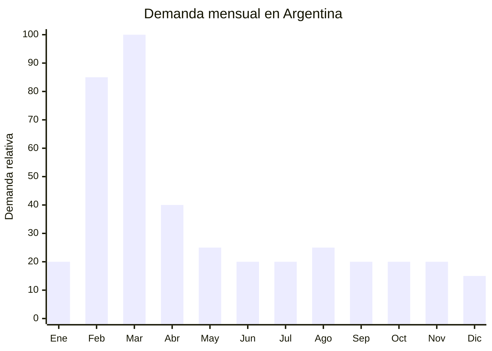

# Carpetas y folios escolares

> **Capítulo NCM 48** — Papel, cartón y sus manufacturas | **Temporada:** Otoño (Mar–May)

## Qué es y por qué importarlo

Las carpetas y folios escolares incluyen carpetas con anillos N3 (formato estándar argentino), folios transparentes A4 (fundas plásticas perforadas), carpetas con cierre (cremallera o broche), biblioratos, y carpetas tipo sobre con botón. Son artículos de librería esenciales que figuran en todas las listas de útiles escolares desde primaria hasta universidad.

En Argentina, el inicio del ciclo lectivo en marzo genera un pico de demanda explosivo. Las carpetas N3 son el formato estándar del sistema educativo argentino, lo que garantiza una demanda cautiva de millones de unidades cada año. Los folios A4 son consumibles de alta rotación que se reponen varias veces durante el año escolar.

China produce carpetas y folios de polipropileno (PP) con costos FOB de USD 0.20-1.50 por unidad. El producto es liviano, plano y fácil de transportar. Sin regulaciones especiales y con márgenes de 200-350%, es un producto accesible para importadores con capital limitado.

## Datos clave

| Dato | Valor |
|------|-------|
| **Posiciones NCM típicas** | 4820.30.00 (clasificadores, carpetas), 3926.10.00 (artículos de oficina de plástico) |
| **Derecho de importación** | 16-18% (DIE) + 3% tasa estadística |
| **Rango FOB típico** | USD 0.20 — USD 1.50 por unidad |
| **Precio de venta en Argentina** | ARS 1.500 — ARS 6.000 |
| **Margen bruto estimado** | 200% — 350% |
| **MOQ típico** | 500 — 2,000 unidades |
| **Demanda en MercadoLibre** | Alta (estacional con base anual) |
| **Competencia en MercadoLibre** | Alta |
| **Dificultad para importar** | Fácil |
| **Certificaciones necesarias** | Ninguna |
| **Antidumping** | No |

## Variantes y subtipos más comunes

| Subtipo / Variante | FOB aprox. | Venta AR aprox. | Nota |
|--------------------|-----------|-----------------|------|
| Folios A4 transparentes x100 unidades | USD 0.80 — 1.50 (pack) | ARS 2.000 — 4.000 | **Consumible recurrente** |
| Carpeta con anillos N3 PP lisa | USD 0.40 — 0.80 | ARS 2.000 — 4.000 | Estándar argentino |
| Carpeta N3 estampada/diseño | USD 0.60 — 1.20 | ARS 3.000 — 6.000 | Mayor margen |
| Carpeta con cierre A4 PP | USD 0.20 — 0.50 | ARS 1.500 — 3.000 | Económica, alto volumen |
| Carpeta sobre con botón A4 | USD 0.10 — 0.30 | ARS 500 — 1.500 | Complemento |
| Bibliorato A4 cartón plastificado | USD 0.50 — 1.50 | ARS 2.500 — 6.000 | Oficina y escuela |

## Regulaciones y requisitos

<Tabs>
  <Tab title="Certificaciones">
    | Organismo | Requiere | Detalle |
    |-----------|----------|---------|
    | ARCA (Aduana) | Sí siempre | Despacho estándar |
    | ANMAT | No | No aplica |
    | ENACOM | No | No aplica |
    | INTI | No | No aplica |

    **Recomendación:** Producto sin barreras regulatorias. Verificar que las carpetas N3 cumplan con el diámetro de anillos estándar argentino (no confundir con estándar europeo o americano).
  </Tab>

  <Tab title="Etiquetado">
    | Requisito | Aplica |
    |-----------|--------|
    | País de origen | Sí |
    | Datos del importador | Sí |
    | Material | Recomendado (PP, cartón, etc.) |
    | Tamaño / formato | Recomendado (A4, Oficio) |
    | Idioma español | Sí |
  </Tab>

  <Tab title="Restricciones">
    - Sin restricciones significativas.
    - Verificar compatibilidad de las perforaciones de los folios con las carpetas N3 argentinas (3 anillos, separación estándar).
    - Formato "Letter" (americano) NO se vende en Argentina — asegurar formato A4 u Oficio.
    - Sin antidumping vigente.
  </Tab>
</Tabs>

## Logística de importación

| Factor | Detalle |
|--------|---------|
| **Peso por unidad** | 30 — 250 g según tipo |
| **Volumen por unidad** | Bajo — producto plano |
| **Unidades por caja (master carton)** | 50 — 200 unidades |
| **Peso por caja** | 5 — 15 kg |
| **Cajas por contenedor 20'** | ~2,000 — 4,000 cajas |
| **Unidades por contenedor 20'** | ~100,000 — 500,000 unidades |
| **Fragilidad** | Muy baja |
| **Requiere embalaje especial** | No — producto plano apilable |

<Tip>
Las carpetas y folios son productos planos que se apilan perfectamente, optimizando al máximo el espacio del contenedor o del paquete courier. Un pedido de 1,000 folios A4 pesa apenas 8-10 kg. Ideal para combinar con otros útiles escolares en un mismo envío y diversificar la oferta.
</Tip>

## Estacionalidad y timing de compra

| Dato | Valor |
|------|-------|
| **Meses de mayor venta** | Febrero — Marzo (vuelta a clases) |
| **Pedido ideal (marítimo)** | Octubre — Noviembre |
| **Pedido ideal (aéreo)** | Enero |
| **Anticipación mínima** | 3 meses |

## Ventajas y riesgos

<CardGroup cols={2}>
  <Card title="Ventajas" icon="circle-check">
    - Demanda cautiva obligatoria (lista de útiles)
    - Producto plano y liviano: flete económico
    - Sin regulaciones ni certificaciones
    - Folios son consumibles recurrentes (recompra)
    - Inversión inicial baja
    - Se vende todo el año (base + pico)
  </Card>

  <Card title="Riesgos y desventajas" icon="triangle-exclamation">
    - Competencia muy alta con marcas establecidas (Avery, Ledesma)
    - Ticket bajo por unidad
    - Anillos de carpeta N3 deben ser estándar argentino exacto
    - Folios de baja calidad se rompen fácil (reclamos)
    - Producción local competitiva en carpetas de cartón
  </Card>
</CardGroup>

## Palabras clave para buscar en Alibaba

`A4 folder ring binder 3 rings` · `sheet protector A4 clear wholesale` · `PP folder zipper A4` · `document folder snap button` · `ring binder plastic wholesale` · `clear file folder A4 wholesale`

## Fuentes

- MercadoLibre Argentina — búsqueda "carpeta N3 escolar", "folios A4"
- Alibaba.com — proveedores de A4 ring binder y sheet protector
- ARCA — Nomenclador Arancelario, posiciones 4820 y 3926
