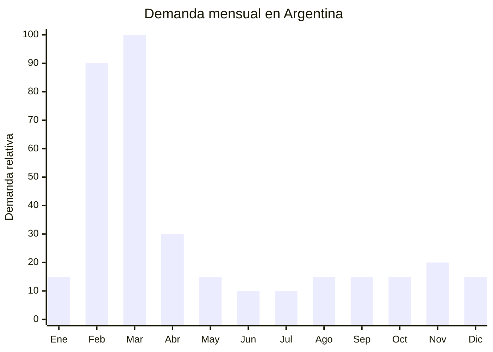

# Cuadernos escolares

> **Capítulo NCM 48** — Papel y cartón; manufacturas de pasta de celulosa | **Temporada:** Otoño (Mar–May)

## Qué es y por qué importarlo

Los cuadernos escolares incluyen cuadernos tapa dura A4 y oficio (rayados, cuadriculados, lisos), cuadernos espiralados, cuadernos de comunicaciones y blocs de notas. Son el producto de mayor volumen en la canasta escolar argentina, con millones de unidades vendidas cada temporada.

La vuelta a clases en Argentina genera un pico de demanda MASIVO en febrero-marzo. La canasta escolar (el conjunto de útiles necesarios para un alumno) ha tenido aumentos interanuales significativos, impulsando a las familias a buscar alternativas más económicas. Los cuadernos representan uno de los rubros de mayor gasto dentro de la canasta escolar.

China (Wenzhou, Zhejiang) es el mayor exportador mundial de cuadernos, con precios FOB desde USD 0.50 por unidad para cuadernos tapa dura de 96 hojas. Sin embargo, la producción local argentina (Rivadavia, Avon, Éxito, Laprida) es fuerte en este rubro y tiene ventajas logísticas y de marca. La importación es viable para cuadernos con valor agregado (diseño premium, marca propia) o para competir en el segmento económico con volúmenes grandes.

## Datos clave

| Dato | Valor |
|------|-------|
| **Posiciones NCM típicas** | 4820.10.00 (cuadernos, blocs de notas) |
| **Derecho de importación** | 16% (DIE) + 3% tasa estadística |
| **Rango FOB típico** | USD 0.50 — USD 1.00 por unidad (tapa dura 96 hojas) |
| **Precio de venta en Argentina** | ARS 2.000 — ARS 8.000 |
| **Margen bruto estimado** | 100% — 200% |
| **MOQ típico** | 1,000 — 5,000 unidades |
| **Demanda en MercadoLibre** | Muy alta (estacional) |
| **Competencia en MercadoLibre** | Muy alta |
| **Dificultad para importar** | Media (competir con producción local) |
| **Certificaciones necesarias** | Ninguna obligatoria |
| **Antidumping** | No |

<Note>
El principal desafío de importar cuadernos escolares no es regulatorio sino **comercial**: las marcas locales (Rivadavia, Éxito, Ledesma) dominan el mercado con distribución masiva en librerías y supermercados. Para competir, la estrategia debe ser: (1) diseño diferenciado que las marcas locales no ofrecen, (2) marca propia con identidad fuerte, o (3) precios significativamente más bajos para canal mayorista.
</Note>

## Variantes y subtipos más comunes

| Subtipo / Variante | FOB aprox. | Venta AR aprox. | Nota |
|--------------------|-----------|-----------------|------|
| Cuaderno tapa dura A4 rayado 96h | USD 0.50 — 0.80 | ARS 2.000 — 4.500 | Base escolar |
| Cuaderno tapa dura oficio 96h | USD 0.55 — 0.85 | ARS 2.500 — 5.000 | Formato popular AR |
| Cuaderno espiralado A4 120h | USD 0.60 — 1.00 | ARS 3.000 — 6.000 | Secundaria/universidad |
| Cuaderno tapa dura diseño premium | USD 0.80 — 1.50 | ARS 4.000 — 8.000 | **Diferenciación** |
| Cuaderno de comunicaciones | USD 0.30 — 0.50 | ARS 1.500 — 3.000 | Primaria obligatorio |
| Block de hojas sueltas A4 x100 | USD 0.30 — 0.60 | ARS 1.500 — 3.500 | Complemento carpeta |

## Regulaciones y requisitos

<Tabs>
  <Tab title="Certificaciones">
    | Organismo | Requiere | Detalle |
    |-----------|----------|---------|
    | ARCA (Aduana) | Sí siempre | Despacho estándar |
    | ANMAT | No | No aplica |
    | ENACOM | No | No aplica |
    | INTI/IRAM | Verificar | Norma IRAM 3102 para papel de escritura escolar puede aplicar para licitaciones públicas o venta a instituciones |

    **Recomendación:** Para venta minorista general no se requieren certificaciones especiales. Si se quiere participar en licitaciones de canasta escolar del gobierno, verificar cumplimiento de normas IRAM para papel escolar.
  </Tab>

  <Tab title="Etiquetado">
    | Requisito | Aplica |
    |-----------|--------|
    | Idioma español | Sí |
    | Datos del importador | Sí |
    | Cantidad de hojas | Sí |
    | Tipo de rayado | Sí (rayado, cuadriculado, liso) |
    | Tamaño (A4, oficio, A5) | Sí |
    | Gramaje del papel | Recomendado |
    | País de origen | Sí |
    | Garantía legal 6 meses | Sí |
  </Tab>

  <Tab title="Restricciones">
    Sin restricciones significativas. Los cuadernos en blanco tributan IVA 21% (a diferencia de libros impresos que tienen IVA 0% por Ley 25.446).
  </Tab>
</Tabs>

## Logística de importación

| Factor | Detalle |
|--------|---------|
| **Peso por unidad** | 250 — 500 g |
| **Volumen por unidad** | 800 — 1,500 cm³ aprox. |
| **Unidades por caja (master carton)** | 20 — 50 unidades |
| **Peso por caja** | 8 — 20 kg |
| **Cajas por contenedor 20'** | ~800 — 1,500 cajas |
| **Unidades por contenedor 20'** | ~25,000 — 50,000 unidades |
| **Fragilidad** | Baja (tapa dura protege) |
| **Requiere embalaje especial** | Sí — film shrink individual + desecante contra humedad |

<Tip>
El papel es MUY sensible a la humedad del contenedor marítimo. Exigir al proveedor: (1) film shrink individual por unidad, (2) bolsas de gel desecante en cada caja master (mínimo 50g por caja), (3) palletizado con film stretch. Un cuaderno con hojas onduladas por humedad es invendible. Esta es la causa #1 de pérdidas en importación de papelería.
</Tip>

## Estacionalidad y timing de compra

| Dato | Valor |
|------|-------|
| **Meses de mayor venta** | Febrero — Marzo (vuelta a clases) |
| **Pedido ideal (marítimo)** | Octubre — Noviembre (llega enero-febrero) |
| **Pedido ideal (aéreo)** | No recomendado (peso/valor desfavorable para aéreo) |
| **Anticipación mínima** | 4 meses |

<Warning>
Los cuadernos son pesados para su valor unitario. Un contenedor de 20' puede cargar 25,000-50,000 cuadernos pero pesar 10-20 toneladas. El envío aéreo es generalmente inviable por la relación peso/valor. Solo marítimo tiene sentido económico, lo que obliga a planificar con mínimo 4 meses de anticipación.
</Warning>

## Ventajas y riesgos

<CardGroup cols={2}>
  <Card title="Ventajas" icon="circle-check">
    - Demanda masiva y garantizada
    - Producto obligatorio en lista escolar
    - FOB muy bajo
    - Personalización completa (tapa, diseño, logo)
    - No requiere certificaciones
    - No hay antidumping
  </Card>
  <Card title="Riesgos y desventajas" icon="triangle-exclamation">
    - Competencia feroz con marcas locales (Rivadavia, Éxito)
    - Producto muy pesado para su valor
    - Sensible a humedad en tránsito marítimo
    - Temporada muy corta (4-6 semanas de pico)
    - Relación peso/valor desfavorable para aéreo
    - Margen menor que otros productos escolares
  </Card>
</CardGroup>

## Palabras clave para buscar en Alibaba

`hardcover notebook A4 wholesale` · `spiral notebook school wholesale` · `custom printed notebook` · `school exercise book` · `composition notebook wholesale` · `Wenzhou notebook factory` · `hardcover journal custom` · `ruled notebook school`

## Fuentes

- MercadoLibre Argentina — búsqueda "cuaderno escolar tapa dura"
- Alibaba.com — proveedores de school notebook wholesale
- Canasta escolar Argentina — referencia de precios
