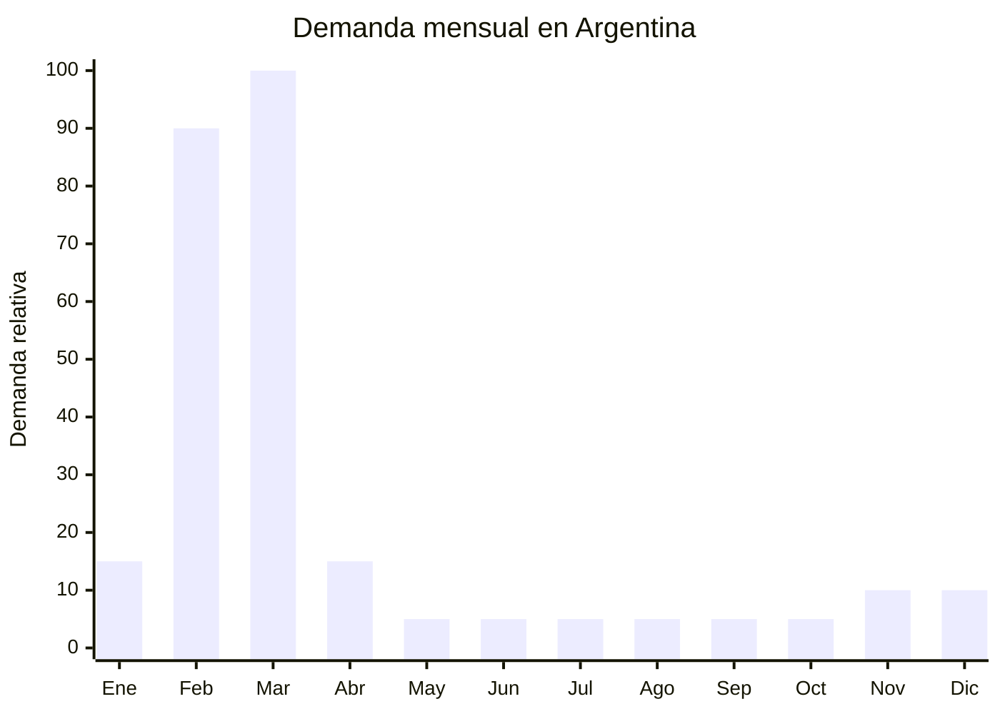

# Etiquetas escolares autoadhesivas

> **Capítulo NCM 48** — Papel, cartón y sus manufacturas | **Temporada:** Otoño (Mar–May)

## Qué es y por qué importarlo

Las etiquetas escolares autoadhesivas son stickers personalizados con el nombre del alumno que se pegan en cuadernos, carpetas, lápices, botellas y todos los útiles escolares. Se comercializan en kits de 50 a 188 unidades por set, con diseños temáticos (dinosaurios, unicornios, animales, superhéroes) y diferentes tamaños y formas (rectangulares, circulares, con forma). Son un producto obligatorio de facto — ningún padre envía a su hijo al colegio sin etiquetar sus útiles.

La temporada es ultra-corta pero explosiva: 4-6 semanas entre mediados de febrero y mediados de marzo. El pico de ventas coincide exactamente con la compra de útiles escolares. En MercadoLibre, los kits de etiquetas personalizadas se venden entre ARS 3,000 y ARS 8,000 con altísima rotación durante la temporada.

La oportunidad más interesante no es importar las etiquetas ya impresas, sino importar el MATERIAL base: vinilo adhesivo imprimible de China (FOB USD 0.01-0.05 por pliego) y producir las etiquetas localmente con impresora y plotter de corte. Esto permite ofrecer personalización real (nombre de cada alumno), que es exactamente lo que el mercado demanda, con márgenes superiores al 500%.

## Datos clave

| Dato | Valor |
|------|-------|
| **Posiciones NCM típicas** | 4821.10.00 (etiquetas impresas de papel/cartón), 3919.90.00 (planchas adhesivas de plástico, para vinilo adhesivo) |
| **Derecho de importación** | 14-18% (DIE) + 3% tasa estadística |
| **Rango FOB típico** | USD 0.01 — USD 0.05 por pliego (vinilo adhesivo imprimible) |
| **Precio de venta en Argentina** | ARS 3.000 — ARS 8.000 por kit personalizado |
| **Margen bruto estimado** | 300% — 700% (producción local con material importado) |
| **MOQ típico** | 500 — 2,000 pliegos (vinilo) |
| **Demanda en MercadoLibre** | Muy Alta (estacional, temporada pura) |
| **Competencia en MercadoLibre** | Alta |
| **Dificultad para importar** | Muy Fácil (material base sin regulación) |
| **Certificaciones necesarias** | Ninguna |
| **Antidumping** | No |

## Variantes y subtipos más comunes

| Subtipo / Variante | FOB aprox. | Venta AR aprox. | Nota |
|--------------------|-----------|-----------------|------|
| Kit 50 etiquetas nombre + diseño básico | Costo material: USD 0.10-0.30 | ARS 3.000 — 4.000 | Económico |
| Kit 100 etiquetas variadas (cuadernos+útiles) | Costo material: USD 0.20-0.50 | ARS 4.500 — 6.000 | **Más vendido** |
| Kit 188 etiquetas premium (todos los tamaños) | Costo material: USD 0.30-0.70 | ARS 6.000 — 8.000 | Pack completo |
| Etiquetas ropa termoadhesivas (x30-x50) | FOB USD 0.05-0.15/pliego transfer | ARS 3.000 — 5.000 | Complemento guardapolvo |
| Vinilo adhesivo blanco mate A4 x100 pliegos | FOB USD 3.00-5.00 (pack 100) | Material para ~50-100 kits | **Materia prima clave** |
| Vinilo adhesivo transparente A4 x100 pliegos | FOB USD 4.00-7.00 (pack 100) | Para etiquetas waterproof | Valor agregado |

## Regulaciones y requisitos

<Tabs>
  <Tab title="Certificaciones">
    | Organismo | Requiere | Detalle |
    |-----------|----------|---------|
    | ARCA (Aduana) | Sí siempre | Despacho estándar para vinilo adhesivo |
    | ANMAT | No | No aplica |
    | ENACOM | No | No aplica |
    | INTI | No | No aplica |

    **Recomendación:** Si importás vinilo adhesivo como materia prima, el despacho es aún más simple que importar producto terminado. Clasificá correctamente como "planchas autoadhesivas de plástico" (NCM 3919) y no como etiquetas impresas.
  </Tab>

  <Tab title="Etiquetado">
    | Requisito | Aplica |
    |-----------|--------|
    | País de origen del vinilo | Sí (en el embalaje del material) |
    | Datos del importador | Sí |
    | Composición | Recomendado (vinilo PVC, PP, etc.) |
  </Tab>

  <Tab title="Restricciones">
    - Sin restricciones significativas.
    - El vinilo adhesivo es material genérico sin barreras.
    - Si las etiquetas usan personajes con licencia, se requiere autorización (diseños genéricos no tienen este problema).
    - Sin antidumping vigente.
  </Tab>
</Tabs>

## Logística de importación

| Factor | Detalle |
|--------|---------|
| **Peso por pliego A4** | 5 — 15 g |
| **Peso pack 100 pliegos** | 0.5 — 1.5 kg |
| **Volumen** | Mínimo — pliegos planos apilables |
| **Unidades por caja (master carton)** | 500 — 2,000 pliegos |
| **Peso por caja** | 3 — 10 kg |
| **Fragilidad** | Muy baja |
| **Requiere embalaje especial** | No — protección contra humedad recomendada (film plástico) |

<Tip>
La estrategia ganadora es importar el vinilo adhesivo como materia prima y producir las etiquetas localmente. Con una impresora láser color (ARS 200,000-400,000) y un plotter de corte Silhouette/Cricut (ARS 150,000-300,000), podés producir 50-100 kits por día y ofrecer personalización real con el nombre del alumno. El vinilo importado cuesta centavos por pliego; el kit personalizado se vende a ARS 4,000-8,000.
</Tip>

## Estacionalidad y timing de compra

| Dato | Valor |
|------|-------|
| **Meses de mayor venta** | Febrero — Marzo (4-6 semanas) |
| **Pedido ideal (marítimo)** | Octubre — Noviembre (para tener material en enero) |
| **Pedido ideal (aéreo)** | Diciembre — Enero |
| **Anticipación mínima** | 2-3 meses (material llega rápido por ser liviano) |

## Ventajas y riesgos

<CardGroup cols={2}>
  <Card title="Ventajas" icon="circle-check">
    - Márgenes excepcionales (300-700% con producción local)
    - Producto personalizable = diferenciación real
    - Material base ultraliviano y barato de importar
    - Demanda masiva y obligatoria (todos etiquetan útiles)
    - Inversión en equipo se amortiza en una temporada
    - Material sobrante sirve para stickers y calcos todo el año
  </Card>

  <Card title="Riesgos y desventajas" icon="triangle-exclamation">
    - Temporada ultra-corta (4-6 semanas reales)
    - Requiere capacidad de producción (impresora + plotter)
    - Alta competencia en MercadoLibre durante la temporada
    - Pico de pedidos puede saturar capacidad productiva
    - Cada kit requiere personalización individual (tiempo de producción)
  </Card>
</CardGroup>

## Palabras clave para buscar en Alibaba

`vinyl sticker paper A4 printable` · `self adhesive vinyl sheet wholesale` · `matte white vinyl sticker paper laser` · `waterproof label paper A4` · `printable vinyl roll wholesale` · `clear adhesive film printable A4`

## Fuentes

- MercadoLibre Argentina — búsqueda "etiquetas escolares personalizadas"
- Alibaba.com — proveedores de printable vinyl sticker paper
- ARCA — Nomenclador Arancelario, posiciones 3919 y 4821
