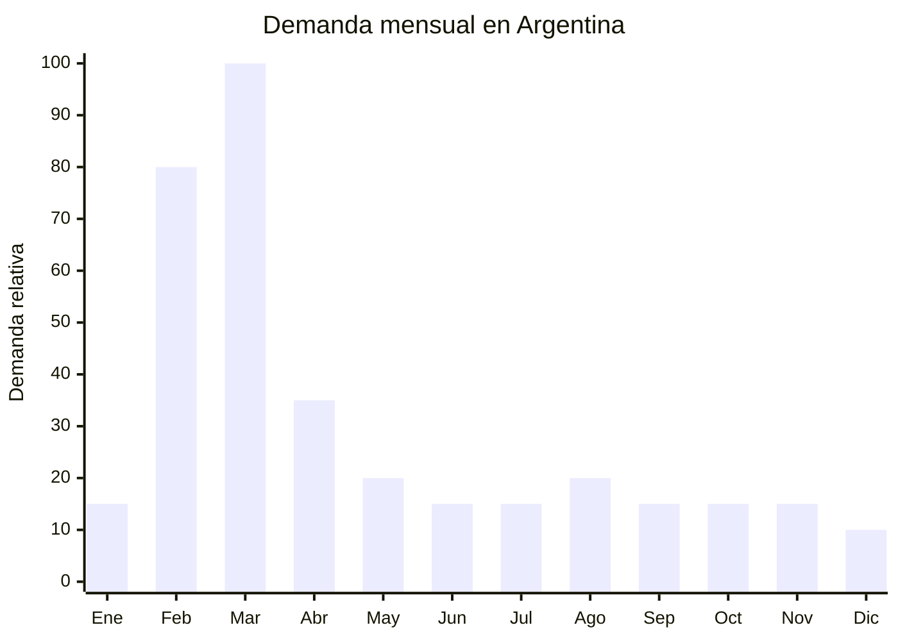

# Láminas escolares educativas

> **Capítulo NCM 49** — Productos editoriales y gráficos | **Temporada:** Otoño (Mar–May)

## Qué es y por qué importarlo

Las láminas escolares educativas son impresiones en papel ilustración o cartulina plastificada con contenido didáctico: mapas de Argentina y del mundo, sistema solar, tabla periódica, cuerpo humano, abecedario, números, banderas, líneas de tiempo históricas, y otros temas curriculares. Se usan como material de apoyo visual en aulas, carpetas y decoración de habitaciones infantiles. Los formatos más comunes son A3, 50x70 cm y 70x100 cm.

En Argentina, las láminas son un ítem clásico de la lista de útiles escolares, especialmente en primaria. Los docentes solicitan láminas específicas (mapa bicontinental de Argentina es obligatorio en muchas escuelas) y los padres las compran en librerías y por MercadoLibre entre febrero y marzo. El precio de venta oscila entre ARS 1,000 y ARS 4,000, dependiendo del tamaño y la calidad de impresión.

La producción local es competitiva en este rubro (imprentas argentinas producen láminas de buena calidad), pero China ofrece láminas con acabado plastificado (laminado mate o brillo) a FOB USD 0.05-0.30 por lámina, lo que permite competir en precio o importar diseños diferenciados (láminas interactivas, con texturas, bilingües). La oportunidad está en los diseños diferenciados más que en competir por precio con la producción local.

## Datos clave

| Dato | Valor |
|------|-------|
| **Posiciones NCM típicas** | 4911.91.00 (estampas, grabados y fotografías), 4901.99.00 (demás libros, folletos e impresos) |
| **Derecho de importación** | 0-16% (DIE) + 3% tasa estadística (productos editoriales tienen aranceles bajos o nulos) |
| **Rango FOB típico** | USD 0.05 — USD 0.30 por lámina |
| **Precio de venta en Argentina** | ARS 1.000 — ARS 4.000 |
| **Margen bruto estimado** | 150% — 350% |
| **MOQ típico** | 500 — 2,000 láminas |
| **Demanda en MercadoLibre** | Media-Alta (estacional) |
| **Competencia en MercadoLibre** | Alta (producción local fuerte) |
| **Dificultad para importar** | Fácil |
| **Certificaciones necesarias** | Ninguna |
| **Antidumping** | No |

## Variantes y subtipos más comunes

| Subtipo / Variante | FOB aprox. | Venta AR aprox. | Nota |
|--------------------|-----------|-----------------|------|
| Lámina papel ilustración 50x70 cm | USD 0.05 — 0.10 | ARS 1.000 — 2.000 | Básica, alto volumen |
| Lámina plastificada mate 50x70 cm | USD 0.10 — 0.20 | ARS 1.500 — 3.000 | **Más vendida** — durable |
| Lámina plastificada brillo 70x100 cm | USD 0.15 — 0.30 | ARS 2.000 — 4.000 | Premium, impacto visual |
| Set x5 láminas temáticas (pack escolar) | USD 0.40 — 1.00 | ARS 3.000 — 8.000 | Pack valor |
| Lámina interactiva (con stickers removibles) | USD 0.20 — 0.50 | ARS 2.500 — 5.000 | Diferenciador |
| Póster educativo bilingüe (español/inglés) | USD 0.10 — 0.25 | ARS 1.500 — 3.500 | Nicho colegios bilingües |

## Regulaciones y requisitos

<Tabs>
  <Tab title="Certificaciones">
    | Organismo | Requiere | Detalle |
    |-----------|----------|---------|
    | ARCA (Aduana) | Sí siempre | Despacho estándar. Productos editoriales pueden tener arancel 0% |
    | ANMAT | No | No aplica |
    | ENACOM | No | No aplica |
    | INTI | No | No aplica |

    **Recomendación:** Los productos editoriales e impresos educativos pueden beneficiarse de arancel 0% según la clasificación NCM exacta. Consultar con el despachante si aplica la exención para material educativo.
  </Tab>

  <Tab title="Etiquetado">
    | Requisito | Aplica |
    |-----------|--------|
    | País de origen | Sí |
    | Datos del importador | Sí |
    | Idioma español | Sí (contenido educativo debe estar en español) |
    | Exactitud del contenido | Crítico (mapas deben ser correctos y actualizados) |
  </Tab>

  <Tab title="Restricciones">
    - Los mapas de Argentina DEBEN incluir las Islas Malvinas, Antártida e Islas del Atlántico Sur como territorio argentino. Un mapa sin Malvinas puede ser rechazado o generar problemas legales y de imagen.
    - Verificar que la información científica esté actualizada y sea precisa.
    - La tabla periódica debe incluir los elementos más recientes.
    - Sin antidumping vigente.
  </Tab>
</Tabs>

## Logística de importación

| Factor | Detalle |
|--------|---------|
| **Peso por lámina** | 10 — 50 g |
| **Volumen** | Mínimo — producto plano enrollable o apilable |
| **Unidades por caja (master carton)** | 200 — 1,000 láminas |
| **Peso por caja** | 5 — 15 kg |
| **Cajas por contenedor 20'** | ~3,000 — 5,000 cajas |
| **Unidades por contenedor 20'** | ~500,000 — 2,000,000 láminas |
| **Fragilidad** | Baja (papel) / Media (plastificadas grandes se doblan) |
| **Requiere embalaje especial** | Tubo de cartón para láminas grandes enrolladas |

<Tip>
Las láminas plastificadas son más durables y tienen mayor valor percibido, pero requieren embalaje en tubo para evitar dobleces permanentes. Las láminas de papel común pueden enviarse planas en cajas. Para primeras pruebas, 500 láminas plastificadas pesan menos de 10 kg y pueden enviarse por courier.
</Tip>

## Estacionalidad y timing de compra

| Dato | Valor |
|------|-------|
| **Meses de mayor venta** | Febrero — Marzo (vuelta a clases) |
| **Pedido ideal (marítimo)** | Octubre — Noviembre |
| **Pedido ideal (aéreo)** | Enero |
| **Anticipación mínima** | 3 meses |

## Ventajas y riesgos

<CardGroup cols={2}>
  <Card title="Ventajas" icon="circle-check">
    - FOB extremadamente bajo (centavos por unidad)
    - Producto ultraliviano: flete mínimo
    - Arancel potencialmente 0% (material educativo)
    - Sin regulaciones ni certificaciones
    - Demanda garantizada por currícula escolar
    - Formato pack multiplica el ticket promedio
  </Card>

  <Card title="Riesgos y desventajas" icon="triangle-exclamation">
    - Producción local muy competitiva (imprentas argentinas)
    - Contenido debe adaptarse al currícula argentina
    - Mapas incorrectos pueden generar problemas legales
    - Ticket muy bajo por unidad individual
    - Temporada concentrada en 4-6 semanas
  </Card>
</CardGroup>

## Palabras clave para buscar en Alibaba

`educational poster print` · `laminated school poster wholesale` · `educational chart kids` · `world map poster classroom` · `solar system poster education` · `periodic table poster laminated`

## Fuentes

- MercadoLibre Argentina — búsqueda "láminas escolares educativas"
- Alibaba.com — proveedores de educational poster laminated
- ARCA — Nomenclador Arancelario, posiciones 4911 y 4901
