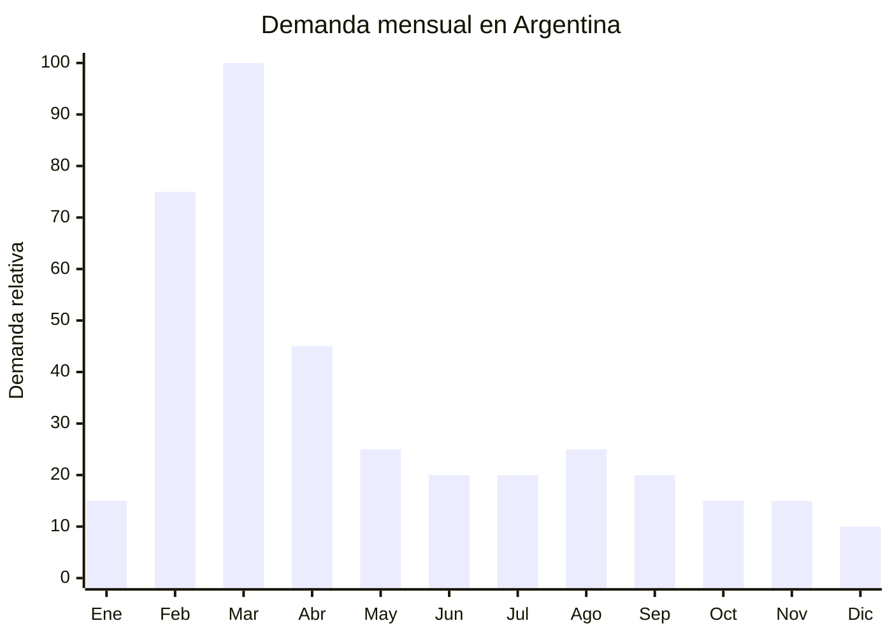

# Fieltro y goma EVA escolar

> **Capítulo NCM 56** — Guata, fieltro y no tejidos | **Temporada:** Otoño (Mar–May)

## Qué es y por qué importarlo

El fieltro de poliéster y la goma EVA (etilvinilacetato) son materiales de manualidades que figuran como ítems OBLIGATORIOS en las listas de útiles escolares de jardín de infantes y primaria en Argentina. El fieltro se presenta en planchas o rollos de colores variados, mientras que la goma EVA viene en planchas A4 o 40x60 cm en colores lisos, con glitter, estampadas o texturadas. Ambos materiales se usan para actividades de recorte, pegado y creación de figuras en el aula.

En Argentina, las marcas dominantes son Mooving y Cresko, que importan directamente desde China y distribuyen a librerías de todo el país. La vuelta a clases en marzo genera un pico de demanda concentrado pero masivo: millones de planchas de goma EVA y metros de fieltro se venden en 4-6 semanas. El precio de venta al público oscila entre ARS 100-600 por plancha de goma EVA y ARS 500-2,000 por metro de fieltro.

China es el productor mundial dominante de ambos materiales. El fieltro de poliéster se produce a FOB USD 0.10-0.50 por plancha (dependiendo del gramaje y tamaño), y la goma EVA a FOB aún menor. La clave para competir con Mooving y Cresko es encontrar nichos: goma EVA con glitter premium, fieltro de gramaje superior, colores especiales, o formatos pre-cortados con formas (estrellas, corazones, letras).

## Datos clave

| Dato | Valor |
|------|-------|
| **Posiciones NCM típicas** | 5602.10.00 (fieltro punzonado), 3921.19.00 (láminas de plástico celular — goma EVA) |
| **Derecho de importación** | 18% (DIE) + 3% tasa estadística |
| **Rango FOB típico** | USD 0.10 — USD 0.50 por plancha (fieltro); USD 0.05 — USD 0.30 por plancha (goma EVA) |
| **Precio de venta en Argentina** | ARS 100 — ARS 600/plancha (goma EVA); ARS 500 — ARS 2.000/metro (fieltro) |
| **Margen bruto estimado** | 150% — 350% |
| **MOQ típico** | 1,000 — 5,000 planchas |
| **Demanda en MercadoLibre** | Alta (estacional con base anual) |
| **Competencia en MercadoLibre** | Alta (Mooving, Cresko dominan) |
| **Dificultad para importar** | Fácil |
| **Certificaciones necesarias** | Ninguna |
| **Antidumping** | No |

## Variantes y subtipos más comunes

| Subtipo / Variante | FOB aprox. | Venta AR aprox. | Nota |
|--------------------|-----------|-----------------|------|
| Goma EVA lisa A4 colores surtidos | USD 0.05 — 0.10/plancha | ARS 100 — 300/plancha | **Básico — mayor volumen** |
| Goma EVA con glitter A4 | USD 0.08 — 0.15/plancha | ARS 200 — 500/plancha | Muy demandada |
| Goma EVA 40x60 cm lisa | USD 0.10 — 0.20/plancha | ARS 200 — 600/plancha | Formato grande |
| Goma EVA texturada/estampada | USD 0.10 — 0.25/plancha | ARS 250 — 600/plancha | Diferenciador |
| Fieltro poliéster 1mm 40x50 cm | USD 0.10 — 0.30/plancha | ARS 500 — 1.200 | Estándar escolar |
| Fieltro poliéster 2-3mm (gramaje alto) | USD 0.20 — 0.50/plancha | ARS 800 — 2.000 | Premium, manualidades |
| Set goma EVA x10 colores surtidos | USD 0.50 — 1.50 | ARS 1.000 — 3.000 | Pack escolar |

## Regulaciones y requisitos

<Tabs>
  <Tab title="Certificaciones">
    | Organismo | Requiere | Detalle |
    |-----------|----------|---------|
    | ARCA (Aduana) | Sí siempre | Despacho estándar |
    | ANMAT | No | No aplica |
    | ENACOM | No | No aplica |
    | INTI | No | No es prenda textil (es material de manualidades) |

    **Recomendación:** Producto sin barreras regulatorias. Es material escolar, no textil de vestir, por lo que no aplica IRAM 12560.
  </Tab>

  <Tab title="Etiquetado">
    | Requisito | Aplica |
    |-----------|--------|
    | País de origen | Sí |
    | Datos del importador | Sí |
    | Material / composición | Recomendado (100% poliéster, EVA, etc.) |
    | Dimensiones | Recomendado |
    | Idioma español | Sí |
  </Tab>

  <Tab title="Restricciones">
    - Sin restricciones significativas para fieltro y goma EVA como material de manualidades.
    - La goma EVA con glitter puede soltar partículas: verificar que el glitter esté bien adherido para evitar reclamos.
    - Verificar que los colores no destiñan con el contacto (especialmente el fieltro de baja calidad).
    - Sin antidumping vigente.
  </Tab>
</Tabs>

## Logística de importación

| Factor | Detalle |
|--------|---------|
| **Peso por plancha (goma EVA A4)** | 15 — 40 g |
| **Peso por plancha (fieltro 40x50)** | 30 — 80 g |
| **Volumen** | Bajo-Medio — planchas apilables |
| **Unidades por caja (master carton)** | 200 — 1,000 planchas |
| **Peso por caja** | 5 — 15 kg |
| **Cajas por contenedor 20'** | ~2,000 — 4,000 cajas |
| **Fragilidad** | Muy baja (material flexible) |
| **Requiere embalaje especial** | No — film retráctil o bolsa OPP |

<Tip>
La goma EVA y el fieltro son materiales flexibles e irrompibles que se apilan perfectamente. Un pedido de 2,000 planchas de goma EVA A4 pesa apenas 30-60 kg. Podés importar un surtido de 10-15 colores con MOQ bajo por color (100-200 planchas de cada) y ofrecer el pack completo que las librerías necesitan.
</Tip>

## Estacionalidad y timing de compra

| Dato | Valor |
|------|-------|
| **Meses de mayor venta** | Febrero — Abril (vuelta a clases + primer bimestre) |
| **Pedido ideal (marítimo)** | Octubre — Noviembre |
| **Pedido ideal (aéreo)** | Enero |
| **Anticipación mínima** | 3 meses |

## Ventajas y riesgos

<CardGroup cols={2}>
  <Card title="Ventajas" icon="circle-check">
    - Material OBLIGATORIO en listas de útiles (demanda cautiva)
    - FOB extremadamente bajo
    - Material irrompible, sin pérdidas en transporte
    - Sin regulaciones ni certificaciones
    - Demanda anual sostenida (no solo temporada)
    - Goma EVA con glitter tiene margen superior
  </Card>

  <Card title="Riesgos y desventajas" icon="triangle-exclamation">
    - Competencia directa con Mooving y Cresko (marcas dominantes)
    - Ticket muy bajo por unidad individual
    - Necesita alto volumen para ser rentable
    - Calidad variable entre proveedores chinos
    - Glitter que se despega = reclamos garantizados
  </Card>
</CardGroup>

## Palabras clave para buscar en Alibaba

`EVA foam sheet A4 color wholesale` · `glitter EVA foam sheet craft` · `polyester felt sheet craft wholesale` · `non woven felt fabric craft` · `EVA foam roll wholesale craft` · `felt fabric sheet 1mm color`

## Fuentes

- MercadoLibre Argentina — búsqueda "goma eva escolar", "fieltro manualidades"
- Alibaba.com — proveedores de EVA foam sheet y polyester felt
- ARCA — Nomenclador Arancelario, posiciones 5602 y 3921
