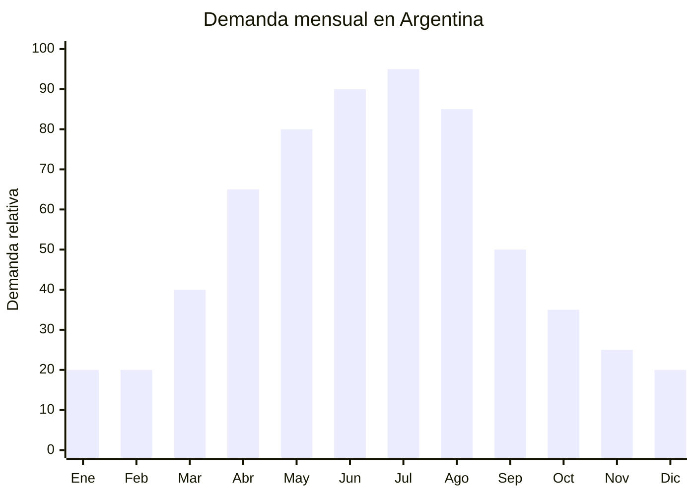

# Alfombras de pelo largo para confort invernal

> **Capítulo NCM 57** — Alfombras y demás revestimientos textiles para el suelo | **Temporada:** Otoño (Mar–May)

## Qué es y por qué importarlo

Las alfombras de pelo largo (shaggy) orientadas al confort invernal son revestimientos textiles gruesos diseñados específicamente para aislar del frío del piso durante otoño e invierno. A diferencia de las alfombras decorativas atemporales, estas priorizan la calidez y el confort térmico: pelo más largo (40-70mm), mayor densidad de fibra y materiales como microfibra, poliéster de alta densidad y faux fur que retienen el calor corporal.

El pico de demanda se concentra entre abril y agosto, cuando las temperaturas bajan y los consumidores buscan soluciones para pisos fríos en living, dormitorios y espacios de estar. En MercadoLibre Argentina hay más de 11,075 resultados para frazadas y mantas, lo que indica una demanda fuerte de productos de abrigo para el hogar que se extiende a alfombras de confort.

China (Yiwu, Nantong, Tianjin) produce estas alfombras a costos muy competitivos. El valor percibido es alto: una alfombra que cuesta USD 5-10 FOB se vende fácilmente por ARS 15,000-30,000 en temporada de frío.

## Datos clave

| Dato | Valor |
|------|-------|
| **Posiciones NCM típicas** | 5703.30.00 (alfombras de fibras sintéticas con mechón insertado) |
| **Derecho de importación** | 20% (DIE) + 3% tasa estadística |
| **Rango FOB típico** | USD 3.00 — USD 15.00 por unidad (según tamaño) |
| **Precio de venta en Argentina** | ARS 8.000 — ARS 30.000 |
| **Margen bruto estimado** | 150% — 300% |
| **MOQ típico** | 50 — 300 unidades |
| **Demanda en MercadoLibre** | Muy Alta (132,000+ resultados "alfombra", 11,075+ "frazadas/mantas") |
| **Competencia en MercadoLibre** | Alta |
| **Dificultad para importar** | Moderada (volumen y peso) |
| **Certificaciones necesarias** | Etiquetado textil (composición de fibra) |
| **Antidumping** | No hay antidumping general sobre alfombras textiles chinas — verificar NCM exacto |

## Variantes y subtipos más comunes

| Subtipo / Variante | FOB aprox. | Venta AR aprox. | Nota |
|--------------------|-----------|-----------------|------|
| Alfombra shaggy pie de cama 60x120cm | USD 3.00 — 6.00 | ARS 8.000 — 15.000 | Impulso, alta rotación |
| Alfombra pelo largo living 140x200cm | USD 8.00 — 15.00 | ARS 18.000 — 30.000 | **Más vendido en otoño** |
| Alfombra faux fur redonda 120cm | USD 5.00 — 10.00 | ARS 12.000 — 22.000 | Deco Instagram |
| Alfombra microfibra alta densidad 200x100cm | USD 6.00 — 12.00 | ARS 15.000 — 25.000 | Confort máximo |
| Alfombra pelo largo baño antideslizante 50x80cm | USD 2.00 — 4.00 | ARS 5.000 — 10.000 | Baño invernal |

## Regulaciones y requisitos

<Tabs>
  <Tab title="Certificaciones">
    Sin certificaciones especiales más allá del etiquetado textil. No requiere habilitación ANMAT ni INTI para alfombras de uso doméstico.
  </Tab>
  <Tab title="Etiquetado">
    **Obligatorio:** Composición de fibra con porcentajes (ej: "100% Poliéster", "80% Microfibra, 20% Algodón"), tamaño en cm, país de origen ("Hecho en China"), datos del importador (razón social, CUIT, domicilio).
  </Tab>
  <Tab title="Restricciones">
    No hay antidumping general sobre alfombras textiles chinas. Verificar siempre el NCM exacto en la [CNCE](https://www.argentina.gob.ar/cnce/investigaciones/medidasvigentes). Algunas alfombras con base de caucho pueden clasificar en otra posición arancelaria.
  </Tab>
</Tabs>

## Logística de importación

| Dato | Valor |
|------|-------|
| **Peso típico por unidad** | 1.00 — 6.00 kg (según tamaño) |
| **Volumen típico** | Alto (alfombras enrolladas son voluminosas) |
| **Fragilidad** | Baja |
| **Envío recomendado** | Marítimo LCL/FCL |
| **Tiempo total estimado** | 50 — 80 días (marítimo) |

<Tip>
Las alfombras de pelo largo son pesadas y voluminosas. Una alfombra 140x200cm pesa entre 3-6 kg enrollada. El flete marítimo se cobra por CBM (metro cúbico) o peso, lo que sea mayor. Conviene importar tamaños chicos (pie de cama) si es tu primera importación, ya que tienen mejor relación precio/peso/volumen.
</Tip>

## Estacionalidad y timing de compra



| Aspecto | Detalle |
|---------|---------|
| **Meses pico de venta** | Abril — Agosto (otoño-invierno, pisos fríos) |
| **Meses valle** | Noviembre — Febrero (verano, nadie quiere alfombra gruesa) |
| **Cuándo pedir a China** | Diciembre — Enero para tener stock en marzo-abril |
| **Tiempo de anticipación** | 60-90 días (producción + envío marítimo) |

## Ventajas y riesgos

<CardGroup cols={2}>
  <Card title="Ventajas" icon="circle-check">
    - Alto valor percibido vs FOB (margen 150-300%)
    - Sin antidumping (ventaja vs prendas de vestir)
    - Demanda estacional predecible
    - Producto aspiracional (deco nórdica)
    - Fácil de personalizar con marca propia
  </Card>
  <Card title="Riesgos" icon="triangle-exclamation">
    - Pesado y voluminoso (flete alto por CBM)
    - Estacional: stock sobrante queda hasta próximo año
    - Color y textura pueden diferir de muestra
    - Competencia alta en MercadoLibre
    - Difícil de devolver por costos logísticos
  </Card>
</CardGroup>

## Palabras clave para buscar en Alibaba

```
shaggy rug winter, long pile carpet warm, faux fur rug thick,
fluffy area rug bedroom, microfiber shaggy carpet, soft plush rug,
polyester shaggy carpet wholesale, anti-slip shaggy rug
```

## Fuentes

- [MercadoLibre Argentina — Alfombras pelo largo](https://listado.mercadolibre.com.ar/alfombra-pelo-largo)
- [Alibaba — Shaggy rug wholesale](https://www.alibaba.com/showroom/shaggy-rug-wholesale.html)
- [CNCE — Medidas antidumping vigentes](https://www.argentina.gob.ar/cnce/investigaciones/medidasvigentes)
