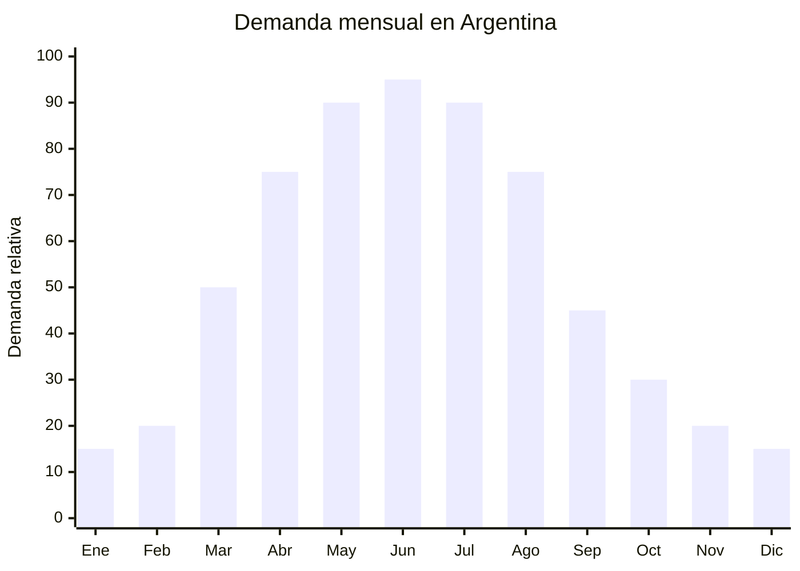

# Buzos canguro y hoodies de otoño

> **Capítulo NCM 61** — Prendas y complementos de vestir, de punto | **Temporada:** Otoño (Mar–May)

<Warning>
**ANTIDUMPING VIGENTE:** Argentina mantiene derechos antidumping sobre prendas de punto originarias de China. El Decreto 236/2025 redujo el arancel general del 35% al 20%, pero el antidumping es **ADICIONAL** al arancel. Verificar siempre el NCM exacto en la [CNCE](https://www.argentina.gob.ar/cnce/investigaciones/medidasvigentes). A pesar de esto, 7 de cada 10 prendas importadas ya provienen de China (dato Infobae, diciembre 2025).
</Warning>

## Qué es y por qué importarlo

El buzo canguro con capucha (hoodie) es LA prenda de transición por excelencia del otoño argentino. Cuando las temperaturas bajan de 25°C a 15°C entre marzo y mayo, el hoodie se convierte en la primera prenda de abrigo que la gente busca. Formato clásico: capucha con cordón ajustable, bolsillo canguro frontal, puños y cintura con elástico.

Según datos de Nubimetrics, "campera negra" y "saco mujer" están entre las búsquedas más populares en MercadoLibre al inicio del otoño, arrastrando categorías completas de abrigo liviano. El buzo canguro captura esa demanda con un ticket accesible y alta versatilidad: sirve para uso casual, deportivo y streetwear.

China (especialmente Yiwu) ofrece precios FOB desde USD 3.50 por unidad en hoodies de 280gsm algodón/poliéster. La clave está en calcular correctamente el costo total landed incluyendo el posible antidumping, que puede sumar entre USD 2-6 adicionales por prenda según el NCM exacto.

## Datos clave

| Dato | Valor |
|------|-------|
| **Posiciones NCM típicas** | 6110.20.00 (prendas de punto de algodón), 6110.30.00 (de fibras sintéticas) |
| **Derecho de importación** | 20% (DIE) + 3% tasa estadística + **antidumping adicional** |
| **Rango FOB típico** | USD 3.50 — USD 6.50 por unidad (hoodie 280gsm) |
| **Precio de venta en Argentina** | ARS 27.930 — ARS 100.000+ |
| **Margen bruto estimado** | 80% — 180% (variable según impacto antidumping) |
| **MOQ típico** | 300 — 500 unidades por diseño/talle |
| **Demanda en MercadoLibre** | Muy Alta (25,000+ resultados "buzo hoodie") |
| **Competencia en MercadoLibre** | Alta |
| **Dificultad para importar** | Difícil (antidumping + etiquetado IRAM) |
| **Certificaciones necesarias** | Etiquetado textil IRAM 12560 obligatorio |
| **Antidumping** | **SÍ — Verificar NCM exacto en CNCE** |

## Variantes y subtipos más comunes

| Subtipo / Variante | FOB aprox. | Venta AR aprox. | Nota |
|--------------------|-----------|-----------------|------|
| Buzo canguro capucha algodón frisa 280gsm | USD 3.50 — 6.00 | ARS 27.930 — 50.000 | **Más vendido otoño** |
| Hoodie oversize unisex 320gsm | USD 4.50 — 7.00 | ARS 35.000 — 70.000 | Tendencia streetwear |
| Buzo canguro poliéster deportivo | USD 3.00 — 5.00 | ARS 25.000 — 45.000 | Menor riesgo antidumping (verificar) |
| Hoodie con cierre completo | USD 4.00 — 6.50 | ARS 30.000 — 55.000 | Versátil |
| Conjunto hoodie + jogger | USD 6.00 — 12.00 | ARS 50.000 — 100.000 | Set completo, mayor ticket |

## Regulaciones y requisitos

<Tabs>
  <Tab title="Certificaciones">
    **IRAM 12560** — Etiquetado textil obligatorio para todas las prendas importadas. Se verifica en aduana. Sin la etiqueta correcta, la mercadería queda retenida.

    **Antidumping** — Verificar derechos antidumping vigentes en la [CNCE](https://www.argentina.gob.ar/cnce/investigaciones/medidasvigentes) para el NCM exacto antes de comprar. Los derechos antidumping se aplican como un porcentaje adicional sobre el valor FOB o como un monto fijo por unidad.
  </Tab>
  <Tab title="Etiquetado">
    **Obligatorio según IRAM 12560:**
    - Composición con porcentajes (ej: "80% Algodón, 20% Poliéster")
    - Talle (sistema argentino: S, M, L, XL o numérico)
    - Instrucciones de lavado (símbolos ISO)
    - País de origen ("Hecho en China" / "Made in China")
    - Datos del importador (razón social, CUIT, domicilio en Argentina)

    La etiqueta debe estar cosida, no pegada. Debe ser legible y permanente.
  </Tab>
  <Tab title="Restricciones">
    **Antidumping vigente** — Los derechos antidumping sobre prendas de punto de China son adicionales al arancel del 20%. El algodón peinado frisa premium tiene diferente tratamiento que la frisa sintética básica. Consultar despachante de aduana con el NCM exacto.

    **7 de cada 10 prendas importadas vienen de China** — A pesar del antidumping, el volumen sigue siendo masivo, lo que indica que el negocio sigue siendo viable con planificación correcta de costos.
  </Tab>
</Tabs>

## Logística de importación

| Dato | Valor |
|------|-------|
| **Peso típico por unidad** | 0.35 — 0.70 kg |
| **Volumen típico** | Bajo-Medio (prendas comprimidas ocupan poco) |
| **Fragilidad** | Baja |
| **Envío recomendado** | Marítimo LCL (lotes medianos) / FCL (lotes grandes 2,000+ pcs) |
| **Tiempo total estimado** | 50 — 80 días (marítimo desde Yiwu/Shanghai) |

<Tip>
Yiwu ofrece precios FOB más bajos que otras ciudades chinas para hoodies básicos. Para lotes de 500+ unidades, pedir cotización directa a fábricas en Yiwu y comparar con trading companies. Considerar envío consolidado LCL si el lote no llena un contenedor completo.
</Tip>

## Estacionalidad y timing de compra



| Aspecto | Detalle |
|---------|---------|
| **Meses pico de venta** | Abril — Julio (otoño-invierno pleno) |
| **Meses valle** | Noviembre — Febrero (verano) |
| **Cuándo pedir a China** | Diciembre — Enero para tener stock listo en marzo |
| **Tiempo de anticipación** | 70-90 días (producción MOQ 500 + envío marítimo) |

## Ventajas y riesgos

<CardGroup cols={2}>
  <Card title="Ventajas" icon="circle-check">
    - Prenda estrella de transición otoño
    - Alto ticket promedio (ARS 30,000-100,000)
    - Personalizable con marca propia (etiqueta + estampa)
    - Hoodie oversize es tendencia fuerte y sostenida
    - Demanda masiva y predecible
  </Card>
  <Card title="Riesgos" icon="triangle-exclamation">
    - **Antidumping puede reducir o anular el margen**
    - Etiquetado IRAM 12560 estricto (retención en aduana si falta)
    - Problemas de talles entre sistema chino y argentino
    - Competencia alta con industria textil local
    - Stock sobrante queda hasta próximo otoño
  </Card>
</CardGroup>

## Palabras clave para buscar en Alibaba

```
hoodie wholesale 280gsm, pullover hoodie blank cotton fleece,
oversized hoodie unisex bulk, kangaroo pocket hoodie,
french terry hoodie wholesale, custom hoodie printing Yiwu,
blank hoodie bulk polyester cotton, zip up hoodie wholesale
```

## Fuentes

- [MercadoLibre Argentina — Buzos hoodies](https://listado.mercadolibre.com.ar/buzo-hoodie)
- [CNCE — Medidas antidumping vigentes](https://www.argentina.gob.ar/cnce/investigaciones/medidasvigentes)
- [Nubimetrics — Tendencias MercadoLibre](https://www.nubimetrics.com)
- [Infobae — Importación textil China Argentina 2025](https://www.infobae.com)
