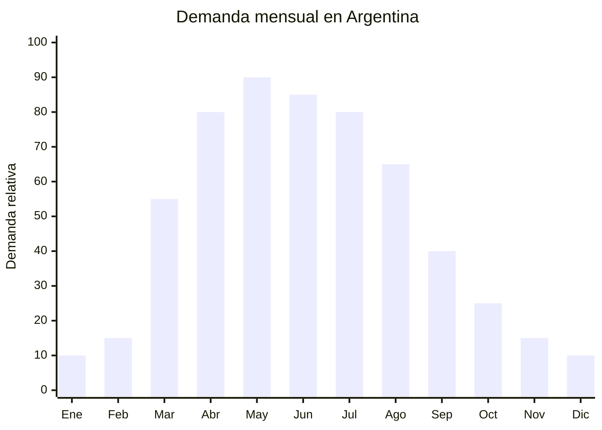

# Camperas polar y micropolar

> **Capítulo NCM 61** — Prendas y complementos de vestir, de punto | **Temporada:** Otoño (Mar–May)

<Warning>
**ANTIDUMPING VIGENTE:** Argentina mantiene derechos antidumping sobre prendas de punto originarias de China. El Decreto 236/2025 redujo el arancel general del 35% al 20%, pero el antidumping es **ADICIONAL**. Verificar NCM exacto en la [CNCE](https://www.argentina.gob.ar/cnce/investigaciones/medidasvigentes).
</Warning>

## Qué es y por qué importarlo

La campera polar (fleece jacket) es la primera capa de abrigo que se usa en la transición verano-otoño. Cuando las mañanas bajan a 12-18°C pero las tardes todavía están templadas, el polar es la prenda ideal: liviana, abrigada, fácil de quitar y poner. El material es 100% poliéster polar de 280-320gsm con cierre frontal completo.

A diferencia de hoodies y camperas pesadas, la campera polar cubre el hueco entre la remera y la campera de invierno. Es extremadamente popular en uniformes empresariales, colegios y uso outdoor/trekking. El margen es atractivo porque el FOB es bajo (USD 3-8) y el valor percibido como "abrigo técnico" permite precios de venta superiores al costo real.

China produce camperas polar a escala masiva con calidades que van desde el polar básico 200gsm hasta micropolar premium 320gsm con tratamiento anti-pilling. El poliéster polar se fabrica a partir de botellas PET recicladas, lo cual es un argumento de venta cada vez más relevante.

## Datos clave

| Dato | Valor |
|------|-------|
| **Posiciones NCM típicas** | 6101.30.00 (camperas de punto de fibras sintéticas hombre), 6102.30.00 (mujer) |
| **Derecho de importación** | 20% (DIE) + 3% tasa estadística + **posible antidumping** |
| **Rango FOB típico** | USD 3.00 — USD 8.00 por unidad |
| **Precio de venta en Argentina** | ARS 15.000 — ARS 45.000 |
| **Margen bruto estimado** | 100% — 200% (variable según antidumping) |
| **MOQ típico** | 300 — 500 unidades por color/talle |
| **Demanda en MercadoLibre** | Alta (búsquedas crecen 200%+ en marzo-abril) |
| **Competencia en MercadoLibre** | Media-Alta |
| **Dificultad para importar** | Moderada-Difícil (antidumping + etiquetado) |
| **Certificaciones necesarias** | Etiquetado textil IRAM 12560 obligatorio |
| **Antidumping** | **Verificar NCM 6101/6102 en CNCE** |

## Variantes y subtipos más comunes

| Subtipo / Variante | FOB aprox. | Venta AR aprox. | Nota |
|--------------------|-----------|-----------------|------|
| Campera polar básica cierre completo 280gsm | USD 3.00 — 5.00 | ARS 15.000 — 25.000 | **Más vendida** |
| Campera micropolar premium 320gsm anti-pilling | USD 5.00 — 8.00 | ARS 25.000 — 45.000 | Calidad superior |
| Campera polar medio cierre (1/4 zip) | USD 3.00 — 5.00 | ARS 12.000 — 22.000 | Estilo casual/outdoor |
| Chaleco polar sin mangas | USD 2.50 — 4.50 | ARS 10.000 — 20.000 | Complemento versátil |
| Campera polar niños | USD 2.50 — 5.00 | ARS 10.000 — 22.000 | Colegios/uniformes |

## Regulaciones y requisitos

<Tabs>
  <Tab title="Certificaciones">
    **IRAM 12560** — Etiquetado textil obligatorio. Toda prenda importada debe cumplir con la norma antes de ingresar al mercado.

    **Antidumping** — Verificar derechos antidumping vigentes para NCM 6101.30.00 y 6102.30.00 en la [CNCE](https://www.argentina.gob.ar/cnce/investigaciones/medidasvigentes).
  </Tab>
  <Tab title="Etiquetado">
    **Obligatorio según IRAM 12560:**
    - Composición: "100% Poliéster" (o la composición real)
    - Talle (S, M, L, XL o numérico)
    - Instrucciones de lavado con símbolos ISO
    - País de origen ("Hecho en China")
    - Datos del importador (razón social, CUIT, domicilio)

    Etiqueta cosida, legible y permanente.
  </Tab>
  <Tab title="Restricciones">
    Antidumping vigente sobre prendas de punto de China. La campera polar de poliéster clasifica en NCM 6101/6102 (fibras sintéticas). Verificar si el NCM específico tiene derechos antidumping activos.

    Para uniformes empresariales o escolares con logo bordado, el tratamiento aduanero puede diferir. Consultar con despachante de aduana.
  </Tab>
</Tabs>

## Logística de importación

| Dato | Valor |
|------|-------|
| **Peso típico por unidad** | 0.25 — 0.50 kg |
| **Volumen típico** | Bajo (polar se comprime bien) |
| **Fragilidad** | Baja |
| **Envío recomendado** | Marítimo LCL |
| **Tiempo total estimado** | 50 — 80 días (marítimo) |

<Tip>
La campera polar es una de las prendas más eficientes para importar en relación peso/precio. Una caja de 50 camperas pesa aproximadamente 15-20 kg. Considerar envío aéreo para lotes urgentes de 200-500 unidades si la temporada ya arrancó.
</Tip>

## Estacionalidad y timing de compra



| Aspecto | Detalle |
|---------|---------|
| **Meses pico de venta** | Marzo — Junio (transición y otoño pleno) |
| **Meses valle** | Noviembre — Febrero (verano) |
| **Cuándo pedir a China** | Noviembre — Diciembre para stock en marzo |
| **Tiempo de anticipación** | 60-80 días (producción + envío marítimo) |

## Ventajas y riesgos

<CardGroup cols={2}>
  <Card title="Ventajas" icon="circle-check">
    - FOB muy competitivo (USD 3-8)
    - Liviana y fácil de transportar
    - Demanda amplia: casual, trabajo, outdoor, colegios
    - Argumento eco (poliéster reciclado PET)
    - Personalizable con bordado de marca
  </Card>
  <Card title="Riesgos" icon="triangle-exclamation">
    - **Antidumping puede afectar el margen**
    - Pilling en calidades bajas (200gsm)
    - Competencia con marcas locales establecidas
    - Producto estacional con demanda concentrada
    - Etiquetado IRAM 12560 obligatorio
  </Card>
</CardGroup>

## Palabras clave para buscar en Alibaba

```
fleece jacket wholesale, polar fleece jacket zip, micropolar jacket,
anti-pilling fleece jacket, 1/4 zip fleece pullover, fleece vest wholesale,
polyester fleece jacket 280gsm, outdoor fleece jacket bulk
```

## Fuentes

- [MercadoLibre Argentina — Campera polar](https://listado.mercadolibre.com.ar/campera-polar)
- [CNCE — Medidas antidumping vigentes](https://www.argentina.gob.ar/cnce/investigaciones/medidasvigentes)
- [Alibaba — Fleece jacket wholesale](https://www.alibaba.com/showroom/fleece-jacket-wholesale.html)
