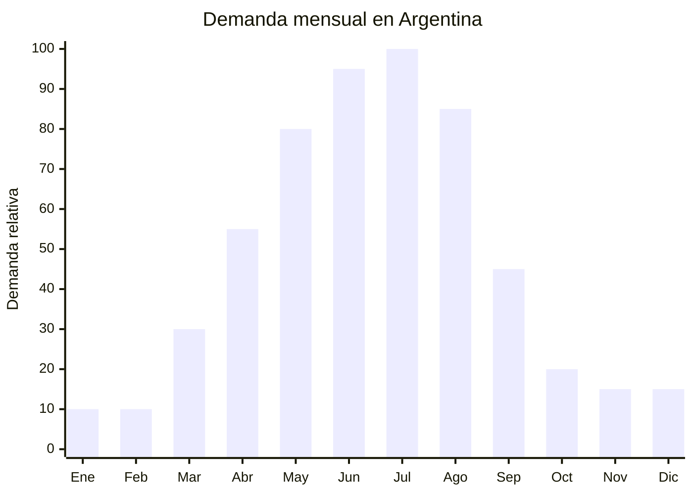

# Medias y calcetines térmicos

> **Capítulo NCM 61** — Prendas y complementos de vestir, de punto | **Temporada:** Otoño (Mar–May)

<Warning>
**ANTIDUMPING VIGENTE:** Argentina mantiene derechos antidumping sobre prendas de punto originarias de China. Verificar NCM exacto para medias en la [CNCE](https://www.argentina.gob.ar/cnce/investigaciones/medidasvigentes). Las medias y calcetines tienen menor riesgo de antidumping que las prendas principales, pero siempre verificar.
</Warning>

## Qué es y por qué importarlo

Las medias y calcetines térmicos son medias de mayor grosor y densidad diseñadas para retener el calor durante otoño e invierno. A diferencia de las medias comunes (producto atemporal), las térmicas incorporan mezclas de lana, acrílico grueso o poliéster con interior afelpado (terry loop / brushed). Se venden típicamente en packs de 3 a 6 pares.

Zhuji (Zhejiang, China) es la capital mundial del calcetín: produce más del 30% de todos los calcetines del mundo. Esto significa acceso a fábricas especializadas, precios extremadamente competitivos (desde USD 0.30/par) y MOQ accesibles (desde 100 pares). El FOB bajo y el peso mínimo hacen de las medias térmicas uno de los productos más eficientes para importar.

La demanda en Argentina se concentra entre abril y agosto, con pico en junio-julio. Los packs de medias térmicas de lana o "tipo montaña" tienen alta rotación en MercadoLibre y en ferias/locales de Once y Flores.

## Datos clave

| Dato | Valor |
|------|-------|
| **Posiciones NCM típicas** | 6115.95.00 (medias de algodón), 6115.96.00 (de fibras sintéticas), 6115.10.00 (medias de compresión) |
| **Derecho de importación** | 20% (DIE) + 3% tasa estadística + **verificar antidumping** |
| **Rango FOB típico** | USD 0.30 — USD 1.50 por par |
| **Precio de venta en Argentina** | ARS 2.000 — ARS 8.000 por pack de 3 pares |
| **Margen bruto estimado** | 150% — 400% |
| **MOQ típico** | 100 — 500 pares (Zhuji acepta MOQ bajos) |
| **Demanda en MercadoLibre** | Alta (63,600+ resultados "medias") |
| **Competencia en MercadoLibre** | Media-Alta |
| **Dificultad para importar** | Fácil-Moderada |
| **Certificaciones necesarias** | Etiquetado textil IRAM 12560 |
| **Antidumping** | **Verificar NCM 6115 — menor riesgo que prendas** |

## Variantes y subtipos más comunes

| Subtipo / Variante | FOB aprox. | Venta AR aprox. | Nota |
|--------------------|-----------|-----------------|------|
| Pack x3 medias térmicas algodón/acrílico | USD 0.90 — 2.50 | ARS 2.000 — 5.000 | **Más vendido** |
| Pack x3 medias térmicas lana merino blend | USD 1.50 — 4.50 | ARS 4.000 — 8.000 | Premium, mayor margen |
| Medias térmicas tipo montaña/trekking | USD 0.80 — 1.50/par | ARS 1.500 — 3.500/par | Outdoor/aventura |
| Medias térmicas largas hasta rodilla | USD 0.50 — 1.20/par | ARS 1.200 — 3.000/par | Frío extremo |
| Medias térmicas niños pack x6 | USD 1.00 — 2.50 | ARS 2.000 — 5.000 | Escolar/invierno |

## Regulaciones y requisitos

<Tabs>
  <Tab title="Certificaciones">
    **IRAM 12560** — Etiquetado textil obligatorio. Para medias, la composición de fibra es el dato principal.

    **Antidumping** — Verificar NCM 6115 en [CNCE](https://www.argentina.gob.ar/cnce/investigaciones/medidasvigentes). Las medias históricamente tienen menor riesgo de derechos antidumping que las prendas de vestir principales (hoodies, camperas), pero siempre confirmar.
  </Tab>
  <Tab title="Etiquetado">
    **Obligatorio:**
    - Composición de fibra con porcentajes (ej: "70% Algodón, 25% Poliéster, 5% Elastano")
    - Talle (si aplica) o indicación "Talle único"
    - País de origen
    - Datos del importador
  </Tab>
  <Tab title="Restricciones">
    Menor riesgo regulatorio que prendas de vestir. Verificar antidumping por NCM específico. Las medias con contenido de lana pueden tener clasificación diferente a las sintéticas puras.
  </Tab>
</Tabs>

## Logística de importación

| Dato | Valor |
|------|-------|
| **Peso típico por pack x3** | 0.10 — 0.25 kg |
| **Volumen típico** | Muy bajo |
| **Fragilidad** | Nula |
| **Envío recomendado** | Marítimo LCL (volumen) / Aéreo (lotes chicos, excelente relación peso/valor) |
| **Tiempo total estimado** | 50 — 80 días (marítimo) / 15 — 25 días (aéreo) |

<Tip>
Las medias tienen la mejor relación peso/precio de todas las prendas textiles. Un cartón de 200 packs x3 pares pesa aproximadamente 25-40 kg. Para lotes de prueba o reposición urgente, el envío aéreo desde Zhuji es perfectamente viable y el costo de flete por unidad es mínimo. Ideal para primera importación.
</Tip>

## Estacionalidad y timing de compra



| Aspecto | Detalle |
|---------|---------|
| **Meses pico de venta** | Mayo — Agosto (frío intenso) |
| **Meses valle** | Octubre — Febrero (verano, nadie busca medias térmicas) |
| **Cuándo pedir a China** | Diciembre — Enero para stock en abril |
| **Tiempo de anticipación** | 45-70 días (producción rápida en Zhuji + envío) |

## Ventajas y riesgos

<CardGroup cols={2}>
  <Card title="Ventajas" icon="circle-check">
    - FOB extremadamente bajo (desde USD 0.30/par)
    - Ultraliviano: mejor relación precio/peso del textil
    - MOQ bajo en Zhuji (desde 100 pares)
    - Ideal para primera importación textil
    - Menor riesgo antidumping que prendas principales
  </Card>
  <Card title="Riesgos" icon="triangle-exclamation">
    - Ticket bajo por unidad
    - Estacionalidad marcada (solo otoño-invierno)
    - Competencia alta en ferias/Once/Flores
    - Calidad variable: elasticidad y durabilidad
    - Margen individual bajo (se compensa con volumen)
  </Card>
</CardGroup>

## Palabras clave para buscar en Alibaba

```
thermal socks wholesale Zhuji, wool blend socks winter, thick warm socks bulk,
terry loop socks wholesale, brushed thermal socks, hiking socks wool,
winter socks pack wholesale, thermal crew socks men
```

## Fuentes

- [MercadoLibre Argentina — Medias térmicas](https://listado.mercadolibre.com.ar/medias-termicas)
- [CNCE — Medidas antidumping vigentes](https://www.argentina.gob.ar/cnce/investigaciones/medidasvigentes)
- [Alibaba — Thermal socks wholesale](https://www.alibaba.com/showroom/thermal-socks-wholesale.html)
