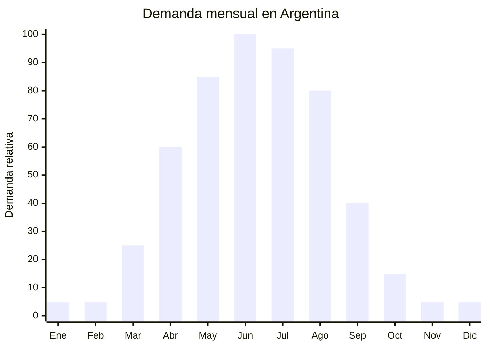

# Ropa interior térmica (primera capa)

> **Capítulo NCM 61** — Prendas y complementos de vestir, de punto | **Temporada:** Otoño (Mar–May)

<Warning>
**ANTIDUMPING VIGENTE:** Argentina mantiene derechos antidumping sobre prendas de punto originarias de China. El Decreto 236/2025 redujo el arancel general del 35% al 20%, pero el antidumping es **ADICIONAL**. Verificar NCM exacto en la [CNCE](https://www.argentina.gob.ar/cnce/investigaciones/medidasvigentes).
</Warning>

## Qué es y por qué importarlo

La ropa interior térmica de primera capa incluye remeras térmicas (manga larga y corta) y calzas térmicas que se usan directamente sobre la piel como base de abrigo. A diferencia de la ropa interior convencional, estas prendas tienen interior afelpado (brushed) que retiene el calor corporal. El material típico es poliéster + spandex (elastano) con interior cepillado.

Es un producto funcional, no de moda. La demanda es fuerte en zonas frías de Argentina: Patagonia, Cuyo, Córdoba serrana, y en general toda la región centro-sur durante otoño-invierno (abril-agosto). Mayoristas como Río Mejor ya distribuyen este tipo de producto con éxito, lo que valida el mercado.

El atractivo para el importador es el FOB bajo (USD 2-5 por set remera+calza), la alta demanda estacional y el hecho de que se vende por packs o sets, aumentando el ticket promedio. Al ser funcional y no estar atado a la moda, no hay riesgo de que el diseño quede desactualizado.

## Datos clave

| Dato | Valor |
|------|-------|
| **Posiciones NCM típicas** | 6108.22.00 (camisones/pijamas de punto fibras sintéticas mujer), 6107.12.00 (ropa interior hombre fibras sintéticas), 6110.30.00 (prendas exteriores de punto sintéticas) |
| **Derecho de importación** | 20% (DIE) + 3% tasa estadística + **posible antidumping** |
| **Rango FOB típico** | USD 2.00 — USD 5.00 por set (remera + calza) |
| **Precio de venta en Argentina** | ARS 5.000 — ARS 20.000 por set |
| **Margen bruto estimado** | 100% — 250% |
| **MOQ típico** | 300 — 1,000 sets |
| **Demanda en MercadoLibre** | Alta (creciente en zonas frías) |
| **Competencia en MercadoLibre** | Media |
| **Dificultad para importar** | Moderada-Difícil (antidumping + etiquetado) |
| **Certificaciones necesarias** | Etiquetado textil IRAM 12560 obligatorio |
| **Antidumping** | **Verificar NCM exacto en CNCE** |

## Variantes y subtipos más comunes

| Subtipo / Variante | FOB aprox. | Venta AR aprox. | Nota |
|--------------------|-----------|-----------------|------|
| Set remera térmica + calza básica brushed | USD 2.00 — 3.50 | ARS 5.000 — 12.000 | **Más vendido** |
| Remera térmica manga larga hombre | USD 1.50 — 3.00 | ARS 3.000 — 8.000 | Individual |
| Calza térmica interior afelpado mujer | USD 1.50 — 3.00 | ARS 3.500 — 10.000 | Alta demanda femenina |
| Set térmico premium doble capa | USD 3.50 — 5.00 | ARS 10.000 — 20.000 | Outdoor/trekking |
| Camiseta térmica cuello alto hombre | USD 2.00 — 4.00 | ARS 5.000 — 12.000 | Frío extremo Patagonia |

## Regulaciones y requisitos

<Tabs>
  <Tab title="Certificaciones">
    **IRAM 12560** — Etiquetado textil obligatorio para todas las prendas importadas, incluyendo ropa interior térmica.

    **Antidumping** — Verificar derechos antidumping en la [CNCE](https://www.argentina.gob.ar/cnce/investigaciones/medidasvigentes). La clasificación NCM puede variar: si se comercializa como "ropa interior" clasifica en 6107/6108, si se vende como "primera capa deportiva" puede clasificar en 6110.
  </Tab>
  <Tab title="Etiquetado">
    **Obligatorio según IRAM 12560:**
    - Composición con porcentajes (ej: "92% Poliéster, 8% Elastano")
    - Indicar "Interior afelpado" / "Brushed interior" si corresponde
    - Talle (S, M, L, XL)
    - Instrucciones de lavado (símbolos ISO)
    - País de origen
    - Datos del importador
  </Tab>
  <Tab title="Restricciones">
    Verificar antidumping según NCM exacto. La clasificación arancelaria de ropa interior térmica puede ser discutida entre NCM 6107/6108 (ropa interior) y NCM 6110 (prendas exteriores de punto). Consultar con despachante de aduana para determinar la posición correcta y el impacto de antidumping.
  </Tab>
</Tabs>

## Logística de importación

| Dato | Valor |
|------|-------|
| **Peso típico por set** | 0.25 — 0.45 kg |
| **Volumen típico** | Muy bajo (prendas ajustadas, mínimo volumen) |
| **Fragilidad** | Baja |
| **Envío recomendado** | Marítimo LCL / Aéreo (excelente relación peso-valor) |
| **Tiempo total estimado** | 50 — 80 días (marítimo) / 15 — 25 días (aéreo) |

<Tip>
La ropa interior térmica tiene una relación peso/valor excelente: un set de 0.3 kg con FOB USD 3 puede venderse a ARS 10,000+. Para pedidos urgentes de temporada, el envío aéreo puede ser viable económicamente. Un pallet de 500 sets pesa solo ~150 kg.
</Tip>

## Estacionalidad y timing de compra



| Aspecto | Detalle |
|---------|---------|
| **Meses pico de venta** | Mayo — Agosto (frío intenso, demanda máxima) |
| **Meses valle** | Octubre — Febrero (sin demanda) |
| **Cuándo pedir a China** | Diciembre — Enero para stock en abril |
| **Tiempo de anticipación** | 60-90 días (producción + envío marítimo) |

## Ventajas y riesgos

<CardGroup cols={2}>
  <Card title="Ventajas" icon="circle-check">
    - FOB muy bajo (USD 2-5/set)
    - Producto funcional: no depende de tendencias de moda
    - Excelente relación peso/valor para envío
    - Demanda predecible en zonas frías
    - Se vende por sets (mayor ticket promedio)
  </Card>
  <Card title="Riesgos" icon="triangle-exclamation">
    - **Antidumping puede afectar el margen**
    - Estacionalidad muy marcada (solo otoño-invierno)
    - Clasificación NCM ambigua (interior vs exterior)
    - Talles deben ajustarse al cuerpo argentino
    - Stock no vendido queda hasta siguiente temporada
  </Card>
</CardGroup>

## Palabras clave para buscar en Alibaba

```
thermal underwear set wholesale, brushed thermal leggings,
fleece lined thermal top, winter base layer set, thermal underwear polyester spandex,
first layer thermal clothing, brushed inner thermal shirt,
warm underwear set wholesale
```

## Fuentes

- [MercadoLibre Argentina — Ropa térmica](https://listado.mercadolibre.com.ar/ropa-termica)
- [CNCE — Medidas antidumping vigentes](https://www.argentina.gob.ar/cnce/investigaciones/medidasvigentes)
- [Alibaba — Thermal underwear wholesale](https://www.alibaba.com/showroom/thermal-underwear-wholesale.html)
