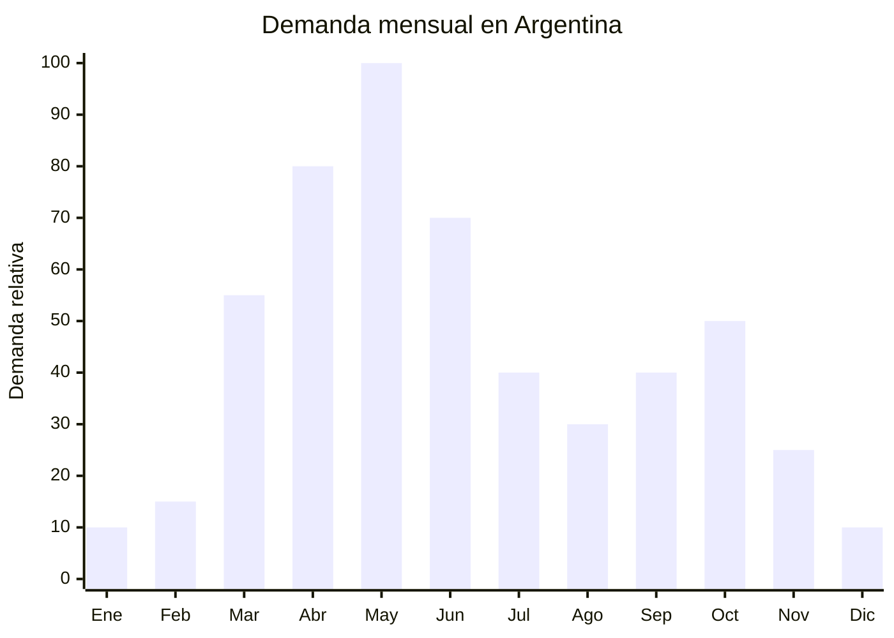

# Camperas rompevientos de otoño

> **Capítulo NCM 62** — Prendas y complementos de vestir (excepto punto) | **Temporada:** Otoño (Mar–May)

<Warning>
**ANTIDUMPING — VERIFICAR ANTES DE COMPRAR:** Argentina aplica derechos antidumping sobre determinadas prendas de vestir originarias de China. Las camperas rompevientos pueden estar alcanzadas bajo NCM 6201 (prendas de abrigo para hombres) o 6202 (para mujeres). Consultar siempre el listado actualizado en la [CNCE](https://www.argentina.gob.ar/cnce/investigaciones/medidasvigentes) con el NCM exacto de tu producto antes de realizar cualquier pedido. El antidumping es ADICIONAL al arancel del 20%.
</Warning>

## Qué es y por qué importarlo

Las camperas rompevientos (windbreakers) son prendas livianas de poliéster o nylon con tratamiento repelente al agua, diseñadas para proteger del viento y lluvia ligera sin el peso de una campera de abrigo. Son la prenda estrella de la transición otoñal argentina (marzo-mayo), cuando las temperaturas bajan pero no justifican un abrigo pesado. Se presentan con capucha plegable, cierre frontal, puños elásticos y bolsillos con cierre.

En Argentina, la demanda de rompevientos explota entre marzo y mayo, impulsada por la necesidad de una prenda versátil para los días de temperatura variable (15-22°C) típicos del otoño porteño y de la zona central. Es una prenda unisex que se usa para actividades urbanas, deportivas y outdoor.

China (especialmente las fábricas de Fujian y Guangdong) produce rompevientos de poliéster 190T/210T y nylon ripstop a FOB de USD 11.20-16.70 por unidad. En Argentina se venden entre ARS 27,930 y ARS 100,000+. Sin embargo, el margen puede verse reducido significativamente por los derechos antidumping, que pueden agregar entre un 10% y un 40% adicional al costo landed.

## Datos clave

| Dato | Valor |
|------|-------|
| **Posiciones NCM típicas** | 6201.13.00 (anoraks, camperas de hombre, fibras sintéticas), 6202.13.00 (ídem mujer) |
| **Derecho de importación** | 20% (DIE) + 3% tasa estadística + **antidumping adicional (verificar)** |
| **Rango FOB típico** | USD 11.20 — USD 16.70 por unidad |
| **Precio de venta en Argentina** | ARS 27.930 — ARS 100.000+ |
| **Margen bruto estimado** | 60% — 150% (variable según impacto antidumping) |
| **MOQ típico** | 200 — 500 unidades por diseño/color |
| **Demanda en MercadoLibre** | Muy Alta |
| **Competencia en MercadoLibre** | Alta |
| **Dificultad para importar** | Difícil (antidumping + etiquetado IRAM) |
| **Certificaciones necesarias** | Etiquetado textil IRAM 12560 obligatorio |
| **Antidumping** | **SÍ — Verificar NCM exacto en CNCE** |

## Variantes y subtipos más comunes

| Subtipo / Variante | FOB aprox. | Venta AR aprox. | Nota |
|--------------------|-----------|-----------------|------|
| Rompevientos poliéster 190T básico | USD 11.20 — 13.00 | ARS 27.930 — 45.000 | Económico |
| Rompevientos nylon ripstop con capucha | USD 13.00 — 16.70 | ARS 40.000 — 70.000 | **Más vendido** |
| Rompevientos packable (se pliega en bolsillo) | USD 12.00 — 15.00 | ARS 35.000 — 65.000 | Tendencia outdoor |
| Rompevientos reflectivo (bandas 3M) | USD 14.00 — 18.00 | ARS 45.000 — 80.000 | Seguridad vial, ciclistas |
| Rompevientos softshell liviano | USD 15.00 — 20.00 | ARS 50.000 — 100.000 | Premium, mayor abrigo |

## Regulaciones y requisitos

<Tabs>
  <Tab title="Certificaciones">
    **IRAM 12560** — Etiquetado textil obligatorio. Todas las prendas de vestir importadas deben tener etiqueta cosida con la información requerida. Sin etiqueta correcta, la mercadería queda retenida en aduana.

    **Antidumping** — Verificar derechos antidumping vigentes en la [CNCE](https://www.argentina.gob.ar/cnce/investigaciones/medidasvigentes) para el NCM 6201.13.00 y 6202.13.00 ANTES de realizar el pedido. Los derechos se aplican como porcentaje sobre FOB o monto fijo por unidad.
  </Tab>

  <Tab title="Etiquetado">
    **Obligatorio según IRAM 12560:**
    - Composición con porcentajes (ej: "100% Poliéster" o "80% Nylon, 20% Poliéster")
    - Talle (sistema argentino: S, M, L, XL, XXL)
    - Instrucciones de lavado (símbolos ISO)
    - País de origen ("Hecho en China" / "Made in China")
    - Datos del importador (razón social, CUIT, domicilio en Argentina)

    La etiqueta debe estar cosida, no pegada. Debe ser legible y permanente.
  </Tab>

  <Tab title="Restricciones">
    - **Antidumping vigente:** Costo adicional significativo que puede reducir el margen drásticamente. Calcular el costo total landed ANTES de comprar.
    - Las prendas de fibra sintética (poliéster/nylon) pueden tener tratamiento diferente a las de algodón en materia de antidumping — verificar el NCM exacto.
    - Las camperas con relleno (guata, pluma) clasifican diferente a las rompevientos livianos.
    - Problemas de talles: solicitar tabla de medidas reales al proveedor y comparar con talles argentinos.
  </Tab>
</Tabs>

## Logística de importación

| Factor | Detalle |
|--------|---------|
| **Peso por unidad** | 0.20 — 0.45 kg |
| **Volumen por unidad** | Bajo (prendas comprimidas al vacío ocupan muy poco) |
| **Unidades por caja (master carton)** | 30 — 100 unidades |
| **Peso por caja** | 8 — 20 kg |
| **Fragilidad** | Baja |
| **Envío recomendado** | Marítimo LCL (lotes medianos) / FCL (2,000+ pcs) |
| **Tiempo total estimado** | 50 — 80 días (marítimo desde Fujian/Guangdong) |

<Tip>
Las camperas rompevientos son prendas livianas que ocupan poco volumen cuando se empaquetan al vacío. Un contenedor 20' puede llevar 10,000-15,000 unidades. Para lotes de prueba de 200-500 unidades, el envío aéreo/courier es viable dado el bajo peso. Siempre solicitar empaque al vacío para reducir volumen.
</Tip>

## Estacionalidad y timing de compra

| Dato | Valor |
|------|-------|
| **Meses de mayor venta** | Marzo — Junio (transición otoño + inicio invierno) |
| **Pedido ideal (marítimo)** | Noviembre — Enero |
| **Pedido ideal (aéreo)** | Febrero — Marzo |
| **Anticipación mínima** | 3-4 meses antes del pico |

## Ventajas y riesgos

<CardGroup cols={2}>
  <Card title="Ventajas" icon="circle-check">
    - Prenda estrella de transición otoñal
    - Alto ticket promedio (ARS 30,000-100,000)
    - Liviana: buen ratio valor/peso para flete
    - Personalizable con marca propia (etiqueta + estampa)
    - Demanda extendida de marzo a junio
    - Versatilidad: urbana, deportiva, outdoor
  </Card>

  <Card title="Riesgos y desventajas" icon="triangle-exclamation">
    - **Antidumping puede reducir o anular el margen**
    - Etiquetado IRAM 12560 estricto
    - Problemas de talles chino vs. argentino frecuentes
    - Impermeabilidad real vs. declarada (reclamos)
    - Competencia con marcas deportivas (Nike, Adidas, Topper)
    - Stock sobrante de temporada difícil de liquidar
  </Card>
</CardGroup>

## Palabras clave para buscar en Alibaba

`windbreaker jacket wholesale` · `lightweight rain jacket polyester` · `nylon ripstop windbreaker` · `packable rain jacket wholesale` · `hooded windbreaker custom logo` · `waterproof jacket lightweight ODM`

## Fuentes

- MercadoLibre Argentina — búsqueda "campera rompevientos"
- Alibaba.com — proveedores de windbreaker jacket wholesale
- CNCE — Medidas antidumping vigentes sobre prendas de vestir
- ARCA — Nomenclador Arancelario, posiciones 6201 y 6202
- Norma IRAM 12560 — Etiquetado de productos textiles
