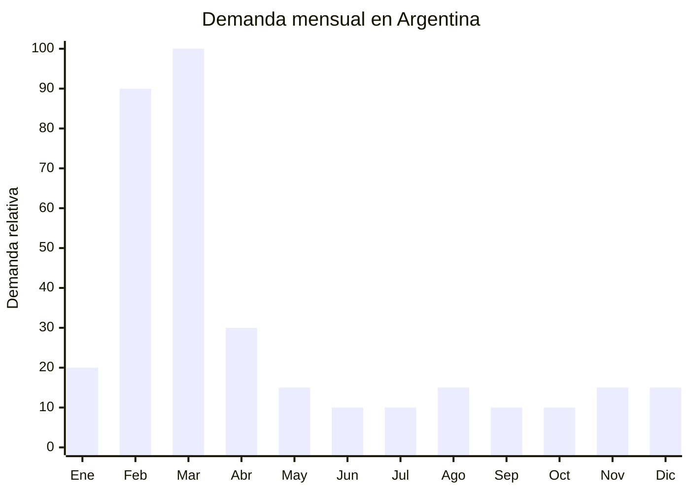

# Guardapolvos escolares

> **Capítulo NCM 62** — Prendas y complementos de vestir (excepto punto) | **Temporada:** Otoño (Mar–May)

<Warning>
**ANTIDUMPING — VERIFICAR NCM 6211:** Los guardapolvos pueden clasificar bajo NCM 6211 (prendas de vestir confeccionadas, no de punto). Verificar si esta posición tiene derechos antidumping vigentes sobre prendas originarias de China en la [CNCE](https://www.argentina.gob.ar/cnce/investigaciones/medidasvigentes). El derecho antidumping es ADICIONAL al arancel y puede impactar significativamente el costo.
</Warning>

## Qué es y por qué importarlo

El guardapolvo escolar blanco es la prenda de vestir OBLIGATORIA por excelencia del sistema educativo argentino. Todos los alumnos de escuela primaria pública (y muchas privadas) deben asistir a clase con guardapolvo blanco "tablitas" (con alforzas/pliegues). Es un símbolo de igualdad social en la educación argentina y su uso es normativo: sin guardapolvo, el alumno no puede ingresar al aula.

La demanda es masiva y concentrada: entre febrero y marzo, millones de familias compran guardapolvos nuevos para el ciclo lectivo. Los talles van del 4 al 16 (4-16 años), con mayor demanda en talles 6-12 (primaria). El guardapolvo estándar es blanco, manga larga, con cinturón, bolsillos y botones, en tela de "tablita" (poliéster/algodón poplin o gabardina liviana).

China produce guardapolvos a FOB de USD 3-8 por unidad dependiendo de la calidad de tela y terminación. En Argentina se venden entre ARS 15,000 y ARS 40,000. La OPORTUNIDAD es alta porque la demanda es obligatoria y predecible, pero hay que verificar cuidadosamente el tema antidumping y cumplir con el etiquetado IRAM 12560.

## Datos clave

| Dato | Valor |
|------|-------|
| **Posiciones NCM típicas** | 6211.42.00 (prendas de vestir de algodón, mujeres/niñas), 6211.43.00 (de fibras sintéticas) |
| **Derecho de importación** | 20% (DIE) + 3% tasa estadística + **antidumping adicional (verificar)** |
| **Rango FOB típico** | USD 3.00 — USD 8.00 por unidad |
| **Precio de venta en Argentina** | ARS 15.000 — ARS 40.000 |
| **Margen bruto estimado** | 100% — 250% (variable según antidumping) |
| **MOQ típico** | 300 — 1,000 unidades (surtido de talles) |
| **Demanda en MercadoLibre** | Muy Alta (estacional, pico febrero-marzo) |
| **Competencia en MercadoLibre** | Alta |
| **Dificultad para importar** | Moderada-Difícil (antidumping + IRAM) |
| **Certificaciones necesarias** | Etiquetado textil IRAM 12560 obligatorio |
| **Antidumping** | **Verificar NCM 6211 en CNCE** |

## Variantes y subtipos más comunes

| Subtipo / Variante | FOB aprox. | Venta AR aprox. | Nota |
|--------------------|-----------|-----------------|------|
| Guardapolvo blanco tablitas poliéster/algodón | USD 3.00 — 5.00 | ARS 15.000 — 25.000 | **Estándar — mayor volumen** |
| Guardapolvo blanco gabardina premium | USD 5.00 — 8.00 | ARS 25.000 — 40.000 | Mejor caída, más durable |
| Delantal escolar color (jardín) | USD 2.50 — 4.00 | ARS 12.000 — 20.000 | Jardín de infantes, colores varios |
| Guardapolvo manga corta (verano) | USD 2.50 — 4.50 | ARS 12.000 — 22.000 | Regiones cálidas |
| Guardapolvo con bordado/estampa escudo | USD 4.00 — 7.00 | ARS 20.000 — 35.000 | Personalizado por colegio |

## Regulaciones y requisitos

<Tabs>
  <Tab title="Certificaciones">
    **IRAM 12560** — Etiquetado textil obligatorio. El guardapolvo DEBE tener etiqueta cosida con toda la información requerida. Sin etiqueta, la mercadería queda retenida en aduana.

    **Antidumping** — Verificar derechos antidumping vigentes en la [CNCE](https://www.argentina.gob.ar/cnce/investigaciones/medidasvigentes) para NCM 6211.42.00 y 6211.43.00. El tipo de fibra (algodón vs. sintética) puede determinar si aplica o no el antidumping.
  </Tab>

  <Tab title="Etiquetado">
    **Obligatorio según IRAM 12560:**
    - Composición con porcentajes (ej: "65% Poliéster, 35% Algodón")
    - Talle (sistema argentino: 4, 6, 8, 10, 12, 14, 16)
    - Instrucciones de lavado (símbolos ISO — el guardapolvo se lava frecuentemente)
    - País de origen ("Hecho en China")
    - Datos del importador (razón social, CUIT, domicilio)

    La etiqueta debe estar cosida, no pegada. Indicar claramente que resiste lavados frecuentes.
  </Tab>

  <Tab title="Restricciones">
    - El guardapolvo blanco debe ser de un BLANCO puro, no crudo ni beige. Los padres son muy exigentes con el tono de blanco.
    - Las tablitas (alforzas) deben estar bien planchadas y fijadas. Un guardapolvo sin tablitas definidas se percibe como de baja calidad.
    - Los botones deben ser resistentes al lavado frecuente en lavarropas.
    - Verificar antidumping según la composición (algodón puro vs. mezcla sintética pueden tener diferente tratamiento).
  </Tab>
</Tabs>

## Logística de importación

| Factor | Detalle |
|--------|---------|
| **Peso por unidad** | 0.20 — 0.40 kg |
| **Volumen por unidad** | Medio (las tablitas agregan volumen) |
| **Unidades por caja (master carton)** | 30 — 80 unidades |
| **Peso por caja** | 8 — 15 kg |
| **Fragilidad** | Baja |
| **Envío recomendado** | Marítimo LCL o FCL según volumen |
| **Tiempo total estimado** | 50 — 80 días (marítimo) |

<Tip>
Los guardapolvos requieren un CONTROL DE CALIDAD riguroso antes del embarque: verificar blancura del tono, calidad de las tablitas, resistencia de botones y costuras, y que los talles coincidan con el estándar argentino. Un guardapolvo que amarillea al primer lavado genera reclamos masivos. Invertir en inspección pre-embarque con empresa como SGS o similar.
</Tip>

## Estacionalidad y timing de compra

| Dato | Valor |
|------|-------|
| **Meses de mayor venta** | Febrero — Marzo (vuelta a clases) |
| **Pedido ideal (marítimo)** | Octubre — Noviembre (para llegar en enero-febrero) |
| **Pedido ideal (aéreo)** | Enero (último recurso, costo alto) |
| **Anticipación mínima** | 3-4 meses |

## Ventajas y riesgos

<CardGroup cols={2}>
  <Card title="Ventajas" icon="circle-check">
    - Demanda OBLIGATORIA (normativa escolar)
    - Millones de unidades se venden cada año
    - Producto predecible y estandarizado
    - Alto ticket (ARS 15,000-40,000 por unidad)
    - Se repone: guardapolvos se gastan/ensucian y se reemplazan
    - Oportunidad de marca propia
  </Card>

  <Card title="Riesgos y desventajas" icon="triangle-exclamation">
    - **Antidumping puede impactar el margen significativamente**
    - Etiquetado IRAM 12560 estricto (retención en aduana si falta)
    - Calidad del blanco es crítica (reclamos si amarillea)
    - Producción local competitiva y con tradición
    - Temporada concentrada en 4-6 semanas
    - Problemas de talles: estándar argentino difiere del chino
  </Card>
</CardGroup>

## Palabras clave para buscar en Alibaba

`white school uniform smock` · `white lab coat children` · `kids white school gown` · `children smock dress white` · `school uniform white apron kids` · `white poplin school coat wholesale`

## Fuentes

- MercadoLibre Argentina — búsqueda "guardapolvo escolar blanco"
- Alibaba.com — proveedores de white school uniform smock
- CNCE — Medidas antidumping vigentes, NCM 6211
- Norma IRAM 12560 — Etiquetado de productos textiles
- ARCA — Nomenclador Arancelario, posición 6211
