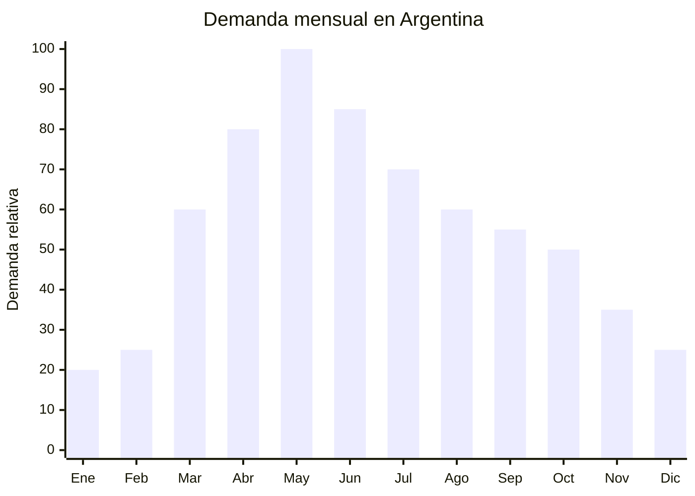

# Pantalones de gabardina para otoño

> **Capítulo NCM 62** — Prendas y complementos de vestir (excepto punto) | **Temporada:** Otoño (Mar–May)

<Warning>
**ANTIDUMPING — VERIFICAR ANTES DE COMPRAR:** Los pantalones de gabardina y jean importados de China pueden estar sujetos a derechos antidumping bajo NCM 6203 (hombre) y 6204 (mujer). Consultar el listado vigente en la [CNCE](https://www.argentina.gob.ar/cnce/investigaciones/medidasvigentes) con el NCM exacto. El antidumping es ADICIONAL al arancel y puede hacer inviable la operación si no se calcula previamente.
</Warning>

## Qué es y por qué importarlo

Los pantalones de gabardina (drill, chino, cargo) y jeans son las prendas de parte inferior que dominan el guardarropa otoñal argentino. Cuando las temperaturas bajan de 25°C en marzo, se produce la transición masiva de shorts y bermudas a pantalones largos. La gabardina de algodón/poliéster y el denim son los tejidos predominantes para uso casual, urbano y laboral.

En Argentina, la demanda de pantalones largos crece sostenidamente de marzo a mayo. Los formatos más buscados son: chino slim (corte recto entallado), cargo (con bolsillos laterales), jogger con puño, y jean clásico 5 bolsillos. El precio de venta en MercadoLibre oscila entre ARS 15,000 y ARS 40,000, con los jeans premium alcanzando los ARS 60,000.

China es el mayor productor mundial de pantalones, con hubs especializados en Guangzhou (denim), Dongguan y Ningbo (gabardina). Los FOB van de USD 4 a USD 10 por unidad dependiendo del tejido y terminación. Sin embargo, el antidumping sobre prendas de vestir chinas puede agregar costos significativos, por lo que es imprescindible verificar antes de comprar.

## Datos clave

| Dato | Valor |
|------|-------|
| **Posiciones NCM típicas** | 6203.42.00 (pantalones algodón hombre), 6203.43.00 (fibras sintéticas hombre), 6204.62.00 (algodón mujer), 6204.63.00 (fibras sintéticas mujer) |
| **Derecho de importación** | 20% (DIE) + 3% tasa estadística + **antidumping adicional (verificar)** |
| **Rango FOB típico** | USD 4.00 — USD 10.00 por unidad |
| **Precio de venta en Argentina** | ARS 15.000 — ARS 40.000 |
| **Margen bruto estimado** | 80% — 200% (variable según antidumping) |
| **MOQ típico** | 300 — 500 unidades por modelo/talle |
| **Demanda en MercadoLibre** | Muy Alta |
| **Competencia en MercadoLibre** | Muy Alta |
| **Dificultad para importar** | Difícil (antidumping + etiquetado IRAM) |
| **Certificaciones necesarias** | Etiquetado textil IRAM 12560 obligatorio |
| **Antidumping** | **SÍ — Verificar NCM exacto en CNCE** |

## Variantes y subtipos más comunes

| Subtipo / Variante | FOB aprox. | Venta AR aprox. | Nota |
|--------------------|-----------|-----------------|------|
| Pantalón chino slim algodón/poliéster | USD 4.00 — 6.00 | ARS 15.000 — 25.000 | **Más vendido casual** |
| Pantalón cargo multibolsillo | USD 5.00 — 8.00 | ARS 18.000 — 30.000 | Tendencia streetwear |
| Jean 5 bolsillos denim 10-12 oz | USD 5.00 — 8.00 | ARS 18.000 — 35.000 | Clásico imbatible |
| Jogger gabardina con puño | USD 4.00 — 7.00 | ARS 15.000 — 28.000 | Casual/deportivo |
| Pantalón de vestir gabardina | USD 5.00 — 10.00 | ARS 20.000 — 40.000 | Oficina/formal |

## Regulaciones y requisitos

<Tabs>
  <Tab title="Certificaciones">
    **IRAM 12560** — Etiquetado textil obligatorio para todas las prendas. Sin etiqueta correcta cosida, la mercadería queda retenida en aduana.

    **Antidumping** — Consultar siempre la [CNCE](https://www.argentina.gob.ar/cnce/investigaciones/medidasvigentes) para NCM 6203 y 6204. Los pantalones de algodón y los de fibra sintética pueden tener diferente tratamiento antidumping. Calcular costo total landed incluyendo antidumping ANTES de comprar.
  </Tab>

  <Tab title="Etiquetado">
    **Obligatorio según IRAM 12560:**
    - Composición con porcentajes (ej: "98% Algodón, 2% Elastano")
    - Talle (sistema argentino: 38-48 numérico, o S/M/L/XL)
    - Instrucciones de lavado (símbolos ISO)
    - País de origen ("Hecho en China")
    - Datos del importador (razón social, CUIT, domicilio)

    Etiqueta cosida, legible y permanente.
  </Tab>

  <Tab title="Restricciones">
    - **Antidumping vigente** — Los pantalones son una de las categorías con mayor escrutinio antidumping. No intentar subfacturar para evadir el antidumping: las autoridades manejan precios de referencia.
    - Problemas comunes de talles: la cintura y largo chino no coinciden con el estándar argentino. Solicitar tabla de medidas detallada.
    - Los jeans de denim pueden tener aranceles diferentes a los pantalones de gabardina — clasificar correctamente.
    - Verificar calidad del cierre (YKK vs. genérico) y resistencia de costuras.
  </Tab>
</Tabs>

## Logística de importación

| Factor | Detalle |
|--------|---------|
| **Peso por unidad** | 0.30 — 0.60 kg |
| **Volumen por unidad** | Bajo-Medio (se comprimen bien) |
| **Unidades por caja (master carton)** | 30 — 60 unidades |
| **Peso por caja** | 10 — 20 kg |
| **Fragilidad** | Baja |
| **Envío recomendado** | Marítimo LCL o FCL |
| **Tiempo total estimado** | 50 — 80 días (marítimo) |

<Tip>
Los jeans y pantalones de gabardina pesan más que camisas o buzos (denim 12 oz es pesado). Calcular bien el flete por kilo, especialmente si enviás por aéreo. Para pedidos de prueba, los pantalones chino de poliéster/algodón son más livianos que los jeans y permiten envíos aéreos más económicos.
</Tip>

## Estacionalidad y timing de compra

| Dato | Valor |
|------|-------|
| **Meses de mayor venta** | Marzo — Julio (otoño-invierno) |
| **Pedido ideal (marítimo)** | Noviembre — Enero |
| **Pedido ideal (aéreo)** | Febrero — Marzo |
| **Anticipación mínima** | 3-4 meses |

## Ventajas y riesgos

<CardGroup cols={2}>
  <Card title="Ventajas" icon="circle-check">
    - Demanda masiva y sostenida (marzo-julio)
    - Alto ticket promedio (ARS 15,000-40,000)
    - Prenda básica de guardarropa = recompra frecuente
    - China es líder mundial en producción de pantalones
    - Variedad de modelos y terminaciones disponibles
    - Temporada más larga que otros productos otoñales
  </Card>

  <Card title="Riesgos y desventajas" icon="triangle-exclamation">
    - **Antidumping puede anular el margen completamente**
    - Etiquetado IRAM 12560 estricto
    - Problemas de talles muy frecuentes (cintura + largo)
    - Competencia altísima (marcas locales + importadas)
    - Producción local importante en Argentina (industria textil)
    - Calidad de cierres y costuras variable en proveedores chinos
  </Card>
</CardGroup>

## Palabras clave para buscar en Alibaba

`chino pants wholesale cotton` · `cargo pants men wholesale` · `denim jeans wholesale factory` · `jogger pants gabardine` · `men trousers wholesale bulk` · `slim fit pants factory Guangzhou`

## Fuentes

- MercadoLibre Argentina — búsqueda "pantalón gabardina hombre", "jean mujer"
- Alibaba.com — proveedores de chino pants y denim jeans wholesale
- CNCE — Medidas antidumping vigentes, NCM 6203 y 6204
- Norma IRAM 12560 — Etiquetado de productos textiles
- ARCA — Nomenclador Arancelario, posiciones 6203 y 6204
