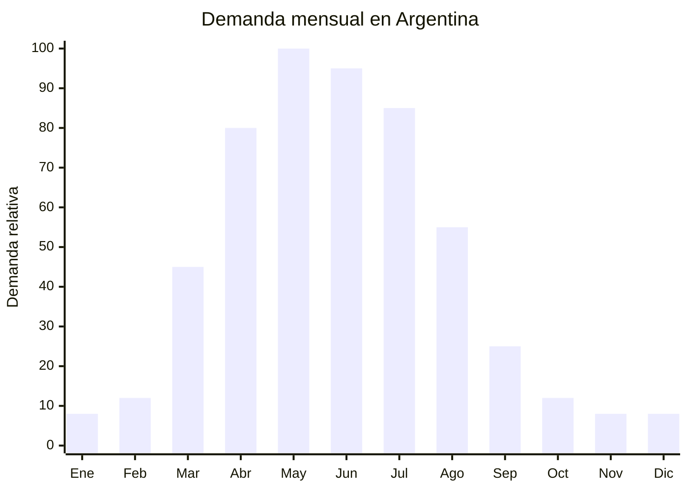

# Acolchados y edredones con relleno (fibra siliconada / pluma sintética)

> **Capítulo NCM 63** — Los demás artículos textiles confeccionados | **Temporada:** Otoño (Mar–May)

## Qué es y por qué importarlo

Los acolchados (también llamados edredones, duvets o cobertores) son productos de cama con relleno de fibra siliconada, microfibra hueca o pluma sintética, recubiertos con tela de algodón, microfibra o poliéster. Son el complemento natural de las frazadas polares y representan el **ticket más alto** dentro de la blanquería de otoño-invierno.

En Argentina, los acolchados tienen una demanda estacional fuerte entre abril y julio. Los gramajes más buscados van de 300 g/m² (entretiempo) a 600 g/m² (invierno intenso). Nantong y Tongxiang (China) son los principales centros de producción mundial. El relleno de fibra siliconada es el más popular por su relación calidad-precio.

**Sin antidumping vigente** en blanquería (Cap. 63). Sin embargo, es un producto **muy voluminoso** que ocupa mucho espacio en contenedor, por lo que el costo de flete por unidad es significativamente mayor que en frazadas. Es fundamental evaluar la relación flete vs. precio de venta antes de importar.

## Datos clave

| Dato | Valor |
|------|-------|
| **Posiciones NCM típicas** | 9404.90.00 (edredones, colchas acolchadas), 6301.40.00 (mantas sintéticas con relleno) |
| **Derecho de importación** | 20% (DIE) + 3% tasa estadística |
| **Rango FOB típico** | USD 5.00 — USD 20.00 por unidad |
| **Precio de venta en Argentina** | ARS 20.000 — ARS 80.000 |
| **Margen bruto estimado** | 150% — 300% |
| **MOQ típico** | 200 — 500 unidades |
| **Demanda en MercadoLibre** | Alta (miles de resultados) |
| **Competencia en MercadoLibre** | Alta |
| **Dificultad para importar** | Moderada (volumen alto = flete alto) |
| **Certificaciones necesarias** | Etiquetado textil obligatorio |
| **Antidumping** | **No** (blanquería Cap. 63 sin antidumping) |

## Variantes y subtipos más comunes

| Subtipo / Variante | FOB aprox. | Venta AR aprox. | Nota |
|--------------------|-----------|-----------------|------|
| Acolchado microfibra liso 2½ plazas | USD 5.00 — 10.00 | ARS 20.000 — 40.000 | **Más vendido** |
| Acolchado estampado 2 plazas | USD 6.00 — 12.00 | ARS 25.000 — 50.000 | Diseños florales, geométricos |
| Edredón premium 400g/m² king | USD 10.00 — 20.00 | ARS 45.000 — 80.000 | Ticket alto |
| Acolchado infantil 1½ plaza | USD 4.00 — 8.00 | ARS 15.000 — 30.000 | Diseños infantiles |
| Duvet cover + relleno (juego) | USD 8.00 — 15.00 | ARS 30.000 — 60.000 | Set completo, mayor valor percibido |
| Acolchado entretiempo 200g/m² | USD 4.00 — 8.00 | ARS 15.000 — 35.000 | Para otoño suave |

## Regulaciones y requisitos

<Tabs>
  <Tab title="Certificaciones">
    | Requisito | Obligatorio | Detalle |
    |-----------|-------------|---------|
    | Etiquetado textil | **Sí** | Composición de tela exterior y relleno, gramaje |
    | Antidumping CNCE | **No aplica** | Blanquería Cap. 63 sin antidumping vigente |
    | Certificación relleno | Recomendado | Certificado Oeko-Tex para rellenos sin sustancias nocivas |
  </Tab>
  <Tab title="Etiquetado">
    Composición de tela exterior (ej: "100% Microfibra Poliéster"), composición del relleno (ej: "Fibra siliconada hueca 300g/m²"), dimensiones en cm, instrucciones de lavado con pictogramas, país de origen, datos del importador (razón social, CUIT, dirección).
  </Tab>
  <Tab title="Restricciones">
    - **Sin antidumping** en blanquería — viable para importación
    - Verificar que el relleno no contenga sustancias restringidas
    - Producto de importación relativamente libre
    - Barrera regulatoria: **BAJA**
  </Tab>
</Tabs>

## Logística de importación

| Dato | Valor |
|------|-------|
| **Peso típico por unidad** | 1.50 — 4.00 kg |
| **Volumen típico** | **Alto** (producto muy voluminoso) |
| **Fragilidad** | Nula |
| **Envío recomendado** | Marítimo FCL (volumen justifica contenedor) |
| **Tiempo total estimado** | 50 — 80 días (producción + marítimo) |
| **Origen principal** | Nantong, Tongxiang, Jiangsu, China |

<Tip>
Los acolchados son **extremadamente voluminosos**. Un contenedor 40' HQ puede contener solo 2.000–4.000 unidades sin comprimir. Solicitar **compresión al vacío (vacuum compression)** al proveedor es **indispensable**: reduce el volumen hasta un 70% y permite cargar el doble o triple de unidades por contenedor. Sin vacuum packing, el flete por unidad puede destruir el margen.
</Tip>

## Estacionalidad y timing de compra



| Aspecto | Detalle |
|---------|---------|
| **Meses pico de venta** | Abril — Julio (otoño-invierno) |
| **Mejor momento para comprar en China** | Noviembre — Enero (producción + tránsito = 3-4 meses) |
| **Producción estimada** | 20 — 30 días (más largo que frazadas por costura compleja) |
| **Tránsito marítimo** | 35 — 50 días |
| **Ventana crítica** | Embarcar en diciembre-enero para tener stock en marzo-abril |

## Ventajas y riesgos

<CardGroup cols={2}>
  <Card title="Ventajas" icon="circle-check">
    - **Sin antidumping** (Cap. 63 libre)
    - Ticket alto (ARS 20.000–80.000 por unidad)
    - Complementario a frazadas (venta cruzada)
    - Margen bruto 150%–300%
    - Producto de reposición periódica
    - Diferenciación por diseño y gramaje
    - Barrera regulatoria baja
  </Card>
  <Card title="Riesgos" icon="triangle-exclamation">
    - **Producto muy voluminoso** (alto CBM = flete costoso)
    - Sin vacuum packing, flete puede destruir margen
    - Competencia de marcas establecidas (Palette, Arredo)
    - Estacionalidad fuerte (stock sobrante = capital inmovilizado)
    - Calidad de relleno difícil de verificar a distancia
    - Reclamos por gramaje inferior al declarado
  </Card>
</CardGroup>

## Palabras clave para buscar en Alibaba

```
comforter wholesale, duvet insert bulk, polyester comforter set,
quilt bedding set wholesale, Nantong comforter factory,
siliconized fiber comforter, vacuum packed duvet wholesale,
microfiber quilt 300gsm, printed comforter set
```

## Fuentes

- [MercadoLibre Argentina — Acolchados](https://listado.mercadolibre.com.ar/acolchados)
- [Alibaba — Comforter wholesale](https://www.alibaba.com/showroom/comforter-wholesale.html)
- [CNCE — Medidas antidumping vigentes](https://www.argentina.gob.ar/cnce/investigaciones/medidasvigentes)
