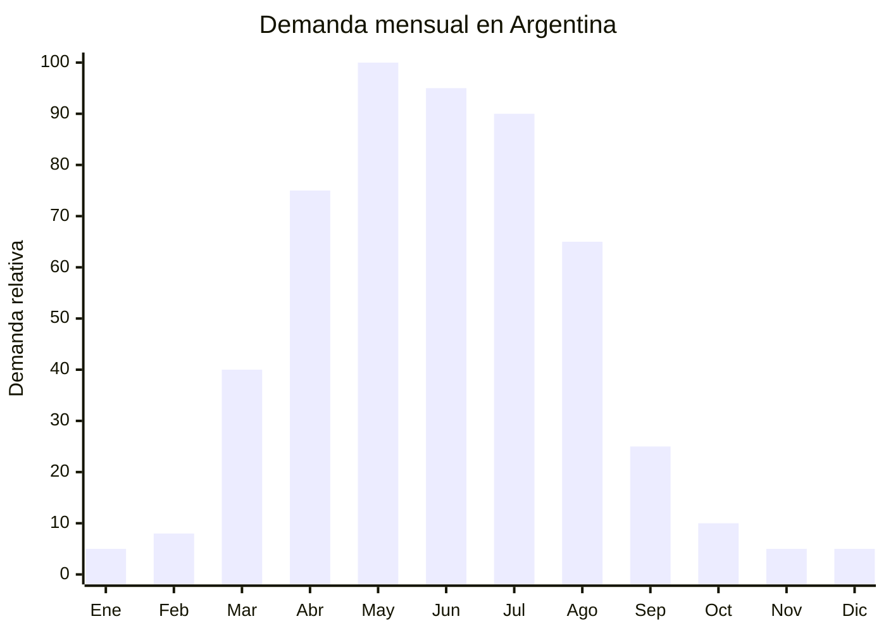

# Bufandas, cuellos polares tubulares y pañuelos de abrigo

> **Capítulo NCM 63** — Los demás artículos textiles confeccionados | **Temporada:** Otoño (Mar–May)

## Qué es y por qué importarlo

Las bufandas, cuellos polares tubulares (tipo buff/bandana multifunción) y pañuelos de abrigo son accesorios textiles de invierno con demanda estacional fuerte entre abril y agosto. Los cuellos tubulares de polar o acrílico son particularmente populares por su versatilidad: se usan como cuello, gorro, vincha o máscara facial.

La modalidad de venta más exitosa en Argentina es el **combo o set de invierno**: gorro + bufanda + guantes (beanie + scarf + gloves set). Estos combos tienen un FOB de USD 2.94–5.80 por set y se venden en Argentina entre ARS 9.990 y ARS 25.000. Los principales proveedores están en Yiwu y Ningbo (China), con materiales predominantes de 100% acrílico o polar de poliéster.

**Sin antidumping vigente** para accesorios textiles del Cap. 63. Barrera de entrada baja, producto liviano con flete mínimo, ideal para importadores principiantes que buscan productos de temporada.

## Datos clave

| Dato | Valor |
|------|-------|
| **Posiciones NCM típicas** | 6117.10.00 (chales, bufandas de punto), 6214.30.00 (de fibras sintéticas), 6214.20.00 (de lana) |
| **Derecho de importación** | 20% (DIE) + 3% tasa estadística |
| **Rango FOB típico** | USD 0.80 — USD 5.80 por unidad/set |
| **Precio de venta en Argentina** | ARS 5.000 — ARS 25.000 (sets) |
| **Margen bruto estimado** | 200% — 400% |
| **MOQ típico** | 100 — 500 unidades/sets |
| **Demanda en MercadoLibre** | Alta (636+ resultados cuellos y bufandas) |
| **Competencia en MercadoLibre** | Media |
| **Dificultad para importar** | Fácil |
| **Certificaciones necesarias** | Etiquetado textil básico |
| **Antidumping** | **No** (accesorios textiles sin antidumping) |

## Variantes y subtipos más comunes

| Subtipo / Variante | FOB aprox. | Venta AR aprox. | Nota |
|--------------------|-----------|-----------------|------|
| Combo gorro+bufanda+guantes acrílico | USD 2.94 — 5.80 | ARS 9.990 — 25.000 | **Más vendido** |
| Cuello tubular polar (tipo buff) | USD 0.80 — 2.00 | ARS 3.000 — 8.000 | Versátil, unisex |
| Bufanda lisa acrílico/lana | USD 1.00 — 3.00 | ARS 5.000 — 12.000 | Clásica |
| Set infantil gorro+bufanda+guantes | USD 2.00 — 4.00 | ARS 9.990 — 21.570 | Diseños con personajes |
| Pañuelo/pashmina grande | USD 1.50 — 4.00 | ARS 6.000 — 15.000 | Moda femenina |
| Cuello polar con cierre/botón | USD 1.50 — 3.00 | ARS 5.000 — 12.000 | Más ajustable |

## Regulaciones y requisitos

<Tabs>
  <Tab title="Certificaciones">
    | Requisito | Obligatorio | Detalle |
    |-----------|-------------|---------|
    | Etiquetado textil | **Sí** | Composición de fibra, país de origen |
    | Antidumping CNCE | **No aplica** | Accesorios textiles sin antidumping vigente |
  </Tab>
  <Tab title="Etiquetado">
    Composición de fibra (ej: "100% Acrílico" o "100% Poliéster Polar"), país de origen ("Hecho en China"), datos del importador (razón social, CUIT, dirección). Instrucciones de lavado con pictogramas.
  </Tab>
  <Tab title="Restricciones">
    - **Sin antidumping** para accesorios textiles
    - Sin restricciones especiales
    - Barrera regulatoria: **BAJA**
    - Producto de importación libre
  </Tab>
</Tabs>

## Logística de importación

| Dato | Valor |
|------|-------|
| **Peso típico por set** | 0.20 — 0.50 kg |
| **Volumen típico** | Bajo (se comprimen fácilmente) |
| **Fragilidad** | Nula |
| **Envío recomendado** | Marítimo LCL / Aéreo si lote chico |
| **Tiempo total estimado** | 50 — 80 días (marítimo) / 15–25 días (aéreo) |
| **Origen principal** | Yiwu, Ningbo, China |

<Tip>
Los sets gorro+bufanda+guantes tienen un **valor percibido mucho mayor** que las piezas sueltas. El costo FOB por set es apenas USD 1-2 más que una bufanda sola, pero el precio de venta en Argentina se duplica o triplica. Priorizar la importación de combos sobre piezas individuales para maximizar el margen.
</Tip>

## Estacionalidad y timing de compra



| Aspecto | Detalle |
|---------|---------|
| **Meses pico de venta** | Abril — Agosto (otoño-invierno) |
| **Mejor momento para comprar en China** | Noviembre — Enero |
| **Producción estimada** | 10 — 20 días |
| **Tránsito marítimo** | 35 — 50 días |
| **Ventana crítica** | Embarcar en enero para tener stock en marzo |

## Ventajas y riesgos

<CardGroup cols={2}>
  <Card title="Ventajas" icon="circle-check">
    - **Sin antidumping** (barrera baja)
    - Producto ultraliviano (flete mínimo)
    - Sets/combos maximizan margen
    - FOB muy bajo (desde USD 0.80)
    - Ideal para importadores principiantes
    - Se combina con gorros (mismos proveedores)
    - Margen 200%–400%
  </Card>
  <Card title="Riesgos" icon="triangle-exclamation">
    - Ticket promedio bajo por unidad suelta
    - Estacionalidad marcada (stock sobrante)
    - Competencia de marcas deportivas (Columbia, etc.)
    - Calidad variable en acrílico de baja gama
    - Dependencia de tendencias de moda
  </Card>
</CardGroup>

## Palabras clave para buscar en Alibaba

```
winter scarf gloves beanie set wholesale, polar fleece neck gaiter,
tubular bandana wholesale, acrylic scarf set, knit scarf hat gloves combo,
Yiwu winter accessories, neck warmer fleece wholesale,
kids winter set wholesale, pashmina scarf bulk
```

## Fuentes

- [MercadoLibre Argentina — Bufandas y cuellos](https://listado.mercadolibre.com.ar/bufandas-cuellos)
- [Alibaba — Winter scarf set wholesale](https://www.alibaba.com/showroom/winter-scarf-hat-gloves-set.html)
- [CNCE — Medidas antidumping vigentes](https://www.argentina.gob.ar/cnce/investigaciones/medidasvigentes)
