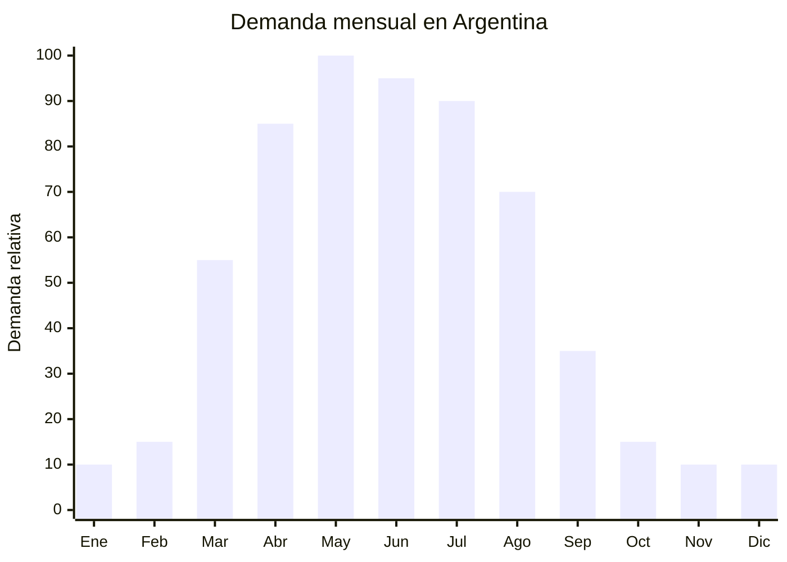

# Frazadas y mantas polares (polar fleece)

> **Capítulo NCM 63** — Los demás artículos textiles confeccionados | **Temporada:** Otoño (Mar–May)

## Qué es y por qué importarlo

Las frazadas y mantas de polar fleece son el **producto estrella del otoño-invierno argentino**. Se fabrican con tejido de poliéster microfibra de pelo corto (polar), que ofrece abrigo liviano, secado rápido y bajo costo de producción. El tamaño más vendido en Argentina es el de **2 plazas (200x230 cm)**, seguido por 1½ plaza y queen/king.

Nantong (Jiangsu, China) es la **capital mundial de blanquería** con cientos de fábricas especializadas en frazadas polares, mantas de flannel y coral fleece. Los precios FOB son extremadamente competitivos: desde USD 1.00 por unidad en volumen. En Argentina, las frazadas polares tienen demanda masiva desde marzo hasta agosto, con pico en abril-junio.

**No tiene antidumping vigente** en blanquería (Cap. 63), a diferencia de la ropa (Cap. 61-62), lo que convierte a este producto en una de las opciones más viables del rubro textil para importadores. Las marcas establecidas incluyen Jean Cartier, Alcoyana, Piñata, City Blanco y Danubio, pero hay amplio espacio para marcas propias y líneas económicas.

## Datos clave

| Dato | Valor |
|------|-------|
| **Posiciones NCM típicas** | 6301.40.00 (mantas de fibras sintéticas excepto eléctricas), 6301.30.00 (de algodón) |
| **Derecho de importación** | 20% (DIE) + 3% tasa estadística |
| **Rango FOB típico** | USD 1.00 — USD 4.50 por unidad |
| **Precio de venta en Argentina** | ARS 8.075 — ARS 49.969 |
| **Margen bruto estimado** | 200% — 400% |
| **MOQ típico** | 500 — 1.000 unidades |
| **Demanda en MercadoLibre** | Muy Alta (11.075+ resultados frazadas y mantas) |
| **Competencia en MercadoLibre** | Alta |
| **Dificultad para importar** | Baja |
| **Certificaciones necesarias** | Etiquetado textil obligatorio |
| **Antidumping** | **No** (blanquería Cap. 63 sin antidumping) |

## Variantes y subtipos más comunes

| Subtipo / Variante | FOB aprox. | Venta AR aprox. | Nota |
|--------------------|-----------|-----------------|------|
| Frazada polar lisa 200x230cm (2 plazas) | USD 1.00 — 1.50 | ARS 8.075 — 15.000 | **Más vendido** |
| Frazada polar estampada 200x230cm | USD 1.50 — 2.50 | ARS 12.000 — 25.000 | Estampados infantiles y diseños |
| Manta coral fleece premium | USD 2.00 — 4.50 | ARS 18.000 — 35.000 | Pelo más suave, mayor gramaje |
| Frazada polar 1½ plaza (160x220cm) | USD 0.80 — 1.20 | ARS 6.000 — 12.000 | Individual |
| Manta flannel sherpa (doble capa) | USD 3.00 — 6.00 | ARS 25.000 — 49.969 | Premium, doble textura |
| Frazada infantil con diseño (120x150cm) | USD 0.60 — 1.00 | ARS 5.000 — 10.000 | Personajes, unicornios |

## Regulaciones y requisitos

<Tabs>
  <Tab title="Certificaciones">
    | Requisito | Obligatorio | Detalle |
    |-----------|-------------|---------|
    | Etiquetado textil | **Sí** | Composición de fibra, tamaño, instrucciones de lavado |
    | Antidumping CNCE | **No aplica** | Blanquería Cap. 63 sin antidumping vigente |
    | INTI | No obligatorio | No requiere certificación INTI para blanquería |
  </Tab>
  <Tab title="Etiquetado">
    Composición de fibra (ej: "100% Poliéster Polar"), dimensiones en cm, instrucciones de lavado y cuidado con pictogramas, país de origen ("Hecho en China"), datos del importador (razón social, CUIT, dirección).
  </Tab>
  <Tab title="Restricciones">
    - **Sin antidumping** en blanquería — mucho más viable que ropa (Cap. 61-62)
    - Sin restricciones de sustancias peligrosas para uso textil general
    - Producto de importación relativamente libre
    - Barrera regulatoria: **BAJA**
  </Tab>
</Tabs>

## Logística de importación

| Dato | Valor |
|------|-------|
| **Peso típico por unidad** | 0.60 — 1.80 kg |
| **Volumen típico** | Medio-Alto (producto voluminoso cuando empacado) |
| **Fragilidad** | Nula |
| **Envío recomendado** | Marítimo FCL o LCL |
| **Tiempo total estimado** | 50 — 80 días (producción + marítimo) |
| **Origen principal** | Nantong, Jiangsu, China |

<Tip>
Las frazadas polares son voluminosas pero livianas. Un contenedor 40' HQ puede contener aproximadamente 8.000–12.000 frazadas de 2 plazas comprimidas al vacío. Solicitar **empaque al vacío (vacuum packed)** al proveedor reduce el volumen hasta un 60% y optimiza significativamente el flete.
</Tip>

## Estacionalidad y timing de compra



| Aspecto | Detalle |
|---------|---------|
| **Meses pico de venta** | Abril — Julio (otoño-invierno) |
| **Mejor momento para comprar en China** | Noviembre — Enero (3-4 meses antes del pico) |
| **Producción estimada** | 15 — 25 días |
| **Tránsito marítimo** | 35 — 50 días |
| **Ventana crítica** | Embarcar en enero para tener stock en marzo |

## Ventajas y riesgos

<CardGroup cols={2}>
  <Card title="Ventajas" icon="circle-check">
    - **Sin antidumping** (principal ventaja vs. ropa)
    - Producto estrella otoño-invierno con demanda masiva
    - FOB muy bajo (desde USD 1.00)
    - Nantong tiene cientos de fábricas especializadas
    - Margen bruto 200%-400%
    - Barrera regulatoria baja
    - Producto de reposición (se compra cada año)
    - Empaque al vacío reduce flete
  </Card>
  <Card title="Riesgos" icon="triangle-exclamation">
    - Competencia alta (Jean Cartier, Alcoyana, Piñata)
    - Producto voluminoso (impacta flete marítimo)
    - Estacionalidad fuerte (stock sobrante pierde valor)
    - Calidad variable en polar de bajo gramaje
    - Tamaños deben adaptarse al mercado argentino
    - Si llega tarde (julio+), pierde la temporada
  </Card>
</CardGroup>

## Palabras clave para buscar en Alibaba

```
polar fleece blanket wholesale, coral fleece blanket 200x230,
flannel blanket bulk, sherpa blanket wholesale, Nantong blanket factory,
fleece throw blanket, vacuum packed blanket wholesale,
microfiber blanket bulk order, printed fleece blanket
```

## Fuentes

- [MercadoLibre Argentina — Frazadas y mantas](https://listado.mercadolibre.com.ar/frazadas-mantas)
- [Alibaba — Polar fleece blanket wholesale](https://www.alibaba.com/showroom/polar-fleece-blanket-wholesale.html)
- [CNCE — Medidas antidumping vigentes](https://www.argentina.gob.ar/cnce/investigaciones/medidasvigentes)
