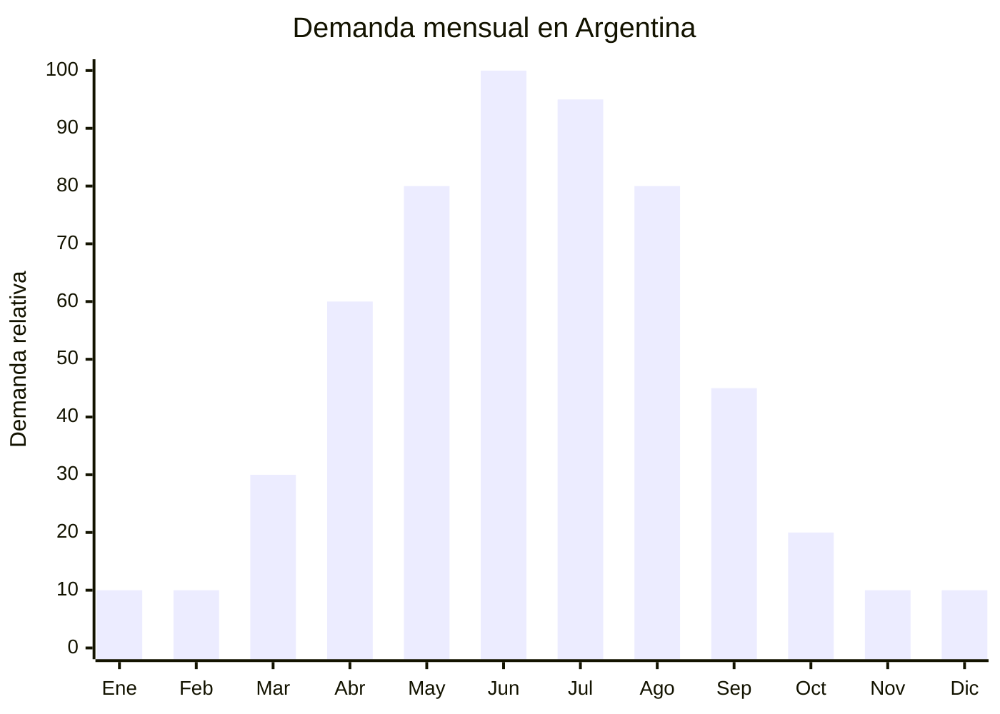

# Sábanas de franela para otoño-invierno

> **Capítulo NCM 63** — Textiles para el hogar | **Temporada:** Otoño (Mar–May)

## Qué es y por qué importarlo

Las sábanas de franela (o flanela) son juegos de sábanas fabricados en algodón cepillado (brushed cotton) o mezcla algodón/poliéster con acabado afelpado en una o ambas caras. Este cepillado les da una textura suave y cálida al tacto, ideal para los meses fríos. Se comercializan como juegos de 3 piezas (sábana bajera, sábana encimera y funda de almohada) o 4 piezas (+ funda extra), en tamaños 1 plaza, 1 1/2 plaza, 2 plazas y queen.

En Argentina, la demanda de sábanas de franela crece sostenidamente desde abril hasta agosto, coincidiendo con la caída de temperaturas del otoño-invierno. Es un producto con alta percepción de valor: los consumidores asocian "franela" con calidez, confort y calidad de sueño. Los precios de venta van de ARS 10,000 a ARS 30,000 por juego.

Nantong (China) es el hub mundial de producción de ropa de cama, con fábricas especializadas en flanela que ofrecen FOB de USD 3-10 por set completo. La clave está en que las sábanas de franela para el hogar (NCM capítulo 63) generalmente NO están alcanzadas por las medidas antidumping que afectan a prendas de vestir (capítulos 61 y 62), lo que las convierte en una opción con barrera regulatoria baja y buenos márgenes.

## Datos clave

| Dato | Valor |
|------|-------|
| **Posiciones NCM típicas** | 6302.31.00 (ropa de cama de algodón), 6302.32.00 (de fibras sintéticas o artificiales) |
| **Derecho de importación** | 20% (DIE) + 3% tasa estadística |
| **Rango FOB típico** | USD 3.00 — USD 10.00 por set |
| **Precio de venta en Argentina** | ARS 10.000 — ARS 30.000 |
| **Margen bruto estimado** | 120% — 300% |
| **MOQ típico** | 200 — 500 sets |
| **Demanda en MercadoLibre** | Alta (estacional, pico otoño-invierno) |
| **Competencia en MercadoLibre** | Media-Alta |
| **Dificultad para importar** | Fácil-Moderada |
| **Certificaciones necesarias** | Etiquetado textil IRAM 12560 (sí aplica a ropa de cama) |
| **Antidumping** | No (ropa de cama generalmente excluida) |

## Variantes y subtipos más comunes

| Subtipo / Variante | FOB aprox. | Venta AR aprox. | Nota |
|--------------------|-----------|-----------------|------|
| Juego franela 1 1/2 plaza (3 piezas) | USD 3.00 — 5.00 | ARS 10.000 — 18.000 | **Más vendido** |
| Juego franela 2 plazas (3 piezas) | USD 4.00 — 7.00 | ARS 13.000 — 22.000 | Demanda alta |
| Juego franela queen (4 piezas) | USD 6.00 — 10.00 | ARS 18.000 — 30.000 | Mayor ticket |
| Sábana bajera ajustable franela (individual) | USD 2.00 — 4.00 | ARS 6.000 — 12.000 | Reposición |
| Juego franela estampado infantil | USD 4.00 — 7.00 | ARS 12.000 — 22.000 | Niños, diseños temáticos |
| Juego franela premium 100% algodón peinado | USD 7.00 — 12.00 | ARS 20.000 — 35.000 | Segmento alto |

## Regulaciones y requisitos

<Tabs>
  <Tab title="Certificaciones">
    | Organismo | Requiere | Detalle |
    |-----------|----------|---------|
    | ARCA (Aduana) | Sí siempre | Despacho estándar |
    | ANMAT | No | No aplica |
    | INTI | Sí — IRAM 12560 | Etiquetado textil obligatorio para ropa de cama |

    **Recomendación:** Aunque no hay antidumping sobre ropa de cama, el etiquetado IRAM 12560 sí aplica. Asegurar que cada juego tenga etiqueta cosida con composición, instrucciones de lavado y datos del importador. Es más simple que para prendas de vestir, pero igualmente obligatorio.
  </Tab>

  <Tab title="Etiquetado">
    **Obligatorio según IRAM 12560:**
    - Composición con porcentajes (ej: "100% Algodón" o "80% Algodón, 20% Poliéster")
    - Medidas del producto (1 plaza, 1 1/2, 2 plazas, queen)
    - Instrucciones de lavado (símbolos ISO)
    - País de origen ("Hecho en China")
    - Datos del importador (razón social, CUIT, domicilio)
  </Tab>

  <Tab title="Restricciones">
    - Verificar que las medidas de los juegos coincidan con los estándares argentinos (las medidas chinas suelen diferir de las argentinas en 5-10 cm).
    - Medidas estándar argentinas aproximadas: 1 plaza (80x190 cm), 1 1/2 (120x190 cm), 2 plazas (150x190 cm), queen (160x200 cm).
    - Verificar que el cepillado (peeling) no se pierda después de pocos lavados. Solicitar test de resistencia al lavado.
    - Sin antidumping vigente para ropa de cama (capítulo 63).
  </Tab>
</Tabs>

## Logística de importación

| Factor | Detalle |
|--------|---------|
| **Peso por set** | 1.0 — 2.5 kg |
| **Volumen por set** | Medio (empaquetados al vacío se reducen significativamente) |
| **Unidades por caja (master carton)** | 10 — 30 sets |
| **Peso por caja** | 15 — 30 kg |
| **Fragilidad** | Baja |
| **Envío recomendado** | Marítimo LCL o FCL según volumen |
| **Tiempo total estimado** | 50 — 80 días (marítimo desde Nantong/Shanghai) |

<Tip>
Nantong (provincia de Jiangsu) es la capital mundial de la ropa de cama. Concentra miles de fábricas especializadas con precios FOB muy competitivos. Al solicitar cotización, pedir que los sets se empaquen al vacío (vacuum pack) para reducir volumen hasta un 60%. Esto reduce significativamente el costo de flete, especialmente en envíos LCL.
</Tip>

## Estacionalidad y timing de compra

| Dato | Valor |
|------|-------|
| **Meses de mayor venta** | Abril — Agosto (otoño-invierno pleno) |
| **Pedido ideal (marítimo)** | Diciembre — Febrero |
| **Pedido ideal (aéreo)** | Marzo (para stock en abril) |
| **Anticipación mínima** | 3-4 meses |

## Ventajas y riesgos

<CardGroup cols={2}>
  <Card title="Ventajas" icon="circle-check">
    - Sin antidumping (capítulo 63, ropa de cama)
    - Temporada larga (abril-agosto = 5 meses)
    - Alto valor percibido por los consumidores
    - Nantong ofrece FOB muy competitivos
    - Empaque al vacío reduce volumen de flete
    - Producto de recompra (se renuevan los juegos)
  </Card>

  <Card title="Riesgos y desventajas" icon="triangle-exclamation">
    - Medidas deben coincidir con estándar argentino (verificar)
    - Calidad del cepillado variable (peeling después de lavados)
    - Sets pesados (1-2.5 kg c/u) encarecen flete
    - Competencia con marcas locales (Cannon, Arcoiris, Palette)
    - Colores/estampados deben adaptarse al gusto argentino
    - IRAM 12560 obligatorio (etiquetado textil)
  </Card>
</CardGroup>

## Palabras clave para buscar en Alibaba

`flannel bed sheet set wholesale` · `brushed cotton bedding set` · `flannel duvet cover set factory` · `warm bed sheet set winter` · `Nantong flannel bedding wholesale` · `cotton brushed bed linen set`

## Fuentes

- MercadoLibre Argentina — búsqueda "sábanas franela"
- Alibaba.com — proveedores de flannel bed sheet set Nantong
- ARCA — Nomenclador Arancelario, posición 6302
- Norma IRAM 12560 — Etiquetado de productos textiles
