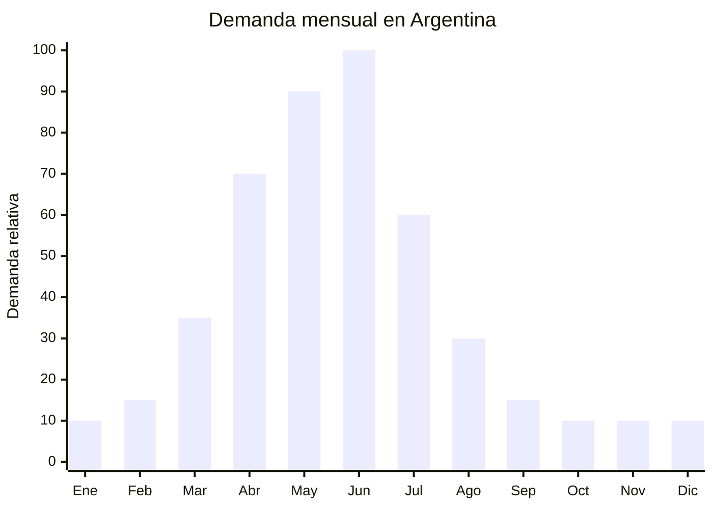

# Botas de lluvia de caucho

> **Capítulo NCM 64** — Calzado, polainas y artículos análogos | **Temporada:** Otoño (Mar–May)

## Qué es y por qué importarlo

Las botas de lluvia (también llamadas galochas, botas de agua o wellies) son calzado impermeable fabricado en caucho vulcanizado o PVC, diseñado para proteger los pies de la lluvia, el barro y la humedad. Los modelos abarcan desde botas cortas tipo botín hasta botas altas por debajo de la rodilla, en versiones para adultos e infantiles.

En Argentina, el otoño (abril-junio) trae lluvias sostenidas, especialmente en Buenos Aires y la región pampeana, generando un pico de demanda fuerte. Las botas infantiles tienen un impulso adicional por la vuelta a clases en marzo: los padres las compran junto con el uniforme escolar. China (principalmente las provincias de Fujian y Zhejiang) produce más del 70% de las botas de lluvia del mundo, con precios FOB extremadamente competitivos.

Sin embargo, este producto tiene una complejidad regulatoria importante: existe una medida antidumping vigente sobre calzado de origen chino (Resolución 915/2021 y sus actualizaciones), que establece valores FOB mínimos de referencia. Las botas de lluvia de caucho/PVC clasificadas en la partida 6401 pueden tener un tratamiento diferenciado respecto del calzado deportivo y casual cubierto por el antidumping principal, pero es imprescindible verificar la posición NCM exacta con un despachante de aduanas antes de importar.

## Datos clave

| Dato | Valor |
|------|-------|
| **Posiciones NCM típicas** | 6401.10.00 (calzado con puntera metálica), 6401.92.00 (botas que cubren la rodilla), 6401.99.00 (demás calzado impermeable de caucho/plástico) |
| **Derecho de importación** | 35% (DIE) + 3% tasa estadística |
| **Rango FOB típico** | USD 2.00 — USD 6.00 por par |
| **Precio de venta en Argentina** | ARS 8.000 — ARS 25.000 |
| **Margen bruto estimado** | 100% — 200% (considerar antidumping) |
| **MOQ típico** | 200 — 1,000 pares |
| **Demanda en MercadoLibre** | Alta (estacional) |
| **Competencia en MercadoLibre** | Media-Alta |
| **Dificultad para importar** | Media-Alta (por antidumping) |
| **Certificaciones necesarias** | Ninguna obligatoria, pero verificar antidumping |
| **Antidumping** | VERIFICAR — Res. 915/2021 y actualizaciones. NCM 6401 puede tener tratamiento diferenciado. Consultar despachante. |

<Warning>
**ANTIDUMPING CALZADO CHINO — VERIFICACIÓN OBLIGATORIA.** Existe una medida antidumping sobre calzado originario de China (Resolución 915/2021 y normas complementarias) que establece valores FOB mínimos de referencia (aprox. USD 15.70/par para ciertas categorías). Las botas de lluvia 100% caucho/PVC (NCM 6401) podrían estar excluidas del alcance principal del antidumping que se enfoca en calzado deportivo y casual, pero esto depende de la posición arancelaria exacta. **Antes de comprar, consultar con un despachante de aduanas la situación vigente de la NCM específica.** El incumplimiento del antidumping puede generar derechos adicionales del 200-400% sobre el valor FOB.
</Warning>

## Variantes y subtipos más comunes

| Subtipo / Variante | FOB aprox. | Venta AR aprox. | Nota |
|--------------------|-----------|-----------------|------|
| Bota lluvia corta adulto (botín) | USD 2.00 — 3.50 | ARS 8.000 — 15.000 | Urbano, más vendido mujeres |
| Bota lluvia alta adulto (caña media) | USD 3.00 — 5.00 | ARS 12.000 — 22.000 | Clásica, campo/ciudad |
| Bota lluvia infantil estampada | USD 1.50 — 3.50 | ARS 6.000 — 15.000 | **Pico vuelta a clases** |
| Bota lluvia con forro polar | USD 3.50 — 6.00 | ARS 15.000 — 25.000 | Otoño-invierno premium |
| Bota de trabajo PVC (industrial) | USD 2.50 — 5.00 | ARS 10.000 — 20.000 | Construcción, campo |
| Cubre-calzado impermeable | USD 0.80 — 2.00 | ARS 3.000 — 8.000 | Alternativa económica |

## Regulaciones y requisitos

<Tabs>
  <Tab title="Certificaciones">
    | Organismo | Requiere | Detalle |
    |-----------|----------|---------|
    | ARCA (Aduana) | Sí siempre | Despacho estándar + verificación antidumping |
    | INTI | Verificar | Calzado puede requerir certificación de seguridad según uso (industrial sí, casual generalmente no) |
    | ANMAT | No | No aplica |
    | ENACOM | No | No aplica |

    **Recomendación:** Antes de realizar el pedido, enviar la descripción exacta del producto y la NCM propuesta a un despachante de aduanas para que confirme si está alcanzado por medidas antidumping y cuál es el valor FOB mínimo de referencia vigente.
  </Tab>

  <Tab title="Etiquetado">
    | Requisito | Aplica |
    |-----------|--------|
    | Idioma español | Sí |
    | Datos del importador | Sí |
    | Composición / materiales | Sí (caucho, PVC, forro) |
    | Tallas (sistema argentino) | Sí — convertir de sistema chino |
    | País de origen | Sí |
    | Garantía legal 6 meses | Sí |
  </Tab>

  <Tab title="Restricciones">
    **Antidumping:** Medida vigente sobre calzado de origen chino. Verificar si la NCM 6401.XX.XX está incluida en el alcance. Si está incluida, se aplica un derecho antidumping adicional que puede hacer inviable la operación con FOB real bajo.

    **Alternativa:** Algunos importadores optan por origen Vietnam o Indonesia para evitar el antidumping, aunque con menor variedad de diseños y MOQ más altos.
  </Tab>
</Tabs>

## Logística de importación

| Factor | Detalle |
|--------|---------|
| **Peso por unidad** | 400 — 900 g por par |
| **Volumen por unidad** | 3,000 — 5,000 cm³ aprox. (con caja) |
| **Unidades por caja (master carton)** | 10 — 20 pares |
| **Peso por caja** | 8 — 15 kg |
| **Cajas por contenedor 20'** | ~800 — 1,200 cajas |
| **Unidades por contenedor 20'** | ~10,000 — 15,000 pares |
| **Fragilidad** | Baja (caucho/PVC es muy resistente) |
| **Requiere embalaje especial** | No — pares en bolsa individual + caja master |

<Tip>
Las botas de caucho son uno de los productos más resistentes al transporte marítimo. No se deforman, no se rompen y no les afecta la humedad. El principal desafío logístico es el volumen: ocupan mucho espacio relativo a su valor. Para optimizar flete, pedir al proveedor que empaque sin caja individual (solo bolsa) y se embalen anidadas (una dentro de otra) en los master cartons.
</Tip>

## Estacionalidad y timing de compra

| Dato | Valor |
|------|-------|
| **Meses de mayor venta** | Abril — Junio (lluvias otoño-invierno) |
| **Pedido ideal (marítimo)** | Diciembre — Enero (llega marzo-abril) |
| **Pedido ideal (aéreo)** | Febrero — Marzo (llega en 15-20 días) |
| **Anticipación mínima** | 3 — 4 meses |

<Note>
Las botas infantiles tienen un pico adelantado en **febrero-marzo** por la vuelta a clases. Si vas a importar modelos infantiles, adelantar el pedido para tener stock a principios de marzo.
</Note>

## Ventajas y riesgos

<CardGroup cols={2}>
  <Card title="Ventajas" icon="circle-check">
    - Demanda estacional fuerte y predecible
    - Producto muy resistente al transporte
    - Sin riesgo de rotura ni fragilidad
    - Modelo infantil con demanda escolar adicional
    - Personalización fácil (estampados, colores)
    - Sin requisitos de certificación electrónica
  </Card>
  <Card title="Riesgos y desventajas" icon="triangle-exclamation">
    - **Antidumping calzado chino** — riesgo de derechos adicionales altísimos
    - Producto voluminoso (bajo valor por m³)
    - Temporada corta (4-5 meses de venta fuerte)
    - Conversión de tallas puede generar devoluciones
    - Competencia con marcas nacionales (Pampero, Diadora)
    - Producto con olor fuerte si la calidad del caucho es baja
  </Card>
</CardGroup>

## Palabras clave para buscar en Alibaba

`rain boots wholesale` · `PVC rain boots women` · `rubber rain boots children` · `waterproof boots wholesale` · `gumboots factory` · `kids rain boots cartoon` · `wellington boots custom` · `PVC garden boots`

## Fuentes

- MercadoLibre Argentina — búsqueda "botas lluvia"
- Alibaba.com — proveedores de rain boots wholesale
- Boletín Oficial Argentina — Resolución 915/2021 antidumping calzado
