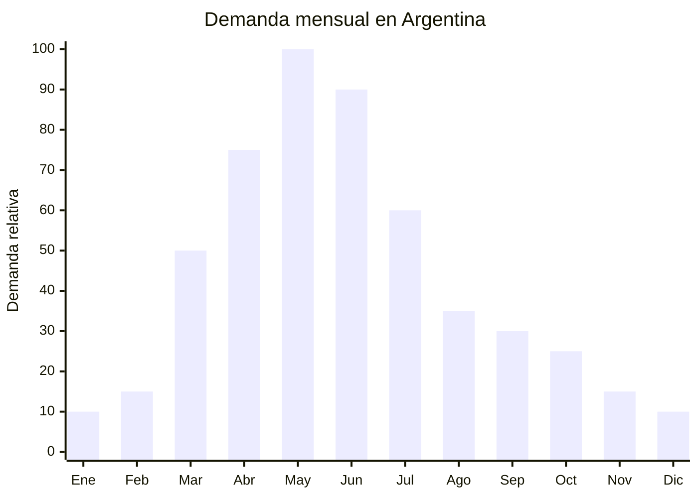

# Botines y botas cortas de otoño

> **Capítulo NCM 64** — Calzado | **Temporada:** Otoño (Mar–May)

<Warning>
**ANTIDUMPING VIGENTE SOBRE CALZADO CHINO:** Argentina mantiene derechos antidumping sobre calzado originario de China. Se establece un valor FOB mínimo de exportación de aproximadamente USD 15.70 por par (verificar valor actualizado). Si el FOB declarado es inferior, se cobra la diferencia como derecho antidumping adicional. Verificar siempre en la [CNCE](https://www.argentina.gob.ar/cnce/investigaciones/medidasvigentes) el NCM exacto y los valores vigentes.
</Warning>

## Qué es y por qué importarlo

Los botines y botas cortas de otoño son el calzado femenino estrella de la temporada de transición. Incluyen botines Chelsea (elástico lateral, sin cordones), botines texanos/cowboy (punta afinada, taco bajo), botines con cierre lateral, botas cortas con hebillas y botines de plataforma. Los materiales van desde cuero sintético (PU) hasta cuero genuino, con suelas de goma o TPR.

En Argentina, la temporada de botines arranca en marzo con las primeras jornadas frescas y se extiende hasta junio-julio. Es una categoría con altísima demanda femenina: los botines Chelsea y texanos son tendencia sostenida en moda argentina. Los precios de venta en MercadoLibre van de ARS 15,000 a ARS 60,000 dependiendo del material y diseño.

China (Guangzhou, Wenzhou) produce botines a FOB de USD 8-18 por par. Sin embargo, el mecanismo antidumping sobre calzado chino impone un FOB mínimo de referencia (aprox. USD 15.70/par), lo que significa que calzado con FOB inferior a ese valor pagará antidumping adicional. La estrategia viable es apuntar a calzado de calidad media-alta con FOB natural por encima del mínimo, donde el antidumping no impacta.

## Datos clave

| Dato | Valor |
|------|-------|
| **Posiciones NCM típicas** | 6403.99.90 (calzado con parte superior de cuero), 6402.99.90 (parte superior de plástico/caucho) |
| **Derecho de importación** | 20% (DIE) + 3% tasa estadística + **antidumping adicional** |
| **Rango FOB típico** | USD 8.00 — USD 18.00 por par |
| **Precio de venta en Argentina** | ARS 15.000 — ARS 60.000 |
| **Margen bruto estimado** | 60% — 150% (variable según impacto antidumping) |
| **MOQ típico** | 200 — 500 pares (surtido de talles) |
| **Demanda en MercadoLibre** | Muy Alta |
| **Competencia en MercadoLibre** | Alta |
| **Dificultad para importar** | Difícil (antidumping + etiquetado INTI) |
| **Certificaciones necesarias** | Etiquetado de calzado según normativa INTI |
| **Antidumping** | **SÍ — FOB mínimo aprox. USD 15.70/par** |

## Variantes y subtipos más comunes

| Subtipo / Variante | FOB aprox. | Venta AR aprox. | Nota |
|--------------------|-----------|-----------------|------|
| Botín Chelsea cuero sintético PU | USD 8.00 — 12.00 | ARS 15.000 — 30.000 | **Más vendido** — atención antidumping |
| Botín texano/cowboy PU | USD 9.00 — 14.00 | ARS 18.000 — 35.000 | Tendencia sostenida |
| Botín con cierre lateral cuero genuino | USD 14.00 — 18.00 | ARS 30.000 — 60.000 | Premium, FOB > mínimo |
| Bota corta con hebillas PU | USD 10.00 — 15.00 | ARS 20.000 — 40.000 | Diseño diferenciado |
| Botín plataforma chunky | USD 10.00 — 16.00 | ARS 22.000 — 45.000 | Tendencia moda joven |

## Regulaciones y requisitos

<Tabs>
  <Tab title="Certificaciones">
    **Etiquetado de calzado** — El calzado importado debe cumplir con los requisitos de etiquetado que indica el INTI, incluyendo materiales de la parte superior, forro, plantilla y suela.

    **Antidumping** — Verificar en la [CNCE](https://www.argentina.gob.ar/cnce/investigaciones/medidasvigentes) el valor FOB mínimo de exportación para el NCM exacto. Si tu FOB es inferior al mínimo, la diferencia se cobra como antidumping. Estrategia: importar calzado con FOB superior al mínimo (calidad media-alta).
  </Tab>

  <Tab title="Etiquetado">
    **Obligatorio para calzado importado:**
    - Material de la parte superior (cuero, sintético, textil)
    - Material del forro
    - Material de la suela
    - Talle (sistema argentino: 35-41 para mujer)
    - País de origen ("Hecho en China")
    - Datos del importador (razón social, CUIT, domicilio)

    Cada par debe tener etiqueta visible en la caja y en el calzado.
  </Tab>

  <Tab title="Restricciones">
    - **Antidumping:** El FOB mínimo de referencia (aprox. USD 15.70/par) es el dato clave. Calzado con FOB por debajo de este valor paga la diferencia como derecho adicional.
    - Verificar tabla de talles: el sistema chino difiere del argentino. Un talle 37 chino puede ser un 36 argentino.
    - La calidad del cemento de pegado de la suela es un punto crítico. Suelas que se despegan = reclamos masivos. Pedir test de adherencia.
    - El cuero sintético PU de baja calidad se descascara en 2-3 meses. Verificar calidad con muestras.
  </Tab>
</Tabs>

## Logística de importación

| Factor | Detalle |
|--------|---------|
| **Peso por par** | 0.50 — 1.00 kg (con caja) |
| **Volumen por par** | Medio (cajas de calzado ocupan espacio) |
| **Pares por caja (master carton)** | 10 — 20 pares |
| **Peso por caja** | 8 — 18 kg |
| **Fragilidad** | Media (cuidar forma del calzado en tránsito) |
| **Envío recomendado** | Marítimo LCL o FCL |
| **Tiempo total estimado** | 50 — 80 días (marítimo desde Guangzhou/Wenzhou) |

<Tip>
Para evitar el impacto del antidumping, enfocarse en botines de calidad media-alta con FOB natural por encima de USD 15.70/par. Esto incluye calzado con cuero genuino, suelas de mejor calidad y terminaciones premium. El margen por par es mayor y el antidumping no impacta. Evitar calzado ultra-barato que queda atrapado por el FOB mínimo.
</Tip>

## Estacionalidad y timing de compra

| Dato | Valor |
|------|-------|
| **Meses de mayor venta** | Marzo — Junio (otoño pleno) |
| **Pedido ideal (marítimo)** | Noviembre — Enero |
| **Pedido ideal (aéreo)** | Febrero — Marzo |
| **Anticipación mínima** | 3-4 meses |

## Ventajas y riesgos

<CardGroup cols={2}>
  <Card title="Ventajas" icon="circle-check">
    - Demanda femenina muy alta y sostenida
    - Alto ticket promedio (ARS 15,000-60,000)
    - Temporada extendida (marzo-junio = 4 meses)
    - Chelsea y texano son tendencias que no pasan de moda
    - Oportunidad en segmento medio-alto (sobre FOB mínimo)
    - Personalizable con marca propia (plantilla + caja)
  </Card>

  <Card title="Riesgos y desventajas" icon="triangle-exclamation">
    - **Antidumping con FOB mínimo USD 15.70/par**
    - Problemas de talles chino vs. argentino muy frecuentes
    - PU de baja calidad se descascara rápido (reclamos)
    - Suelas que se despegan = devoluciones garantizadas
    - Competencia con marcas locales (Prüne, Viamo, Sarkany)
    - Stock sobrante de talles extremos (35, 40, 41)
  </Card>
</CardGroup>

## Palabras clave para buscar en Alibaba

`chelsea boots women wholesale` · `ankle boots women PU leather` · `western cowboy boots women` · `platform boots women chunky` · `women boots genuine leather wholesale` · `Guangzhou women boots factory`

## Fuentes

- MercadoLibre Argentina — búsqueda "botines mujer otoño"
- Alibaba.com — proveedores de women ankle boots wholesale
- CNCE — Medidas antidumping vigentes sobre calzado
- INTI — Normativa de etiquetado de calzado
- ARCA — Nomenclador Arancelario, posiciones 6402 y 6403
