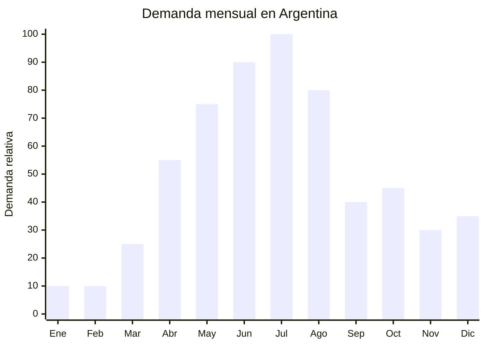

# Pantuflas de invierno abrigadas

> **Capítulo NCM 64** — Calzado | **Temporada:** Otoño (Mar–May)

<Note>
**ANTIDUMPING — POSIBLE EXCLUSIÓN:** Las pantuflas pueden clasificar bajo NCM 6405 (calzado con parte superior de materias textiles u otras) que en algunos casos queda FUERA del alcance principal del antidumping sobre calzado chino (centrado en NCM 6402, 6403, 6404). **VERIFICAR** con el despachante de aduana el NCM exacto y si aplica o no antidumping. Si queda excluida, es una ALTA OPORTUNIDAD con barrera regulatoria baja.
</Note>

## Qué es y por qué importarlo

Las pantuflas de invierno abrigadas son calzado de interior fabricado en materiales suaves y cálidos: polar (fleece), felpa (peluche), algodón acolchado, y bases de goma EVA o TPR antideslizante. Los diseños van desde pantuflas clásicas cerradas hasta babuchas tipo bota, pantuflas con forma de animal (para niños), pantuflas con suela dura (para usar también en exterior), y pantuflas tipo mocasín con forro de borreguito (sherpa).

En Argentina, la demanda de pantuflas abrigadas arranca en abril con los primeros fríos y se extiende hasta agosto. Es un producto de impulso con alto componente regalo: se regalan en el Día de la Madre (octubre, repunte secundario), Día del Padre (junio), y para Navidad. Los precios de venta oscilan entre ARS 5,000 y ARS 20,000.

China (Yiwu, Wenzhou) produce pantuflas a FOB de USD 1-5 por par, con una variedad enorme de diseños. Si el NCM 6405 queda fuera del alcance del antidumping principal, los márgenes son excepcionales (200-400%). Es un producto liviano, compacto y con bajo riesgo de transporte, ideal para importadores de todos los niveles.

## Datos clave

| Dato | Valor |
|------|-------|
| **Posiciones NCM típicas** | 6405.20.00 (calzado con parte superior de materia textil), 6404.19.00 (calzado con suela de caucho/plástico y parte superior textil) |
| **Derecho de importación** | 20% (DIE) + 3% tasa estadística |
| **Rango FOB típico** | USD 1.00 — USD 5.00 por par |
| **Precio de venta en Argentina** | ARS 5.000 — ARS 20.000 |
| **Margen bruto estimado** | 200% — 400% (si no aplica antidumping) |
| **MOQ típico** | 200 — 1,000 pares |
| **Demanda en MercadoLibre** | Alta (estacional otoño-invierno + regalos) |
| **Competencia en MercadoLibre** | Media |
| **Dificultad para importar** | Fácil-Moderada (depende del antidumping) |
| **Certificaciones necesarias** | Etiquetado básico de calzado |
| **Antidumping** | **VERIFICAR — NCM 6405 posiblemente excluido** |

## Variantes y subtipos más comunes

| Subtipo / Variante | FOB aprox. | Venta AR aprox. | Nota |
|--------------------|-----------|-----------------|------|
| Pantufla cerrada polar clásica | USD 1.00 — 2.00 | ARS 5.000 — 10.000 | Económica, alto volumen |
| Pantufla tipo bota (bootie) forro sherpa | USD 2.00 — 4.00 | ARS 8.000 — 15.000 | **Más vendida invierno** |
| Pantufla animal 3D (niños) | USD 1.50 — 3.00 | ARS 5.000 — 12.000 | Regalería, niños |
| Pantufla mocasín con suela dura | USD 2.50 — 5.00 | ARS 8.000 — 20.000 | Interior/exterior |
| Pantufla con memory foam | USD 3.00 — 5.00 | ARS 10.000 — 20.000 | Premium, confort |
| Pack pantuflas x2 (él + ella) | USD 3.00 — 6.00 | ARS 12.000 — 25.000 | Formato regalo |

## Regulaciones y requisitos

<Tabs>
  <Tab title="Certificaciones">
    | Organismo | Requiere | Detalle |
    |-----------|----------|---------|
    | ARCA (Aduana) | Sí siempre | Despacho estándar |
    | INTI | Etiquetado básico | Material parte superior, suela, país de origen |
    | ANMAT | No | No aplica |
    | ENACOM | No | No aplica |

    **Recomendación:** Verificar con el despachante si el NCM 6405 está excluido del antidumping sobre calzado. Si lo está, la barrera regulatoria se reduce significativamente y el producto se vuelve muy accesible para importar.
  </Tab>

  <Tab title="Etiquetado">
    | Requisito | Aplica |
    |-----------|--------|
    | Material parte superior | Sí (textil, polar, felpa) |
    | Material suela | Sí (EVA, TPR, goma) |
    | Talle | Sí (sistema argentino) |
    | País de origen | Sí |
    | Datos del importador | Sí |
  </Tab>

  <Tab title="Restricciones">
    - **Verificar antidumping:** El NCM exacto determina si aplica o no. NCM 6405 puede estar excluido del antidumping principal sobre calzado chino.
    - Las pantuflas con suela lisa (sin antideslizante) pueden generar reclamos por seguridad, especialmente para niños y adultos mayores.
    - Verificar que el forro polar/felpa no suelte pelusa excesiva (calidad del material).
    - Pantuflas con forma de animal para niños menores de 3 años: verificar que no contengan piezas pequeñas desmontables.
  </Tab>
</Tabs>

## Logística de importación

| Factor | Detalle |
|--------|---------|
| **Peso por par** | 0.15 — 0.40 kg |
| **Volumen por par** | Bajo-Medio |
| **Pares por caja (master carton)** | 20 — 60 pares |
| **Peso por caja** | 5 — 12 kg |
| **Fragilidad** | Muy baja (material blando y flexible) |
| **Envío recomendado** | Courier/aéreo (lotes pequeños) o marítimo LCL |
| **Tiempo total estimado** | 15-20 días (aéreo) / 50-80 días (marítimo) |

<Tip>
Las pantuflas son blandas, livianas y no se rompen. Un pedido de prueba de 200-500 pares pesa apenas 30-100 kg y puede enviarse por courier con flete razonable. Mezclar diseños y talles en un solo pedido para testear qué modelos tienen más tracción antes de escalar a volúmenes grandes.
</Tip>

## Estacionalidad y timing de compra

| Dato | Valor |
|------|-------|
| **Meses de mayor venta** | Abril — Agosto (otoño-invierno) + repuntes en junio (Día del Padre) y octubre (Día de la Madre) |
| **Pedido ideal (marítimo)** | Diciembre — Febrero |
| **Pedido ideal (aéreo)** | Marzo — Abril |
| **Anticipación mínima** | 2-3 meses |

## Ventajas y riesgos

<CardGroup cols={2}>
  <Card title="Ventajas" icon="circle-check">
    - FOB muy bajo (USD 1-5/par) con buenos márgenes
    - Posiblemente excluida de antidumping (NCM 6405)
    - Producto liviano, blando, sin riesgo de rotura
    - Temporada larga (abril-agosto) + regalos todo el año
    - Alta variedad de diseños para diferenciarse
    - Producto de impulso: se compra sin pensar mucho
  </Card>

  <Card title="Riesgos y desventajas" icon="triangle-exclamation">
    - Verificar antidumping caso por caso (NCM exacto)
    - Calidad variable del forro y la suela
    - Talles chinos tienden a ser más pequeños
    - Suela sin antideslizante = reclamos por seguridad
    - Pelusa que se desprende al primer uso (calidad baja)
    - Competencia con marcas locales (Gaelle, 47 Street)
  </Card>
</CardGroup>

## Palabras clave para buscar en Alibaba

`winter slippers wholesale fleece` · `indoor slippers warm plush` · `sherpa bootie slippers wholesale` · `memory foam slippers home` · `animal slippers kids 3D` · `house slippers anti-slip wholesale`

## Fuentes

- MercadoLibre Argentina — búsqueda "pantuflas invierno"
- Alibaba.com — proveedores de winter slippers wholesale
- CNCE — Medidas antidumping vigentes sobre calzado
- ARCA — Nomenclador Arancelario, posiciones 6404 y 6405
